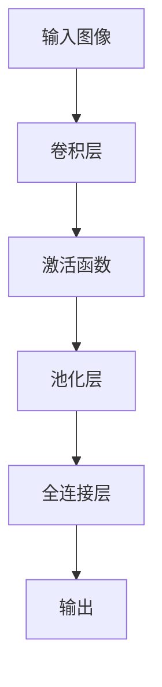
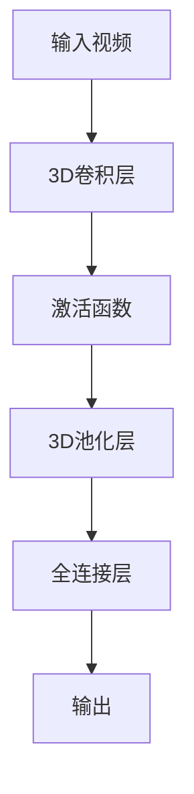
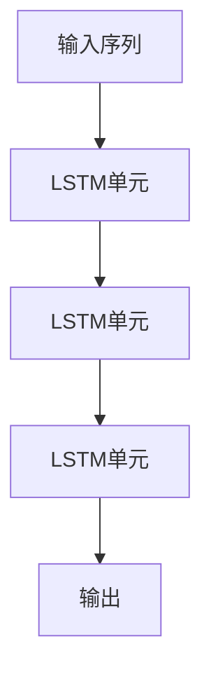

# 基于深度学习提取图像视频特征

作者：禅与计算机程序设计艺术

## 1. 背景介绍

### 1.1 深度学习的兴起

近年来，深度学习（Deep Learning）已经成为人工智能和计算机视觉领域最重要的研究方向之一。它通过多层神经网络的训练，能够自动提取数据的高层次特征，从而在图像识别、语音识别、自然语言处理等多个领域取得了显著的成果。

### 1.2 图像和视频特征提取的重要性

图像和视频特征提取是计算机视觉中的一个核心问题。传统的特征提取方法依赖于手工设计的特征，如SIFT、HOG等，但这些方法在复杂场景下的表现往往不尽如人意。深度学习通过自动学习数据的特征，能够在更高层次上理解图像和视频内容，从而大大提高了特征提取的效果。

### 1.3 文章目标

本文旨在深入探讨基于深度学习的图像和视频特征提取技术。我们将详细介绍核心概念与联系、核心算法原理、数学模型和公式、项目实践、实际应用场景、工具和资源推荐，并对未来发展趋势与挑战进行总结。

## 2. 核心概念与联系

### 2.1 特征提取的定义

特征提取是从原始数据中提取有用信息的过程。在图像和视频处理中，特征提取的目标是找到能够代表图像或视频内容的特征向量，这些特征向量可以用于分类、检测、分割等任务。

### 2.2 深度学习中的特征提取

深度学习中的特征提取通过训练神经网络，自动学习数据的特征。不同于传统方法，深度学习不需要手工设计特征，而是通过大量数据的训练，逐层提取图像或视频的高层次特征。

### 2.3 卷积神经网络（CNN）

卷积神经网络（Convolutional Neural Network, CNN）是深度学习中最常用的模型之一。它通过卷积层、池化层和全连接层的组合，能够有效地提取图像和视频的特征。

### 2.4 时空特征提取

在视频处理中，不仅需要提取图像的空间特征，还需要提取时间维度上的特征。3D卷积神经网络（3D CNN）和长短期记忆网络（LSTM）是常用的时空特征提取模型。

## 3. 核心算法原理具体操作步骤

### 3.1 卷积神经网络（CNN）的基本结构

#### 3.1.1 卷积层

卷积层通过卷积核对输入图像进行卷积操作，提取局部特征。每个卷积核可以看作一个特征检测器，能够检测图像中的边缘、纹理等低层次特征。



#### 3.1.2 池化层

池化层通过对卷积层的输出进行下采样，减少特征图的尺寸，从而降低计算复杂度。常用的池化操作有最大池化（Max Pooling）和平均池化（Average Pooling）。

#### 3.1.3 全连接层

全连接层将池化层的输出展开成一维向量，并通过全连接操作进行分类或回归。全连接层的输出通常是图像的分类结果。

### 3.2 3D卷积神经网络（3D CNN）

3D卷积神经网络通过在时间维度上进行卷积操作，能够同时提取视频的空间和时间特征。3D卷积核在三个维度上滑动，提取时空特征。



### 3.3 长短期记忆网络（LSTM）

LSTM是一种能够捕捉序列数据长时间依赖关系的循环神经网络（RNN）。在视频处理中，LSTM可以用于提取时间维度上的特征。



## 4. 数学模型和公式详细讲解举例说明

### 4.1 卷积操作

卷积操作是卷积神经网络的核心。对于输入图像 $I$ 和卷积核 $K$，卷积操作的输出 $O$ 可以表示为：

$$
O(i, j) = \sum_m \sum_n I(i+m, j+n) \cdot K(m, n)
$$

其中，$i$ 和 $j$ 表示输出图像的像素位置，$m$ 和 $n$ 表示卷积核的大小。

### 4.2 激活函数

激活函数用于引入非线性特性，使得神经网络能够表示更复杂的函数。常用的激活函数包括ReLU、Sigmoid和Tanh。

$$
\text{ReLU}(x) = \max(0, x)
$$

$$
\text{Sigmoid}(x) = \frac{1}{1 + e^{-x}}
$$

$$
\text{Tanh}(x) = \frac{e^x - e^{-x}}{e^x + e^{-x}}
$$

### 4.3 池化操作

池化操作用于减少特征图的尺寸。最大池化和平均池化的公式分别为：

$$
\text{MaxPooling}(x) = \max(x)
$$

$$
\text{AveragePooling}(x) = \frac{1}{N} \sum_{i=1}^N x_i
$$

### 4.4 LSTM单元

LSTM单元通过输入门、遗忘门和输出门来控制信息的流动。LSTM的数学模型可以表示为：

$$
f_t = \sigma(W_f \cdot [h_{t-1}, x_t] + b_f)
$$

$$
i_t = \sigma(W_i \cdot [h_{t-1}, x_t] + b_i)
$$

$$
\tilde{C}_t = \tanh(W_C \cdot [h_{t-1}, x_t] + b_C)
$$

$$
C_t = f_t * C_{t-1} + i_t * \tilde{C}_t
$$

$$
o_t = \sigma(W_o \cdot [h_{t-1}, x_t] + b_o)
$$

$$
h_t = o_t * \tanh(C_t)
$$

其中，$f_t$、$i_t$ 和 $o_t$ 分别表示遗忘门、输入门和输出门的输出，$C_t$ 表示单元状态，$h_t$ 表示隐藏状态，$x_t$ 表示输入，$W$ 和 $b$ 表示权重和偏置。

## 5. 项目实践：代码实例和详细解释说明

### 5.1 图像特征提取示例

以下是一个使用卷积神经网络提取图像特征的示例代码：

```python
import torch
import torch.nn as nn
import torch.optim as optim
from torchvision import datasets, transforms

# 定义卷积神经网络
class CNN(nn.Module):
    def __init__(self):
        super(CNN, self).__init__()
        self.conv1 = nn.Conv2d(1, 32, kernel_size=3, stride=1, padding=1)
        self.pool = nn.MaxPool2d(kernel_size=2, stride=2, padding=0)
        self.fc1 = nn.Linear(32 * 14 * 14, 128)
        self.fc2 = nn.Linear(128, 10)

    def forward(self, x):
        x = self.pool(F.relu(self.conv1(x)))
        x = x.view(-1, 32 * 14 * 14)
        x = F.relu(self.fc1(x))
        x = self.fc2(x)
        return x

# 加载数据集
transform = transforms.Compose([transforms.ToTensor(), transforms.Normalize((0.5,), (0.5,))])
trainset = datasets.MNIST(root='./data', train=True, download=True, transform=transform)
trainloader = torch.utils.data.DataLoader(trainset, batch_size=64, shuffle=True)

# 定义损失函数和优化器
criterion = nn.CrossEntropyLoss()
optimizer = optim