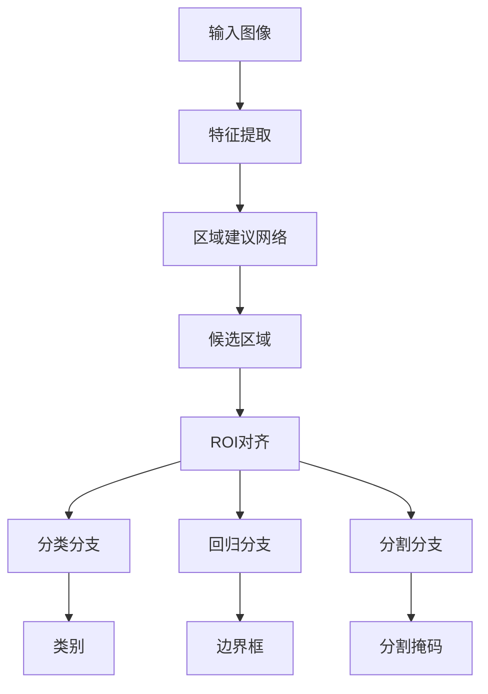

# 基于深度学习的目标实例分割

作者：禅与计算机程序设计艺术

## 1. 背景介绍

### 1.1 目标检测与分割的历史演进

目标检测与分割是计算机视觉领域的核心任务之一。从早期的边缘检测、区域生长到现代的深度学习方法，目标检测与分割技术经历了飞速的发展。传统方法依赖于手工特征和规则，而深度学习方法则依赖于大量数据和强大的计算能力，极大地提高了检测和分割的精度和效率。

### 1.2 深度学习在目标实例分割中的崛起

深度学习，特别是卷积神经网络（CNN），在图像处理任务中取得了显著的成功。自从2014年R-CNN提出以来，深度学习在目标检测和分割任务上不断突破，逐步演变出Fast R-CNN、Faster R-CNN、Mask R-CNN等经典模型。这些模型不仅提高了检测精度，还实现了实例级别的分割。

### 1.3 目标实例分割的重要性

目标实例分割不仅要求识别图像中的所有目标，还要为每个目标生成一个精确的分割掩码。这在自动驾驶、医疗图像分析、视频监控等领域具有重要应用。例如，在自动驾驶中，精确的目标实例分割可以帮助识别并区分道路上的行人、车辆和其他物体，从而提高行车安全。

## 2. 核心概念与联系

### 2.1 目标检测

目标检测任务的核心是识别图像中的所有目标，并为每个目标生成一个边界框。常用的目标检测模型包括YOLO系列、SSD、RetinaNet等。这些模型通过不同的网络架构和损失函数，优化检测精度和速度。

### 2.2 语义分割

语义分割任务旨在对图像中的每个像素进行分类，将其归类到特定的类别中。常用的语义分割模型包括FCN、U-Net、DeepLab系列等。语义分割模型通常使用全卷积网络，通过逐层上采样恢复原图尺寸，同时保证像素级别的分类精度。

### 2.3 实例分割

实例分割结合了目标检测和语义分割的任务，要求同时识别图像中的目标，并为每个目标生成精确的分割掩码。Mask R-CNN是实例分割领域的代表性模型，它在Faster R-CNN的基础上增加了一个分割分支，实现了高效的实例级分割。

### 2.4 各任务之间的联系

目标检测、语义分割和实例分割任务之间存在紧密联系。目标检测提供目标的位置信息，语义分割提供类别信息，而实例分割则将两者结合，生成精确的目标掩码。理解这些任务之间的联系，有助于设计更高效、更准确的模型。

## 3. 核心算法原理具体操作步骤

### 3.1 Mask R-CNN的基本架构

Mask R-CNN是在Faster R-CNN的基础上发展而来的。其基本架构包括以下几个部分：

- **骨干网络（Backbone）**：通常使用ResNet或ResNeXt等预训练模型，提取图像的特征。
- **区域建议网络（RPN）**：生成候选区域，并通过非极大值抑制（NMS）筛选出高质量的候选框。
- **ROI对齐（ROI Align）**：将候选区域对齐到固定尺寸，解决ROI Pooling中量化误差的问题。
- **分类和回归分支**：对每个候选区域进行分类，并回归边界框。
- **分割分支**：为每个候选区域生成分割掩码。

### 3.2 操作步骤详解

#### 3.2.1 特征提取

使用预训练的ResNet或ResNeXt模型提取图像特征，生成特征金字塔。特征金字塔包含不同尺度的特征图，能够捕捉不同大小的目标信息。

#### 3.2.2 区域建议网络（RPN）

RPN在特征图上滑动窗口，生成大量候选区域。通过二分类网络筛选出前景和背景区域，并回归候选框的位置。非极大值抑制（NMS）用于去除冗余的候选框，保留高质量的候选区域。

#### 3.2.3 ROI对齐（ROI Align）

ROI Align将候选区域对齐到固定尺寸，使用双线性插值解决ROI Pooling中的量化误差问题。对齐后的候选区域送入分类、回归和分割分支。

#### 3.2.4 分类和回归分支

分类分支对每个候选区域进行分类，回归分支回归边界框的位置。分类分支使用交叉熵损失，回归分支使用平滑L1损失。

#### 3.2.5 分割分支

分割分支为每个候选区域生成分割掩码。使用全卷积网络（FCN）对候选区域进行逐像素分类，生成精确的分割掩码。分割分支的损失函数为二分类交叉熵损失。

## 4. 数学模型和公式详细讲解举例说明

### 4.1 区域建议网络（RPN）

RPN的目标是生成高质量的候选区域。其核心是二分类网络和边界框回归网络。假设输入特征图为 $F$，RPN生成 $k$ 个锚点（anchors），每个锚点对应一个二分类输出和一个边界框回归输出。

$$
L_{\text{RPN}} = \frac{1}{N_{\text{cls}}} \sum_{i} L_{\text{cls}}(p_i, p_i^*) + \lambda \frac{1}{N_{\text{reg}}} \sum_{i} p_i^* L_{\text{reg}}(t_i, t_i^*)
$$

其中，$L_{\text{cls}}$ 为分类损失，$L_{\text{reg}}$ 为回归损失，$p_i$ 为预测的类别概率，$p_i^*$ 为真实类别标签，$t_i$ 为预测的边界框参数，$t_i^*$ 为真实的边界框参数，$\lambda$ 为平衡系数。

### 4.2 ROI对齐（ROI Align）

ROI Align解决了ROI Pooling中的量化误差问题。假设输入候选区域为 $R$，输出对齐后的特征图为 $R'$。ROI Align通过双线性插值，将候选区域对齐到固定尺寸。

$$
R'_{ij} = \sum_{m=0}^{H-1} \sum_{n=0}^{W-1} R_{mn} \max(0, 1 - |i - m|) \max(0, 1 - |j - n|)
$$

其中，$H$ 和 $W$ 为输出特征图的高度和宽度，$i$ 和 $j$ 为输出特征图的坐标。

### 4.3 分类和回归分支

分类分支使用交叉熵损失，回归分支使用平滑L1损失。假设输入候选区域的特征为 $x$，分类分支的输出为类别概率 $p$，回归分支的输出为边界框参数 $t$。

$$
L_{\text{cls}} = -\sum_{c=1}^{C} y_c \log(p_c)
$$

$$
L_{\text{reg}} = \sum_{i=1}^{4} \text{smooth}_{L1}(t_i - t_i^*)
$$

其中，$y_c$ 为真实类别标签，$p_c$ 为预测的类别概率，$t_i$ 为预测的边界框参数，$t_i^*$ 为真实的边界框参数。

### 4.4 分割分支

分割分支为每个候选区域生成分割掩码。假设输入候选区域的特征为 $x$，分割分支的输出为分割掩码 $m$。

$$
L_{\text{mask}} = -\sum_{i=1}^{H} \sum_{j=1}^{W