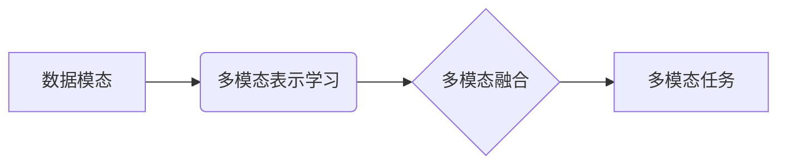

# 多模态大模型：技术原理与实战 国内多模态大模型介绍

作者：禅与计算机程序设计艺术

## 1. 背景介绍

### 1.1 人工智能的新纪元：从单模态到多模态

近年来，人工智能领域取得了突破性进展，其中深度学习的兴起功不可没。然而，传统的深度学习模型大多局限于单一模态数据，例如图像识别、语音识别等。而现实世界中，信息往往以多模态的形式存在，例如图片通常伴随着文字描述，视频包含图像、声音和文本信息等。为了使人工智能更好地理解和处理现实世界的信息，多模态学习应运而生。

### 1.2 多模态学习：融合感知，理解世界

多模态学习旨在通过整合多种感官信息，构建能够理解和处理多模态数据的模型。与单模态学习相比，多模态学习具有以下优势：

* **更全面地理解信息:**  多模态信息可以相互补充和印证，从而更全面地理解信息。例如，一张图片可以表达的信息有限，但如果结合图片的文字描述，就能更准确地理解图片内容。
* **更鲁棒的模型:** 单一模态数据容易受到噪声、遮挡等因素的影响，而多模态信息可以提供冗余信息，提高模型的鲁棒性。
* **更广泛的应用场景:** 多模态学习可以应用于更广泛的场景，例如图像 captioning、视频理解、跨模态检索等。

### 1.3 多模态大模型：迈向通用人工智能的重要一步

近年来，随着深度学习技术的不断发展以及大规模数据集的出现，多模态大模型逐渐成为研究热点。这些模型通常包含数十亿甚至数千亿参数，能够学习到更复杂、更抽象的多模态特征表示，并在各种多模态任务上取得了显著的效果。多模态大模型的出现，被认为是迈向通用人工智能的重要一步。


## 2. 核心概念与联系

### 2.1 数据模态

* **定义:**  数据模态是指数据的表现形式，例如文本、图像、语音、视频等。
* **特点:** 不同模态的数据具有不同的特点，例如文本数据是离散的符号序列，图像数据是连续的像素值矩阵，语音数据是时序波形信号等。
* **联系:** 不同模态的数据之间 often 存在着语义上的关联性，例如一张图片可以对应一段文字描述，一段语音可以转录成一段文本等。

### 2.2 多模态表示学习

* **定义:** 多模态表示学习旨在将不同模态的数据映射到一个共同的特征空间，使得不同模态的数据可以在同一个空间内进行比较和融合。
* **方法:** 常见的多模态表示学习方法包括：
    * **联合表示学习 (Joint Representation Learning):** 将不同模态的数据输入到同一个模型中，通过联合训练学习一个共同的特征表示。
    * **协同表示学习 (Coordinated Representation Learning):** 分别学习不同模态数据的特征表示，并通过约束条件使得不同模态的特征表示之间具有一定的关联性。
* **意义:** 多模态表示学习是多模态学习的基础，通过学习到有效的特征表示，可以提高后续多模态任务的性能。

### 2.3 多模态融合

* **定义:** 多模态融合是指将不同模态的特征表示进行整合，以获得更全面的信息表示。
* **方法:** 常见的多模态融合方法包括：
    * **早期融合 (Early Fusion):** 在特征提取阶段就将不同模态的数据进行融合。
    * **晚期融合 (Late Fusion):** 分别对不同模态的数据进行特征提取，然后在决策层将不同模态的特征进行融合。
    * **混合融合 (Hybrid Fusion):** 结合早期融合和晚期融合的优点，在不同层次上进行多模态融合。
* **意义:** 多模态融合是多模态学习的关键步骤，通过有效地融合不同模态的信息，可以提高模型的性能。

### 2.4 多模态任务

* **定义:** 多模态任务是指涉及到多个模态数据的任务，例如图像 captioning、视频理解、跨模态检索等。
* **分类:** 
    * **多模态生成:**  根据一种模态的数据生成另一种模态的数据，例如根据图片生成文字描述。
    * **多模态理解:**  对多模态数据进行分析和理解，例如对视频内容进行分类或情感分析。
    * **跨模态检索:**  根据一种模态的数据检索另一种模态的数据，例如根据文字描述检索相关的图片。
* **意义:** 多模态任务是多模态学习的最终目标，通过解决各种多模态任务，可以推动人工智能的发展。

### 2.5 核心概念联系图




## 3. 核心算法原理具体操作步骤

### 3.1 多模态表示学习算法

#### 3.1.1 联合表示学习

* **原理:** 将不同模态的数据输入到同一个模型中，通过联合训练学习一个共同的特征表示。
* **操作步骤:**
    1. 将不同模态的数据分别进行预处理，例如文本数据进行分词和编码，图像数据进行缩放和归一化等。
    2. 将预处理后的数据输入到多模态模型中，例如多层感知机 (MLP)、卷积神经网络 (CNN)、循环神经网络 (RNN) 等。
    3. 定义损失函数，例如对比损失、三元组损失等，用于衡量不同模态特征表示之间的相似性。
    4. 使用梯度下降等优化算法对模型进行训练，使得不同模态的数据能够映射到同一个特征空间。
* **举例:**  图像 captioning 任务中，可以使用 CNN 提取图像的特征，使用 RNN 提取文本的特征，然后将两种特征拼接起来输入到 MLP 中进行联合训练。

#### 3.1.2 协同表示学习

* **原理:** 分别学习不同模态数据的特征表示，并通过约束条件使得不同模态的特征表示之间具有一定的关联性。
* **操作步骤:**
    1. 分别使用单模态模型学习不同模态数据的特征表示，例如使用 CNN 提取图像特征，使用 RNN 提取文本特征等。
    2. 定义约束条件，例如最大化相关性、最小化距离等，用于衡量不同模态特征表示之间的关联性。
    3. 将约束条件加入到损失函数中，使用梯度下降等优化算法对模型进行训练，使得不同模态的特征表示之间具有一定的关联性。
* **举例:** 跨模态检索任务中，可以使用 CNN 提取图像特征，使用 RNN 提取文本特征，然后使用对比损失函数训练模型，使得相同语义的图像和文本特征表示之间的距离尽可能小。

### 3.2 多模态融合算法

#### 3.2.1 早期融合

* **原理:** 在特征提取阶段就将不同模态的数据进行融合。
* **操作步骤:**
    1. 将不同模态的数据分别进行预处理。
    2. 将预处理后的数据拼接起来，输入到单模态模型中进行特征提取。
    3. 使用提取到的特征进行后续任务，例如分类、回归等。
* **举例:**  视频情感分析任务中，可以将视频的图像帧和音频信号拼接起来，输入到 CNN 中进行特征提取，然后使用提取到的特征进行情感分类。

#### 3.2.2 晚期融合

* **原理:** 分别对不同模态的数据进行特征提取，然后在决策层将不同模态的特征进行融合。
* **操作步骤:**
    1. 分别使用单模态模型对不同模态的数据进行特征提取。
    2. 将提取到的特征输入到融合模型中，例如 MLP、支持向量机 (SVM) 等。
    3. 使用融合模型进行后续任务，例如分类、回归等。
* **举例:**  图像 captioning 任务中，可以使用 CNN 提取图像特征，使用 RNN 提取文本特征，然后将两种特征输入到 MLP 中进行融合，最后生成文本描述。

#### 3.2.3 混合融合

* **原理:** 结合早期融合和晚期融合的优点，在不同层次上进行多模态融合。
* **操作步骤:**
    1. 在低层特征提取阶段使用早期融合，将不同模态的数据进行融合。
    2. 在高层特征抽象阶段使用晚期融合，将不同模态的特征进行融合。
* **举例:**  视频问答任务中，可以使用 CNN 提取视频帧的特征，使用 RNN 提取问题的特征，然后在低层使用早期融合将视频帧特征和问题特征进行融合，在高层使用晚期融合将融合后的特征和答案特征进行融合，最后预测答案。

## 4. 数学模型和公式详细讲解举例说明

### 4.1 对比损失 (Contrastive Loss)

* **公式:**
 $$
 L = \sum_{i=1}^{N} y_i d(x_i, x_i^+) + (1-y_i) max(0, m - d(x_i, x_i^-))
 $$
    * $N$ 表示样本数量。
    * $y_i$ 表示第 $i$ 个样本对是否匹配，匹配为 1，不匹配为 0。
    * $x_i$ 和 $x_i^+$ 表示匹配的样本对，$x_i$ 和 $x_i^-$ 表示不匹配的样本对。
    * $d(x_i, x_j)$ 表示样本 $x_i$ 和 $x_j$ 之间的距离，例如欧氏距离。
    * $m$ 表示 margin，用于控制不匹配样本对之间的距离。
* **原理:**  对比损失函数的目标是使得匹配的样本对之间的距离尽可能小，不匹配的样本对之间的距离尽可能大。
* **举例:**  在跨模态检索任务中，可以使用对比损失函数训练模型，使得相同语义的图像和文本特征表示之间的距离尽可能小，不同语义的图像和文本特征表示之间的距离尽可能大。

### 4.2 三元组损失 (Triplet Loss)

* **公式:**
 $$
 L = \sum_{i=1}^{N} max(0, m + d(x_i^a, x_i^p) - d(x_i^a, x_i^n))
 $$
    * $N$ 表示样本数量。
    * $x_i^a$ 表示 anchor 样本，$x_i^p$ 表示与 anchor 样本匹配的 positive 样本，$x_i^n$ 表示与 anchor 样本不匹配的 negative 样本。
    * $d(x_i, x_j)$ 表示样本 $x_i$ 和 $x_j$ 之间的距离，例如欧氏距离。
    * $m$ 表示 margin，用于控制 positive 样本对和 negative 样本对之间的距离差。
* **原理:**  三元组损失函数的目标是使得 anchor 样本与 positive 样本之间的距离小于 anchor 样本与 negative 样本之间的距离。
* **举例:**  在人脸识别任务中，可以使用三元组损失函数训练模型，使得同一个人的不同照片之间的距离尽可能小，不同人之间的照片距离尽可能大。


## 5. 项目实践：代码实例和详细解释说明

### 5.1 图像 captioning

```python
import tensorflow as tf

# 定义图像编码器
image_encoder = tf.keras.applications.ResNet50(
    include_top=False, weights='imagenet', pooling='avg'
)

# 定义文本编码器
text_encoder = tf.keras.layers.GRU(256)

# 定义解码器
decoder = tf.keras.layers.LSTM(256, return_sequences=True)

# 定义模型
inputs = {
    'image': tf.keras.Input(shape=(224, 224, 3)),
    'text': tf.keras.Input(shape=(None,)),
}
image_features = image_encoder(inputs['image'])
text_features = text_encoder(inputs['text'])
decoder_outputs = decoder(
    tf.concat([image_features[:, tf.newaxis, :], text_features], axis=1)
)
outputs = tf.keras.layers.Dense(vocab_size, activation='softmax')(decoder_outputs)
model = tf.keras.Model(inputs=inputs, outputs=outputs)

# 定义损失函数
loss_fn = tf.keras.losses.CategoricalCrossentropy()

# 定义优化器
optimizer = tf.keras.optimizers.Adam()

# 训练模型
model.compile(optimizer=optimizer, loss=loss_fn)
model.fit(train_dataset, epochs=10)

# 生成图像描述
def generate_caption(image):
    # 提取图像特征
    image_features = image_encoder(image)

    # 初始化文本输入
    text_input = tf.constant(['<start>'], dtype=tf.string)

    # 生成文本描述
    for i in range(max_length):
        # 编码文本输入
        text_features = text_encoder(text_input)

        # 解码文本输出
        decoder_outputs = decoder(
            tf.concat([image_features[:, tf.newaxis, :], text_features], axis=1)
        )
        predictions = tf.keras.layers.Dense(vocab_size, activation='softmax')(
            decoder_outputs
        )

        # 选择概率最高的词
        predicted_id = tf.argmax(predictions, axis=-1)[:, -1]
        predicted_word = tf.gather(vocab, predicted_id)

        # 更新文本输入
        text_input = tf.concat([text_input, predicted_word], axis=1)

        # 如果预测到结束符，则停止生成
        if predicted_word == '<end>':
            break

    # 返回生成的文本描述
    return tf.strings.join(text_input[:, 1:], separator=' ')
```

**代码解释:**

1. 首先定义图像编码器、文本编码器和解码器。
2. 然后定义模型，将图像特征和文本特征拼接起来输入到解码器中，最后输出词表大小的概率分布。
3. 定义损失函数和优化器，并训练模型。
4. 最后定义生成图像描述的函数，根据输入的图像生成文本描述。

### 5.2 跨模态检索

```python
import tensorflow as tf

# 定义图像编码器
image_encoder = tf.keras.applications.ResNet50(
    include_top=False, weights='imagenet', pooling='avg'
)

# 定义文本编码器
text_encoder = tf.keras.layers.GRU(256)

# 定义模型
inputs = {
    'image': tf.keras.Input(shape=(224, 224, 3)),
    'text': tf.keras.Input(shape=(None,)),
}
image_features = image_encoder(inputs['image'])
text_features = text_encoder(inputs['text'])
outputs = tf.keras.layers.Dot(axes=1)([image_features, text_features])
model = tf.keras.Model(inputs=inputs, outputs=outputs)

# 定义损失函数
loss_fn = tf.keras.losses.CosineSimilarity()

# 定义优化器
optimizer = tf.keras.optimizers.Adam()

# 训练模型
model.compile(optimizer=optimizer, loss=loss_fn)
model.fit(train_dataset, epochs=10)

# 检索相关图像
def retrieve_images(query_text, k=10):
    # 编码查询文本
    query_features = text_encoder(query_text)

    # 计算查询文本与所有图像特征的相似度
    similarities = tf.matmul(query_features, image_features, transpose_b=True)

    # 选择相似度最高的 k 个图像
    _, indices = tf.math.top_k(similarities, k=k)

    # 返回检索到的图像
    return indices
```

**代码解释:**

1. 首先定义图像编码器和文本编码器。
2. 然后定义模型，计算图像特征和文本特征之间的点积，表示相似度。
3. 定义损失函数和优化器，并训练模型。
4. 最后定义检索相关图像的函数，根据输入的查询文本检索与其语义相关的图像。


## 6. 实际应用场景

### 6.1 图像理解与生成

* **图像 captioning:**  为图像生成文字描述，例如为新闻图片生成标题，为商品图片生成广告语等。
* **图像问答:**  根据图像内容回答问题，例如根据风景图片回答“图片中最高的山峰是什么”等。
* **图像生成:**  根据文字描述生成图像，例如根据“一只红色的鸟站在树枝上”生成对应的图像等。

### 6.2 视频理解与生成

* **视频摘要:**  为视频生成简短的文字描述或关键帧，例如为电影生成预告片，为体育比赛生成精彩片段等。
* **视频问答:**  根据视频内容回答问题，例如根据新闻视频回答“事件发生在哪里”等。
* **视频生成:**  根据文字描述生成视频，例如根据“一个人在跑步”生成对应的视频等。

### 6.3 跨模态检索

* **以文搜图:**  根据文字描述检索相关的图像，例如根据“红色的跑车”检索相关的跑车图片等。
* **以图搜文:**  根据图像检索相关的文字描述，例如根据一张风景图片检索相关的旅游攻略等。

### 6.4 其他应用场景

* **医疗诊断:**  结合医学影像、病历文本等多模态数据进行疾病诊断。