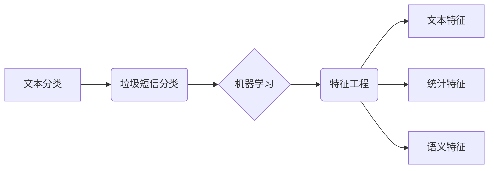

##  大数据背景下基于文本内容的垃圾短信分类

作者：禅与计算机程序设计艺术

## 1. 背景介绍

### 1.1 垃圾短信的危害

随着移动互联网的快速发展和普及，手机已经成为人们生活中不可或缺的一部分，而短信作为手机最基本的通信功能之一，也被广泛应用于各种场景。然而，与此同时，垃圾短信问题也日益严重，不仅浪费用户的流量和时间，还可能造成经济损失，甚至威胁到用户的个人信息安全。

垃圾短信的危害主要体现在以下几个方面：

* **骚扰用户正常生活：** 垃圾短信数量庞大，内容繁杂，严重干扰用户的正常生活和工作。
* **造成经济损失：** 一些垃圾短信包含诈骗信息，诱导用户进行转账汇款等操作，导致用户蒙受经济损失。
* **泄露个人信息：** 一些垃圾短信会诱导用户点击链接或下载安装恶意软件，从而窃取用户的个人信息，如银行卡号、密码等。
* **传播不良信息：** 一些垃圾短信内容低俗、色情，甚至包含暴力、恐怖等信息，对青少年身心健康造成不良影响。

### 1.2 垃圾短信分类的意义

垃圾短信分类是指利用计算机技术将垃圾短信从正常短信中识别和过滤出来的过程。垃圾短信分类对于维护网络安全、保障用户利益、净化网络环境具有重要意义。

* **保护用户权益：** 垃圾短信分类可以有效过滤垃圾短信，减少用户受到的骚扰，保护用户的合法权益。
* **维护网络安全：** 垃圾短信分类可以有效拦截包含诈骗、病毒等恶意信息的短信，维护网络安全。
* **促进移动互联网健康发展：** 垃圾短信分类可以净化网络环境，为用户提供更加安全、健康的移动互联网体验，促进移动互联网的健康发展。

## 2. 核心概念与联系

### 2.1 文本分类

文本分类是自然语言处理领域的一个重要任务，旨在将文本数据根据其内容自动分类到预定义的类别中。垃圾短信分类可以看作是文本分类的一个特例，即将短信文本分类为“垃圾短信”和“正常短信”两类。

### 2.2 机器学习

机器学习是人工智能的一个分支，其核心思想是让计算机从数据中学习规律，并利用学习到的规律对未知数据进行预测。在垃圾短信分类中，机器学习算法可以从大量的短信数据中学习垃圾短信和正常短信的特征，从而构建垃圾短信分类模型。

### 2.3 特征工程

特征工程是指将原始数据转换为机器学习算法可以理解和处理的特征向量的过程。在垃圾短信分类中，常用的特征包括：

* **文本特征：** 如词袋模型、TF-IDF、词向量等。
* **统计特征：** 如短信长度、标点符号数量、数字占比等。
* **语义特征：** 如情感倾向、主题模型等。

### 2.4 核心概念联系图



## 3. 核心算法原理具体操作步骤

### 3.1 数据预处理

数据预处理是垃圾短信分类的第一步，其目的是将原始短信数据转换为机器学习算法可以处理的格式。数据预处理的主要步骤包括：

* **数据清洗：** 去除重复数据、无效数据、缺失数据等。
* **分词：** 将文本数据按照一定的规则切分成词语序列。
* **停用词过滤：** 去除对分类没有贡献的词语，如“的”、“是”、“了”等。
* **特征提取：** 将文本数据转换为特征向量。

### 3.2 模型训练

模型训练是垃圾短信分类的核心步骤，其目的是利用预处理后的数据训练垃圾短信分类模型。常用的机器学习算法包括：

* **朴素贝叶斯：** 
    * **原理：** 基于贝叶斯定理，计算短信属于垃圾短信和正常短信的概率，选择概率较大的类别作为分类结果。
    * **操作步骤：**
        1. 计算先验概率：即在训练集中，垃圾短信和正常短信的比例。
        2. 计算条件概率：即在垃圾短信和正常短信中，每个词语出现的概率。
        3. 对于待分类的短信，计算其属于垃圾短信和正常短信的后验概率。
        4. 选择后验概率较大的类别作为分类结果。
* **支持向量机（SVM）：** 
    * **原理：** 寻找一个最优的超平面，将垃圾短信和正常短信分隔开来。
    * **操作步骤：**
        1. 将训练数据映射到高维空间。
        2. 在高维空间中寻找一个最优的超平面。
        3. 利用该超平面对新的短信进行分类。
* **深度学习：** 
    * **原理：** 利用多层神经网络对文本数据进行特征提取和分类。
    * **操作步骤：**
        1. 构建深度神经网络模型，如卷积神经网络（CNN）、循环神经网络（RNN）等。
        2. 利用训练数据对模型进行训练。
        3. 利用训练好的模型对新的短信进行分类。

### 3.3 模型评估

模型评估是垃圾短信分类的最后一步，其目的是评估训练得到的模型的性能。常用的评估指标包括：

* **准确率（Accuracy）：** 正确分类的短信数量占总短信数量的比例。
* **精确率（Precision）：** 被分类为垃圾短信的短信中，真正是垃圾短信的比例。
* **召回率（Recall）：** 所有垃圾短信中，被正确分类为垃圾短信的比例。
* **F1值：** 精确率和召回率的调和平均值。

## 4. 数学模型和公式详细讲解举例说明

### 4.1 朴素贝叶斯

朴素贝叶斯算法的数学模型如下：

$$P(y|x) = \frac{P(x|y)P(y)}{P(x)}$$

其中：

* $P(y|x)$ 表示在已知短信内容为 $x$ 的情况下，该短信属于类别 $y$ 的概率。
* $P(x|y)$ 表示在类别 $y$ 的短信中，出现短信内容为 $x$ 的概率。
* $P(y)$ 表示类别 $y$ 的先验概率。
* $P(x)$ 表示短信内容为 $x$ 的先验概率。

假设有一条短信内容为“恭喜您中奖了”，需要判断该短信是否为垃圾短信。

* 类别：$y_1$ 表示垃圾短信，$y_2$ 表示正常短信。
* 短信内容：$x = $ “恭喜您中奖了”。

根据训练集数据，可以计算得到以下概率：

* $P(y_1) = 0.8$（垃圾短信的先验概率）
* $P(y_2) = 0.2$（正常短信的先验概率）
* $P("恭喜" | y_1) = 0.6$（在垃圾短信中，出现“恭喜”的概率）
* $P("您" | y_1) = 0.5$（在垃圾短信中，出现“您”的概率）
* $P("中奖" | y_1) = 0.7$（在垃圾短信中，出现“中奖”的概率）
* $P("了" | y_1) = 0.4$（在垃圾短信中，出现“了”的概率）
* $P("恭喜" | y_2) = 0.1$（在正常短信中，出现“恭喜”的概率）
* $P("您" | y_2) = 0.2$（在正常短信中，出现“您”的概率）
* $P("中奖" | y_2) = 0.05$（在正常短信中，出现“中奖”的概率）
* $P("了" | y_2) = 0.3$（在正常短信中，出现“了”的概率）

根据朴素贝叶斯算法，可以计算该短信属于垃圾短信和正常短信的概率：

$$
\begin{aligned}
P(y_1|x) &= \frac{P(x|y_1)P(y_1)}{P(x)} \\
&= \frac{P("恭喜" | y_1)P("您" | y_1)P("中奖" | y_1)P("了" | y_1)P(y_1)}{P(x)} \\
&= \frac{0.6 \times 0.5 \times 0.7 \times 0.4 \times 0.8}{P(x)} \\
&= 0.0672 / P(x)
\end{aligned}
$$

$$
\begin{aligned}
P(y_2|x) &= \frac{P(x|y_2)P(y_2)}{P(x)} \\
&= \frac{P("恭喜" | y_2)P("您" | y_2)P("中奖" | y_2)P("了" | y_2)P(y_2)}{P(x)} \\
&= \frac{0.1 \times 0.2 \times 0.05 \times 0.3 \times 0.2}{P(x)} \\
&= 0.00006 / P(x)
\end{aligned}
$$

由于 $P(y_1|x) > P(y_2|x)$，因此可以判断该短信为垃圾短信。

### 4.2 支持向量机 (SVM)

SVM 旨在找到一个最优超平面，该平面可以最大化两个类别之间的间隔。其数学模型如下：

$$
\min_{w, b} \frac{1}{2} ||w||^2 + C \sum_{i=1}^{n} \max(0, 1 - y_i(w^T x_i + b))
$$

其中：

* $w$ 是权重向量。
* $b$ 是偏差。
* $C$ 是正则化参数。
* $x_i$ 是第 $i$ 个样本的特征向量。
* $y_i$ 是第 $i$ 个样本的标签（+1 表示垃圾短信，-1 表示正常短信）。

### 4.3 深度学习

深度学习模型（如 CNN 和 RNN）使用多层神经元来学习数据中的复杂模式。 

以 CNN 为例，其核心思想是使用卷积层来提取文本数据的局部特征，然后使用池化层来减少特征维度，最后使用全连接层进行分类。

## 5. 项目实践：代码实例和详细解释说明

```python
import nltk
import numpy as np
from sklearn.model_selection import train_test_split
from sklearn.naive_bayes import MultinomialNB
from sklearn.metrics import accuracy_score, precision_score, recall_score, f1_score

# 1. 数据预处理
def preprocess_data(data):
    # 分词
    data['words'] = data['content'].apply(nltk.word_tokenize)
    # 停用词过滤
    stopwords = nltk.corpus.stopwords.words('english')
    data['words'] = data['words'].apply(lambda words: [word for word in words if word not in stopwords])
    return data

# 2. 特征提取
def extract_features(data):
    # 词袋模型
    all_words = []
    for words in data['words']:
        all_words.extend(words)
    word_features = nltk.FreqDist(all_words)
    # 构建特征向量
    features = []
    for words in data['words']:
        feature = {}
        for word in word_features:
            feature[word] = words.count(word)
        features.append(feature)
    return features

# 3. 模型训练和评估
def train_and_evaluate_model(features, labels):
    # 划分训练集和测试集
    X_train, X_test, y_train, y_test = train_test_split(features, labels, test_size=0.2, random_state=42)
    # 训练模型
    model = MultinomialNB()
    model.fit(X_train, y_train)
    # 预测
    y_pred = model.predict(X_test)
    # 评估
    accuracy = accuracy_score(y_test, y_pred)
    precision = precision_score(y_test, y_pred)
    recall = recall_score(y_test,