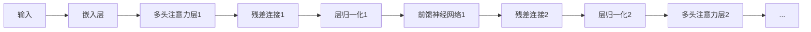

# 大语言模型原理与工程实践：大语言模型训练综述

作者：禅与计算机程序设计艺术

## 1. 背景介绍

### 1.1 大语言模型的兴起

近年来，随着深度学习技术的飞速发展以及互联网上文本数据的爆炸式增长，自然语言处理（NLP）领域取得了突破性进展。其中，大语言模型（Large Language Model，LLM）作为一种新兴的技术方向，凭借其强大的文本生成、理解和推理能力，受到了学术界和工业界的广泛关注。

大语言模型通常是指参数量超过亿级甚至千亿级的深度学习模型，例如 GPT-3、BERT、LaMDA 等。这些模型在海量文本数据上进行预训练，学习到了丰富的语言知识和世界知识，能够在各种 NLP 任务上取得优异的表现。

### 1.2 大语言模型的应用

大语言模型的出现，为 NLP 领域带来了革命性的变化，其应用场景也越来越广泛，例如：

* **文本生成**:  自动生成高质量的文章、对话、诗歌、代码等。
* **机器翻译**:  实现不同语言之间的快速准确翻译。
* **问答系统**:  根据用户的问题，提供精准的答案和解决方案。
* **文本摘要**:  自动提取文本的关键信息，生成简洁的摘要。
* **代码生成**:  根据自然语言描述，自动生成代码。

### 1.3 大语言模型训练的挑战

尽管大语言模型在 NLP 领域取得了巨大成功，但其训练过程仍然面临着诸多挑战，例如：

* **计算资源消耗巨大**:  训练大语言模型需要大量的计算资源，包括高性能的 GPU 和海量的存储空间。
* **训练数据质量参差不齐**:  互联网上的文本数据质量参差不齐，需要进行严格的清洗和筛选。
* **模型训练效率低下**:  大语言模型的训练过程非常耗时，需要不断优化训练算法和模型结构。
* **模型泛化能力不足**:  大语言模型在特定领域或任务上的表现可能很好，但在其他领域或任务上的泛化能力不足。

## 2. 核心概念与联系

### 2.1  Transformer 架构

Transformer 架构是近年来 NLP 领域最具影响力的模型结构之一，其核心是自注意力机制（Self-Attention Mechanism），能够有效地捕捉文本序列中的长距离依赖关系。

#### 2.1.1 自注意力机制

自注意力机制允许模型在处理每个词的时候，关注到句子中其他词的信息，从而更好地理解词语之间的语义关系。

#### 2.1.2 多头注意力机制

为了进一步提升模型的表达能力，Transformer 架构中引入了多头注意力机制（Multi-Head Attention Mechanism），将多个自注意力模块的输出进行拼接，并通过线性变换得到最终的输出。

### 2.2 预训练语言模型

预训练语言模型（Pre-trained Language Model，PLM）是指在大规模文本语料库上进行预训练的语言模型。通过预训练，模型可以学习到丰富的语言知识和世界知识，从而在各种 NLP 任务上取得更好的表现。

#### 2.2.1 掩码语言模型（MLM）

掩码语言模型是一种常用的预训练任务，其核心思想是随机掩盖句子中的一部分词，然后让模型根据上下文信息预测被掩盖的词。

#### 2.2.2 下一句预测（NSP）

下一句预测是另一种常用的预训练任务，其核心思想是判断两个句子是否是连续的。

### 2.3 微调

微调（Fine-tuning）是指在预训练语言模型的基础上，针对特定任务进行进一步训练，以提升模型在该任务上的表现。

## 3. 核心算法原理具体操作步骤

### 3.1 数据预处理

#### 3.1.1 数据清洗

* 去除文本中的 HTML 标签、特殊字符等噪声数据。
* 对文本进行分词、词性标注、命名实体识别等预处理操作。

#### 3.1.2 数据格式转换

* 将文本数据转换为模型可以处理的格式，例如将文本转换为数字序列。
* 创建词汇表，将每个词映射到唯一的数字 ID。

### 3.2 模型训练

#### 3.2.1 模型初始化

* 初始化模型的参数，例如使用随机初始化或预训练模型的参数。

#### 3.2.2 前向传播

* 将输入数据送入模型，计算模型的输出。

#### 3.2.3 计算损失函数

* 计算模型输出与真实标签之间的差异，例如使用交叉熵损失函数。

#### 3.2.4 反向传播

* 根据损失函数计算梯度，并使用梯度下降算法更新模型的参数。

#### 3.2.5 模型评估

* 使用验证集评估模型的性能，例如计算准确率、召回率、F1 值等指标。

### 3.3 模型部署

#### 3.3.1 模型保存

* 将训练好的模型保存到磁盘，以便后续使用。

#### 3.3.2 模型加载

* 加载保存的模型，用于推理或预测。

#### 3.3.3 模型推理

* 将新的输入数据送入模型，得到模型的预测结果。

## 4. 数学模型和公式详细讲解举例说明

### 4.1 自注意力机制

自注意力机制的计算过程可以表示为：

$$
\text{Attention}(Q, K, V) = \text{softmax}(\frac{QK^T}{\sqrt{d_k}})V
$$

其中：

* $Q$ 表示查询矩阵，$K$ 表示键矩阵，$V$ 表示值矩阵。
* $d_k$ 表示键的维度。
* $\text{softmax}$ 函数用于将注意力权重归一化到 0 到 1 之间。

### 4.2 Transformer Encoder

Transformer Encoder 的结构如下图所示：



### 4.3 Transformer Decoder

Transformer Decoder 的结构与 Encoder 类似，但增加了一个掩码多头注意力层，用于防止模型在预测当前词的时候，看到后面的词的信息。


## 5. 项目实践：代码实例和详细解释说明

### 5.1 使用 TensorFlow 训练 GPT-2 模型

```python
import tensorflow as tf

# 定义模型
model = tf.keras.Sequential([
    tf.keras.layers.Embedding(vocab_size, embedding_dim),
    tf.keras.layers.LSTM(units),
    tf.keras.layers.Dense(vocab_size, activation='softmax')
])

# 定义损失函数和优化器
loss_fn = tf.keras.losses.SparseCategoricalCrossentropy()
optimizer = tf.keras.optimizers.Adam()

# 定义训练步骤
@tf.function
def train_step(inputs, targets):
    with tf.GradientTape() as tape:
        predictions = model(inputs)
        loss = loss_fn(targets, predictions)
    gradients = tape.gradient(loss, model.trainable_variables)
    optimizer.apply_gradients(zip(gradients, model.trainable_variables))
    return loss

# 训练模型
for epoch in range(epochs):
    for inputs, targets in dataset:
        loss = train_step(inputs, targets)
        print('Epoch:', epoch, 'Loss:', loss.numpy())
```

### 5.2 使用 Hugging Face Transformers 库微调 BERT 模型

```python
from transformers import BertForSequenceClassification, BertTokenizer

# 加载预训练模型和分词器
model_name = 'bert-base-uncased'
tokenizer = BertTokenizer.from_pretrained(model_name)
model = BertForSequenceClassification.from_pretrained(model_name, num_labels=2)

# 定义训练参数
epochs = 3
batch_size = 32
learning_rate = 2e-5

# 定义优化器和损失函数
optimizer = tf.keras.optimizers.Adam(learning_rate=learning_rate)
loss_fn = tf.keras.losses.SparseCategoricalCrossentropy(from_logits=True)

# 定义训练步骤
@tf.function
def train_step(inputs, attention_mask, labels):
    with tf.GradientTape() as tape:
        outputs = model(inputs, attention_mask=attention_mask)
        loss = loss_fn(labels, outputs.logits)
    gradients = tape.gradient(loss, model.trainable_variables)
    optimizer.apply_gradients(zip(gradients, model.trainable_variables))
    return loss

# 训练模型
for epoch in range(epochs):
    for batch in dataset:
        inputs = batch['input_ids']
        attention_mask = batch['attention_mask']
        labels = batch['labels']
        loss = train_step(inputs, attention_mask, labels)
        print('Epoch:', epoch, 'Loss:', loss.numpy())
```

## 6. 实际应用场景

### 6.1  聊天机器人

大语言模型可以用于构建更加智能、流畅的聊天机器人，例如：

* **客服机器人**:  自动回答用户咨询，提供产品或服务信息。
* **娱乐机器人**:  与用户进行闲聊，提供娱乐内容。
* **教育机器人**:  辅助学生学习，解答学生疑问。

### 6.2  文本创作

大语言模型可以辅助人类进行文本创作，例如：

* **文章写作**:  生成文章框架、补充内容、润色语言等。
* **诗歌创作**:  生成不同风格的诗歌。
* **剧本创作**:  生成剧本大纲、人物对话等。

### 6.3  代码生成

大语言模型可以根据自然语言描述，自动生成代码，例如：

* **代码补全**:  根据已有的代码，预测接下来要输入的代码。
* **代码生成**:  根据自然语言描述，生成完整的代码片段或函数。
* **代码翻译**:  将一种编程语言的代码翻译成另一种编程语言的代码。

## 7. 工具和资源推荐

### 7.1  Hugging Face Transformers 库

Hugging Face Transformers 库是一个开源的 NLP 工具库，提供了各种预训练语言模型和工具，方便用户进行 NLP 任务的开发和研究。

### 7.2  Google Colaboratory

Google Colaboratory 是一个免费的云端机器学习平台，提供了 GPU 和 TPU 资源，方便用户进行深度学习模型的训练和实验。

### 7.3  OpenAI API

OpenAI API 提供了 GPT-3 等大语言模型的 API 接口，方便用户进行文本生成、翻译、问答等任务的开发。

## 8. 总结：未来发展趋势与挑战

### 8.1  未来发展趋势

* **模型规模更大**:  随着计算能力的提升和数据量的增加，未来大语言模型的规模将会越来越大，模型的性能也将进一步提升。
* **模型效率更高**:  研究人员将致力于开发更加高效的模型训练算法和模型结构，以降低模型训练的成本和时间。
* **模型泛化能力更强**:  研究人员将探索如何提升大语言模型的泛化能力，使其能够更好地应用于不同的领域和任务。

### 8.2  挑战

* **模型的可解释性**:  大语言模型的决策过程通常是一个黑盒，如何解释模型的预测结果仍然是一个挑战。
* **模型的伦理问题**:  大语言模型可能会被用于生成虚假信息或进行其他恶意行为，如何规范模型的使用是一个重要的伦理问题。
* **模型的公平性**:  大语言模型的训练数据可能存在偏见，导致模型的预测结果也存在偏见，如何消除模型的偏见是一个重要的研究方向。


## 9. 附录：常见问题与解答

### 9.1  什么是大语言模型？

大语言模型是指参数量超过亿级甚至千亿级的深度学习模型，例如 GPT-3、BERT、LaMDA 等。这些模型在海量文本数据上进行预训练，学习到了丰富的语言知识和世界知识，能够在各种 NLP 任务上取得优异的表现。

### 9.2  大语言模型有哪些应用场景？

大语言模型的应用场景非常广泛，例如聊天机器人、文本创作、代码生成、机器翻译、问答系统等。

### 9.3  如何训练大语言模型？

训练大语言模型需要大量的计算资源和数据，通常需要使用高性能的 GPU 集群进行训练。训练过程包括数据预处理、模型训练、模型评估等步骤。

### 9.4  大语言模型有哪些局限性？

大语言模型的局限性包括：

* **模型的可解释性**:  大语言模型的决策过程通常是一个黑盒，如何解释模型的预测结果仍然是一个挑战。
* **模型的伦理问题**:  大语言模型可能会被用于生成虚假信息或进行其他恶意行为，如何规范模型的使用是一个重要的伦理问题。
* **模型的公平性**:  大语言模型的训练数据可能存在偏见，导致模型的预测结果也存在偏见，如何消除模型的偏见是一个重要的研究方向。
