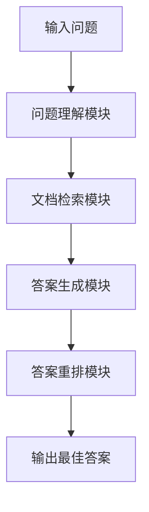
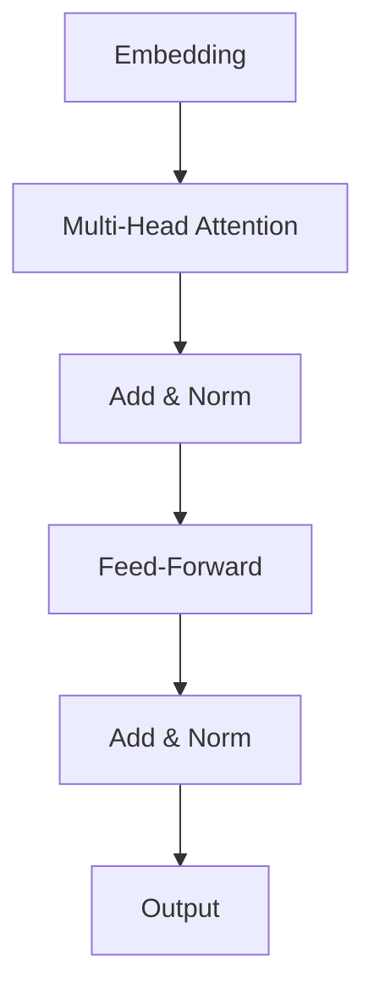

# 大语言模型在问答系统中的应用：技术方案与代码实践

## 1. 背景介绍

### 1.1 问答系统的重要性

在当今信息时代,海量的数据和知识被不断产生和积累。人们面临着从庞大的信息中快速获取所需知识的挑战。问答系统(Question Answering System, QA)作为一种自然语言处理技术,旨在自动从给定的文本语料库中检索出对特定问题的准确答案,为用户提供高效、便捷的知识获取途径。

问答系统广泛应用于搜索引擎、客户服务、智能助手等领域,可以极大地提高信息检索的效率和用户体验。随着人工智能技术的不断发展,基于大语言模型的问答系统逐渐成为研究热点。

### 1.2 大语言模型在问答系统中的作用

大语言模型(Large Language Model, LLM)是一种利用海量语料训练而成的深度神经网络模型,能够捕捉语言的复杂语义和上下文关系。相比传统的基于规则或模板的问答系统,基于大语言模型的问答系统具有以下优势:

1. **语义理解能力强**:大语言模型能够深入理解问题和文本的语义,更好地捕捉上下文信息,提高答案的准确性和相关性。
2. **泛化能力好**:大语言模型通过学习海量语料,具备较强的泛化能力,可以应对各种领域和形式的问题。
3. **无需人工规则**:传统问答系统需要人工设计复杂的规则和模板,而基于大语言模型的系统可以自主学习语言模式,降低了开发和维护成本。

本文将重点介绍如何将大语言模型应用于问答系统,包括核心技术、算法原理、代码实现等内容,为读者提供全面的理解和实践指导。

## 2. 核心概念与联系

### 2.1 大语言模型

大语言模型是一种基于深度学习的自然语言处理模型,通过在海量语料上训练,学习语言的统计规律和语义表示。常见的大语言模型包括:

- **GPT(Generative Pre-trained Transformer)**: 由OpenAI开发的基于Transformer的生成式语言模型,可用于文本生成、问答等任务。
- **BERT(Bidirectional Encoder Representations from Transformers)**: 由Google开发的基于Transformer的双向编码语言模型,在自然语言理解任务上表现出色。
- **XLNet**: 由Carnegie Mellon University和Google Brain开发的基于Transformer的自回归语言模型,在多项自然语言处理任务上取得了state-of-the-art的表现。
- **T5(Text-to-Text Transfer Transformer)**: 由Google开发的统一的Transformer模型,可用于多种自然语言处理任务,如文本生成、文本summarization、问答等。

这些大语言模型通过预训练和微调的方式,可以应用于各种自然语言处理任务,包括问答系统。

### 2.2 问答系统的核心任务

问答系统通常包括以下几个核心任务:

1. **问题理解(Question Understanding)**: 对输入的自然语言问题进行语义分析和表示,理解问题的意图和关键信息。
2. **文档检索(Document Retrieval)**: 从给定的语料库中检索与问题相关的文档或段落,为后续的答案生成提供必要的上下文信息。
3. **答案生成(Answer Generation)**: 基于问题和检索到的相关文档,生成对应的自然语言答案。
4. **答案重排(Answer Reranking,可选)**: 对生成的多个候选答案进行打分和重新排序,选择最佳答案。

大语言模型在这些任务中发挥着关键作用,尤其在问题理解和答案生成方面表现出色。

## 3. 核心算法原理具体操作步骤

### 3.1 基于大语言模型的问答系统架构

基于大语言模型的问答系统通常采用以下架构:

1. **问题理解模块**: 利用大语言模型对输入问题进行语义表示和分析,提取关键信息,如问题类型、实体、关系等。
2. **文档检索模块**: 基于问题理解的结果,在语料库中检索与问题相关的文档或段落,为答案生成提供必要的上下文信息。
3. **答案生成模块**: 利用大语言模型,结合问题和检索到的相关文档,生成自然语言形式的答案。
4. **答案重排模块(可选)**: 对生成的多个候选答案进行打分和重新排序,选择最佳答案作为输出。

在实际应用中,可以根据具体需求对该架构进行调整和优化。

### 3.2 问题理解

问题理解是问答系统的关键环节之一,直接影响后续文档检索和答案生成的质量。利用大语言模型进行问题理解的一般步骤如下:

1. **问题编码**: 将输入的自然语言问题转换为大语言模型可以理解的token序列,如BERT的WordPiece编码。
2. **语义表示**: 将编码后的token序列输入大语言模型,获得问题的语义表示,即上下文敏感的向量表示。
3. **特征提取**: 从语义表示中提取关键特征,如问题类型(事实型、因果型等)、关键实体、关系等,以辅助后续的文档检索和答案生成。

常用的特征提取方法包括:

- **序列标注**: 利用序列标注模型(如BERT+CRF)识别问题中的实体和关系。
- **分类器**: 训练分类器(如BERT+分类头)识别问题类型。
- **注意力机制**: 利用大语言模型的注意力分数提取关键词或短语。

### 3.3 文档检索

文档检索的目标是从语料库中检索与问题相关的文档或段落,为答案生成提供必要的上下文信息。常用的文档检索方法包括:

1. **词匹配检索**: 基于问题中的关键词在语料库中搜索相关文档,如BM25、TF-IDF等传统检索模型。
2. **语义检索**: 利用大语言模型计算问题和文档之间的语义相似度,检索与问题最相关的文档,如基于BERT的双编码器或交互式模型。
3. **密集检索**: 将问题和文档映射到同一语义空间,基于向量相似度进行快速近似最近邻搜索,如Facebook AI的DPR模型。

根据具体场景,可以采用单阶段或多阶段检索策略,结合词匹配和语义检索的优势,提高检索效率和准确性。

### 3.4 答案生成

答案生成是问答系统的核心环节,需要基于问题和检索到的相关文档,生成自然语言形式的答案。利用大语言模型进行答案生成的一般步骤如下:

1. **输入构建**: 将问题和相关文档拼接为单个序列,作为大语言模型的输入。
2. **生成式解码**: 利用大语言模型的生成式解码功能(如GPT的top-k/top-p采样),生成自然语言形式的答案。
3. **约束解码(可选)**: 在解码过程中引入约束条件,如答案长度、关键词等,以提高答案的质量和相关性。

常用的答案生成模型包括:

- **GPT**: 利用OpenAI的GPT模型及其变体(如GPT-2、GPT-3)进行生成式解码。
- **T5**: 利用Google的T5模型,将问答任务转换为"文本到文本"的生成任务。
- **BART/ProphetNet**: 利用Facebook AI的BART或微软的ProphetNet模型,结合编码器-解码器架构进行答案生成。

根据实际需求,还可以对生成的答案进行后处理,如去重、拼写检查、语法纠正等。

### 3.5 答案重排(可选)

在某些情况下,问答系统可能会生成多个候选答案。为了选择最佳答案,可以引入答案重排模块,对候选答案进行打分和重新排序。常用的答案重排方法包括:

1. **机器学习打分模型**: 训练机器学习模型(如逻辑回归、梯度提升树等)对候选答案进行打分,根据特征如答案长度、关键词覆盖率等进行排序。
2. **基于大语言模型的打分**: 利用大语言模型计算问题-答案对的语义相关性分数,作为候选答案的打分依据。
3. **基于知识的约束**: 引入外部知识库,对候选答案进行过滤和打分,如实体链接、事实验证等。

答案重排模块可以提高问答系统的准确性和鲁棒性,但也会增加计算开销。在实际应用中,需要权衡答案质量和系统效率。

## 4. 数学模型和公式详细讲解举例说明

在问答系统中,大语言模型通常采用基于Transformer的架构,如BERT、GPT等。Transformer是一种全注意力机制的序列到序列模型,能够有效捕捉输入序列中的长程依赖关系。

### 4.1 Transformer架构

Transformer的核心组件是多头注意力机制(Multi-Head Attention)和前馈神经网络(Feed-Forward Neural Network)。它的基本架构如下:

其中:

- **Embedding**: 将输入序列(如词或子词)映射到连续的向量空间。
- **Multi-Head Attention**: 计算输入序列中每个位置与其他位置的注意力权重,捕捉长程依赖关系。
- **Add & Norm**: 残差连接和层归一化,用于加速训练和提高模型性能。
- **Feed-Forward**: 对每个位置的向量进行全连接前馈运算,提供非线性映射能力。

Transformer的输出是一个序列的向量表示,可用于下游任务如序列生成、序列分类等。

### 4.2 注意力机制

注意力机制是Transformer的核心,它能够自适应地捕捉输入序列中不同位置之间的依赖关系。给定一个查询向量 $\boldsymbol{q}$ 和一组键-值对 $(\boldsymbol{K}, \boldsymbol{V})$,注意力机制的计算过程如下:

$$\begin{aligned}
\text{Attention}(\boldsymbol{Q}, \boldsymbol{K}, \boldsymbol{V}) &= \text{softmax}\left(\frac{\boldsymbol{Q}\boldsymbol{K}^\top}{\sqrt{d_k}}\right)\boldsymbol{V} \\
&= \sum_{i=1}^n \alpha_i \boldsymbol{v}_i
\end{aligned}$$

其中:

- $\boldsymbol{Q}$、$\boldsymbol{K}$、$\boldsymbol{V}$ 分别表示查询、键和值的矩阵表示。
- $d_k$ 是缩放因子,用于防止内积过大导致梯度饱和。
- $\alpha_i$ 是注意力权重,反映了查询对键 $\boldsymbol{k}_i$ 的关注程度。
- 输出是加权求和的值向量,捕捉了输入序列中不同位置的信息。

多头注意力机制(Multi-Head Attention)是将多个注意力头的输出进行拼接,以捕捉不同的子空间表示:

$$\text{MultiHead}(\boldsymbol{Q}, \boldsymbol{K}, \boldsymbol{V}) = \text{Concat}(\text{head}_1, \dots, \text{head}_h)\boldsymbol{W}^O$$

其中 $\text{head}_i = \text{Attention}(\boldsymbol{Q}\boldsymbol{W}_i^Q, \boldsymbol{K}\boldsymbol{W}_i^K, \boldsymbol{V}\boldsymbol{W}_i^V)$,  $\boldsymbol{W}_i^Q$、$\boldsymbol{W}_i^K$、$\boldsymbol{W}_i^V$、$\boldsymbol{W}^O$ 是可学习的线性变换矩阵。

注意力机制使Transformer能够有效地建模输入序列的上下文信息,是大语言模型取得卓越性能的关键所在。

### 4.3 生成式解码

在问答系统