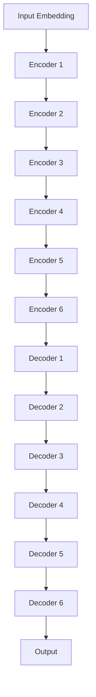

# 如何利用AI LLM优化自然语言处理任务

## 1. 背景介绍

### 1.1 自然语言处理的重要性

在当今的数字时代,自然语言处理(NLP)已经成为人工智能(AI)领域中最重要和最具挑战性的研究方向之一。随着大数据和计算能力的不断提高,NLP技术在各个领域都有着广泛的应用,如智能助手、机器翻译、情感分析、文本摘要等。然而,传统的NLP方法往往需要大量的人工特征工程,效率低下且容易受到语言偏差的影响。

### 1.2 大型语言模型(LLM)的兴起

近年来,benefing from 大规模的计算资源和海量的语料数据,大型语言模型(Large Language Model,LLM)通过自监督学习的方式在NLP任务上取得了突破性的进展。LLM能够从大量无标注的文本数据中自动学习语言知识,捕捉语义和上下文信息,从而在下游NLP任务中表现出惊人的泛化能力。

### 1.3 AI LLM在NLP中的应用前景

AI LLM不仅在学术界引起了广泛关注,在工业界也得到了越来越多的应用。通过对LLM进行优化和微调,我们可以将其应用于各种NLP任务,从而显著提高性能并降低人工成本。本文将探讨如何利用AI LLM来优化自然语言处理任务,包括LLM的工作原理、优化技术、实际应用案例等,为读者提供一个全面的指导。

## 2. 核心概念与联系

### 2.1 自然语言处理(NLP)

自然语言处理是人工智能的一个分支,旨在使计算机能够理解、处理和生成人类语言。NLP涉及多个子领域,包括:

- **语音识别**: 将语音信号转换为文本
- **语义分析**: 理解语言的含义和上下文
- **自然语言生成**: 根据某些输入自动生成自然语言文本
- **机器翻译**: 在不同语言之间进行自动翻译
- **问答系统**: 回答用户提出的自然语言问题
- **信息检索**: 从大量文本数据中检索相关信息
- **情感分析**: 识别和分类文本中的情感态度

### 2.2 大型语言模型(LLM)

大型语言模型是一种基于深度学习的NLP模型,通过在大规模语料库上进行自监督预训练而获得强大的语言理解和生成能力。常见的LLM包括:

- **GPT(Generative Pre-trained Transformer)**: 由OpenAI开发,是第一个真正成功的大型语言模型,能够生成连贯、流畅的自然语言文本。
- **BERT(Bidirectional Encoder Representations from Transformers)**: 由Google开发,是一种双向编码器模型,在各种NLP任务上表现出色。
- **XLNet**: 由Carnegie Mellon University和Google Brain开发,是一种通用自回归预训练模型,在多项基准测试中表现优异。
- **T5(Text-to-Text Transfer Transformer)**: 由Google开发,是一种将所有NLP任务统一为"文本到文本"的框架,在多项任务上取得了state-of-the-art的表现。

LLM的核心思想是通过在大量无标注文本数据上进行自监督预训练,学习通用的语言表示,然后将这些表示迁移到下游的NLP任务中进行微调,从而显著提高任务性能。

### 2.3 LLM与传统NLP方法的区别

与传统的NLP方法相比,LLM具有以下优势:

1. **无需人工特征工程**: 传统方法需要人工设计和提取特征,而LLM可以自动从数据中学习特征表示。
2. **泛化能力强**: LLM在大量无标注数据上进行预训练,能够捕捉到丰富的语义和上下文信息,因此在下游任务上具有很强的泛化能力。
3. **一次训练,多项应用**: 经过预训练的LLM可以通过简单的微调就能应用于多种NLP任务,大大降低了开发成本。
4. **持续学习能力**: LLM可以通过不断地在新数据上继续训练,从而持续扩展和更新自身的知识库。

然而,LLM也存在一些挑战,如需要大量计算资源、可解释性较差、存在偏见和安全隐患等,这些问题需要在实际应用中加以解决。

## 3. 核心算法原理具体操作步骤 

### 3.1 自监督预训练

LLM的核心是通过自监督预训练在大规模语料库上学习通用的语言表示。常见的自监督预训练目标包括:

1. **掩码语言模型(Masked Language Modeling, MLM)**: 随机掩蔽输入序列中的某些token,模型需要基于上下文预测被掩蔽的token。这种方式能够让模型学习双向的语义表示。

2. **下一句预测(Next Sentence Prediction, NSP)**: 判断两个句子是否为连续的句子,从而让模型学习捕捉句子之间的关系和语境。

3. **因果语言模型(Causal Language Modeling, CLM)**: 基于前文预测下一个token,这种自回归的方式能够让模型学习生成自然语言。

4. **序列到序列(Sequence-to-Sequence)**: 将输入序列映射到输出序列,可用于机器翻译、摘要等任务。

5. **反向语言模型(Reversed Language Modeling)**: 基于后文预测当前token,以缓解语言模型的展位偏差问题。

这些预训练目标可以单独使用,也可以组合使用。通过大规模的自监督预训练,LLM能够学习到丰富的语义和上下文知识,为下游任务奠定基础。

### 3.2 微调(Fine-tuning)

经过自监督预训练后,LLM需要在特定的下游任务上进行微调,以进一步提高任务性能。微调的过程包括:

1. **准备训练数据**: 针对目标任务准备标注好的训练数据集。

2. **数据预处理**: 对训练数据进行必要的预处理,如分词、标记化、填充等。

3. **设置微调超参数**: 包括学习率、批量大小、训练轮数等超参数。

4. **构建微调模型**: 通常将预训练的LLM作为encoder,在其之上添加适当的task-specific层,如分类头、序列生成头等。

5. **模型微调训练**: 使用准备好的训练数据,对模型进行端到端的微调训练。

6. **模型评估**: 在验证集或测试集上评估微调后模型的性能。

7. **模型优化**: 根据评估结果,通过调整超参数、数据增强等方式对模型进行进一步优化。

通过微调,LLM可以将在大规模语料库上学习到的通用语言知识,转移到特定的下游任务中,从而取得显著的性能提升。

### 3.3 提示学习(Prompt Learning)

除了标准的微调方法外,提示学习(Prompt Learning)是另一种有效利用LLM的范式。提示学习的核心思想是,通过精心设计的提示(prompt),将下游任务"重新表述"为LLM在预训练时遇到的形式,从而直接利用LLM的生成能力完成任务,而无需进行微调。

提示学习的步骤如下:

1. **任务形式化**: 将下游任务转化为一个"填空"问题,设计合适的提示模板。

2. **提示工程**: 探索不同的提示表述方式,如手工提示、自动提示等。

3. **提示选择**: 在验证集上评估不同提示的效果,选择性能最佳的提示。

4. **生成与后处理**: 将选定的提示输入到LLM中,获得生成的结果,并进行必要的后处理。

提示学习的优势在于无需微调,可以快速利用LLM完成各种任务,并避免了微调可能带来的"catastrophic forgetting"问题。但其也存在一些局限性,如对提示设计的依赖、生成质量的不确定性等,需要根据具体场景权衡使用。

## 4. 数学模型和公式详细讲解举例说明

LLM通常是基于Transformer的序列到序列模型,其核心是Self-Attention机制。我们先来回顾一下Transformer模型的基本结构:

### 4.1 Self-Attention机制

Self-Attention是Transformer模型的核心,它能够捕捉输入序列中任意两个位置之间的关系。具体来说,对于一个长度为$n$的输入序列$\boldsymbol{x} = (x_1, x_2, \dots, x_n)$,Self-Attention的计算过程如下:

1. 将输入序列$\boldsymbol{x}$通过三个不同的线性投影矩阵$\boldsymbol{W}_q, \boldsymbol{W}_k, \boldsymbol{W}_v$分别映射到Query($\boldsymbol{Q}$)、Key($\boldsymbol{K}$)和Value($\boldsymbol{V}$)空间:

$$\begin{aligned}
\boldsymbol{Q} &= \boldsymbol{x}\boldsymbol{W}_q \\
\boldsymbol{K} &= \boldsymbol{x}\boldsymbol{W}_k \\
\boldsymbol{V} &= \boldsymbol{x}\boldsymbol{W}_v
\end{aligned}$$

2. 计算Query与所有Key之间的点积,对其进行缩放并应用Softmax函数,得到Attention分数矩阵$\boldsymbol{A}$:

$$\boldsymbol{A} = \text{softmax}\left(\frac{\boldsymbol{Q}\boldsymbol{K}^\top}{\sqrt{d_k}}\right)$$

其中$d_k$是Key向量的维度,缩放是为了防止点积值过大导致梯度消失。

3. 将Attention分数矩阵$\boldsymbol{A}$与Value矩阵$\boldsymbol{V}$相乘,得到输出表示$\boldsymbol{Z}$:

$$\boldsymbol{Z} = \boldsymbol{A}\boldsymbol{V}$$

$\boldsymbol{Z}$的每一行都是对应位置的Value向量的加权和,权重由Attention分数决定。这样,Self-Attention就能够自动学习到输入序列中不同位置之间的依赖关系。

在实际应用中,通常会使用多头注意力(Multi-Head Attention),即将输入序列通过不同的投影矩阵映射到多个子空间,分别计算Attention,再将结果拼接起来,以捕捉不同子空间的信息。

### 4.2 Transformer编码器(Encoder)

Transformer的编码器由多个相同的层组成,每一层包含两个子层:Multi-Head Attention层和前馈全连接层。

1. **Multi-Head Attention层**:
    - 输入序列$\boldsymbol{x}$通过Multi-Head Self-Attention计算得到$\boldsymbol{z}$
    - 将$\boldsymbol{z}$与$\boldsymbol{x}$相加,得到$\boldsymbol{x}'$
    - 对$\boldsymbol{x}'$进行Layer Normalization,得到该层的输出$\boldsymbol{y}_1$

2. **前馈全连接层**:
    - 将$\boldsymbol{y}_1$通过两个全连接层变换,中间使用ReLU激活函数
    - 将变换后的结果与$\boldsymbol{y}_1$相加
    - 对加和结果进行Layer Normalization,得到该层的最终输出$\boldsymbol{y}_2$

编码器的输出$\boldsymbol{y}_2$将作为解码器的输入,用于生成目标序列。

### 4.3 Transformer解码器(Decoder)

Transformer的解码器与编码器结构类似,也由多个相同的层组成,每一层包含三个子层:

1. **Masked Multi-Head Attention层**:
    - 对当前已生成的目标序列进行Masked Self-Attention,确保每个位置只能看到之前的位置
    - 将