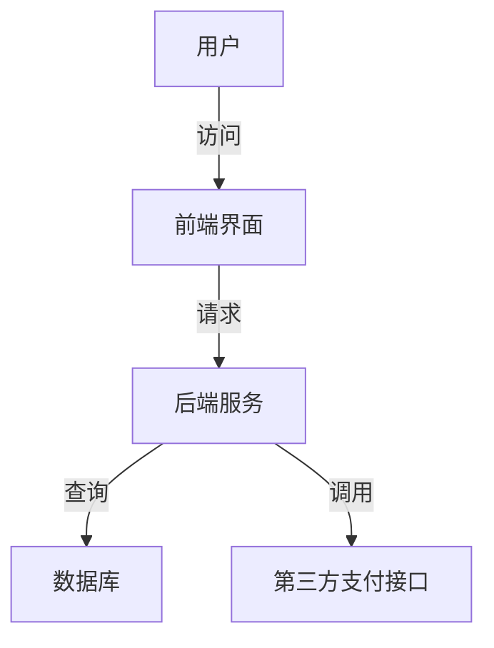

# 客运售票系统详细设计与具体代码实现

## 1. 背景介绍

### 1.1 需求分析

客运售票系统是现代交通行业中至关重要的一部分。它不仅需要处理大量的用户请求，还需要确保数据的准确性和安全性。随着技术的发展，传统的手工售票方式已经无法满足日益增长的客运需求，因此开发一个高效、可靠的客运售票系统显得尤为重要。

### 1.2 系统目标

设计一个客运售票系统，主要目标包括：
- 提供用户友好的界面，方便用户购买车票。
- 支持多种支付方式，确保交易安全。
- 实现高效的票务管理，包括票务查询、预订、取消等功能。
- 提供实时的票务信息，确保数据的及时更新。
- 确保系统的高可用性和扩展性，能够应对高并发请求。

### 1.3 现有系统分析

现有的客运售票系统大多采用集中式架构，存在单点故障、扩展性差等问题。随着用户数量的增加，系统的性能和稳定性面临巨大的挑战。因此，我们需要设计一个基于分布式架构的客运售票系统，以提高系统的可靠性和可扩展性。

## 2. 核心概念与联系

### 2.1 系统架构

客运售票系统的核心架构包括前端用户界面、后端服务、数据库和第三方支付接口。系统采用微服务架构，各个功能模块独立部署，互相之间通过API进行通信。



### 2.2 模块划分

系统主要分为以下几个模块：
- 用户管理模块：处理用户的注册、登录、信息修改等功能。
- 票务管理模块：处理车票的查询、预订、取消等功能。
- 支付管理模块：处理支付相关的功能，包括支付请求、支付确认等。
- 数据管理模块：处理数据的存储、查询和更新等功能。

### 2.3 数据流

数据流是系统设计中的关键部分，它描述了数据在系统中的流动过程。以用户购买车票为例，数据流如下：
1. 用户通过前端界面提交购票请求。
2. 前端界面将请求发送到后端服务。
3. 后端服务查询数据库，检查车票是否有余票。
4. 如果有余票，后端服务调用第三方支付接口，处理支付请求。
5. 支付成功后，后端服务更新数据库，确认车票预订成功。
6. 后端服务将确认信息返回给前端界面。
7. 前端界面将确认信息展示给用户。

## 3. 核心算法原理具体操作步骤

### 3.1 车票查询算法

车票查询是客运售票系统中的一个重要功能，它需要在大量的数据中快速查找满足用户需求的车票。下面是一个简单的车票查询算法：

1. 接收用户的查询请求，包括出发地、目的地、出发时间等信息。
2. 根据用户的查询条件，从数据库中查找满足条件的车票。
3. 对查找到的车票按照出发时间进行排序。
4. 返回排序后的车票信息给用户。

### 3.2 余票检查算法

余票检查是确保用户能够购买到车票的关键步骤。下面是一个简单的余票检查算法：

1. 接收用户的购票请求，包括车次信息和购票数量。
2. 从数据库中查询该车次的余票数量。
3. 如果余票数量大于或等于购票数量，则允许购票；否则，返回余票不足的信息。

### 3.3 支付处理算法

支付处理是客运售票系统中的一个关键步骤，它需要确保支付的安全性和可靠性。下面是一个简单的支付处理算法：

1. 接收用户的支付请求，包括支付金额、支付方式等信息。
2. 调用第三方支付接口，处理支付请求。
3. 根据支付接口的返回结果，判断支付是否成功。
4. 如果支付成功，更新数据库，确认车票预订成功；否则，返回支付失败的信息。

## 4. 数学模型和公式详细讲解举例说明

### 4.1 车票查询数学模型

车票查询可以看作是一个多条件的查询问题，可以用集合论来表示。设 $T$ 是所有车票的集合，$Q$ 是用户的查询条件，则满足查询条件的车票集合 $T_Q$ 可以表示为：

$$
T_Q = \{ t \in T \mid t \text{ 满足 } Q \}
$$

### 4.2 余票检查数学模型

余票检查可以看作是一个简单的比较问题。设 $S$ 是车次的总票数，$B$ 是已售票数，$R$ 是余票数，则余票数可以表示为：

$$
R = S - B
$$

如果 $R \geq N$（其中 $N$ 是用户的购票数量），则允许购票；否则，返回余票不足的信息。

### 4.3 支付处理数学模型

支付处理可以看作是一个状态转换问题。设 $P$ 是支付请求的集合，$S$ 是支付状态的集合，则支付处理可以表示为一个状态转换函数：

$$
f : P \rightarrow S
$$

其中，$S = \{ \text{成功}, \text{失败} \}$。支付处理的目标是将支付请求 $p \in P$ 转换为支付状态 $s \in S$。

## 5. 项目实践：代码实例和详细解释说明

### 5.1 用户管理模块

```python
from flask import Flask, request, jsonify
from werkzeug.security import generate_password_hash, check_password_hash
import sqlite3

app = Flask(__name__)
db_path = 'users.db'

def init_db():
    conn = sqlite3.connect(db_path)
    cursor = conn.cursor()
    cursor.execute('''
    CREATE TABLE IF NOT EXISTS users (
        id INTEGER PRIMARY KEY AUTOINCREMENT,
        username TEXT NOT NULL,
        password TEXT NOT NULL
    )
    ''')
    conn.commit()
    conn.close()

@app.route('/register', methods=['POST'])
def register():
    data = request.get_json()
    username = data['username']
    password = generate_password_hash(data['password'])
    
    conn = sqlite3.connect(db_path)
    cursor = conn.cursor()
    cursor.execute('INSERT INTO users (username, password) VALUES (?, ?)', (username, password))
    conn.commit()
    conn.close()
    
    return jsonify({'message': 'User registered successfully'}), 201

@app.route('/login', methods=['POST'])
def login():
    data = request.get_json()
    username = data['username']
    password = data['password']
    
    conn = sqlite3.connect(db_path)
    cursor = conn.cursor()
    cursor.execute('SELECT password FROM users WHERE username = ?', (username,))
    user = cursor.fetchone()
    conn.close()
    
    if user and check_password_hash(user[0], password):
        return jsonify({'message': 'Login successful'}), 200
    else:
        return jsonify({'message': 'Invalid credentials'}), 401

if __name__ == '__main__':
    init_db()
    app.run(debug=True)
```

### 5.2 票务管理模块

```python
from flask import Flask, request, jsonify
import sqlite3

app = Flask(__name__)
db_path = 'tickets.db'

def init_db():
    conn = sqlite3.connect(db_path)
    cursor = conn.cursor()
    cursor.execute('''
    CREATE TABLE IF NOT EXISTS tickets (
        id INTEGER PRIMARY KEY AUTOINCREMENT,
        departure TEXT NOT NULL,
        destination TEXT NOT NULL,
        departure_time TEXT NOT NULL,
        available_seats INTEGER NOT NULL
    )
    ''')
    conn.commit()
    conn.close()

@app.route('/search', methods=['GET'])
def search_tickets():
    departure = request.args.get('departure')
    destination = request.args.get('destination')
    departure_time = request.args.get('departure_time')
    
    conn = sqlite3.connect(db_path)
    cursor = conn.cursor()
    cursor.execute('''
    SELECT * FROM tickets WHERE departure = ? AND destination = ? AND departure_time = ?
    ORDER BY departure_time
    ''', (departure, destination, departure_time))
    tickets = cursor.fetchall()
    conn.close()
    
    return jsonify(tickets), 200

@app.route('/book', methods=['POST'])
def book_ticket():
    data = request.get_json()
    ticket_id = data['ticket_id']
    seats = data['seats']
    
    conn = sqlite3.connect(db_path)
    cursor = conn.cursor()
    cursor.execute('SELECT available_seats FROM tickets WHERE id = ?', (ticket_id,))
    available_seats = cursor.fetchone()[0]
    
    if available_seats >= seats:
        cursor.execute('UPDATE tickets SET available_seats = available_seats - ? WHERE id = ?', (seats