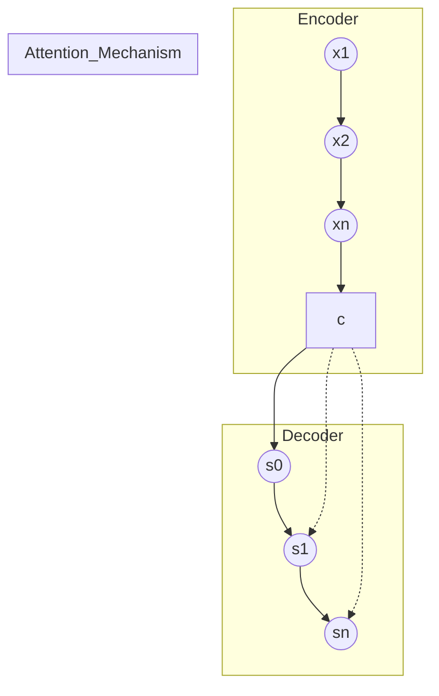

# 序列到序列学习 原理与代码实例讲解

作者：禅与计算机程序设计艺术

## 1. 背景介绍

近年来,深度学习技术取得了巨大的进展,特别是在自然语言处理领域,序列到序列(Sequence-to-Sequence,简称Seq2Seq)学习作为一种强大的端到端学习范式,成为了研究的热点。Seq2Seq模型能够将一个序列映射到另一个序列,具有广泛的应用,如机器翻译、对话系统、文本摘要、图像描述等。

本文将深入探讨Seq2Seq学习的原理、实现、应用以及发展趋势,全面系统地介绍这一前沿技术,让读者能够深入理解并掌握Seq2Seq模型。

### 1.1 Seq2Seq的发展历程

Seq2Seq的概念最早由Google提出,2014年Sutskever等人在论文《Sequence to Sequence Learning with Neural Networks》中首次提出了Seq2Seq模型,并将其应用于机器翻译任务,取得了显著的效果,开启了Seq2Seq研究的新纪元。

此后,Seq2Seq在诸多领域得到广泛应用和发展:

- 2015年,Vinyals等人提出了基于Seq2Seq的图像描述生成模型
- 2015年,Bahdanau等人提出了注意力机制(Attention Mechanism),大幅提升了Seq2Seq模型的性能
- 2016年,Google发布了基于Seq2Seq的实时多语言翻译系统Google Neural Machine Translation (GNMT)
- 2017年,Vaswani等人提出Transformer模型,摒弃传统RNN结构,全面引入自注意力机制,再次刷新多项任务的最佳性能
……
 
如今,Seq2Seq依然是自然语言处理领域最活跃的研究方向之一,不断涌现出新的模型、方法和应用。

### 1.2 Seq2Seq带来的颠覆性变革

传统的自然语言处理模型通常包括多个独立的处理模块,如分词、词性标注、句法分析、语义表示等,每个模块需要单独设计和训练,整个流程复杂繁琐。

而Seq2Seq提供了一种端到端的解决方案——输入一个序列,输出另一个序列,中间不需要人工参与。这种端到端的学习范式具有诸多优势:

- 流程简单:省去了复杂的人工特征工程,直接输入输出序列即可
- 参数统一:所有的模型参数在同一个框架下联合优化
- 效果突出:端到端训练避免了模块间的误差传递,性能大幅提升

Seq2Seq的提出,可以说引发了自然语言处理的一场革命,颠覆了传统的模块化处理流程,为诸多NLP任务提供了全新的解决思路。如今,Seq2Seq已经成为NLP领域必须掌握的核心技术之一。

## 2. 核心概念与联系

我们先来了解一下Seq2Seq中的一些关键概念:

### 2.1 编码器(Encoder)和解码器(Decoder)

Seq2Seq模型的核心是编码器-解码器(Encoder-Decoder)框架:

- 编码器用于将输入序列编码为一个固定长度的向量表示(通常称为上下文向量)
- 解码器根据上下文向量生成输出序列

形象地说,编码器负责"理解"输入序列的语义,解码器负责根据语义"生成"输出序列。两者通过上下文向量来传递信息。

### 2.2 循环神经网络(RNN)

编码器和解码器内部通常使用RNN来处理变长序列。RNN能够建模序列的长距离依赖,对语言建模非常有效。常见的RNN变体有:

- 简单RNN(Vanilla RNN):容易训练,但容易发生梯度消失
- 长短时记忆网络(LSTM):引入门控机制,缓解了梯度消失问题,是应用最广泛的RNN变体
- 门控循环单元(GRU):LSTM的简化版,参数更少,训练更快

此外,还有双向RNN、深层RNN等变体,能够建模更加复杂的序列特征。

### 2.3 注意力机制(Attention Mechanism)

传统的Seq2Seq模型中,编码器将整个输入序列压缩为一个固定的上下文向量。这对较长的序列来说可能信息不足。

注意力机制允许解码器在生成每个输出时,自动搜索与当前输出最相关的输入片段,为当前输出分配不同的注意力权重。这不仅扩充了上下文信息,还提供了解释性——我们可以知道模型在生成每个输出时重点关注了哪些输入片段。常见的注意力机制有:

- 加性注意力(Additive Attention):通过可学习的神经网络来计算注意力权重
- 点积注意力(Dot-Product Attention):通过输入和输出的向量点积来计算注意力权重,速度更快
- 自注意力(Self-Attention):允许序列内部的不同位置相互关注,挖掘序列内部的结构信息

注意力机制是Seq2Seq的重要扩展,极大地提升了模型性能,是现代NLP模型的标配组件。

### 2.4 Seq2Seq核心概念之间的关系

- 编码器和解码器是Seq2Seq的主框架,分别用于理解输入和生成输出
- 编码器和解码器内部一般使用RNN来处理变长序列
- 注意力机制在编码器和解码器之间建立软连接,为解码器提供更丰富的上下文信息

下图直观展示了Seq2Seq的核心概念以及它们之间的关系:

其中,x1到xn表示编码器的输入序列,c表示上下文向量,s0到sn表示解码器的输出序列。注意力机制在c和s1、sn之间建立软连接。

## 3. 核心算法原理具体操作步骤

现在我们来详细介绍Seq2Seq的核心算法原理和实现步骤。以最经典的RNN Encoder-Decoder框架为例:

### 3.1 编码器(Encoder)

编码器接收一个输入序列$x=(x_1,x_2,...,x_T)$,通过RNN递归地计算每个时间步的隐藏状态:

$$h_t = f(x_t, h_{t-1})$$

其中$f$表示RNN单元(如LSTM或GRU),输入为当前时间步的输入$x_t$和前一时间步的隐藏状态$h_{t-1}$。计算到最后一个时间步T后,将最终的隐藏状态$h_T$作为整个输入序列的编码表示,即上下文向量$c=h_T$。 

### 3.2 解码器(Decoder)

解码器根据上下文向量$c$和之前的输出,逐步生成目标序列$y=(y_1,y_2,...,y_{T'})$。在每个时间步$t$,解码器的RNN单元更新隐藏状态:

$$s_t = f(y_{t-1}, s_{t-1}, c)$$

其中$y_{t-1}$为前一时间步生成的输出,$s_{t-1}$为前一时间步的隐藏状态,$c$为编码器传递的上下文向量。将$s_t$通过softmax层转化为输出概率分布:

$$P(y_t|y_1,...,y_{t-1},x) = softmax(Ws_t)$$

解码器根据概率分布$P$采样或选择概率最大的输出作为$y_t$,直到生成特殊的结束符&lt;EOS&gt;,输出完整的目标序列$y_1,y_2,...,y_{T'}$。

### 3.3 注意力机制(Attention Mechanism)

传统的Encoder-Decoder框架中,编码器将整个输入序列压缩为一个固定的上下文向量$c$。当输入序列较长时,这种方式可能损失很多信息。注意力机制能够让解码器在生成每个输出时,自动搜索与当前输出最相关的输入片段,动态地生成上下文向量。

以最经典的Bahdanau Attention为例,在每个解码时间步$t$:

1) 计算解码器隐藏状态$s_t$与编码器每个隐藏状态$h_i$的注意力得分:
$$
e_{ti} = v_a^\top \tanh(W_as_t + U_ah_i)
$$
其中$v_a,W_a,U_a$为可学习的注意力参数。

2) 将注意力得分$e_{ti}$归一化为注意力权重$\alpha_{ti}$:
$$
\alpha_{ti} = \frac{\exp(e_{ti})}{\sum_{j=1}^T \exp(e_{tj})}
$$

3) 根据注意力权重$\alpha_{ti}$计算当前时间步的上下文向量$c_t$:
$$c_t = \sum\limits_{i=1}^T \alpha_{ti}h_i$$

4) 将$c_t$与$s_t$拼接,作为softmax层的输入,生成当前时间步的输出:
$$P(y_t|y_1,...,y_{t-1},x) = softmax(W[s_t;c_t])$$

通过注意力机制,解码器可以在序列的不同位置动态地分配注意力,挖掘输入序列中与当前输出最相关的信息。

### 3.4 训练目标

Seq2Seq模型的目标是最大化生成序列的概率,即最小化负对数似然损失:

$$Loss = -\sum\limits_{t=1}^{T'} \log P(y_t|y_1,...,y_{t-1},x)$$

通过反向传播和梯度下降等优化算法最小化损失函数,联合训练编码器和解码器的参数。

## 4. 数学模型和公式详细讲解举例说明

这里我们详细解释Seq2Seq中用到的一些关键数学模型和公式。

### 4.1 RNN的数学模型

RNN能够处理任意长度的序列数据,其核心是递归地定义隐藏状态$h_t$:

$$h_t = \phi(Ux_t + Wh_{t-1} + b)$$

其中$\phi$为非线性激活函数(如tanh、ReLU等),$U$和$W$分别是输入到隐藏和隐藏到隐藏的权重矩阵,$b$为偏置项。

以文本序列为例,设输入单词$x_t$的词向量为$e(x_t) \in \mathbb{R}^d$,隐藏状态$h_t \in \mathbb{R}^h$,则$U \in \mathbb{R}^{h \times d}, W \in \mathbb{R}^{h \times h}, b \in \mathbb{R}^h$。

假设输入序列为"I love NLP",对应的词向量为$e(I),e(love),e(NLP)$,RNN逐步计算隐藏状态:

$$
\begin{aligned}
h_1 &= \phi(Ue(I)+ b) \\
h_2 &= \phi(Ue(love) + Wh_1 + b) \\ 
h_3 &= \phi(Ue(NLP) + Wh_2 + b)
\end{aligned}
$$

最终隐藏状态$h_3$编码了整个序列"I love NLP"的语义信息。实际应用中,一般使用LSTM或GRU等变体,引入门控机制增强RNN建模长距离依赖的能力。

### 4.2 Softmax函数

Softmax函数将一个实值向量$z=(z_1,...,z_K)$映射为一个概率分布$p=(p_1,...,p_K)$:

$$p_k = \frac{\exp(z_k)}{\sum\limits_{i=1}^K \exp(z_i)}, \quad k=1,...,K$$

直观来看,Softmax函数通过指数变换和归一化,将输入向量$z$中的每个元素$z_i$"挤压"到(0,1)区间内,并且所有元素的和为1,从而得到一个合法的概率分布。

以文本生成为例,设RNN解码器在某个时间步的隐藏状态为$s \in \mathbb{R}^h$,词表大小为$K$,将$s$通过一个全连接层映射到$\mathbb{R}^K$空间得到$z=Ws+b, W \in \