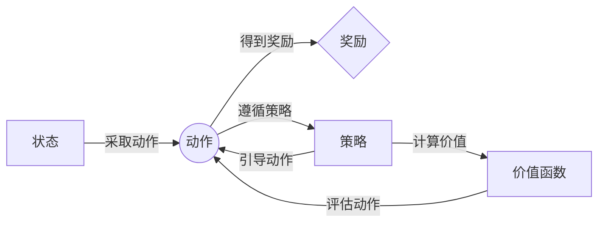

## 1.背景介绍

强化学习，作为人工智能领域中极具活力的一个分支，已经在很多现实世界的问题中发挥了巨大的作用。强化学习的根本思想在于通过与环境的互动，智能体学习如何在给定的状态下选择最优的动作，以达到最大化累积回报的目标。这种以目标驱动的学习方式，使得强化学习在游戏、机器人、推荐系统等多个领域都有广泛的应用。

## 2.核心概念与联系

在强化学习中，最核心的概念包括状态(State)，动作(Action)，奖励(Reward)，策略(Policy)，价值函数(Value Function)等。

- **状态(State)**：在强化学习任务中，智能体所处的环境情况被称为状态。
- **动作(Action)**：智能体在某个状态下可以选择的行为被称为动作。
- **奖励(Reward)**：智能体在某个状态下选择某个动作后，环境给予的反馈称为奖励。
- **策略(Policy)**：策略是智能体在各个状态下应该选择哪个动作的规则。
- **价值函数(Value Function)**：价值函数用于评估在某个状态下选择某个动作的长期回报。

这些概念之间的关系可以通过以下的Mermaid流程图进行简洁的展示：


## 3.核心算法原理具体操作步骤

强化学习的核心算法包括值迭代(Value Iteration)，策略迭代(Policy Iteration)，Q学习(Q-Learning)等。这里以Q学习为例，介绍其核心原理和操作步骤。

Q学习是一种基于值迭代的强化学习算法，它使用一种叫做Q值的函数来评估在某个状态下执行某个动作的价值。Q值函数的更新规则如下：

$$ Q(s,a) \leftarrow Q(s,a) + \alpha [r + \gamma \max_{a'} Q(s',a') - Q(s,a)] $$

其中，$\alpha$是学习率，用于控制学习的速度；$\gamma$是折扣因子，用于控制对未来奖励的重视程度；$r$是当前的奖励；$s'$是新的状态；$a'$是新状态下的动作。

Q学习的操作步骤如下：

1. 初始化Q值函数
2. 在每个时间步，智能体根据当前的Q值函数和策略选择一个动作
3. 智能体执行动作，观察奖励和新的状态
4. 更新Q值函数
5. 如果任务结束，跳到下一个任务，否则回到步骤2

## 4.数学模型和公式详细讲解举例说明

在强化学习中，我们通常使用马尔科夫决策过程(Markov Decision Process, MDP)来描述任务。MDP假设智能体的下一个状态只依赖于当前的状态和动作，与之前的状态和动作无关。MDP可以用五元组$(S, A, P, R, \gamma)$来描述，其中$S$是状态集合，$A$是动作集合，$P$是状态转移概率，$R$是奖励函数，$\gamma$是折扣因子。

在MDP中，策略$\pi$是指定在每个状态下选择动作的概率分布，即$\pi(a|s)$。在给定策略$\pi$下，状态价值函数$V^\pi(s)$和动作价值函数$Q^\pi(s,a)$分别表示在状态$s$下和在状态$s$下选择动作$a$后的期望回报，其计算公式如下：

$$ V^\pi(s) = \sum_{a} \pi(a|s) Q^\pi(s,a) $$

$$ Q^\pi(s,a) = R(s,a) + \gamma \sum_{s'} P(s'|s,a) V^\pi(s') $$

这两个公式是强化学习中的贝尔曼方程，它们揭示了状态价值函数和动作价值函数之间的关系。

## 4.项目实践：代码实例和详细解释说明

我们以OpenAI Gym中的CartPole环境为例，来展示如何使用Q学习算法。在CartPole环境中，智能体的任务是通过移动小车来保持杆子的平衡。

以下是使用Q学习解决CartPole任务的代码实例：

```python
import gym
import numpy as np

env = gym.make('CartPole-v0')
Q = np.zeros([env.observation_space.n, env.action_space.n])

alpha = 0.5
gamma = 0.95
epsilon = 0.1
episodes = 5000

for episode in range(episodes):
    state = env.reset()
    done = False

    while not done:
        if np.random.uniform(0, 1) < epsilon:
            action = env.action_space.sample()
        else:
            action = np.argmax(Q[state])

        next_state, reward, done, _ = env.step(action)
        Q[state, action] = (1 - alpha) * Q[state, action] + alpha * (reward + gamma * np.max(Q[next_state]))
        state = next_state

env.close()
```

在这个代码中，我们首先创建了一个CartPole环境和一个Q值表。然后，我们设置了学习率(alpha)，折扣因子(gamma)，探索率(epsilon)和任务的回合数(episodes)。在每个回合中，智能体根据Q值表和探索率选择动作，然后执行动作并更新Q值表。当任务结束时，智能体开始下一个回合。

## 5.实际应用场景

强化学习被广泛应用在各种实际问题中，例如：

- **游戏**：通过强化学习，智能体可以学习如何玩游戏，并达到超过人类的水平。例如，DeepMind的AlphaGo使用了强化学习算法，成功地击败了世界围棋冠军。
- **机器人**：强化学习可以用于训练机器人执行各种任务，例如行走、跳跃等。通过强化学习，机器人可以在不断与环境互动的过程中，自我学习和提升技能。
- **推荐系统**：强化学习可以用于个性化推荐。通过学习用户的行为和反馈，系统可以更好地理解用户的需求，从而提供更精准的推荐。

## 6.工具和资源推荐

以下是一些强化学习的学习和实践的工具和资源：

- **教科书**：Sutton和Barto的《Reinforcement Learning: An Introduction》是强化学习领域的经典教材，对强化学习的理论和算法有深入的介绍。
- **在线课程**：Coursera上的“强化学习专项课程”和Udacity的“深度学习纳米学位”都有详细的强化学习教程。
- **实践工具**：OpenAI Gym是一个强化学习的环境库，提供了各种预定义的环境，可以用于测试和比较强化学习算法。

## 7.总结：未来发展趋势与挑战

强化学习作为人工智能的重要分支，具有广阔的应用前景和巨大的发展潜力。然而，强化学习也面临着许多挑战，例如样本效率低、稳定性差、易受初始化和超参数影响等。未来的研究将需要在理论和实践上进一步深入，以解决这些问题，推动强化学习的发展。

## 8.附录：常见问题与解答

**问题1：强化学习和监督学习有什么区别？**

答：强化学习和监督学习的主要区别在于，强化学习是通过与环境的互动，通过试错的方式来学习；而监督学习是通过已知的输入输出对来学习。此外，强化学习关注的是如何根据当前的状态选择最优的动作，以最大化长期的回报；而监督学习关注的是如何根据输入预测输出。

**问题2：如何选择强化学习的超参数？**

答：强化学习的超参数包括学习率、折扣因子、探索率等。这些超参数的选择通常需要通过实验来确定。一般来说，学习率决定了学习的速度，折扣因子决定了对未来奖励的重视程度，探索率决定了探索和利用的平衡。

**问题3：为什么我的强化学习智能体学习不成功？**

答：强化学习的学习过程可能受到许多因素的影响，例如初始化、超参数的选择、任务的难度等。如果智能体学习不成功，可能需要尝试调整超参数，或者使用更复杂的策略和算法。