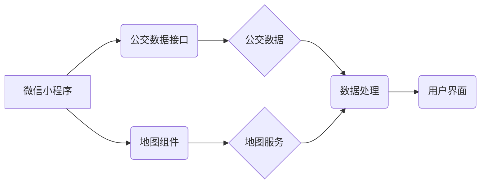
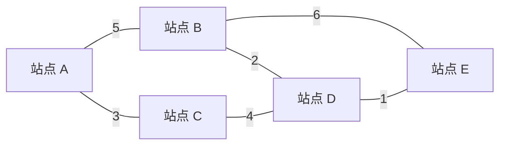

## 微信小程序的城市公交查询系统

作者：禅与计算机程序设计艺术

## 1. 背景介绍

### 1.1 公共交通出行痛点

随着城市化进程的不断加快，城市人口密度越来越大，公共交通出行成为了城市居民日常生活中不可或缺的一部分。然而，传统的公交出行方式存在着诸多痛点，例如：

* **信息不透明:** 乘客难以实时获取公交车到站信息，只能在车站盲目等待，浪费时间和精力。
* **线路规划复杂:**  对于不熟悉路线的乘客，规划最佳乘车路线较为困难，容易造成出行效率低下。
* **乘车体验欠佳:**  公交车厢拥挤、环境嘈杂，乘客的乘车体验不佳。

### 1.2 微信小程序的优势

微信小程序作为一种轻量级的应用程序，具有以下优势：

* **无需下载安装:** 用户无需下载安装即可使用，方便快捷。
* **使用门槛低:**  微信小程序的操作简单易懂，用户学习成本低。
* **用户群体庞大:**  微信作为中国最大的社交平台，拥有庞大的用户群体，小程序可以触达更广泛的用户。

### 1.3 城市公交查询小程序的意义

基于以上背景，开发一款城市公交查询微信小程序具有重要的现实意义：

* **提升出行效率:**  为乘客提供实时公交信息，帮助乘客合理安排出行时间，提高出行效率。
* **优化乘车体验:**  提供线路规划、换乘方案等功能，方便乘客出行，提升乘车体验。
* **促进智慧城市建设:**  城市公交查询小程序是智慧城市建设的重要组成部分，可以提升城市公共交通服务水平，促进城市可持续发展。

## 2. 核心概念与联系

### 2.1 微信小程序开发框架

微信小程序采用类似于 Web 前端开发的技术栈，主要包括：

* **WXML (WeiXin Markup Language):**  类似于 HTML 的标记语言，用于构建小程序的页面结构。
* **WXSS (WeiXin Style Sheets):**  类似于 CSS 的样式表语言，用于控制小程序的页面样式。
* **JavaScript:**  用于处理小程序的逻辑交互。

### 2.2 公交数据接口

城市公交查询小程序的核心功能是获取实时公交数据，通常需要接入第三方公交数据接口，例如：

* **高德地图公交 API:** 提供实时公交、公交线路查询、公交站点查询等功能。
* **百度地图公交 API:** 提供公交线路查询、公交站点查询、公交实时查询等功能。

### 2.3 地图组件

为了在地图上展示公交线路、站点等信息，需要使用地图组件，例如：

* **腾讯地图 SDK:** 提供地图展示、路线规划、POI 搜索等功能。
* **高德地图 SDK:**  提供地图展示、路线规划、POI 搜索等功能。

### 2.4 核心概念联系

下图展示了微信小程序城市公交查询系统的核心概念及其联系：



## 3. 核心算法原理具体操作步骤

### 3.1 公交线路查询

#### 3.1.1  用户输入起点和终点

#### 3.1.2  调用公交数据接口

根据用户输入的起点和终点，调用第三方公交数据接口，获取公交线路数据。

#### 3.1.3  数据解析与处理

对接口返回的公交线路数据进行解析和处理，提取出线路名称、途经站点、预计时间等信息。

#### 3.1.4  结果展示

将处理后的公交线路数据展示在地图上，并以列表形式展示线路详情，方便用户选择。

### 3.2 公交站点查询

#### 3.2.1  用户输入站点名称

#### 3.2.2  调用公交数据接口

根据用户输入的站点名称，调用第三方公交数据接口，获取该站点经过的公交线路数据。

#### 3.2.3  数据解析与处理

对接口返回的公交线路数据进行解析和处理，提取出线路名称、到站时间、距离等信息。

#### 3.2.4  结果展示

将处理后的公交线路数据以列表形式展示，并在地图上标记该站点的位置，方便用户查看。

### 3.3 实时公交查询

#### 3.3.1  获取用户当前位置

调用微信小程序的定位 API，获取用户当前位置信息。

#### 3.3.2  查询附近公交站点

根据用户当前位置，查询附近的公交站点信息。

#### 3.3.3  调用实时公交接口

根据公交站点 ID，调用第三方公交数据接口，获取该站点实时公交信息。

#### 3.3.4  数据解析与处理

对接口返回的实时公交数据进行解析和处理，提取出公交车牌号、距离、预计到站时间等信息。

#### 3.3.5  结果展示

将处理后的实时公交信息以列表形式展示，并在地图上标记公交车的位置，方便用户查看。

## 4. 数学模型和公式详细讲解举例说明

本节以公交线路规划算法为例，介绍其数学模型和公式。

### 4.1 Dijkstra 算法

Dijkstra 算法是一种经典的最短路径算法，可以用于计算公交网络中两点之间的最短路径。

#### 4.1.1 算法描述

1. 创建一个距离表，记录每个站点到起点的最短距离，初始时只有起点到自身的距离为 0，其他站点到起点的距离为无穷大。
2. 创建一个集合，用于存储已经找到最短路径的站点，初始为空。
3. 从距离表中选择距离起点最近的站点，将其加入到已找到最短路径的站点集合中。
4. 遍历该站点的所有邻接站点，如果从起点经过该站点到达邻接站点的距离小于当前距离表中记录的距离，则更新距离表中该邻接站点到起点的距离。
5. 重复步骤 3 和 4，直到找到终点或所有站点都已加入到已找到最短路径的站点集合中。

#### 4.1.2 数学公式

设 $G = (V, E)$ 表示公交网络，其中 $V$ 表示站点集合，$E$ 表示线路集合。$w(u, v)$ 表示站点 $u$ 到站点 $v$ 的距离。

Dijkstra 算法的数学公式如下：

$$
\begin{aligned}
& d[s] = 0 \\
& d[v] = \infty, \forall v \in V - \{s\} \\
& \text{while } Q \neq \emptyset: \\
& \qquad u = \text{extract-min}(Q) \\
& \qquad \text{for each } (u, v) \in E: \\
& \qquad \qquad \text{if } d[u] + w(u, v) < d[v]: \\
& \qquad \qquad \qquad d[v] = d[u] + w(u, v) \\
\end{aligned}
$$

其中：

* $d[v]$ 表示起点 $s$ 到站点 $v$ 的最短距离。
* $Q$ 表示尚未找到最短路径的站点集合。
* $\text{extract-min}(Q)$ 表示从集合 $Q$ 中取出距离起点最近的站点。

### 4.2  示例

假设有一个公交网络，如下图所示：



使用 Dijkstra 算法计算站点 A 到站点 E 的最短路径：

1. 初始化距离表：

| 站点 | 距离 |
|---|---|
| A | 0 |
| B | ∞ |
| C | ∞ |
| D | ∞ |
| E | ∞ |

2. 将站点 A 加入到已找到最短路径的站点集合中，并更新距离表：

| 站点 | 距离 |
|---|---|
| A | 0 |
| B | 5 |
| C | 3 |
| D | ∞ |
| E | ∞ |

3. 从距离表中选择距离起点最近的站点 C，将其加入到已找到最短路径的站点集合中，并更新距离表：

| 站点 | 距离 |
|---|---|
| A | 0 |
| B | 5 |
| C | 3 |
| D | 7 |
| E | ∞ |

4. 从距离表中选择距离起点最近的站点 B，将其加入到已找到最短路径的站点集合中，并更新距离表：

| 站点 | 距离 |
|---|---|
| A | 0 |
| B | 5 |
| C | 3 |
| D | 7 |
| E | 11 |

5. 从距离表中选择距离起点最近的站点 D，将其加入到已找到最短路径的站点集合中，并更新距离表：

| 站点 | 距离 |
|---|---|
| A | 0 |
| B | 5 |
| C | 3 |
| D | 7 |
| E | 8 |

6. 从距离表中选择距离起点最近的站点 E，将其加入到已找到最短路径的站点集合中，算法结束。

因此，站点 A 到站点 E 的最短路径为 A -> C -> D -> E，距离为 8。

## 5. 项目实践：代码实例和详细解释说明

### 5.1 项目结构

```
├── app.js
├── app.json
├── app.wxss
├── pages
│   ├── index
│   │   ├── index.js
│   │   ├── index.json
│   │   ├── index.wxml
│   │   └── index.wxss
│   ├── search
│   │   ├── search.js
│   │   ├── search.json
│   │   ├── search.wxml
│   │   └── search.wxss
│   └── result
│       ├── result.js
│       ├── result.json
│       ├── result.wxml
│       └── result.wxss
├── utils
│   └── api.js
└── project.config.json

```

### 5.2 代码实例

#### 5.2.1  `index.js`

```javascript
// pages/index/index.js
Page({
   {
    inputValue: '', // 输入框的值
  },
  onInput(event) {
    this.setData({
      inputValue: event.detail.value,
    });
  },
  onSearch() {
    const { inputValue } = this.data;
    wx.navigateTo({
      url: `/pages/search/search?keyword=${inputValue}`,
    });
  },
});

```

#### 5.2.2  `search.js`

```javascript
// pages/search/search.js
const app = getApp();
Page({
   {
    keyword: '',
    resultList: [],
  },
  onLoad(options) {
    this.setData({
      keyword: options.keyword,
    });
    this.search();
  },
  search() {
    const { keyword } = this.data;
    app.globalData.api
      .getBusLine(keyword)
      .then((res) => {
        this.setData({
          resultList: res.data,
        });
      })
      .catch((err) => {
        console.error(err);
      });
  },
  onItemClick(event) {
    const { index } = event.currentTarget.dataset;
    const { resultList } = this.data;
    const item = resultList[index];
    wx.navigateTo({
      url: `/pages/result/result?id=${item.id}`,
    });
  },
});

```

#### 5.2.3  `result.js`

```javascript
// pages/result/result.js
const app = getApp();
Page({
   {
    busLine: {},
  },
  onLoad(options) {
    this.setData({
      busLineId: options.id,
    });
    this.getBusLineDetail();
  },
  getBusLineDetail() {
    const { busLineId } = this.data;
    app.globalData.api
      .getBusLineDetail(busLineId)
      .then((res) => {
        this.setData({
          busLine: res.data,
        });
      })
      .catch((err) => {
        console.error(err);
      });
  },
});

```

#### 5.2.4 `api.js`

```javascript
const baseUrl = 'https://api.example.com';

const getBusLine = (keyword) => {
  return new Promise((resolve, reject) => {
    wx.request({
      url: `${baseUrl}/bus/line`,
       {
        keyword,
      },
      success(res) {
        resolve(res);
      },
      fail(err) {
        reject(err);
      },
    });
  });
};

const getBusLineDetail = (id) => {
  return new Promise((resolve, reject) => {
    wx.request({
      url: `${baseUrl}/bus/line/${id}`,
      success(res) {
        resolve(res);
      },
      fail(err) {
        reject(err);
      },
    });
  });
};

module.exports = {
  getBusLine,
  getBusLineDetail,
};

```

### 5.3 代码解释

* `index.js` 是小程序的首页，包含一个输入框和一个搜索按钮，用户输入关键词后点击搜索按钮，跳转到搜索页面。
* `search.js` 是搜索页面，根据用户输入的关键词调用公交数据接口，并将搜索结果展示在页面上。
* `result.js` 是结果页面，根据用户选择的公交线路，调用公交数据接口获取该线路的详细信息，并将详细信息展示在页面上。
* `api.js` 封装了公交数据接口的调用方法，方便其他页面调用。

## 6. 实际应用场景

### 6.1 出行指南

用户可以通过城市公交查询小程序，查询公交线路、站点信息，规划最佳出行路线，提高出行效率。

### 6.2  实时公交信息查询

用户可以实时查看公交车的到站信息，合理安排出行时间，避免在车站长时间等待。

### 6.3  周边公交查询

用户可以查询周边公交站点和线路信息，方便换乘。

## 7. 工具和资源推荐

### 7.1 微信开发者工具

微信开发者工具是开发微信小程序的官方工具，提供了代码编辑、调试、预览、上传等功能。

### 7.2  公交数据接口

* 高德地图公交 API:  [https://lbs.amap.com/](https://lbs.amap.com/)
* 百度地图公交 API:  [https://lbsyun.baidu.com/](https://lbsyun.baidu.com/)

### 7.3  地图组件

* 腾讯地图 SDK:  [https://lbs.tencent.com/](https://lbs.tencent.com/)
* 高德地图 SDK:  [https://lbs.amap.com/](https://lbs.amap.com/)

## 8. 总结：未来发展趋势与挑战

### 8.1 未来发展趋势

* **个性化推荐:**  根据用户的出行习惯和偏好，提供个性化的公交出行方案推荐。
* **多式联运:**  整合公交、地铁、共享单车等多种出行方式，提供一站式的出行服务。
* **大数据分析:**  利用公交出行数据进行分析，为城市公交规划和管理提供决策支持。

### 8.2  挑战

* **数据准确性:**  公交数据的准确性直接影响着用户体验，需要不断提升数据采集和处理的精度。
* **用户隐私保护:**  在收集和使用用户出行数据时，需要做好用户隐私保护工作。
* **技术更新迭代:**  微信小程序开发技术不断更新迭代，需要不断学习和掌握新技术。

## 9. 附录：常见问题与解答

### 9.1  如何获取 AppID？

在微信公众平台注册小程序账号，即可获取 AppID。

### 9.2  如何调试小程序？

使用微信开发者工具进行调试，可以查看日志、断点调试等。

### 9.3  如何发布小程序？

在微信开发者工具中上传代码，提交审核，审核通过后即可发布。
