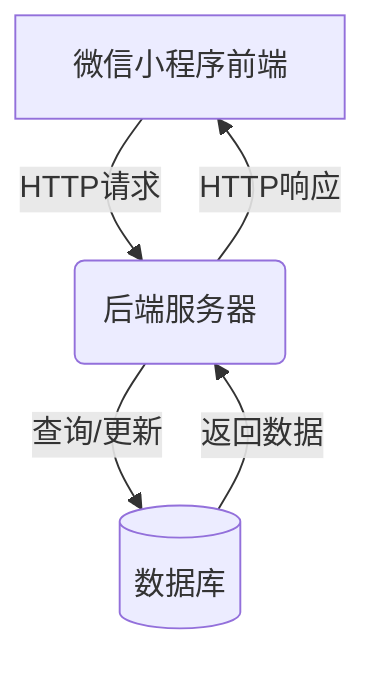

# 微信小程序的学生选课系统

## 1.背景介绍

### 1.1 选课系统的重要性

选课系统是现代教育机构中不可或缺的重要组成部分。它为学生提供了一个便捷的平台,允许他们根据自身的兴趣和需求选择心仪的课程。一个高效、用户友好的选课系统不仅能够优化学生的选课体验,还能够减轻教务人员的工作负担,提高教学资源的利用率。

随着移动互联网技术的飞速发展,微信小程序应运而生,为传统的选课系统带来了全新的机遇和挑战。微信小程序具有开发成本低、无需安装即可使用等优势,使其成为构建选课系统的理想选择。

### 1.2 微信小程序概述

微信小程序是一种全新的连接用户与服务的技术方式,它可以在微信内被便捷地获取和传播,同时具有出色的体验性能。微信小程序开发框架提供了成熟的技术方案,支持多种开发语言,例如JavaScript、TypeScript等,使开发者能够基于微信庞大的用户群快速构建并迭代小程序。

### 1.3 系统架构概览

微信小程序的学生选课系统通常采用前端(小程序)、后端(服务器)、数据库的经典三层架构。前端通过微信小程序提供用户界面,接收用户输入并与后端服务器进行交互;后端负责处理业务逻辑、管理数据库等核心功能;数据库则用于存储课程信息、学生信息等重要数据。



## 2.核心概念与联系

### 2.1 用户角色

在学生选课系统中,主要涉及以下几种用户角色:

1. **学生**: 学生是系统的主要使用者,他们可以通过小程序查看开设的课程信息、选择心仪课程并管理已选课程。

2. **教师**: 教师负责维护自己所授课程的相关信息,包括课程介绍、上课时间、考核方式等。他们还可以查看选修该门课程的学生名单。

3. **教务人员**: 教务人员负责管理整个选课系统,包括开设新课程、调整课程quota(最多可选人数)、处理学生退课申请等工作。

4. **系统管理员**: 系统管理员负责维护整个系统的正常运行,包括数据备份、服务器维护、权限管理等后台工作。

这些用户角色通过明确的权限划分,共同构建和维护了整个选课系统。

### 2.2 核心数据模型

为了高效管理和存储选课相关数据,系统中通常包含以下几种核心数据模型:

1. **课程(Course)模型**: 包含课程名称、课程编号、任课教师、上课时间、课程介绍、课程学分、已选人数、quota等字段。

2. **学生(Student)模型**: 包含学生姓名、学号、所属年级、已选课程等字段。

3. **教师(Teacher)模型**: 包含教师姓名、职称、所授课程等字段。

4. **选课记录(Enrollment)模型**: 包含学生ID、课程ID、选课时间等字段,用于记录学生的选课情况。

这些数据模型通过关系或嵌套的方式相互关联,为系统的核心业务逻辑提供了数据支持。

## 3.核心算法原理具体操作步骤 

### 3.1 课程查询算法

课程查询是选课系统中最基本也是最常用的功能之一。为了提高查询效率,系统通常采用索引等数据库优化技术。此外,还可以引入模糊查询、分页等功能,提升用户体验。

1. 创建课程名称和课程编号的索引,加速查询过程。

2. 对用户输入的查询关键字进行前缀匹配,查找所有包含该前缀的课程。

3. 根据匹配结果计算总页数,并按分页大小(例如每页10条记录)对结果进行分页。

4. 将当前页的课程信息以列表形式呈现给用户。

5. 如果存在下一页,为用户提供翻页按钮以查看更多结果。

该算法的时间复杂度与索引的效率密切相关。在最坏情况下(未创建索引),需要遍历整个课程表,时间复杂度为O(n),其中n为课程总数。而在最好情况下(利用索引),查询时间可以接近常数级O(1)。

### 3.2 选课算法

选课功能是系统的核心功能之一,需要对并发情况作出合理处理,防止出现超量选课等问题。以下是一种基于乐观锁的选课算法:

1. 学生选择心仪课程,向后端发送选课请求。

2. 后端查询该课程的当前已选人数和quota。

3. 如果已选人数小于quota,则执行以下步骤:
    a. 获取该课程记录的版本号(用于乐观锁)。
    b. 更新该课程的已选人数(+1)和版本号(+1)。
    c. 如果更新成功(版本号未变),则向学生返回选课成功的响应。
    d. 如果更新失败(版本号已变),则返回选课失败,请求学生重试。

4. 如果已选人数已经达到quota,则直接返回选课人数已满的错误信息。

该算法的优点是避免了传统的悲观锁导致的长时间等待,提高了系统的响应速度。但在极端情况下,仍可能出现选课失败的情况,这时可以考虑增加指定次数的重试机制。

### 3.3 退课算法

与选课算法类似,退课算法也需要处理并发情况,确保数据的一致性。算法步骤如下:

1. 学生发送退课请求。

2. 后端查询该课程的当前已选人数。

3. 获取该课程记录的版本号(用于乐观锁)。

4. 更新该课程的已选人数(-1)和版本号(+1)。

5. 如果更新成功(版本号未变),则向学生返回退课成功的响应。

6. 如果更新失败(版本号已变),则返回退课失败,请求学生重试。

与选课算法不同的是,退课时不需要检查quota,因为退课不会导致已选人数超过quota。

## 4.数学模型和公式详细讲解举例说明

在选课系统中,我们可以借助数学模型来量化和优化一些指标,例如课程难度系数、教师授课质量评分等。以下是一些可能用到的数学模型:

### 4.1 课程难度模型

课程难度系数是衡量一门课程相对难度的指标,可以用于为学生推荐合适的选修课程。假设一门课程的难度系数记为$d$,则可以用以下公式计算:

$$d = \alpha_1 \times \text{平均学分绩点} + \alpha_2 \times \text{退课率} + \alpha_3 \times \text{教师难度系数}$$

其中:
- $\alpha_1$、$\alpha_2$、$\alpha_3$为系数,表示不同因素的权重,且$\alpha_1 + \alpha_2 + \alpha_3 = 1$。
- 平均学分绩点为该课程所有学生的平均绩点,绩点越低说明该课程越难。
- 退课率为该课程的退课人数占总选课人数的比例,退课率越高说明难度越大。
- 教师难度系数为该课程任课教师的相对难度系数,可由教务处根据教师的历史教学评分等数据计算得出。

通过调整$\alpha$值,可以根据不同院系的实际情况,量身定制合适的难度模型。

### 4.2 教师授课质量评分模型

教师的授课质量是衡量教学水平的重要指标。假设教师$t$的授课质量评分记为$q_t$,则可以用以下公式计算:

$$q_t = \beta_1 \times \overline{s_t} + \beta_2 \times \overline{r_t} + \beta_3 \times e_t$$

其中:
- $\beta_1$、$\beta_2$、$\beta_3$为系数,表示不同因素的权重,且$\beta_1 + \beta_2 + \beta_3 = 1$。
- $\overline{s_t}$为教师$t$所授课程的平均学生评分。
- $\overline{r_t}$为教师$t$所授课程的平均教学评分(由同行或教学督导评定)。
- $e_t$为教师$t$的教学经验系数,可根据任教年限、职称等因素计算得出。

该模型综合考虑了学生评价、同行评价和教师经验等多个维度,能够较为全面地评估教师的授课质量。

## 4.项目实践:代码实例和详细解释说明

为了更好地理解选课系统的实现,我们提供了一些核心功能的代码示例,并对其进行了详细的解释说明。

### 4.1 课程查询功能

以下是课程查询功能的前端(小程序)和后端(Node.js)代码示例:

**前端(小程序)代码:**

```js
// 课程查询页面
Page({
  data: {
    keyword: '', // 搜索关键字
    courses: [], // 课程列表
    page: 1, // 当前页码
    total: 0 // 总页数
  },

  // 输入关键字时触发
  onInput(e) {
    this.setData({
      keyword: e.detail.value
    })
  },

  // 发送查询请求
  search() {
    const { keyword, page } = this.data
    wx.request({
      url: `${API_BASE_URL}/courses?keyword=${keyword}&page=${page}`,
      success: (res) => {
        const { data, total } = res.data
        this.setData({
          courses: data,
          total
        })
      }
    })
  },

  // 切换到上一页
  prevPage() {
    const { page } = this.data
    if (page > 1) {
      this.setData({
        page: page - 1
      }, this.search)
    }
  },

  // 切换到下一页
  nextPage() {
    const { page, total } = this.data
    if (page < total) {
      this.setData({
        page: page + 1
      }, this.search)
    }
  }
})
```

**后端(Node.js)代码:**

```js
const express = require('express')
const router = express.Router()
const Course = require('../models/course')

// 课程查询接口
router.get('/courses', async (req, res) => {
  const { keyword, page = 1, limit = 10 } = req.query
  const options = {}

  // 构建查询条件
  if (keyword) {
    options.$or = [
      { name: new RegExp(keyword, 'i') },
      { code: new RegExp(keyword, 'i') }
    ]
  }

  try {
    // 查询总数
    const total = await Course.countDocuments(options)
    // 查询当前页数据
    const courses = await Course
      .find(options)
      .skip((page - 1) * limit)
      .limit(limit)

    res.json({ data: courses, total: Math.ceil(total / limit) })
  } catch (err) {
    res.status(500).json({ error: err.message })
  }
})

module.exports = router
```

**解释说明:**

1. 前端小程序通过`wx.request`向后端发送HTTP GET请求,请求URL包含查询关键字和页码等参数。

2. 后端使用Express.js框架,定义了`/courses`路由用于处理课程查询请求。

3. 后端根据请求参数构建MongoDB查询条件,使用正则表达式实现模糊查询功能。

4. 后端先调用`countDocuments`方法获取符合条件的总课程数,计算出总页数。

5. 后端再调用`find`方法查询当前页的课程数据,使用`skip`和`limit`实现分页功能。

6. 最后将查询结果和总页数一并返回给前端,前端根据返回数据渲染课程列表和分页控件。

通过将查询逻辑放在后端,可以减轻小程序的运算压力,提高查询效率。同时,模糊查询和分页功能也极大地提升了用户体验。

### 4.2 选课功能

以下是选课功能的前端(小程序)和后端(Node.js)代码示例:

**前端(小程序)代码:**

```js
// 课程详情页面
Page({
  data: {
    course: null // 当前课程信息
  },

  // 选课按钮点击事件