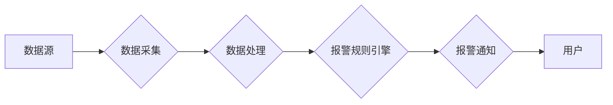

## 1. 背景介绍

### 1.1  报警系统的由来与发展

在信息化高速发展的今天，各种应用系统日益复杂，对系统的稳定性、可靠性要求也越来越高。一旦系统出现故障或者异常情况，往往会导致严重的业务损失。为了及时发现和处理这些问题，报警系统应运而生。从早期的简单的邮件、短信报警，发展到如今的智能化、多渠道、可视化的报警平台，报警系统经历了漫长的发展历程。

### 1.2  报警系统的意义与价值

报警系统的主要目标是：

* **实时监控**:  实时监控各种系统和应用程序的运行状态，并在出现异常情况时及时发出警报。
* **快速定位**: 提供详细的报警信息，帮助运维人员快速定位问题根源，减少故障排查时间。
* **有效处理**: 提供灵活的报警规则配置和通知机制，方便运维人员根据实际情况进行处理。

一个高效的报警系统可以显著提高运维效率，降低故障损失，保障业务的稳定运行。

### 1.3 本文目标

本文将详细介绍如何设计和实现一个功能完备的报警系统，包括系统架构设计、核心算法原理、代码实现以及实际应用场景等方面，并结合具体案例进行讲解，帮助读者深入理解报警系统的核心技术和实现细节。

## 2. 核心概念与联系

### 2.1  报警系统基本架构

一个典型的报警系统架构如下图所示：



* **数据源**:  产生需要监控数据的来源，例如应用程序日志、数据库指标、服务器性能指标等。
* **数据采集**: 从各个数据源采集数据，并进行初步的清洗和过滤。
* **数据处理**: 对采集到的数据进行聚合、统计、分析等处理，为后续的报警规则判断提供依据。
* **报警规则引擎**:  根据预先设定的报警规则，对处理后的数据进行判断，触发相应的报警动作。
* **报警通知**:  通过邮件、短信、电话、微信等多种渠道将报警信息发送给相关人员。

### 2.2  核心概念

* **指标**:  用于描述系统运行状态的量化数据，例如CPU使用率、内存占用率、接口响应时间等。
* **阈值**:  预先设定的指标临界值，当指标超过阈值时，则认为系统出现异常。
* **报警规则**:  由指标、阈值、比较运算符、时间窗口等要素组成的逻辑表达式，用于判断是否触发报警。
* **报警级别**:  根据问题的严重程度，将报警信息划分为不同的级别，例如紧急、重要、警告等。
* **通知方式**:  将报警信息发送给相关人员的方式，例如邮件、短信、电话、微信等。

## 3. 核心算法原理具体操作步骤

### 3.1 数据采集

* **日志采集**:  可以使用开源的日志采集工具，例如Filebeat、Logstash等，将应用程序日志采集到消息队列中。
* **指标采集**:  可以使用监控系统提供的API接口，例如Prometheus、Zabbix等，获取系统和应用程序的性能指标数据。

### 3.2 数据处理

* **数据清洗**:  对采集到的原始数据进行清洗，例如去除无效数据、格式转换等。
* **数据聚合**:  将相同指标的不同数据源的数据进行聚合，例如计算平均值、最大值、最小值等。
* **数据统计**:  对聚合后的数据进行统计分析，例如计算环比、同比等。

### 3.3 报警规则引擎

* **规则定义**:  用户可以根据实际需求，灵活定义各种报警规则，例如：
    * 当CPU使用率连续5分钟超过90%时，触发紧急报警。
    * 当接口响应时间超过1秒的请求数量超过100次/分钟时，触发警告报警。
* **规则匹配**:  报警规则引擎会实时监控处理后的数据，并与预先定义的规则进行匹配。
* **报警触发**:  当数据满足报警规则的条件时，触发相应的报警动作。

### 3.4 报警通知

* **通知方式**:  支持多种通知方式，例如邮件、短信、电话、微信等。
* **通知内容**:  报警通知内容应包含详细的报警信息，例如报警时间、报警级别、报警规则、触发原因、相关指标数据等。
* **通知策略**:  支持灵活的通知策略，例如根据报警级别、时间段、接收人等进行差异化通知。

## 4. 数学模型和公式详细讲解举例说明

### 4.1  移动平均算法

移动平均算法是一种常用的时间序列数据处理方法，可以用于平滑数据波动、减少噪声干扰。其基本思想是：将时间序列数据按照一定的时间窗口进行滑动，计算每个窗口内数据的平均值，作为当前时刻的预测值。

例如，计算5分钟移动平均值，可以使用以下公式：

```
MA(t) = (x(t) + x(t-1) + x(t-2) + x(t-3) + x(t-4)) / 5
```

其中：

* MA(t) 表示t时刻的移动平均值
* x(t) 表示t时刻的实际值

### 4.2  标准差算法

标准差是衡量数据离散程度的指标，可以用于判断数据的波动情况。其计算公式如下：

```
σ = sqrt(Σ(xi - μ)^2 / N)
```

其中：

* σ 表示标准差
* xi 表示第i个数据点
* μ 表示所有数据点的平均值
* N 表示数据点的个数

## 5. 项目实践：代码实例和详细解释说明

### 5.1  Python实现简单的报警系统

```python
import time
import smtplib
from email.mime.text import MIMEText

# 配置邮件发送信息
mail_host = "smtp.qq.com"  # SMTP服务器地址
mail_user = "your_email@qq.com"  # 发送方邮箱地址
mail_pass = "your_password"  # 邮箱授权码
sender = "your_email@qq.com"  # 发送方邮箱地址
receivers = ["receiver1@example.com", "receiver2@example.com"]  # 接收方邮箱地址列表

# 定义报警规则
alert_rules = [
    {
        "metric": "cpu_usage",  # 指标名称
        "threshold": 90,  # 阈值
        "operator": ">",  # 比较运算符
        "window": 5,  # 时间窗口，单位：分钟
        "level": "critical",  # 报警级别
    },
    {
        "metric": "memory_usage",
        "threshold": 80,
        "operator": ">",
        "window": 10,
        "level": "warning",
    },
]

# 模拟监控数据
monitoring_data = {
    "cpu_usage": [85, 88, 92, 95, 90, 87, 89],
    "memory_usage": [75, 78, 82, 85, 83, 79, 81],
}


def send_alert(rule, current_value):
    """发送报警邮件"""
    content = f"报警级别: {rule['level']}\n"
    content += f"指标名称: {rule['metric']}\n"
    content += f"当前值: {current_value}\n"
    content += f"阈值: {rule['threshold']}\n"
    content += f"时间窗口: {rule['window']}分钟\n"

    message = MIMEText(content, "plain", "utf-8")
    message["Subject"] = f"报警通知: {rule['metric']} 超过阈值"
    message["From"] = sender
    message["To"] = ",".join(receivers)

    try:
        smtpObj = smtplib.SMTP_SSL(mail_host, 465)
        smtpObj.login(mail_user, mail_pass)
        smtpObj.sendmail(sender, receivers, message.as_string())
        print("邮件发送成功")
    except smtplib.SMTPException as e:
        print(f"邮件发送失败: {e}")


def check_alert():
    """检查是否触发报警规则"""
    for rule in alert_rules:
        metric = rule["metric"]
        threshold = rule["threshold"]
        operator = rule["operator"]
        window = rule["window"]
        data_points = monitoring_data[metric][-window:]  # 获取最近一段时间的数据

        if len(data_points) == window:
            # 计算当前值
            if operator == ">":
                current_value = max(data_points)
            elif operator == "<":
                current_value = min(data_points)
            else:
                current_value = data_points[-1]

            # 判断是否触发报警
            if eval(f"{current_value} {operator} {threshold}"):
                send_alert(rule, current_value)
                # 可以添加其他报警处理逻辑，例如记录报警日志等


if __name__ == "__main__":
    while True:
        check_alert()
        time.sleep(60)  # 每分钟检查一次
```

### 5.2 代码解释

* 首先，配置邮件发送信息，包括SMTP服务器地址、发送方邮箱地址、邮箱授权码、接收方邮箱地址列表等。
* 然后，定义报警规则，包括指标名称、阈值、比较运算符、时间窗口、报警级别等。
* 接着，模拟监控数据，可以使用实际的监控数据或者随机生成的数据。
* `send_alert()` 函数用于发送报警邮件，接收报警规则和当前值作为参数，根据配置的邮件发送信息发送报警邮件。
* `check_alert()` 函数用于检查是否触发报警规则，遍历所有的报警规则，获取最近一段时间的数据，计算当前值，并判断是否触发报警。如果触发报警，则调用 `send_alert()` 函数发送报警邮件。
* 最后，在主函数中，循环调用 `check_alert()` 函数，每分钟检查一次。

## 6. 实际应用场景

### 6.1  服务器监控

* 监控服务器的CPU使用率、内存占用率、磁盘空间使用率、网络流量等指标，并在指标超过预设阈值时发送报警通知。

### 6.2  应用程序监控

* 监控应用程序的接口响应时间、错误率、吞吐量等指标，并在指标超过预设阈值时发送报警通知。

### 6.3  业务指标监控

* 监控业务系统的关键指标，例如订单量、用户活跃度、转化率等，并在指标出现异常波动时发送报警通知。

## 7. 总结：未来发展趋势与挑战

### 7.1  智能化

* 利用机器学习、深度学习等技术，实现报警规则的自动学习和优化，提高报警的准确性和效率。

### 7.2  可视化

* 提供更加直观、易用的可视化界面，方便用户进行报警规则配置、报警信息查看和分析。

### 7.3  一体化

* 将报警系统与其他运维工具进行集成，例如监控系统、日志分析系统等，实现一体化的运维管理。

### 7.4  挑战

* 海量数据的处理和分析
* 报警规则的准确性和效率
* 报警信息的有效传递和处理

## 8. 附录：常见问题与解答

### 8.1  如何避免报警风暴？

* 设置合理的报警阈值和时间窗口。
* 使用报警抑制机制，避免重复报警。
* 对报警信息进行分类和分级，优先处理高优先级的报警。

### 8.2  如何提高报警的准确性？

* 使用更加精确的监控指标。
* 结合历史数据和趋势分析，制定更加合理的报警规则。
* 使用机器学习等技术，实现报警规则的自动学习和优化。


希望本文能够帮助读者深入理解报警系统的核心技术和实现细节，并能够根据自身需求设计和实现更加完善的报警系统。