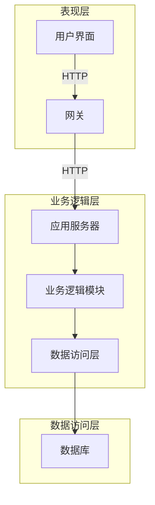

# 招生管理系统详细设计与具体代码实现

## 1.背景介绍

### 1.1 招生管理系统概述

招生管理系统是高等教育机构用于管理学生招生过程的关键系统。它涵盖了从报名、审核、录取到入学注册等一系列环节,是确保招生工作高效、公平、透明的重要保障。随着教育信息化的不断推进,现代化的招生管理系统已经成为高校的基础设施之一。

### 1.2 系统的重要性

一个良好设计的招生管理系统不仅能够简化和自动化招生流程,提高工作效率,还能够为决策者提供准确的数据分析,从而制定科学的招生策略。此外,它还可以提升申请人的体验,增强高校的公信力。因此,开发一个功能完备、性能优异、安全可靠的招生管理系统,对于高校的长远发展至关重要。

## 2.核心概念与联系

### 2.1 系统架构

招生管理系统通常采用三层或多层架构,包括:

1. **表现层(Presentation Layer)**: 提供用户界面,供不同角色(申请人、招生办公室工作人员、管理员等)与系统交互。
2. **业务逻辑层(Business Logic Layer)**: 处理系统的核心业务逻辑,如报名流程控制、信息审核、分数计算、录取决策等。
3. **数据访问层(Data Access Layer)**: 负责与数据库进行交互,执行数据存取操作。

这种分层架构有利于提高系统的可维护性、扩展性和安全性。

### 2.2 核心功能模块

招生管理系统的核心功能模块通常包括:

1. **报名模块**: 允许申请人在线填写报名信息,上传材料。
2. **审核模块**: 招生办公室工作人员审核申请人的资格和材料。
3. **录取模块**: 根据招生政策和申请人的综合情况,进行阶段性录取。
4. **统计分析模块**: 生成报表,为决策提供数据支持。
5. **用户和权限管理模块**: 管理不同角色的用户账号和访问权限。

这些模块相互关联,共同构建了完整的招生管理流程。

### 2.3 关键技术

实现招生管理系统需要综合运用多种技术,包括但不限于:

- **Web开发技术**:HTML、CSS、JavaScript、React/Angular/Vue等前端框架。
- **服务器端技术**:Java、.NET、Python、Node.js等,用于构建应用服务器。
- **数据库技术**:关系型数据库(MySQL、PostgreSQL)和NoSQL数据库(MongoDB)。
- **安全技术**:用户认证、授权、数据加密等。
- **devOps**: 持续集成、持续交付、容器化(Docker)等。

合理选择和集成这些技术,是保证系统高效、稳定、安全运行的关键。

## 3.核心算法原理具体操作步骤 

### 3.1 报名流程控制算法

报名流程控制算法负责管理整个报名过程,确保其合理有序进行。以下是一种常见的实现方式:

1. 定义有限状态机模型,将报名流程分为多个阶段,如"报名开始"、"填写基本信息"、"上传材料"、"提交申请"等。
2. 为每个状态设置对应的操作,如"开始报名"、"保存信息"、"上传文件"、"支付报名费"等。
3. 规定状态转移条件,如只有在前一状态完成后,才能进入下一状态。
4. 设置定时器,控制每个状态的持续时间,如报名时间段、提交截止日期等。
5. 记录申请人的当前状态,并根据状态决定可执行的操作。

该算法可以用状态模式、有限状态机等设计模式实现。

### 3.2 信息审核算法

信息审核算法用于自动或辅助人工审核申请人提交的信息和材料,以确保其合法性和真实性。常见的审核策略包括:

1. **完整性检查**:检查所有必填字段是否已填写,上传材料是否齐全。
2. **格式检查**:检查字段值的格式是否符合要求,如邮箱、手机号码等。
3. **合法性检查**:验证证件号码、学历证书编号等关键信息的合法性。
4. **一致性检查**:对比不同来源的信息,如申请表与成绩单的姓名是否一致。
5. **真实性检查**:调用第三方接口,验证证件、学历、在职等信息的真实性。
6. **反作弊检查**:检测申请材料是否存在抄袭、伪造等作弊行为。

这些策略可以组合使用,并根据需要引入机器学习等人工智能技术,提高审核的准确性和效率。

### 3.3 综合评分算法

综合评分算法根据招生政策,计算申请人的综合分数,作为录取的重要依据。一种常见的实现方式是:

1. 确定评分维度和权重,如学习成绩、综合素质、专业适配度等。
2. 对每个维度的原始数据进行标准化或归一化处理。
3. 根据权重,计算加权分数: $综合分数 = \sum_{i=1}^{n}{w_i * x_i}$,其中$w_i$为第i个维度的权重,$x_i$为标准化后的分数。
4. 引入非线性转换函数,调整分数分布,如$f(x) = \frac{1}{1 + e^{-x}}$。
5. 设置阈值,将综合分数划分为多个等级,如优秀、合格、不合格等。

该算法的关键在于权重的确定和非线性转换函数的选择,需要结合历史数据和专家经验进行调优。

### 3.4 录取决策算法

录取决策算法根据申请人的综合分数、专业服务能力、招生计划等因素,自动或辅助人工作出最终的录取决定。一种可能的实现方式是:

1. 按专业划分申请人,构建优先级队列。
2. 设置最低分数线,剔除不合格的申请人。
3. 根据综合分数从高到低排序,直到满足招生计划。
4. 如有并列分数,引入附加规则,如加考、面试等。
5. 对特殊类型的申请人(如推免生、专项计划等)采用单独的录取规则。
6. 人工审核拟录取名单,确认无误后正式录取。

该算法的设计应该充分考虑公平性、多样性等因素,并具有良好的可解释性,便于事后审计。

## 4.数学模型和公式详细讲解举例说明

### 4.1 标准化处理

由于不同维度的原始分数范围和量纲不同,需要进行标准化处理,使它们处于同一数量级,便于计算和比较。常用的标准化方法有:

1. **Min-Max标准化**:

$$x' = \frac{x - min(X)}{max(X) - min(X)}$$

将原始数据线性映射到[0,1]区间。

2. **Z-Score标准化**:

$$x' = \frac{x - \mu}{\sigma}$$

将原始数据标准化为均值为0、标准差为1的分布,其中$\mu$为均值,$\sigma$为标准差。

3. **小数定标标准化**:

$$x' = \frac{x}{10^k}$$

将原始数据除以一个固定的基数(通常为10的幂次),使之落在[0,1]区间。

以上方法各有利弊,Min-Max标准化会放大异常值的影响,Z-Score标准化对异常值不敏感但需要计算均值和标准差,小数定标标准化简单但信息损失较大。在实际应用中,需要根据数据的分布特征选择合适的方法。

### 4.2 加权求和模型

加权求和模型是综合评分算法中最常用的数学模型,其基本形式为:

$$综合分数 = \sum_{i=1}^{n}{w_i * x_i}$$

其中,$w_i$为第i个评价维度的权重,$x_i$为该维度的标准化分数。

权重的设置是加权求和模型的关键,通常有以下几种方法:

1. **主观赋权法**:由决策者根据经验直接确定权重。
2. **对称赋权法**:所有维度权重相等,即$w_i = \frac{1}{n}$。
3. **最小方差法**:使加权求和的方差最小化。
4. **层次分析法(AHP)**:构建判断矩阵,计算各维度的权重。

加权求和模型的优点是简单易懂,缺点是线性假设可能过于简单,无法反映评价指标之间的内在关联。因此,也可以考虑引入其他非线性模型,如逻辑回归、神经网络等。

### 4.3 非线性转换函数

为了调整综合分数的分布,避免过于集中或分散,可以引入非线性转换函数,如Sigmoid函数:

$$f(x) = \frac{1}{1 + e^{-x}}$$

Sigmoid函数将输入值压缩到(0,1)区间,具有平滑、可导的特点,常用于神经网络和逻辑回归模型中。

另一种常用的非线性函数是Tanh函数:

$$f(x) = \frac{e^x - e^{-x}}{e^x + e^{-x}}$$

Tanh函数的值域为(-1,1),对输入值的正负号敏感,可用于调整分数的正负分布。

除此之外,还可以尝试其他非线性函数,如指数函数、分段函数等,以满足不同的需求。选择合适的非线性函数,能够更好地控制分数分布的形状,提高评分的区分度。

### 4.4 阈值划分模型

为了将连续的综合分数划分为若干等级,如优秀、合格、不合格等,可以采用阈值划分模型。假设需要划分为K个等级,则需要设置K-1个阈值:

$$\theta_1 < \theta_2 < ... < \theta_{K-1}$$

对于任意分数x,如果满足:

$$\theta_i \leq x < \theta_{i+1}$$

则将x划分为第i+1级。特殊地,如果$x < \theta_1$,则划分为第1级;如果$x \geq \theta_{K-1}$,则划分为第K级。

阈值的设置可以根据历史数据的分布情况,或者结合决策者的经验进行。通常希望各等级的人数比例满足一定的分布,如20%的申请人为优秀、70%为合格等。也可以引入机器学习算法,自动确定最优阈值。

## 5.项目实践:代码实例和详细解释说明

### 5.1 系统架构图



上图展示了招生管理系统的典型三层架构:

1. **表现层**:包括用户界面(UI)和网关(GW),负责接收用户请求并将其转发给应用服务器。
2. **业务逻辑层**:包括应用服务器(AS)和业务逻辑模块(BL),处理系统的核心业务逻辑。
3. **数据访问层**:包括数据访问层模块(DL)和数据库(DB),负责数据的持久化和查询。

这种分层架构有利于提高系统的可维护性、扩展性和安全性。每一层都可以相对独立地进行开发、测试和部署,并且可以根据需求进行水平扩展。

### 5.2 报名流程控制

```python
from transitions import Machine

class RegistrationProcess(object):
    
    states = ['start', 'profile_filled', 'materials_uploaded', 'submitted', 'end']
    
    def __init__(self):
        self.machine = Machine(model=self, states=RegistrationProcess.states, initial='start')
        
        self.machine.add_transition('fill_profile', 'start', 'profile_filled')
        self.machine.add_transition('upload_materials', 'profile_filled', 'materials_uploaded')
        self.machine.add_transition('submit', 'materials_uploaded', 'submitted')
        self.machine.add_transition('complete', 'submitted', 'end')
        
    def fill_profile(self):
        print("Filling profile information...")
        
    def upload_materials(self):
        print