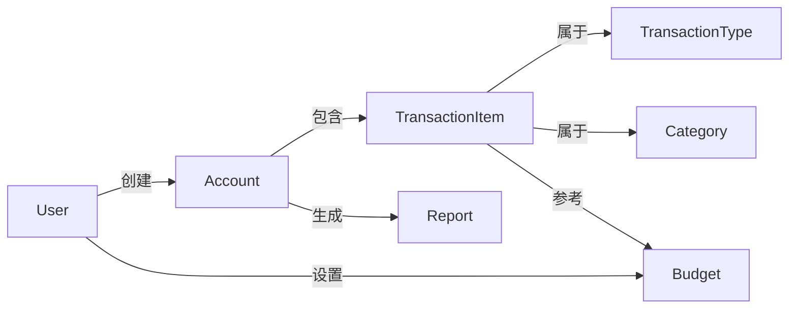

# 收支管理系统详细设计与具体代码实现

## 1. 背景介绍

### 1.1 收支管理的重要性

良好的财务管理对于个人和企业来说都是非常重要的。及时掌握收支情况,合理分配资金,规避财务风险,对于维持生活质量和企业运营都有着重大意义。然而,手动记录和管理收支往往是一项繁琐且容易出错的工作,因此需要一个高效、便捷的收支管理系统来简化这一过程。

### 1.2 传统收支管理方式的缺陷

- 纸质账本记录繁琐、易丢失
- 电子表格管理效率低下、缺乏自动化
- 无法随时随地记录,难以及时更新数据
- 缺乏数据分析和可视化功能

### 1.3 现代收支管理系统的优势

- 方便快捷的移动端录入
- 自动计算、分类和汇总数据
- 强大的数据分析和可视化功能
- 多人协作和数据共享
- 提高财务管理效率,规避风险

## 2. 核心概念与联系

### 2.1 收支管理系统的核心概念

1. **用户 (User)**: 系统的使用者,可以是个人或企业,拥有唯一的身份标识。
2. **账户 (Account)**: 用于记录收支明细的账本,每个用户可以创建多个账户,如现金账户、信用卡账户等。
3. **收支类型 (Transaction Type)**: 用于区分收入和支出,如工资收入、房租支出等。
4. **收支项目 (Transaction Item)**: 具体的收支明细,包括金额、日期、类型、备注等信息。
5. **分类 (Category)**: 用于对收支项目进行分类,如餐饮、交通等,方便统计和分析。
6. **预算 (Budget)**: 用户可以为不同类型的支出设置预算,用于控制开支。
7. **报表 (Report)**: 系统根据用户的收支数据生成各种统计报表,如收支趋势图、分类支出比例等。

### 2.2 核心概念之间的关系

用户可以创建多个账户,每个账户包含多条收支项目,每条项目属于特定的收支类型和分类。系统会根据用户设置的预算对支出进行监控,并生成相应的报表供用户分析财务状况。这些核心概念之间的关系如下图所示:



## 3. 核心算法原理具体操作步骤

### 3.1 数据存储

收支管理系统需要存储大量的用户数据,因此需要一个高效、可靠的数据存储方案。常见的数据存储方式包括:

1. **关系型数据库 (如 MySQL、PostgreSQL)**:适用于结构化数据,支持 SQL 查询,事务处理能力强。
2. **NoSQL 数据库 (如 MongoDB、Cassandra)**:适用于非结构化数据,高并发、高可扩展性。
3. **本地存储 (如 SQLite、Realm)**:适用于移动端应用,无需部署数据库服务器。

本系统建议采用 **SQLite** 作为本地存储方案,原因如下:

- 无需部署数据库服务器,适合移动端应用
- 支持标准 SQL 语言,方便查询和管理数据
- 文件型数据库,易于备份和迁移
- 轻量级、高效,占用资源少

### 3.2 数据模型设计

根据上述核心概念,我们可以设计如下数据模型:

```mermaid
erDiagram
    User ||--o{ Account : has
    Account ||--|{ TransactionItem : contains
    TransactionItem ||--o{ TransactionType : belongs_to
    TransactionItem ||--o{ Category : belongs_to
    User ||--o{ Budget : sets
    Budget ||--|{ Category : for

    User {
        int id PK
        string name
        string email
        --
        created_at timestamp
        updated_at timestamp
    }

    Account {
        int id PK
        int user_id FK
        string name
        decimal balance
        --
        created_at timestamp
        updated_at timestamp
    }

    TransactionItem {
        int id PK
        int account_id FK
        int type_id FK
        int category_id FK
        decimal amount
        string note
        date transaction_date
        --
        created_at timestamp
        updated_at timestamp
    }

    TransactionType {
        int id PK
        string name
        bool is_income
    }

    Category {
        int id PK
        string name
        int parent_id FK
    }

    Budget {
        int id PK
        int user_id FK
        int category_id FK
        decimal amount
        date start_date
        date end_date
    }
```

该模型包含了 6 个核心表:

1. `User` 表存储用户信息
2. `Account` 表存储账户信息,与用户是一对多关系
3. `TransactionItem` 表存储具体的收支项目,与账户是一对多关系,与类型和分类是多对一关系
4. `TransactionType` 表存储收支类型
5. `Category` 表存储分类信息,支持层级分类
6. `Budget` 表存储预算信息,与用户和分类是多对一关系

### 3.3 数据操作

根据上述数据模型,我们可以实现以下核心功能:

1. **用户管理**:注册、登录、修改个人信息等
2. **账户管理**:创建、删除、修改账户信息,查看账户余额等
3. **收支记录**:添加、修改、删除收支项目
4. **分类管理**:添加、修改、删除收支分类
5. **预算管理**:为特定分类设置预算,监控支出
6. **数据统计**:生成各种收支报表,如收支趋势、分类统计等
7. **数据备份**:导出/导入收支数据,方便数据迁移

这些功能的具体实现取决于所采用的编程语言和框架,下面我们将给出一些伪代码示例。

#### 3.3.1 添加收支项目

```python
def add_transaction(account_id, type_id, category_id, amount, note, date):
    # 检查账户是否存在
    account = get_account(account_id)
    if not account:
        return None

    # 检查类型和分类是否存在
    trans_type = get_transaction_type(type_id)
    category = get_category(category_id)
    if not trans_type or not category:
        return None

    # 创建新的收支项目
    item = TransactionItem(
        account_id=account_id,
        type_id=type_id,
        category_id=category_id,
        amount=amount,
        note=note,
        transaction_date=date
    )
    item.save()

    # 更新账户余额
    if trans_type.is_income:
        account.balance += amount
    else:
        account.balance -= amount
    account.save()

    return item
```

该函数实现了添加新的收支项目的功能,包括以下步骤:

1. 检查账户是否存在
2. 检查收支类型和分类是否存在
3. 创建新的收支项目对象
4. 更新对应账户的余额
5. 保存收支项目和账户信息

#### 3.3.2 生成收支报表

```python
def generate_report(account_id, start_date, end_date):
    # 检查账户是否存在
    account = get_account(account_id)
    if not account:
        return None

    # 获取指定时间范围内的收支项目
    items = TransactionItem.objects.filter(
        account_id=account_id,
        transaction_date__gte=start_date,
        transaction_date__lte=end_date
    )

    # 统计收入、支出总额
    income_total = sum(item.amount for item in items if item.type.is_income)
    expense_total = sum(item.amount for item in items if not item.type.is_income)

    # 按分类统计支出
    category_stats = {}
    for item in items:
        if not item.type.is_income:
            category = item.category.name
            amount = item.amount
            if category in category_stats:
                category_stats[category] += amount
            else:
                category_stats[category] = amount

    # 生成报表数据
    report = {
        'account': account.name,
        'start_date': start_date,
        'end_date': end_date,
        'income_total': income_total,
        'expense_total': expense_total,
        'category_stats': category_stats
    }

    return report
```

该函数实现了生成收支报表的功能,包括以下步骤:

1. 检查账户是否存在
2. 获取指定时间范围内的收支项目
3. 统计收入和支出总额
4. 按分类统计支出金额
5. 构建报表数据结构

生成的报表数据包括账户名称、起止日期、收入总额、支出总额以及按分类统计的支出金额。

## 4. 数学模型和公式详细讲解举例说明

在收支管理系统中,我们可以使用一些数学模型和公式来帮助分析和优化财务状况。

### 4.1 收支平衡分析

收支平衡是指在一定时间内,收入和支出保持平衡,即:

$$
\sum_{i=1}^{n}Income_i = \sum_{j=1}^{m}Expense_j
$$

其中 $Income_i$ 表示第 $i$ 项收入, $Expense_j$ 表示第 $j$ 项支出, $n$ 和 $m$ 分别表示收入和支出的总项数。

如果收入大于支出,则存在结余;反之则存在赤字。我们可以计算收支差额:

$$
Balance = \sum_{i=1}^{n}Income_i - \sum_{j=1}^{m}Expense_j
$$

根据收支差额,我们可以评估财务状况,并制定相应的调整策略。

### 4.2 投资收益率计算

对于一些投资收入,我们需要计算其收益率。假设初始投资金额为 $P$,经过 $n$ 个时间周期后,投资总收益为 $G$,则投资收益率 $R$ 可以计算如下:

$$
R = \frac{G}{P} \times 100\%
$$

我们也可以计算年化收益率 $R_a$:

$$
R_a = \left(\frac{G}{P} + 1\right)^{\frac{1}{n}} - 1
$$

通过计算投资收益率,我们可以评估不同投资渠道的收益水平,从而做出合理的投资决策。

### 4.3 消费支出分析

对于消费支出,我们可以使用一些数学模型来分析其规律和趋势。例如,我们可以使用指数平滑模型来预测未来的消费支出:

$$
F_{t+1} = \alpha Y_t + (1 - \alpha)F_t
$$

其中 $F_{t+1}$ 表示下一时间周期的预测值, $Y_t$ 表示当前时间周期的实际值, $F_t$ 表示当前时间周期的预测值, $\alpha$ 是平滑系数 $(0 < \alpha < 1)$,用于控制新数据对预测值的影响程度。

通过分析消费支出的趋势,我们可以制定更加合理的预算和支出控制策略。

### 4.4 示例:分期付款计算

假设我们需要购买一件价值 $10000$ 元的商品,可以选择一次性付款或者分期付款。如果选择分期付款,每月需要支付 $500$ 元,并且需要支付 $5\%$ 的年利率。我们可以计算出分期付款的总成本:

已知:
- 商品价格 $P = 10000$
- 每月还款额 $R = 500$
- 年利率 $r = 5\%$
- 分期期数 $n$ (待求)

我们可以使用等额年金的终值公式计算总成本 $C$:

$$
C = R \times \frac{(1 + \frac{r}{12})^{12n} - 1}{\frac{r}{12}(1 + \frac{r}{12})^{12n}}
$$

将已知数值代入公式,可以求解出分期期数 $n$:

$$
10000 = 500 \times \frac{(1 + \frac{0.05}{12})^{12n} - 1}{\frac{0.05}{12}(1 + \frac{0.05}{12})^{12n}}
$$

解得 $n \approx 21$,即分期付款需要 $21$ 个月,总成本约为 $10500$ 元。

通过这个示例,我们可以看到如何应用数学公式来解决实际的财务问题。

## 4. 项目实践:代码实例和详细解释说明

在本节中,我们将提供一个基于 Python 和 Flask 框架的收支管理系统示例,并详细解释其核心代码实现。

### 4.1