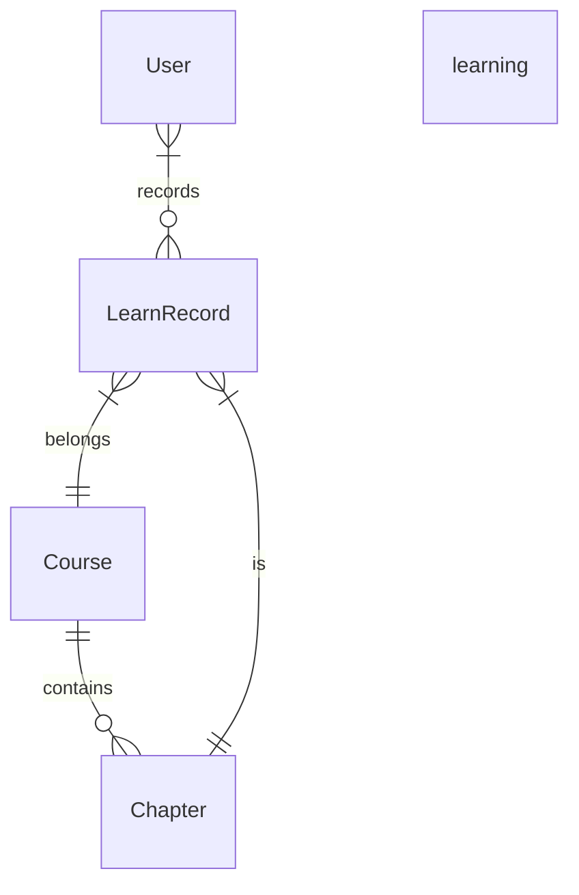
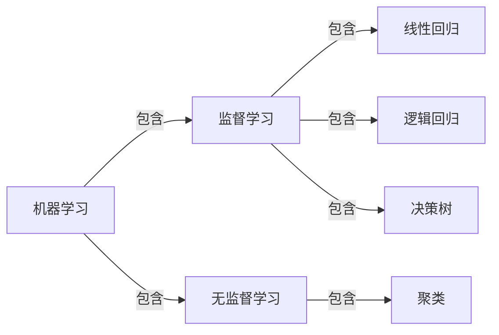

# 教学在线网站详细设计与具体代码实现

作者：禅与计算机程序设计艺术

## 1. 背景介绍

### 1.1 在线教育的发展现状

近年来,在线教育行业发展迅速,越来越多的人选择通过网络平台学习知识和技能。据统计,2020年全球在线教育市场规模达到2275亿美元,预计到2025年将达到3190亿美元。

### 1.2 教学在线网站的重要性

教学在线网站作为在线教育的重要载体,为学习者提供了便捷高效的学习方式。一个优秀的教学在线网站不仅能够满足学习者的多样化需求,还能提高教学质量和学习效果。

### 1.3 教学在线网站的主要功能

一个完善的教学在线网站通常包括以下主要功能:

- 课程管理:包括课程发布、编辑、删除等
- 用户管理:包括用户注册、登录、角色分配等
- 学习管理:包括课程学习、作业完成、在线考试等
- 互动交流:包括在线答疑、讨论区、直播课等
- 数据统计:包括学习进度跟踪、学习效果分析等

## 2. 核心概念与联系

### 2.1 MVC架构

MVC是Model-View-Controller的缩写,是一种常用的Web应用程序设计模式。它将应用程序分为三个核心部件:模型(Model)、视图(View)和控制器(Controller),并定义它们之间的交互方式。

- Model:负责管理应用程序的数据和业务逻辑
- View:负责数据的显示和用户交互
- Controller:响应用户输入,调用模型和视图完成用户请求

### 2.2 前后端分离

前后端分离是指将Web应用划分为前端(客户端)和后端(服务器端)两个部分,两个部分之间通过API进行通信。这样可以使前后端开发独立进行,提高开发效率和可维护性。

- 前端:使用HTML/CSS/JavaScript实现用户界面
- 后端:使用编程语言(如Java、Python等)实现业务逻辑和数据存储

### 2.3 RestAPI

RestAPI是一种常用的前后端通信方式,使用HTTP协议(如GET、POST等)传输数据。RestAPI具有以下特点:

- 每个URI代表一种资源
- 使用不同的HTTP方法对资源进行操作(CRUD)
- 使用JSON作为数据交换格式
- 无状态,每个请求都包含处理该请求所需的信息

### 2.4 数据库设计

教学在线网站涉及大量数据的存储和管理,合理的数据库设计是保证网站性能和可扩展性的关键。以下是几个核心数据库表的设计:

- 用户表(User):存储用户的基本信息,如用户名、密码、角色等
- 课程表(Course):存储课程的基本信息,如课程名称、简介、分类等
- 章节表(Chapter):存储课程下的章节,如章节名称、视频、课件等
- 学习记录表(Learn Record):存储用户的学习记录,如学习进度、完成作业、考试成绩等

数据库表之间的关系可以用ER图表示:



## 3. 核心算法原理和具体操作步骤

在教学在线网站中,以下几个核心算法值得关注:

### 3.1 推荐算法

推荐算法可以根据用户的学习记录和兴趣爱好,向其推荐合适的课程。常见的推荐算法包括:

- 协同过滤(Collaborative Filtering):根据用户的历史行为,找到与其相似的用户,然后将这些用户喜欢的课程推荐给当前用户。
- 基于内容(Content-based)推荐:根据课程的属性(如标题、描述、分类等),找到与用户已学课程相似的课程。

以协同过滤算法为例,其基本步骤如下:

(1) 收集用户对课程的评分数据,构建用户-课程评分矩阵

$$
R = \begin{bmatrix}
 r_{11} & r_{12} & \cdots & r_{1n} \\ 
 r_{21} & r_{22} & \cdots & r_{2n} \\
 \vdots & \vdots & \ddots & \vdots \\
 r_{m1} & r_{m2} & \cdots & r_{mn} 
\end{bmatrix}
$$

其中$r_{ij}$表示用户$i$对课程$j$的评分,若未评分则为空。

(2) 计算用户之间的相似度,常用的相似度计算方法有:

- 欧氏距离:

$$
sim(u,v) = \frac{1}{1+\sqrt{\sum_{i \in I_{uv}} (r_{ui} - r_{vi})^2}}
$$

- 皮尔逊相关系数:

$$
sim(u,v) = \frac{\sum_{i\in I_{uv}}(r_{ui}-\bar{r}_u)(r_{vi}-\bar{r}_v)}{\sqrt{\sum_{i\in I_{uv}}(r_{ui}-\bar{r}_u)^2} \sqrt{\sum_{i\in I_{uv}}(r_{vi}-\bar{r}_v)^2}}
$$

其中$I_{uv}$是用户$u$和$v$共同评分的课程集合,$\bar{r}_u$和$\bar{r}_v$分别是用户$u$和$v$的平均评分。

(3) 找出与当前用户最相似的$k$个用户(最近邻),然后基于他们的评分来预测当前用户对新课程的评分:

$$
\hat{r}_{ui} = \bar{r}_u + \frac{\sum_{v\in N_i(u)} sim(u,v)(r_{vi}-\bar{r}_v)}{\sum_{v\in N_i(u)} sim(u,v)}
$$

其中$N_i(u)$是与用户$u$最相似的$k$个用户组成的集合。

(4) 根据预测评分高低给用户推荐课程。

### 3.2 搜索算法

搜索是用户寻找课程的主要方式,一个高效准确的搜索引擎能大大提高用户体验。搜索算法主要分为两步:建立索引和检索匹配。

(1) 建立索引

- 对课程信息进行预处理,如分词、去除停用词等。
- 提取关键词,计算每个关键词的权重(如TF-IDF)。
- 构建倒排索引,即关键词到课程的映射。

(2) 检索匹配

- 对用户输入的搜索词进行预处理。
- 在倒排索引中查找包含搜索词的课程,计算相关性得分(如BM25)。
- 根据相关性得分排序,返回TopN结果。

常见的相关性计算公式有:
- TF-IDF:

$$ 
tfidf(t,d) = tf(t,d) \times idf(t) 
$$

其中$tf(t,d)$是词$t$在文档$d$中的频率,$idf(t)$是词$t$的逆文档频率,用来衡量词$t$的重要性。

$$
idf(t) = \log \frac{N}{df(t) + 1}
$$

其中$N$是总文档数,$df(t)$是包含词$t$的文档数。

- BM25:

$$
score(q,d) = \sum_{t \in q \cap d} idf(t) \cdot \frac{tf(t,d) \cdot (k_1+1)}{tf(t,d) + k_1 \cdot (1-b+b \cdot \frac{|d|}{avgdl})}
$$

其中$k_1$和$b$是调节因子,$avgdl$是文档平均长度。

## 4. 数学模型和公式详细讲解与举例说明

在教学在线网站中,常用的数学模型有:

### 4.1 用户画像模型

用户画像是描述用户属性特征的一种数学模型,常用于个性化推荐、广告投放等场景。主要分为以下几步:

(1) 收集用户的各种属性数据,如:
- 人口统计学属性:性别、年龄、职业等
- 行为属性:浏览历史、学习时长、学习进度等
- 内容属性:感兴趣的课程主题、关键词等

(2) 对属性数据进行预处理,如填充缺失值、归一化等。

(3) 使用机器学习算法(如聚类、分类等)对用户进行建模,得到用户画像向量:

$$
\mathbf{u} = [u_1, u_2, \dots, u_n]
$$

其中$u_i$表示用户在第$i$个属性上的分值。

举例:假设我们通过聚类算法将用户划分为以下三类:

- $C_1$:高学历,对前沿技术感兴趣
- $C_2$:职场新人,希望提升工作技能 
- $C_3$:在校学生,学习编程基础知识

则每个用户的画像可以表示为一个三维向量,每一维表示其属于对应类别的概率或置信度:

$$
\mathbf{u_1} = [0.8, 0.1, 0.1] \\
\mathbf{u_2} = [0.2, 0.7, 0.1]
$$

### 4.2 知识图谱模型

知识图谱用图的形式表示实体及其关系,是一种结构化的知识库。在教学网站中,可以用知识图谱对课程知识点进行组织和关联。

形式化地,一个知识图谱可以表示为:

$$
\mathcal{G} = (\mathcal{E}, \mathcal{R}, \mathcal{S})
$$

其中$\mathcal{E}$是实体(Entity)的集合,$\mathcal{R}$是关系(Relation)的集合,$\mathcal{S}$是三元组(Triple)的集合,每个三元组表示一个事实:

$$
(h,r,t) \in \mathcal{E} \times \mathcal{R} \times \mathcal{E}
$$

即头实体$h$通过关系$r$连接到尾实体$t$。

举例:假设对于一门机器学习课程,提取了以下知识:

- 监督学习(Supervised learning)、无监督学习(Unsupervised learning)是机器学习的两大类别 
- 线性回归(Linear regression)、逻辑回归(Logistic regression)、决策树(Decision tree)是常见的监督学习算法
- 聚类(Clustering)是常见的无监督学习算法

则我们可以构建以下知识图谱:



对应的三元组集合为:

$$
\mathcal{S} = \{
  (机器学习,包含,监督学习), \\
  (机器学习,包含,无监督学习),\\
  (监督学习,包含,线性回归),\\
  (监督学习,包含,逻辑回归),\\ 
  (监督学习,包含,决策树),\\
  (无监督学习,包含,聚类)
\}
$$

知识图谱的应用:
- 通过图的遍历实现知识推理,如:
  - 监督学习包含哪些算法?
  - 逻辑回归属于哪个大类?
- 作为推荐算法的知识增强,如给用户推荐前置/后继知识点。
- 可视化展示,方便用户理解知识结构。

## 5. 项目实践 - 代码实例和详细解释说明

下面以一个简单的Flask项目为例,演示教学在线网站的核心代码实现。

### 5.1 项目结构
```
edu_website/
  ├─ app/
  │  ├─ models/
  │  │  ├─ user.py
  │  │  ├─ course.py
  │  │  └─ ...
  │  ├─ routes/
  │  │  ├─ home.py
  │  │  ├─ course.py 
  │  │  └─ ...
  │  ├─ templates/
  │  │  ├─ home.html
  │  │  ├─ course.html
  │  │  └─ ...  
  │  ├─ __init__.py
  │  └─ extensions.py
  │  
  ├─ tests/
  ├─ config.py  
  └─ manage.py
```

- app: 应用程序的主要代码
  - models: 数据库模型类
  - routes: 路由控制器
  - templates