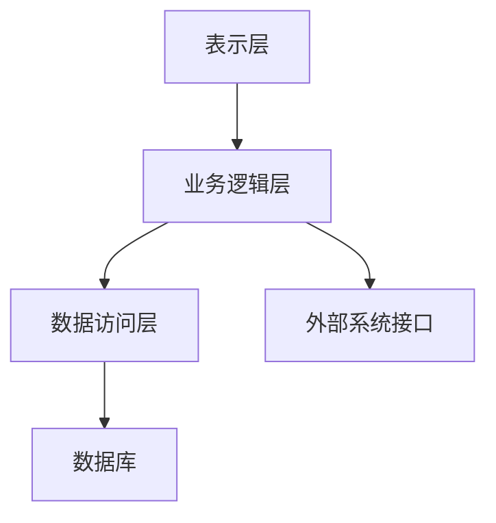

# 教学实验管理系统详细设计与具体代码实现

## 1. 背景介绍

### 1.1 教学实验管理系统的定义与重要性
教学实验管理系统（Teaching Experiment Management System，简称TEMS）是用于管理和组织教学实验活动的软件系统。它的主要功能包括实验课程安排、实验设备管理、实验数据记录与分析、实验报告提交与评审等。随着信息技术的发展，传统的手工管理方式已经无法满足现代教育的需求，TEMS的应用变得越来越重要。

### 1.2 现有系统的局限性
现有的教学实验管理系统通常存在如下局限性：
- **功能单一**：只能满足基础的实验管理需求，缺乏个性化和智能化功能。
- **用户体验差**：界面设计不友好，操作复杂，用户体验较差。
- **数据孤岛**：各个系统之间数据无法互通，导致信息孤立。
- **扩展性差**：难以根据需求进行功能扩展和升级。

### 1.3 设计目标与要求
为了克服上述局限性，本文设计了一种新型的教学实验管理系统，其设计目标包括：
- **功能全面**：涵盖实验管理的各个方面，提供丰富的功能模块。
- **用户友好**：界面简洁美观，操作简单明了。
- **数据共享**：实现数据的互通互联，消除信息孤岛。
- **高度扩展**：系统具有良好的扩展性，能够根据需求进行功能扩展。

## 2. 核心概念与联系

### 2.1 系统架构
教学实验管理系统的架构设计采用分层架构，包括表示层、业务逻辑层和数据访问层。各层之间相互独立，便于系统的维护和扩展。



### 2.2 模块划分
系统主要包括以下模块：
- **用户管理模块**：负责用户的注册、登录、权限管理等。
- **实验课程管理模块**：负责实验课程的安排与管理。
- **实验设备管理模块**：负责实验设备的登记、借用与维护。
- **实验数据管理模块**：负责实验数据的记录、分析与展示。
- **实验报告管理模块**：负责实验报告的提交、评审与存档。

### 2.3 核心功能联系
各模块之间通过业务逻辑层进行联系和交互。例如，实验课程管理模块可以调用实验设备管理模块的接口，查询实验设备的状态；实验数据管理模块可以与实验报告管理模块进行数据交互，实现实验数据的自动填充。

## 3. 核心算法原理具体操作步骤

### 3.1 用户认证与权限管理
用户认证与权限管理是系统安全的重要组成部分，采用基于JWT（JSON Web Token）的认证机制。具体步骤如下：
1. 用户登录时，系统验证用户名和密码。
2. 验证通过后，系统生成JWT并返回给用户。
3. 用户在后续请求中携带JWT，系统验证JWT的有效性和权限。

### 3.2 实验课程安排算法
实验课程安排需要考虑实验室资源、教师时间和学生时间等因素。采用贪心算法进行安排，具体步骤如下：
1. 按照实验室资源、教师时间和学生时间的优先级排序。
2. 依次分配实验课程，保证资源和时间的最优利用。
3. 若出现冲突，调整实验课程的时间或资源。

### 3.3 实验数据分析算法
实验数据分析采用统计分析和机器学习算法。具体步骤如下：
1. 数据预处理：包括数据清洗、数据格式转换等。
2. 数据分析：采用统计分析方法，计算平均值、方差等指标。
3. 机器学习：根据实验数据训练模型，进行预测和分类。

## 4. 数学模型和公式详细讲解举例说明

### 4.1 用户认证模型
用户认证模型采用JWT进行认证，JWT的生成过程如下：
$$
JWT = Base64(Header) + '.' + Base64(Payload) + '.' + HMACSHA256(Base64(Header) + '.' + Base64(Payload), Secret)
$$
其中，Header包含算法信息，Payload包含用户信息，Secret为密钥。

### 4.2 实验课程安排模型
实验课程安排问题可以抽象为一个资源调度问题，采用贪心算法进行求解。假设有 $n$ 个实验课程，$m$ 个实验室，$t$ 个时间段，目标是最大化实验室和时间段的利用率。定义决策变量 $x_{ijt}$ 表示实验课程 $i$ 在实验室 $j$ 和时间段 $t$ 的安排情况，目标函数为：
$$
\max \sum_{i=1}^{n} \sum_{j=1}^{m} \sum_{t=1}^{t} x_{ijt}
$$
约束条件为：
$$
\sum_{j=1}^{m} \sum_{t=1}^{t} x_{ijt} \leq 1, \quad \forall i
$$
$$
\sum_{i=1}^{n} x_{ijt} \leq 1, \quad \forall j, \forall t
$$

### 4.3 实验数据分析模型
实验数据分析采用线性回归模型，假设实验数据为 $(x_1, y_1), (x_2, y_2), \ldots, (x_n, y_n)$，线性回归模型为：
$$
y = \beta_0 + \beta_1 x + \epsilon
$$
其中，$\beta_0$ 和 $\beta_1$ 为回归系数，$\epsilon$ 为误差项。通过最小二乘法求解回归系数：
$$
\hat{\beta}_1 = \frac{\sum_{i=1}^{n} (x_i - \bar{x})(y_i - \bar{y})}{\sum_{i=1}^{n} (x_i - \bar{x})^2}
$$
$$
\hat{\beta}_0 = \bar{y} - \hat{\beta}_1 \bar{x}
$$

## 5. 项目实践：代码实例和详细解释说明

### 5.1 用户认证与权限管理代码实例
```python
import jwt
import datetime

SECRET_KEY = "your_secret_key"

def generate_jwt(user_id):
    payload = {
        "user_id": user_id,
        "exp": datetime.datetime.utcnow() + datetime.timedelta(hours=1)
    }
    token = jwt.encode(payload, SECRET_KEY, algorithm="HS256")
    return token

def verify_jwt(token):
    try:
        payload = jwt.decode(token, SECRET_KEY, algorithms=["HS256"])
        return payload["user_id"]
    except jwt.ExpiredSignatureError:
        return None
    except jwt.InvalidTokenError:
        return None
```

### 5.2 实验课程安排代码实例
```python
class ExperimentScheduler:
    def __init__(self, labs, teachers, students):
        self.labs = labs
        self.teachers = teachers
        self.students = students

    def schedule(self, experiments):
        schedule = []
        for experiment in experiments:
            for lab in self.labs:
                for time_slot in lab.available_time_slots:
                    if self._is_time_slot_available(lab, time_slot, experiment):
                        schedule.append((experiment, lab, time_slot))
                        lab.book_time_slot(time_slot)
                        break
        return schedule

    def _is_time_slot_available(self, lab, time_slot, experiment):
        return all([
            lab.is_available(time_slot),
            experiment.teacher.is_available(time_slot),
            all(student.is_available(time_slot) for student in experiment.students)
        ])
```

### 5.3 实验数据分析代码实例
```python
import numpy as np
from sklearn.linear_model import LinearRegression

def perform_linear_regression(data):
    X = np.array([d[0] for d in data]).reshape(-1, 1)
    y = np.array([d[1] for d in data])
    model = LinearRegression()
    model.fit(X, y)
    return model.coef_[0], model.intercept_

data = [(1, 2), (2, 3), (3, 4), (4, 5)]
slope, intercept = perform_linear_regression(data)
print(f"Slope: {slope}, Intercept: {intercept}")
```

## 6. 实际应用场景

### 6.1 高校实验室管理
高校实验室管理是教学实验管理系统的主要应用场景。通过该系统，可以实现实验课程的高效安排，实验设备的统一管理，实验数据的自动记录与分析，提高实验教学的质量和效率。

### 6.2 企业培训实验管理
在企业培训中，实验管理系统可以用于安排和管理各种培训实验，提供实验数据分析功能，帮助企业提升员工的技能水平和培训效果。

### 6.3 科研