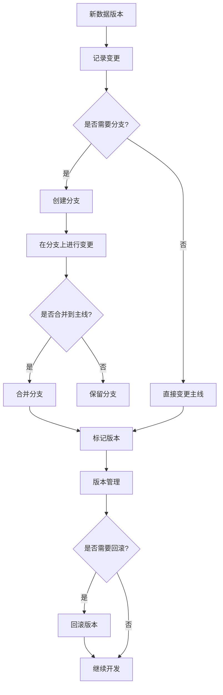

下面是关于"数据版本控制与数据管理原理与代码实战案例讲解"的技术博客文章。

## 1.背景介绍

### 1.1 数据的重要性

在当今数据主导的世界中,数据无疑成为了最宝贵的资源之一。无论是科研、商业还是政府部门,都依赖于大量的数据来支持决策、驱动创新和优化运营。随着数据量的不断增长,有效管理和控制数据版本变得至关重要。

### 1.2 数据版本控制的挑战

数据通常会经历多个版本的变化,这些变化可能源于数据更新、模型调整或其他因素。在这个过程中,跟踪和管理数据版本变得极为复杂,尤其是在涉及多个数据源、多个处理步骤和多个利益相关方的情况下。缺乏有效的版本控制可能会导致数据不一致、难以复现结果以及浪费资源等问题。

### 1.3 数据管理的重要性

除了版本控制之外,数据管理也是确保数据质量和可靠性的关键因素。良好的数据管理实践包括数据存储、数据访问控制、数据备份和恢复、数据治理等多个方面。只有将数据版本控制与全面的数据管理策略相结合,才能真正实现数据资产的最大价值。

## 2.核心概念与联系

### 2.1 数据版本控制

数据版本控制是指对数据的变更进行系统的跟踪、记录和管理,以确保数据的可追溯性、可重现性和一致性。它通常包括以下几个关键概念:

1. **版本标识**: 为每个数据版本分配一个唯一的标识符,以便于引用和跟踪。
2. **变更记录**: 记录每次数据变更的详细信息,包括变更时间、变更人员、变更原因等。
3. **版本管理**: 管理数据版本之间的关系,例如分支、合并等操作。
4. **回滚与恢复**: 能够将数据恢复到特定的历史版本。

### 2.2 数据管理

数据管理是一个更广泛的概念,它涵盖了数据的整个生命周期,从数据采集到数据处理、存储、共享、保护和最终销毁。数据管理的主要目标是确保数据的高质量、可访问性、安全性和合规性。它包括以下几个关键领域:

1. **数据治理**: 制定数据标准、政策和流程,确保数据的一致性、完整性和准确性。
2. **数据集成**: 从多个异构数据源收集和整合数据。
3. **数据存储和访问**: 选择合适的数据存储解决方案,并提供安全的数据访问机制。
4. **数据安全和隐私**: 保护数据免受未经授权的访问、修改或破坏,并遵守相关的隐私法规。
5. **数据质量管理**: 监控和改进数据质量,包括准确性、完整性、一致性等方面。

### 2.3 数据版本控制与数据管理的关系

数据版本控制和数据管理是密切相关的概念。有效的数据版本控制需要建立在健全的数据管理基础之上,而数据管理也需要考虑版本控制的需求。它们共同构成了确保数据资产价值的关键支柱。

例如,数据治理为版本控制提供了标准和政策指导,而版本控制则有助于实现数据的可追溯性和可审计性,从而支持数据治理目标。同时,数据存储和访问解决方案需要与版本控制系统集成,以便高效地存储和检索不同版本的数据。

总的来说,数据版本控制和数据管理是相辅相成的,它们共同为组织提供了管理数据资产的完整解决方案。

## 3.核心算法原理具体操作步骤

### 3.1 数据版本控制算法

数据版本控制算法的核心思想是跟踪和记录数据的变更历史,并支持对历史版本进行访问和操作。以下是一种常见的数据版本控制算法的具体操作步骤:

1. **初始化版本**: 创建一个新的数据版本,并为其分配一个唯一的版本标识符。这通常是版本控制系统的起点。

2. **记录变更**: 每当对数据进行修改时,都需要记录变更的详细信息,包括变更时间、变更人员、变更原因等。这些信息将与新的数据版本一起存储。

3. **创建分支**: 如果需要基于当前版本进行新的开发或实验,可以创建一个新的分支。分支允许在不影响主线版本的情况下进行独立的变更。

4. **合并分支**: 当分支上的工作完成后,可以将分支合并回主线版本。合并过程需要解决潜在的冲突,并记录合并操作的详细信息。

5. **标记版本**: 在特定的里程碑或发布时刻,可以为当前版本添加一个标记或标签,以便于将来快速定位和引用该版本。

6. **回滚版本**: 如果需要恢复到以前的版本,可以执行回滚操作。回滚会将数据恢复到指定的历史版本状态。

7. **版本比较**: 版本控制系统通常提供比较不同版本之间差异的功能,以帮助用户了解变更的具体内容。

8. **版本管理**: 根据需求,可以对版本进行归档、删除或其他管理操作。

这种算法通常采用基于文件或数据库的实现方式,并提供用户友好的界面和工具来简化版本控制操作。

### 3.2 数据版本控制工作流程

数据版本控制通常遵循以下工作流程:



1. 创建一个新的数据版本,作为起点。
2. 记录对数据所做的任何变更。
3. 如果需要进行独立的开发或实验,可以创建一个新的分支。
4. 在分支上进行所需的变更。
5. 如果分支上的工作完成,可以将分支合并回主线版本。
6. 在重要的里程碑或发布时刻,为当前版本添加标记或标签。
7. 根据需求执行版本管理操作,如归档、删除等。
8. 如果需要恢复到以前的版本,可以执行回滚操作。
9. 继续开发,重复上述步骤。

这个工作流程确保了数据版本的可追溯性和可重现性,同时也提供了必要的灵活性,以支持不同的开发和协作模式。

## 4.数学模型和公式详细讲解举例说明

在数据版本控制领域,有几种常见的数学模型和公式被广泛应用。下面将详细介绍其中的两种。

### 4.1 矢量时钟 (Vector Clock)

矢量时钟是一种用于分布式系统中实现事件顺序一致性的算法。在数据版本控制中,它可以用于跟踪分布式环境下的数据变更顺序。

矢量时钟是一个向量 $V = [t_1, t_2, ..., t_n]$,其中 $n$ 是系统中进程的数量,每个进程 $i$ 维护一个逻辑时钟 $t_i$。当进程 $i$ 发生事件时,它会递增自己的逻辑时钟 $t_i$,并将矢量时钟 $V$ 附加到事件上。

矢量时钟满足以下性质:

- 如果矢量时钟 $V$ 和 $U$ 满足 $\forall j: V[j] \leq U[j]$,且存在 $k$ 使得 $V[k] < U[k]$,那么事件 $V$ 发生在事件 $U$ 之前。
- 如果矢量时钟 $V$ 和 $U$ 满足 $\forall j: V[j] = U[j]$,那么事件 $V$ 和 $U$ 是并发的。
- 否则,事件 $V$ 和 $U$ 的顺序是不确定的。

在数据版本控制中,每次数据变更都可以被视为一个事件,并附加一个矢量时钟。通过比较矢量时钟,我们可以确定数据变更的顺序,从而正确地合并或回滚版本。

例如,假设我们有两个进程 $P_1$ 和 $P_2$,它们分别维护数据版本 $V_1$ 和 $V_2$。初始时,矢量时钟为 $[0, 0]$。

1. $P_1$ 对 $V_1$ 进行修改,矢量时钟变为 $[1, 0]$。
2. $P_2$ 对 $V_2$ 进行修改,矢量时钟变为 $[1, 1]$。
3. $P_1$ 再次修改 $V_1$,矢量时钟变为 $[2, 1]$。

根据矢量时钟,我们可以确定事件的发生顺序为:第一次修改 $V_1$ $\rightarrow$ 修改 $V_2$ $\rightarrow$ 第二次修改 $V_1$。因此,在合并版本时,我们需要先应用 $P_2$ 对 $V_2$ 的修改,然后再应用 $P_1$ 对 $V_1$ 的第二次修改。

### 4.2 Levenshtein 距离

Levenshtein 距离是一种用于测量两个序列之间差异的编辑距离度量。在数据版本控制中,它可以用于比较不同版本之间的差异,从而支持版本比较和合并操作。

对于两个长度分别为 $m$ 和 $n$ 的序列 $X$ 和 $Y$,Levenshtein 距离 $lev(X, Y)$ 定义为将 $X$ 转换为 $Y$ 所需的最小编辑操作数。编辑操作包括插入、删除和替换。

Levenshtein 距离可以使用动态规划算法来计算,其递推公式如下:

$$
lev_{i,j}(X, Y) = \begin{cases}
\max(i, j) & \text{if $\min(i, j) = 0$} \\
\min \begin{cases}
lev_{i-1,j}(X, Y) + 1 & \text{(deletion)} \\
lev_{i,j-1}(X, Y) + 1 & \text{(insertion)} \\
lev_{i-1,j-1}(X, Y) + 1_{x_i \neq y_j} & \text{(substitution)}
\end{cases} & \text{otherwise}
\end{cases}
$$

其中 $1_{x_i \neq y_j}$ 是指示函数,当 $x_i \neq y_j$ 时取值为 1,否则为 0。

在数据版本控制中,我们可以将不同版本的数据视为序列,并使用 Levenshtein 距离来量化它们之间的差异。这种差异度量可以用于:

1. **版本比较**: 通过比较不同版本之间的 Levenshtein 距离,可以快速了解它们之间的差异程度。
2. **合并辅助**: 在合并版本时,Levenshtein 距离可以用于识别冲突区域,并提供智能的合并建议。
3. **数据压缩**: Levenshtein 距离也可以应用于数据压缩领域,通过仅存储与基准版本之间的差异,来减小存储空间。

例如,假设我们有两个版本的数据序列 $X$ 和 $Y$:

$X$: "ABCDEFGH"
$Y$: "ABCDXFGH"

我们可以计算它们之间的 Levenshtein 距离:

```
lev(0, 0) = 0
lev(0, 1) = lev(0, 0) + 1 = 1
lev(0, 2) = lev(0, 1) + 1 = 2
...
lev(4, 4) = lev(3, 3) + 1 = 1  # 插入 'X'
lev(5, 4) = lev(4, 4) + 1 =