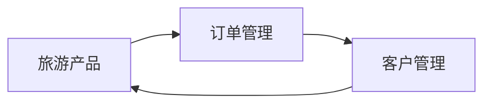

# 旅游业务管理系统详细设计与具体代码实现

作者：禅与计算机程序设计艺术

## 1. 背景介绍

随着旅游业的蓬勃发展,传统的旅游业务管理模式已无法满足日益增长的旅游市场需求。为提高旅游企业的管理效率和服务质量,开发一套功能完善、高效稳定的旅游业务管理系统势在必行。本文将详细阐述旅游业务管理系统的设计思路和具体实现过程,为读者提供全面的技术指导和实践参考。

### 1.1 旅游业务管理系统的必要性
#### 1.1.1 提升管理效率
#### 1.1.2 增强客户体验
#### 1.1.3 优化资源配置

### 1.2 系统开发目标
#### 1.2.1 功能完备性
#### 1.2.2 性能稳定性  
#### 1.2.3 可扩展性

### 1.3 系统架构选型
#### 1.3.1 B/S架构优势
#### 1.3.2 MVC设计模式
#### 1.3.3 前后端分离

## 2. 核心概念与关联

在设计旅游业务管理系统时,需要深入理解以下核心概念及其之间的关联:

### 2.1 旅游产品
#### 2.1.1 产品分类
#### 2.1.2 产品属性
#### 2.1.3 产品关联

### 2.2 订单管理
#### 2.2.1 订单状态流转
#### 2.2.2 订单与产品关联
#### 2.2.3 订单与客户关联

### 2.3 客户管理  
#### 2.3.1 客户分类
#### 2.3.2 客户属性
#### 2.3.3 客户与订单关联

### 2.4 核心概念关系图



## 3. 核心算法原理与具体操作步骤

为实现旅游业务管理系统的关键功能,需要应用以下核心算法:

### 3.1 产品推荐算法
#### 3.1.1 协同过滤算法原理
#### 3.1.2 基于内容的推荐算法原理 
#### 3.1.3 混合推荐算法原理
#### 3.1.4 具体实现步骤

### 3.2 订单调度算法
#### 3.2.1 优先级调度算法原理
#### 3.2.2 动态规划算法原理
#### 3.2.3 遗传算法原理
#### 3.2.4 具体实现步骤

### 3.3 客户分群算法
#### 3.3.1 K-means聚类算法原理  
#### 3.3.2 DBSCAN聚类算法原理
#### 3.3.3 层次聚类算法原理
#### 3.3.4 具体实现步骤

## 4. 数学模型和公式详解

为更好地阐述系统中涉及的核心算法,本节将详细讲解相关数学模型和公式。

### 4.1 协同过滤算法
#### 4.1.1 用户-物品评分矩阵
用户-物品评分矩阵可表示为:

$$
R = 
\begin{bmatrix}
r_{11} & r_{12} & \cdots & r_{1n} \\
r_{21} & r_{22} & \cdots & r_{2n} \\
\vdots & \vdots & \ddots & \vdots \\
r_{m1} & r_{m2} & \cdots & r_{mn} 
\end{bmatrix}
$$

其中,$r_{ij}$表示用户$i$对物品$j$的评分。

#### 4.1.2 相似度计算
余弦相似度可用以下公式计算:

$similarity(i,j) = \frac{\sum_{u \in U} R_{ui} \cdot R_{uj}}{\sqrt{\sum_{u \in U} R_{ui}^2} \cdot \sqrt{\sum_{u \in U} R_{uj}^2}}$

其中,$U$为对物品$i$和$j$均有评分的用户集合。

#### 4.1.3 预测评分计算
预测用户$u$对物品$i$的评分$\hat{r}_{ui}$可通过以下公式计算:  

$\hat{r}_{ui} = \frac{\sum_{j \in S(i;u)} similarity(i,j) \cdot r_{uj}}{\sum_{j \in S(i;u)} |similarity(i,j)|}$

其中,$S(i;u)$为用户$u$评分过的、与物品$i$最相似的$k$个物品集合。

### 4.2 K-means聚类算法
#### 4.2.1 算法目标函数
K-均值聚类算法的目标是最小化平方误差函数:

$J(c,\mu) = \sum_{i=1}^{K}\sum_{j=1}^{n} w_{ij} \|x^{(j)} - \mu_i\|^2$

其中,$\mu_i$是第$i$个聚类的中心点,$w_{ij} \in \{0,1\}$表示数据点$x^{(j)}$是否被分配到第$i$个聚类。

#### 4.2.2 聚类中心点更新
在每次迭代中,聚类中心点按以下公式更新:

$\mu_i = \frac{\sum_{j=1}^{n} w_{ij} x^{(j)}}{\sum_{j=1}^{n} w_{ij}}$

#### 4.2.3 收敛条件
当聚类结果不再发生变化或达到最大迭代次数时,算法收敛。

### 4.3 订单调度中的动态规划
#### 4.3.1 问题定义
订单调度可建模为一个单机调度问题,目标是最小化总延误时间。设有$n$个订单,订单$i$的处理时间为$t_i$,截止时间为$d_i$。

#### 4.3.2 状态转移方程
设$f(i,t)$表示前$i$个订单在$t$时间内的最小延误时间,则状态转移方程为:

$f(i,t) = \min \{ f(i-1, t), f(i-1, t-t_i) + \max\{0, t-d_i\} \}$

#### 4.3.3 边界条件
边界条件为:$f(0,t) = 0, \forall t \geq 0$。

## 5. 项目实践:代码实例与详解

本节将提供旅游业务管理系统的核心功能代码实例,并进行详细解释说明。

### 5.1 产品推荐模块
#### 5.1.1 协同过滤算法实现
```python
class CollaborativeFiltering:
    def __init__(self, data, k=3, sim_method='cosine'):
        self.data = data
        self.k = k
        self.sim_method = sim_method
        
    def get_similarity(self, item1, item2):
        # 计算物品相似度
        pass
    
    def recommend(self, user):
        # 生成推荐列表
        pass
```

#### 5.1.2 基于内容的推荐算法实现
```python
class ContentBasedRecommender:
    def __init__(self, data, sim_method='cosine'):
        self.data = data
        self.sim_method = sim_method
        
    def get_similarity(self, item1, item2):  
        # 计算物品相似度
        pass
    
    def recommend(self, user):
        # 生成推荐列表  
        pass
```

### 5.2 订单管理模块
#### 5.2.1 订单状态流转
```python
class OrderStatus(Enum):
    UNPAID = 1
    PAID = 2
    CANCELLED = 3
    COMPLETED = 4
    
class Order:
    def __init__(self, order_id, user_id, status=OrderStatus.UNPAID):
        self.order_id = order_id
        self.user_id = user_id
        self.status = status
        
    def pay(self):
        self.status = OrderStatus.PAID
    
    def cancel(self):
        self.status = OrderStatus.CANCELLED
        
    def complete(self):
        self.status = OrderStatus.COMPLETED
```

#### 5.2.2 订单调度算法实现
```python
def schedule_orders(orders):
    n = len(orders)
    t_max = sum(o.processing_time for o in orders)
    f = [[0] * (t_max + 1) for _ in range(n + 1)]
    
    for i in range(1, n + 1):
        for t in range(t_max + 1):
            if t < orders[i-1].processing_time:
                f[i][t] = f[i-1][t]
            else:
                f[i][t] = min(f[i-1][t], 
                              f[i-1][t-orders[i-1].processing_time] + max(0, t-orders[i-1].due_time))
                              
    return f[n][t_max]
```  

### 5.3 客户管理模块
#### 5.3.1 客户分群算法实现
```python
class KMeans:
    def __init__(self, n_clusters=3, max_iter=100):
        self.n_clusters = n_clusters
        self.max_iter = max_iter
        
    def fit(self, X):
        # 训练聚类模型
        pass
    
    def predict(self, X):
        # 预测样本的聚类
        pass

```

## 6. 实际应用场景

旅游业务管理系统可广泛应用于以下场景:

### 6.1 在线旅游平台
#### 6.1.1 智能产品推荐
#### 6.1.2 订单自动化处理
#### 6.1.3 个性化客户服务

### 6.2 旅行社业务管理
#### 6.2.1 产品管理与推广
#### 6.2.2 客户关系管理
#### 6.2.3 财务与报表统计

### 6.3 景区智慧化管理
#### 6.3.1 游客流量预测与调度
#### 6.3.2 电子票务管理
#### 6.3.3 游客行为分析   

## 7. 工具和资源推荐

以下是一些实用的开发工具和学习资源,帮助读者进一步掌握旅游业务管理系统的设计与开发技能。

### 7.1 开发工具
- Python: 简洁高效的编程语言,适合快速开发。
- Django: 基于Python的高级Web框架,开发效率高。
- Vue.js: 渐进式JavaScript框架,用于构建用户界面。
- MySQL: 开源的关系型数据库管理系统,社区生态丰富。

### 7.2 学习资源  
- 《Python编程:从入门到实践》: Python入门经典教程。
- 《流畅的Python》: Python进阶必读书籍。
- 《Django官方文档》: Django框架权威指南。
- 《Vue.js官方文档》: Vue.js框架官方文档。
- 《推荐系统实践》: 详解推荐算法原理与实现。
- 《数据挖掘:概念与技术》: 系统介绍数据挖掘理论和方法。

## 8. 未来发展趋势与挑战

展望未来,旅游业务管理系统还有广阔的发展空间,同时也面临诸多挑战。

### 8.1 个性化智能服务   
- 基于大数据和人工智能技术,提供更加个性化、智能化的服务。
- 挑战:用户隐私保护,算法公平性。

### 8.2 全域旅游管理
- 实现景区、酒店、交通等全域旅游要素的协同管理。
- 挑战:异构系统整合,数据孤岛。

### 8.3 VR/AR应用
- 利用虚拟现实和增强现实技术,提供沉浸式旅游体验。 
- 挑战:设备成本,内容制作。

## 9. 总结

本文详细阐述了旅游业务管理系统的设计思路和实现过程,包括系统架构、核心算法、数据库设计和代码实现等方面。通过对系统的全面剖析,读者可以深入了解旅游业务管理系统的技术原理和开发流程,为实际项目开发提供参考。

展望未来,旅游业务管理系统还需要与时俱进,持续优化算法模型,加强数据安全和隐私保护,扩展智能服务,最终为用户提供更加优质、高效、个性化的旅游服务。

## 附录:常见问题与解答

### Q1:旅游业务管理系统的核心功能包括哪些?
A1:核心功能包括: 1)旅游产品管理;2)订单管理;3)客户管理;4)产品智能推荐;5)数据分析与挖掘。

### Q2:协同过滤算法的优缺点是什么?  
A2:优点:1)算法简单,易于实现;2)不需要物品本身的属性信息。缺点:1)冷启动问题;2)稀疏性问题;3)扩展性问题。

### Q3:如何解决协同过滤算法的冷启