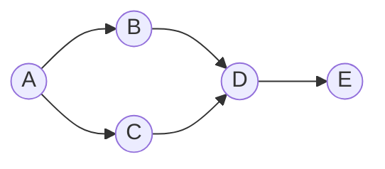

# 标签传播算法的变体：探索更强大的算法家族

## 1.背景介绍

### 1.1 标签传播算法简介

标签传播算法(Label Propagation Algorithm, LPA)是一种半监督学习算法,广泛应用于图数据挖掘、社交网络分析、推荐系统等领域。该算法的核心思想是利用图中节点之间的关系,通过节点标签的相互影响和传播,实现对未标记节点的标签预测。

标签传播算法的优势在于无需事先构建复杂的模型,只需根据节点之间的关联关系进行迭代更新,算法简单高效。同时,该算法能够很好地利用图结构信息,捕捉节点之间的高阶相似性和关联性。

### 1.2 标签传播算法的局限性

尽管标签传播算法具有上述优势,但其也存在一些局限性:

1. **收敛性问题**:标准的标签传播算法在某些情况下可能无法收敛,导致算法无法得到稳定的结果。
2. **敏感性问题**:算法对初始标签分配和参数设置非常敏感,不同的初始化条件可能会得到完全不同的结果。
3. **平凡解问题**:在某些特殊图结构下,算法可能会收敛到平凡解,即所有节点被分配相同的标签。
4. **噪声敏感性**:算法对图中的噪声节点和边非常敏感,噪声数据会严重影响算法的性能。

为了解决这些问题,研究人员提出了多种标签传播算法的变体和改进版本,旨在提高算法的鲁棒性、收敛性和预测精度。

## 2.核心概念与联系

### 2.1 半监督学习

标签传播算法属于半监督学习范畴。半监督学习是机器学习中一种重要的范式,它同时利用了少量标记数据和大量未标记数据进行模型训练。

在现实应用中,获取大量高质量的标记数据往往代价昂贵,而未标记数据则相对容易获取。半监督学习通过有效利用未标记数据,能够提高模型的泛化能力,获得更好的预测性能。

### 2.2 图数据挖掘

标签传播算法主要应用于图数据挖掘领域。图是一种重要的数据结构,能够自然地表示实体之间的关系和网络结构。图数据挖掘旨在从图结构中发现有价值的模式、规律和知识。

标签传播算法利用图中节点之间的关联关系,通过标签的相互传播实现对未标记节点的分类和预测,是图数据挖掘中一种重要的技术手段。

### 2.3 推荐系统

推荐系统是标签传播算法的另一个重要应用领域。在推荐系统中,可以将用户和物品抽象为图中的节点,用户对物品的评分或偏好作为边的权重。通过标签传播算法,可以预测未评分物品的潜在评分,从而为用户推荐感兴趣的物品。

标签传播算法的变体不仅能够提高推荐系统的准确性,还能够解决数据稀疏、冷启动等问题,提升推荐系统的整体性能。

## 3.核心算法原理具体操作步骤

### 3.1 标准标签传播算法

标准的标签传播算法(LPA)可以概括为以下步骤:

1. **初始化**:对已标记节点赋予相应的标签,未标记节点赋予临时标签(如随机标签)。
2. **传播过程**:对每个未标记节点,根据其邻居节点的标签分布,计算该节点被分配不同标签的概率,选择概率最大的标签作为该节点的新标签。
3. **更新标签**:更新所有未标记节点的标签。
4. **收敛判断**:检查标签是否收敛(即所有节点的标签在本次迭代中没有变化)。如果未收敛,则返回步骤2,继续迭代;如果收敛,则算法终止。

该算法的核心思想是通过节点标签的相互影响和传播,逐步更新未标记节点的标签,直至标签分配达到稳定状态。

算法的数学表达式如下:

设图 $G=(V,E)$,其中 $V$ 为节点集合, $E$ 为边集合。对于每个节点 $i \in V$,定义其邻居节点集合为 $N_i = \{j|(i,j) \in E\}$。令 $Y^{(t)}$ 表示第 $t$ 次迭代时节点的标签向量,则算法的更新规则为:

$$
Y_i^{(t+1)} = \arg\max_{y_k} \sum_{j \in N_i} W_{ij} \cdot \mathbb{1}(Y_j^{(t)} = y_k)
$$

其中, $W_{ij}$ 为节点 $i$ 和 $j$ 之间边的权重, $\mathbb{1}(\cdot)$ 为示性函数。该更新规则意味着,节点 $i$ 在下一次迭代中被分配的标签,是其邻居节点当前标签的多数投票结果。

### 3.2 改进版本

为了解决标准标签传播算法的局限性,研究人员提出了多种改进版本,包括但不限于:

1. **加权标签传播算法(WLPA)**:在标准算法的基础上,引入节点权重和边权重,使得不同节点和边在标签传播过程中具有不同的影响力。
2. **半监督高斯场标签传播算法(SSGFLPA)**:将高斯场模型引入标签传播算法,提高了算法的鲁棚性和收敛性。
3. **基于因子图的标签传播算法(FGLPA)**:将标签传播问题建模为因子图模型,利用信念传播算法求解,提高了算法的准确性和稳定性。
4. **基于核函数的标签传播算法(KLPA)**:引入核函数,捕捉节点之间的非线性相似性,提高了算法在复杂数据上的性能。
5. **基于正则化的标签传播算法(RLPA)**:在目标函数中加入正则化项,提高了算法对噪声和异常值的鲁棚性。
6. **基于深度学习的标签传播算法(DLPA)**:将深度神经网络与标签传播算法相结合,自动学习节点表示和传播规则,提升了算法的泛化能力。

这些改进版本从不同角度优化了标签传播算法,旨在提高算法的收敛性、鲁棚性、准确性和适用范围。

## 4.数学模型和公式详细讲解举例说明

在上一节中,我们介绍了标准标签传播算法的数学表达式。现在,我们将详细讲解其中的数学模型和公式,并给出具体的例子说明。

### 4.1 标签传播算法的数学模型

标签传播算法可以被视为在图上求解一个优化问题。具体来说,我们希望找到一个标签分配方案 $Y^*$,使得已标记节点的标签保持不变,同时未标记节点的标签与其邻居节点的标签尽可能一致。

这个优化目标可以用以下目标函数表示:

$$
Y^* = \arg\min_Y \sum_{i,j \in E} W_{ij} \|Y_i - Y_j\|^2 + \mu \sum_{i \in U} D_i \|Y_i - Y_i^0\|^2
$$

其中:

- $E$ 表示图的边集合
- $W_{ij}$ 表示边 $(i,j)$ 的权重
- $U$ 表示未标记节点集合
- $D_i$ 表示节点 $i$ 的度数
- $Y_i^0$ 表示节点 $i$ 的初始标签
- $\mu$ 为超参数,用于平衡两项目标的权重

第一项目标函数旨在最小化相邻节点标签之间的差异,第二项目标函数则试图使未标记节点的标签尽可能接近其初始标签。通过优化该目标函数,我们可以得到一个平衡了这两种目标的标签分配方案。

### 4.2 公式推导

现在,我们来推导标准标签传播算法的更新规则是如何从上述优化目标导出的。

首先,我们对目标函数取梯度,并令其等于0:

$$
\begin{aligned}
\frac{\partial J}{\partial Y_i} &= \sum_{j \in N_i} W_{ij}(Y_i - Y_j) + \mu D_i(Y_i - Y_i^0) = 0 \\
\Rightarrow Y_i &= \frac{1}{D_i + \mu} \left(\sum_{j \in N_i} W_{ij}Y_j + \mu Y_i^0\right)
\end{aligned}
$$

这个更新规则表明,节点 $i$ 的新标签是其邻居节点标签的加权平均,加上一个趋向于初始标签的正则化项。

在标准标签传播算法中,我们通常令 $\mu=0$,忽略正则化项,从而得到简化的更新规则:

$$
Y_i = \frac{1}{D_i} \sum_{j \in N_i} W_{ij}Y_j
$$

这就是我们在上一节中给出的标准算法更新规则。

### 4.3 示例说明

为了更好地理解标签传播算法,我们给出一个简单的示例。

假设我们有一个由5个节点组成的图,如下所示:



其中,节点A和B已被标记为红色,节点C、D和E未标记。我们希望利用标签传播算法预测C、D和E的标签。

初始时,我们可以随机为未标记节点赋予临时标签,例如全部赋予蓝色标签。然后,我们按照标准算法的更新规则进行迭代:

1. 节点C的邻居节点A为红色,B为蓝色,因此C的新标签为红色。
2. 节点D的邻居节点B和C均为红色,因此D的新标签为红色。
3. 节点E的唯一邻居节点D为红色,因此E的新标签为红色。

经过一次迭代后,所有节点的标签已经收敛,算法终止。最终的标签分配结果为:A和B为红色,C、D和E为红色。

通过这个简单的例子,我们可以直观地看到标签传播算法是如何利用节点之间的关联关系,通过标签的相互影响和传播,实现对未标记节点的标签预测。

## 4.项目实践:代码实例和详细解释说明

在这一节中,我们将提供一个基于Python的标签传播算法实现示例,并对代码进行详细的解释说明。

```python
import networkx as nx
import numpy as np

def label_propagation(G, seed, max_iter=1000, tol=1e-6):
    """
    标签传播算法实现
    
    参数:
    G (NetworkX Graph): 输入图
    seed (dict): 初始标签分配,{node: label}的形式
    max_iter (int): 最大迭代次数
    tol (float): 收敛阈值
    
    返回:
    labels (dict): 最终标签分配结果
    """
    # 初始化标签矩阵
    labels = seed.copy()
    nodes = list(G.nodes())
    n = len(nodes)
    label_matrix = np.zeros((n, n))
    for i, node in enumerate(nodes):
        label_matrix[i, i] = 1 if node in seed else 0
    
    # 标签传播迭代
    for iter_count in range(max_iter):
        old_labels = labels.copy()
        for i, node in enumerate(nodes):
            if node not in seed:
                neighbors = [n for n in G.neighbors(node)]
                neighbor_labels = [labels[n] for n in neighbors]
                label_counts = np.bincount(neighbor_labels)
                new_label = np.argmax(label_counts)
                labels[node] = new_label
                label_matrix[i, :] = 0
                label_matrix[i, new_label] = 1
        
        # 检查收敛条件
        diff = np.sum(np.abs(label_matrix - label_matrix.T))
        if diff < n * tol:
            break
    
    return labels
```

以上代码实现了标准的标签传播算法。让我们逐步解释每个部分的功能:

1. **函数定义**:函数`label_propagation`接受四个参数:输入图`G`、初始标签分配`seed`、最大迭代次数`max_iter`和收敛阈值`tol