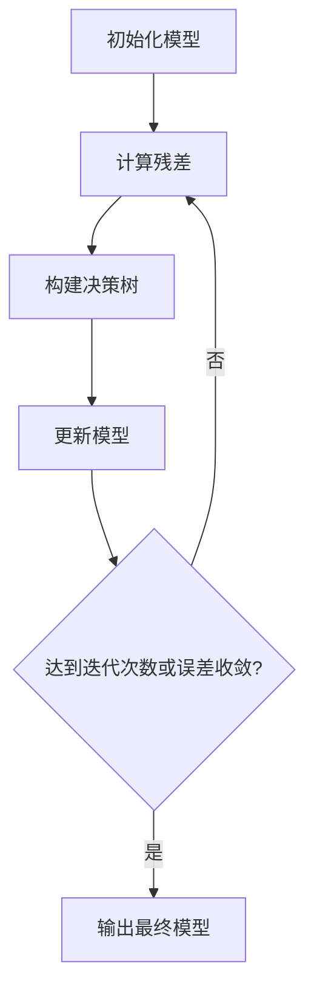

# 梯度提升决策树:Kaggle竞赛中的常胜将军

作者：禅与计算机程序设计艺术

## 1. 背景介绍

### 1.1 Kaggle竞赛的兴起

Kaggle作为全球知名的数据科学和机器学习竞赛平台，已经吸引了来自世界各地的优秀数据科学家和机器学习工程师。在这个平台上，参赛者通过解决各种实际问题，展示自己的技能，并争夺丰厚的奖金和名誉。Kaggle的竞赛涵盖了广泛的领域，包括金融、医疗、图像识别、自然语言处理等。

### 1.2 梯度提升决策树的崛起

在众多的机器学习算法中，梯度提升决策树（Gradient Boosting Decision Trees, GBDT）因其强大的性能和稳定的表现，成为了Kaggle竞赛中的常胜将军。GBDT是一种集成学习方法，通过构建一系列的决策树来提升模型的预测能力。其核心思想是通过逐步减少预测误差来优化模型。

### 1.3 文章目的

本文旨在深入探讨梯度提升决策树在Kaggle竞赛中的应用，详细介绍其核心概念、算法原理、数学模型、实际应用场景以及未来的发展趋势。通过这篇文章，读者将能够全面了解GBDT的工作原理，并掌握在实际项目中使用GBDT的技巧和最佳实践。

## 2. 核心概念与联系

### 2.1 决策树

决策树是一种常用的监督学习方法，其结构类似于一棵树，由节点和边组成。每个内部节点表示一个特征的测试，每个叶节点表示一个类别或一个数值。决策树通过递归地将数据分割成更小的子集来进行预测。

### 2.2 集成学习

集成学习通过结合多个基学习器来提升模型的性能。常见的集成学习方法包括Bagging（如随机森林）和Boosting（如梯度提升决策树）。集成学习的基本思想是通过组合多个弱学习器来构建一个强学习器，从而提高模型的泛化能力。

### 2.3 梯度提升

梯度提升是一种Boosting方法，其核心思想是通过逐步减少模型的预测误差来优化模型。每一步都会构建一个新的决策树，该决策树的目的是修正前一步的预测误差。通过不断迭代，梯度提升算法能够逐步逼近最优解。

### 2.4 梯度提升决策树

梯度提升决策树（GBDT）是梯度提升和决策树相结合的一种算法。GBDT通过构建一系列的决策树来提升模型的预测能力。每棵树都是在前一棵树的基础上构建的，其目的是修正前一棵树的预测误差。

## 3. 核心算法原理具体操作步骤

### 3.1 算法概述

梯度提升决策树的核心思想是通过逐步减少预测误差来优化模型。其基本步骤如下：

1. 初始化模型：使用一个简单的模型（如常数模型）进行初始化。
2. 迭代构建决策树：在每一步中，构建一棵新的决策树，该决策树的目的是修正前一步的预测误差。
3. 更新模型：将新的决策树加入到模型中。
4. 重复步骤2和3，直到达到预定的迭代次数或误差收敛。

### 3.2 算法步骤详解

#### 3.2.1 初始化模型

首先，我们使用一个简单的模型进行初始化。通常情况下，这个模型是一个常数模型，其值为训练数据目标值的均值。

$$
F_0(x) = \arg \min_{\gamma} \sum_{i=1}^n L(y_i, \gamma)
$$

#### 3.2.2 计算残差

在每一步迭代中，我们需要计算当前模型的残差，即预测值与真实值之间的差异。残差表示了当前模型的误差。

$$
r_{im} = -\left[ \frac{\partial L(y_i, F(x_i))}{\partial F(x_i)} \right]_{F(x) = F_{m-1}(x)}
$$

#### 3.2.3 构建决策树

使用残差作为新的目标值，构建一棵新的决策树。该决策树的目的是修正前一步的预测误差。

#### 3.2.4 更新模型

将新的决策树加入到模型中，更新模型的预测值。

$$
F_m(x) = F_{m-1}(x) + \nu h_m(x)
$$

其中，$\nu$ 是学习率，$h_m(x)$ 是新构建的决策树。

#### 3.2.5 重复迭代

重复步骤2到4，直到达到预定的迭代次数或误差收敛。

### 3.3 算法流程图

## 4. 数学模型和公式详细讲解举例说明

### 4.1 损失函数

在梯度提升决策树中，损失函数用于衡量模型预测值与真实值之间的差异。常见的损失函数包括均方误差（MSE）、绝对误差（MAE）和对数损失（Log Loss）等。

#### 4.1.1 均方误差

均方误差是最常用的损失函数之一，其定义为预测值与真实值之间差异的平方和的平均值。

$$
L(y, F(x)) = \frac{1}{n} \sum_{i=1}^n (y_i - F(x_i))^2
$$

#### 4.1.2 绝对误差

绝对误差是另一种常用的损失函数，其定义为预测值与真实值之间差异的绝对值和的平均值。

$$
L(y, F(x)) = \frac{1}{n} \sum_{i=1}^n |y_i - F(x_i)|
$$

#### 4.1.3 对数损失

对数损失常用于分类问题，其定义为预测值与真实值之间的对数差异。

$$
L(y, F(x)) = - \frac{1}{n} \sum_{i=1}^n [y_i \log(F(x_i)) + (1 - y_i) \log(1 - F(x_i))]
$$

### 4.2 梯度计算

在每一步迭代中，我们需要计算损失函数的梯度，以确定新的决策树的目标值。梯度表示了损失函数在当前模型参数下的变化率。

$$
g_i = \frac{\partial L(y_i, F(x_i))}{\partial F(x_i)}
$$

### 4.3 更新规则

在每一步迭代中，我们使用新的决策树来修正前一步的预测误差。更新规则如下：

$$
F_m(x) = F_{m-1}(x) + \nu h_m(x)
$$

其中，$\nu$ 是学习率，$h_m(x)$ 是新的决策树。

### 4.4 举例说明

假设我们有一个简单的回归问题，目标是预测某个变量的值。我们使用梯度提升决策树来解决这个问题。

#### 4.4.1 数据集

假设我们的数据集如下：

| 样本 | 特征$x$ | 目标值$y$ |
| ---- | ------- | --------- |
| 1    | 1.0     | 2.0       |
| 2    | 2.0     | 3.0       |
| 3    | 3.0     | 4.0       |
| 4    | 4.0     | 5.0       |

#### 4.4.2 初始化模型

首先，我们使用目标值的均值进行初始化：

$$
F_0(x) = \frac{1}{n} \sum_{i=1}^n y_i = 3.5
$$

#### 4.4.3 计算残差

计算当前模型的残差：

| 样本 | 真实值$y$ | 预测值$F_0(x)$ | 残差$r$ |
| ---- | --------- | -------------- | ------ |
| 1    | 2.0       | 3.5            | -1.5   |
| 2    | 3.0       | 3