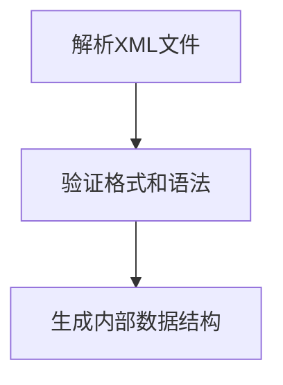
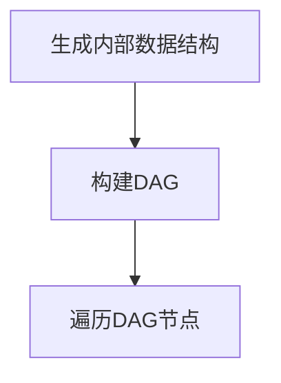
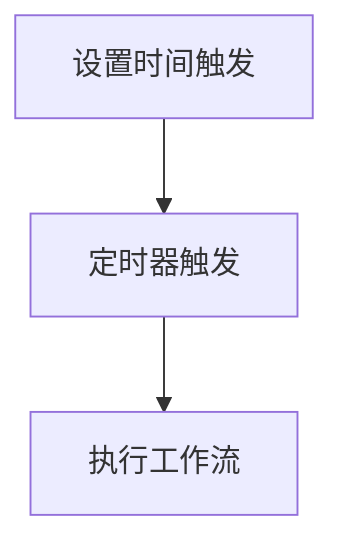
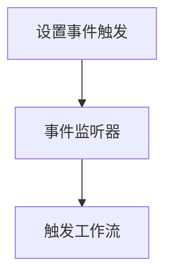
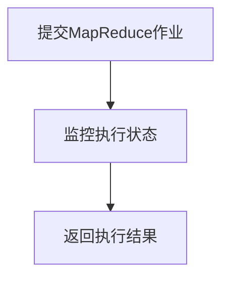
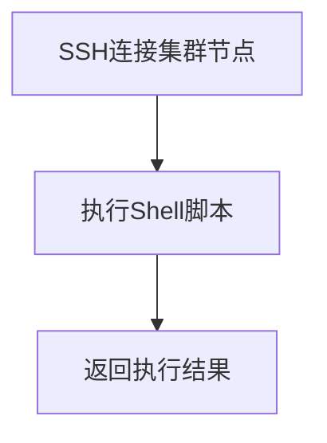
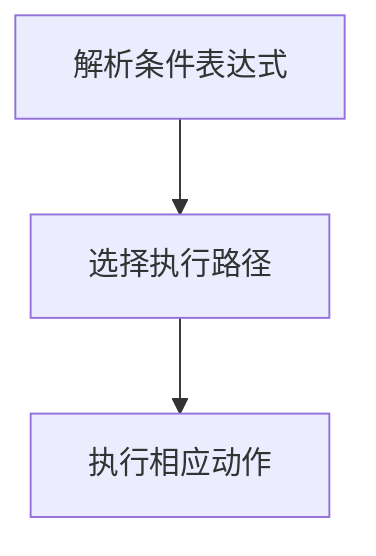
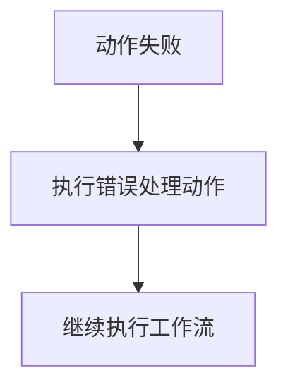

# 深入解读Oozie源代码设计思想

作者：禅与计算机程序设计艺术

## 1. 背景介绍

### 1.1 什么是Oozie？

Oozie是一个工作流调度系统，专门用于管理Apache Hadoop作业。它使得用户能够定义复杂的作业依赖关系，并按照预定的时间或事件触发这些作业。Oozie通过XML定义工作流和协调器应用程序，提供了一个灵活且强大的解决方案来管理数据管道。

### 1.2 Oozie的重要性

在大数据生态系统中，数据处理任务通常需要按序执行，并且依赖于前置任务的完成。Oozie的出现解决了这一复杂问题。通过Oozie，用户可以轻松地调度、监控和管理Hadoop作业，确保数据处理流程的顺畅运行。

### 1.3 文章目标

本文旨在深入解读Oozie的源代码设计思想，帮助读者理解其内部工作机制和架构设计。通过详细分析Oozie的核心概念、算法原理、数学模型和实际应用，读者将能够更好地掌握这一强大工具的使用方法，并在实际项目中加以应用。

## 2. 核心概念与联系

### 2.1 工作流（Workflow）

Oozie的工作流是由一系列动作（Action）和控制流节点（Control-Flow Node）组成的有向无环图（DAG）。工作流描述了Hadoop作业的执行顺序和依赖关系。

### 2.2 协调器（Coordinator）

Oozie的协调器用于基于时间或事件触发工作流。它可以定期调度工作流执行，确保数据处理任务按计划进行。

### 2.3 动作（Action）

动作是工作流中的基本执行单元。Oozie支持多种类型的动作，包括MapReduce、Pig、Hive、Shell等。每个动作都有其特定的执行逻辑和参数配置。

### 2.4 控制流节点（Control-Flow Node）

控制流节点用于定义工作流的执行逻辑，包括开始节点（Start）、结束节点（End）、决策节点（Decision）等。它们决定了工作流的执行路径和条件。

### 2.5 SLA监控

Oozie支持SLA（Service Level Agreement）监控，允许用户定义作业的执行时间和性能指标。一旦违反SLA，Oozie可以触发报警或采取相应措施。

## 3. 核心算法原理具体操作步骤

### 3.1 工作流解析与执行

#### 3.1.1 XML解析

Oozie的工作流定义采用XML格式。系统首先解析XML文件，生成内部的工作流表示。解析过程包括验证XML的格式和语法，并将其转换为Oozie内部的数据结构。



#### 3.1.2 DAG构建

解析后的工作流被表示为有向无环图（DAG）。Oozie通过遍历DAG节点，确定作业的执行顺序和依赖关系。



### 3.2 协调器调度

#### 3.2.1 时间触发

协调器可以基于时间调度工作流。例如，每天凌晨1点执行一次数据处理任务。Oozie通过定时器触发工作流的执行。



#### 3.2.2 事件触发

除了时间触发，Oozie还支持基于事件的触发机制。例如，当数据文件到达HDFS目录时，触发相应的工作流。



### 3.3 动作执行

#### 3.3.1 MapReduce动作

MapReduce动作是Oozie中最常用的动作之一。系统会提交MapReduce作业到Hadoop集群，并监控其执行状态。



#### 3.3.2 Shell动作

Shell动作允许用户在Hadoop集群上执行Shell命令。Oozie通过SSH协议与集群节点通信，执行用户定义的Shell脚本。



### 3.4 控制流节点处理

#### 3.4.1 决策节点

决策节点根据用户定义的条件，选择不同的执行路径。Oozie通过解析条件表达式，决定下一步执行的动作。



#### 3.4.2 错误处理

Oozie支持工作流中的错误处理机制。当某个动作失败时，系统可以执行预定义的错误处理动作，确保工作流的鲁棒性。



## 4. 数学模型和公式详细讲解举例说明

### 4.1 DAG模型

Oozie工作流的核心是有向无环图（DAG）。DAG是一种图结构，其中节点表示作业，边表示作业之间的依赖关系。DAG的数学定义如下：

$$
G = (V, E)
$$

其中，$V$ 是节点的集合，$E$ 是边的集合。对于任意一条边 $(u, v) \in E$，表示作业 $u$ 必须在作业 $v$ 之前完成。

### 4.2 时间复杂度分析

#### 4.2.1 工作流解析

工作流解析的时间复杂度主要取决于XML文件的大小。假设XML文件的大小为 $n$，则解析过程的时间复杂度为 $O(n)$。

#### 4.2.2 DAG遍历

DAG遍历的时间复杂度取决于节点和边的数量。假设DAG中有 $|V|$ 个节点和 $|E|$ 条边，则遍历过程的时间复杂度为 $O(|V| + |E|)$。

### 4.3 SLA监控模型

Oozie的SLA监控模型可以使用概率论和统计学方法进行分析。假设某作业的执行时间服从正态分布 $N(\mu, \sigma^2)$，则其违反SLA的概率可以通过计算累计分布函数（CDF）得到：

$$
P(T > SLA) = 1 - \Phi\left(\frac{SLA - \mu}{\sigma}\right)
$$

其中，$\Phi$ 是标准正态分布的累计分布函数。

## 5. 项目实践：代码实例和详细解释说明

### 5.1 创建工作流定义

以下是一个简单的Oozie工作流定义示例，包含一个MapReduce动作和一个Shell动作：

```xml
<workflow-app name="example-wf" xmlns="uri:oozie:workflow:0.5">
    <start to="mr-node"/>
    
    <action name="mr-node">
        <map-reduce>
            <job-tracker>${jobTracker}</job-tracker>
            <name-node>${nameNode}</name-node>
            <prepare>
                <delete path="${outputDir}"/>
            </prepare>
            <configuration>
                <property>
                    <name>mapred.input.dir</name>
                    <value>${inputDir}</value>
                </property>
                <property>
                    <name>mapred.output.dir</name>
                    <value>${outputDir}</value>
                </property>
            </configuration>
        </map-reduce>
        <ok to="shell-node"/>
        <error to="fail"/>
    </action>
    
    <action name="shell-node">
        <shell>
            <job-tracker>${jobTracker}</job-tracker>
            <name-node>${nameNode}</name-node>
            <exec>example.sh</exec>
            <argument>arg1</argument>
            <argument>arg2</argument>
        </shell>
        <ok to="end"/>
        <error to="fail"/>
    </action>
    
    <kill name="fail">
        <message>Workflow failed, error message[${wf:errorMessage(wf:lastErrorNode())}]</message>
    </kill>
    
    <end name="end"/>
</workflow-app>
```

### 5.2 提交和运行工作流

使用Oozie命