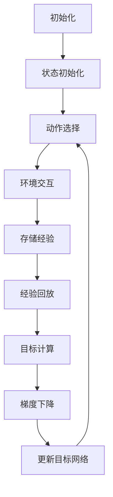

# 深度 Q-learning：在物联网系统中的应用

作者：禅与计算机程序设计艺术

## 1.背景介绍

### 1.1 物联网系统的崛起

物联网（IoT，Internet of Things）是一种通过互联网将物理设备连接起来的技术，使得这些设备能够相互通信、协作和共享数据。随着物联网技术的快速发展，越来越多的智能设备被应用于各个领域，如智能家居、智能城市、工业4.0、医疗健康等。物联网系统的核心在于其能够实时收集、处理和分析大量数据，从而实现自动化和智能化的决策。

### 1.2 深度学习与强化学习的融合

深度学习（Deep Learning）和强化学习（Reinforcement Learning）是人工智能领域的两大重要分支。深度学习通过神经网络模型实现对复杂数据的特征提取和模式识别，而强化学习则通过与环境的交互来学习最优策略。近年来，深度学习与强化学习的融合催生了深度 Q-learning（DQN，Deep Q-Network）等一系列先进算法，这些算法在诸如游戏、机器人控制等领域取得了显著成果。

### 1.3 深度 Q-learning 在物联网中的潜力

深度 Q-learning 将深度学习的强大特征提取能力与强化学习的策略优化能力相结合，使其在物联网系统中的应用具有巨大潜力。例如，在智能家居中，DQN 可以帮助设备根据用户行为模式进行自适应调整；在智能交通系统中，DQN 可以优化交通信号灯的控制策略，以减少交通拥堵。本文将深入探讨深度 Q-learning 的核心概念、算法原理、数学模型及其在物联网系统中的具体应用。

## 2.核心概念与联系

### 2.1 强化学习基础

#### 2.1.1 马尔可夫决策过程

强化学习的核心在于马尔可夫决策过程（MDP，Markov Decision Process），其定义包括以下五个要素：

- 状态集 $S$：系统可能处于的所有状态的集合。
- 动作集 $A$：在每个状态下，智能体可以采取的所有动作的集合。
- 状态转移概率 $P(s'|s, a)$：在状态 $s$ 下采取动作 $a$ 后转移到状态 $s'$ 的概率。
- 奖励函数 $R(s, a, s')$：在状态 $s$ 下采取动作 $a$ 后转移到状态 $s'$ 所获得的即时奖励。
- 折扣因子 $\gamma$：用于折扣未来奖励的衰减系数，范围在 $[0, 1]$ 之间。

#### 2.1.2 Q-learning 算法

Q-learning 是一种基于值迭代的强化学习算法，其核心思想是通过学习状态-动作值函数（Q 函数）来估计在给定状态下采取某一动作的长期回报。Q 函数的更新公式如下：

$$
Q(s, a) \leftarrow Q(s, a) + \alpha \left[ R(s, a, s') + \gamma \max_{a'} Q(s', a') - Q(s, a) \right]
$$

其中，$\alpha$ 是学习率，$s'$ 是动作 $a$ 在状态 $s$ 下的后继状态，$a'$ 是在状态 $s'$ 下采取的动作。

### 2.2 深度 Q-learning 的创新

#### 2.2.1 深度神经网络的引入

深度 Q-learning 将深度神经网络（DNN，Deep Neural Network）引入到传统的 Q-learning 中，用于逼近 Q 函数。DNN 的强大特征提取能力使其能够处理高维、复杂的状态空间，从而提升 Q-learning 的性能。

#### 2.2.2 经验回放与固定 Q 目标

为了提高训练的稳定性，DQN 引入了经验回放和固定 Q 目标两个关键技术。经验回放通过存储智能体与环境交互的经验样本，并在训练时从中随机抽取样本进行训练，从而打破样本之间的相关性。固定 Q 目标则通过引入一个目标网络来生成 Q 值的目标，使得 Q 函数的更新更加稳定。

### 2.3 物联网系统中的强化学习

#### 2.3.1 环境与智能体的定义

在物联网系统中，环境通常由一组互联的智能设备组成，而智能体则是负责决策和控制的核心模块。智能体通过与环境的交互，学习最优的控制策略，以实现系统的最优性能。

#### 2.3.2 状态、动作与奖励的设计

在物联网系统中，状态可以表示设备的运行状态、环境的感知信息等；动作则对应于设备的控制指令或系统的调度策略；奖励函数的设计需要综合考虑系统的性能指标，如能耗、延迟、用户满意度等。

## 3.核心算法原理具体操作步骤

### 3.1 深度 Q-learning 算法步骤

#### 3.1.1 初始化

1. 初始化经验回放池 $D$，大小为 $N$。
2. 初始化行为网络 $Q$，参数为 $\theta$。
3. 初始化目标网络 $Q'$，参数为 $\theta^- = \theta$。

#### 3.1.2 训练过程

1. **状态初始化**：从环境中获取初始状态 $s_0$。
2. **动作选择**：根据 $\epsilon$-贪婪策略选择动作 $a_t$：
   - 以概率 $\epsilon$ 随机选择动作。
   - 以概率 $1 - \epsilon$ 选择使 $Q(s_t, a_t; \theta)$ 最大化的动作。
3. **环境交互**：执行动作 $a_t$，观察奖励 $r_t$ 和下一个状态 $s_{t+1}$。
4. **存储经验**：将经验 $(s_t, a_t, r_t, s_{t+1})$ 存储到经验回放池 $D$ 中。
5. **经验回放**：从经验回放池 $D$ 中随机抽取一个小批量 $(s_j, a_j, r_j, s_{j+1})$。
6. **目标计算**：对于每个抽取的样本，计算目标 Q 值：
   $$
   y_j = \begin{cases} 
   r_j & \text{if } s_{j+1} \text{ is terminal} \\
   r_j + \gamma \max_{a'} Q'(s_{j+1}, a'; \theta^-) & \text{otherwise}
   \end{cases}
   $$
7. **梯度下降**：使用均方误差损失函数 $L(\theta)$ 对行为网络 $Q$ 进行梯度下降优化：
   $$
   L(\theta) = \mathbb{E}_{(s_j, a_j, r_j, s_{j+1}) \sim D} \left[ \left( y_j - Q(s_j, a_j; \theta) \right)^2 \right]
   $$
8. **更新目标网络**：每隔 $C$ 步，将目标网络参数 $\theta^-$ 更新为行为网络参数 $\theta$。

### 3.2 算法流程图

## 4.数学模型和公式详细讲解举例说明

### 4.1 Q-learning 更新公式

Q-learning 的核心在于通过迭代更新 Q 函数来逼近最优策略。其更新公式为：

$$
Q(s, a) \leftarrow Q(s, a) + \alpha \left[ R(s, a, s') + \gamma \max_{a'} Q(s', a') - Q(s, a) \right]
$$

#### 4.1.1 学习率 $\alpha$

学习率 $\alpha$ 控制了每次更新中新信息与旧信息的权重。较高的 $\alpha$ 值使得 Q 函数快速响应新信息，但可能导致不稳定；较低的 $\alpha$ 值则使得 Q 函数更新缓慢，但更加稳定。

#### 4.1.2 折扣因子 $\gamma$

折扣因子 $\gamma$ 决定了未来奖励的重要性。$\gamma$ 值越大，智能体越重视长期回报；$\gamma$ 值越小，智能体越重视即时回报。

### 4.2 深度 Q-learning 中的损失函数

在深度 Q-learning 中，使用均方误