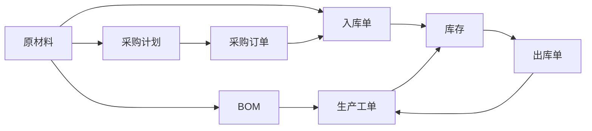

# 生产资料管理系统详细设计与具体代码实现

作者：禅与计算机程序设计艺术

## 1. 背景介绍

### 1.1 生产资料管理的重要性

在现代企业生产运营中,生产资料的管理至关重要。生产资料包括原材料、设备、工具等,是企业进行生产活动的物质基础。高效、规范、智能化的生产资料管理可以帮助企业:

- 降低生产成本
- 提高生产效率  
- 优化库存管理
- 加强质量控制
- 促进供应链协同

因此,开发一套功能完善、易用高效的生产资料管理系统,对于提升企业竞争力具有重要意义。

### 1.2 系统开发目标

本项目旨在开发一套生产资料管理系统,实现以下目标:

1. 建立生产资料的信息化管理,包括原材料、设备、工具等的基本信息录入、查询、修改等功能。

2. 实现生产资料的智能化调配与追踪,优化企业内部物流。

3. 基于大数据分析的生产资料需求预测与采购决策支持。

4. 打通上下游供应链,实现与供应商、客户的信息共享与业务协同。

5. 提供可视化的数据分析与报表功能,为管理决策提供数据支撑。

### 1.3 技术选型

为了实现上述目标,本系统将采用以下技术:

- 前端:Vue.js + Element UI
- 后端:Spring Boot + MySQL
- 大数据:Hadoop + Hive + Spark 
- 部署:Docker + K8s

选择这些技术的原因如下:

- Vue.js是当前流行的前端框架,简洁高效。
- Spring Boot是Java生态中最流行的Web框架,开发效率高。
- MySQL是使用最广泛的开源关系型数据库。
- Hadoop生态是大数据处理的事实标准。
- Docker和K8s是当前最流行的容器化部署方案。

## 2. 核心概念与关系

### 2.1 生产资料分类与编码

为了对生产资料进行系统管理,首先需要建立科学的分类与编码体系。我们可以从以下几个维度对生产资料进行分类:

1. 按照用途分类:原材料、设备、工具、备品备件等。
2. 按照属性分类:大类、小类、品牌、规格型号等。
3. 按照供应商分类:合格供应商、潜在供应商等。
4. 按照criticality分类:关键物料、非关键物料等。

在确定分类维度后,制定统一的编码规则,采用代码自动生成的方式,赋予每一种生产资料唯一的编码。以原材料为例,编码规则如下:

```
XX  -  XX  -  XXX  -  XXX
大类   小类   品牌   型号
```

编码具有唯一性、可扩展性,为后续管理提供坚实基础。

### 2.2 业务对象关系

生产资料管理系统中核心业务对象及其关系如下图所示:



原材料是生产的投入,经过采购、入库,进入企业库存。生产工单从库存中领料,完工后产品入库。原材料与BOM、采购计划、入库单等对象密切关联。通过数据库外键等方式,实现业务对象之间的关联与约束。

## 3. 核心算法原理与具体操作步骤

### 3.1 物料需求计划(MRP)

MRP是生产资料管理的核心算法之一,用于计算生产所需物料的数量和时间。其基本逻辑如下:

1. 从销售订单和预测得到成品的需求量和需求时间。
2. 根据BOM(Bill of Material),自顶向下逐层展开计算每个物料的毛需求量。
3. 考虑现有库存、在途库存、安全库存,计算物料的净需求量。
4. 根据采购和生产提前期,回溯计算每个物料的计划供应量和供应时间。

具体操作步骤如下:

```
输入:成品需求(数量+时间)、BOM、库存、提前期
输出:物料需求计划(物料、数量、时间)

For 每个成品需求
    展开BOM,生成物料毛需求
    For 每个物料
        毛需求 = ∑(成品数量 × 用量)
        净需求 = 毛需求 - 库存 - 在途
        If 净需求 > 0 Then
            计划供应量 = 净需求 + 安全库存
            计划供应时间 = 需求时间 - 提前期
        End If
    End For
End For
```

通过MRP运算,可以生成采购计划和生产计划,驱动企业运营。

### 3.2 经济订货批量(EOQ)

EOQ是优化采购批量、平衡订货和持有成本的经典算法。其核心思想是在采购费用和库存持有成本之间寻找平衡点。

$$
EOQ = \sqrt{\frac{2DS}{H}}
$$

其中:
- D:年需求量
- S:单次订货成本 
- H:单位库存持有成本

当订货量等于EOQ时,总成本最小。但EOQ模型基于一些假设,如需求恒定、无数量折扣等,在实践中需要进行修正。优化采购批量可以降低企业的库存成本。

## 4. 数学模型和公式详细讲解举例说明

### 4.1 ABC分类法

ABC分类法是一种基于帕累托法则的库存管理方法,将物料按照重要程度分为A、B、C三类,分别采取不同的管理策略。

1. 计算每种物料的年度发出金额,即年需求量乘以单价。
2. 按年度发出金额降序排列,计算累计百分比。
3. 将排名前70%的划分为A类,70-90%的划分为B类,90%以后的划分为C类。

以下是一个简单的例子:

| 物料编码 | 年需求量 | 单价 | 年度发出金额 | 累计百分比 | 分类 |
|---------|--------|------|------------|------------|------|
| M001    | 1000   | 100  | 100000     | 65%        |  A   |
| M002    | 500    | 50   | 25000      | 82%        |  B   |
| M003    | 2000   | 10   | 20000      | 95%        |  C   |
| M004    | 100    | 80   | 8000       | 100%       |  C   |

对于A类物料,应该重点管理,严格控制库存水平;B类物料次之;C类物料可以简化管理,提高库存水平。

### 4.2 安全库存计算

安全库存是为了应对需求和供应的不确定性,而准备的额外库存。合理的安全库存水平可以提高供应链的抗风险能力。

一种常用的安全库存计算公式如下:

$$
SS = Z × σ × \sqrt{LT}
$$

其中:
- Z:服务水平对应的标准差倍数(如95%服务水平对应Z=1.65)
- σ:需求标准差  
- LT:提前期(单位:天)

例如,物料M001的日需求量服从正态分布,均值为100,标准差为20,提前期为3天,目标服务水平为98%,则其安全库存为:

$$
SS = 2.05 × 20 × \sqrt{3} = 71(件)
$$

通过合理设置安全库存,可以提高供应链的服务水平,减少脱销的风险。

## 5. 项目实践:代码实例和详细解释说明

下面以原材料的CRUD操作为例,展示项目中的部分代码实现。

### 5.1 后端接口

使用Spring Boot实现原材料的增删改查接口:

```java
@RestController
@RequestMapping("/material")
public class MaterialController {

    @Autowired
    private MaterialService materialService;

    @PostMapping
    public Result add(@RequestBody Material material) {
        materialService.save(material);
        return Result.success();
    }

    @DeleteMapping("/{id}")
    public Result delete(@PathVariable Long id) {
        materialService.removeById(id);
        return Result.success();
    }

    @PutMapping
    public Result update(@RequestBody Material material) {
        materialService.updateById(material);
        return Result.success();
    }

    @GetMapping("/{id}") 
    public Result get(@PathVariable Long id) {
        Material material = materialService.getById(id);
        return Result.success(material);
    }

    @GetMapping
    public Result list() {
        List<Material> list = materialService.list();
        return Result.success(list);
    }
}
```

这里使用了Restful风格的API设计,通过不同的HTTP方法来区分操作类型。`@RequestBody`用于解析请求体中的JSON数据,`@PathVariable`用于获取路径参数。

### 5.2 前端页面

使用Vue.js和Element UI实现原材料管理的前端页面:

```vue
<template>
  <div>
    <el-table :data="tableData">
      <el-table-column prop="id" label="编号"></el-table-column>
      <el-table-column prop="name" label="名称"></el-table-column>
      <el-table-column prop="spec" label="规格"></el-table-column>
      <el-table-column prop="unitPrice" label="单价"></el-table-column>
      <el-table-column label="操作" width="180">
        <template v-slot="scope">
          <el-button @click="handleEdit(scope.row)">编辑</el-button>
          <el-button @click="handleDelete(scope.row.id)" type="danger">删除</el-button>  
        </template>
      </el-table-column>
    </el-table>
    
    <el-dialog v-model="dialogVisible" :title="dialogType==='edit'?'编辑物料':'新增物料'">
      <el-form :model="material" label-width="80px">
        <el-form-item label="名称">
          <el-input v-model="material.name"></el-input>
        </el-form-item>
        <el-form-item label="规格">
          <el-input v-model="material.spec"></el-input>
        </el-form-item>
        <el-form-item label="单价">
          <el-input v-model="material.unitPrice"></el-input>
        </el-form-item>
      </el-form>
      <template #footer>
        <el-button @click="dialogVisible = false">取消</el-button>
        <el-button type="primary" @click="handleSubmit">确认</el-button>
      </template>
    </el-dialog>
    
  </div>
</template>

<script setup>
import { ref } from 'vue'
import axios from 'axios'
import { ElMessage, ElMessageBox } from 'element-plus'

const tableData = ref([])
const dialogVisible = ref(false) 
const dialogType = ref('new')
const material = ref({
  name: '',
  spec: '',
  unitPrice: ''
})

const getMaterialList = async () => {
  const res = await axios.get('/material')
  tableData.value = res.data.data
}

const handleEdit = (row) => {
  dialogVisible.value = true
  dialogType.value = 'edit'
  material.value = {...row}
}

const handleDelete = async (id) => {
  await ElMessageBox.confirm('确认删除该物料吗?')
  await axios.delete(`/material/${id}`)
  ElMessage.success('删除成功')
  getMaterialList()
}

const handleSubmit = async () => {
  if(dialogType.value === 'new'){
    await axios.post('/material', material.value)
  }else{
    await axios.put('/material', material.value)
  }
  dialogVisible.value = false
  ElMessage.success('操作成功')
  getMaterialList()
}

getMaterialList()
</script>
```

这里使用了Vue 3的Composition API语法,用`<script setup>`来简化代码。通过`ref`来声明响应式变量,用`axios`来发送HTTP请求,调用后端接口完成CRUD操作。

以上是一个简单的前后端分离的CRUD示例,通过这种方式,可以快速实现生产资料管理系统的基本功能。在实际项目中,还需要考虑更多的业务逻辑、异常处理、权限控制等因素。

## 6. 实际应用场景

生产资料管理系统在制造业企业中应用广泛,以下是一些典型的应用场景:

### 6.1 原材料采购与入库

- 根据生产计划和库存情况,自动生成原材料采购计划。
- 通过与供应商的信息系统集成,实现采购订单的自动下达。
- 原材料到货后,通过条码、RFID等技术自动登记入库,更新库存。
- 通过系统追踪原材料的质检、上架、发放等状态。

### 6.2 生产领料与补料

- 根据生产工单的投料清单,自动生