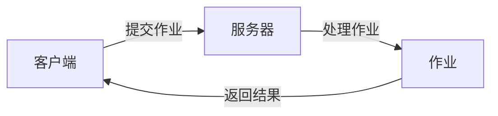

## 1.背景介绍

在当今的数字化时代，网络远程作业处理系统已经成为了一种必不可少的工具。无论是教育、企业还是政府，都在积极地利用这种系统进行操作和管理。然而，尽管网络远程作业处理系统的使用已经非常广泛，但是它的设计和实现过程却鲜为人知。因此，本文将详细介绍网络远程作业处理系统的设计与具体代码实现。

## 2.核心概念与联系

网络远程作业处理系统是一种可以远程处理作业的系统，它主要包括三个核心概念：客户端、服务器和作业。客户端是用户进行操作的界面，服务器是处理作业的主体，作业则是需要处理的任务。这三个核心概念之间的关系可以用以下的Mermaid流程图进行表示：

## 3.核心算法原理具体操作步骤

网络远程作业处理系统的核心算法原理主要包括以下几个步骤：

1. 客户端提交作业：用户通过客户端提交需要处理的作业。
2. 服务器接收作业：服务器接收到客户端提交的作业后，进行相应的处理。
3. 作业处理：服务器根据作业的类型和内容，调用相应的算法进行处理。
4. 返回结果：处理完成后，服务器将结果返回给客户端。

## 4.数学模型和公式详细讲解举例说明

在网络远程作业处理系统中，我们可以使用队列理论来模拟和分析系统的性能。假设我们有一个服务器和一个无限大的队列，那么，到达率（$\lambda$）和服务率（$\mu$）的关系可以用以下的公式来表示：

$$\rho = \frac{\lambda}{\mu}$$

其中，$\rho$是系统的利用率，表示系统被占用的时间比例。如果$\rho$的值接近1，那么说明系统的负载非常重，可能会导致作业的处理时间增加。

## 5.项目实践：代码实例和详