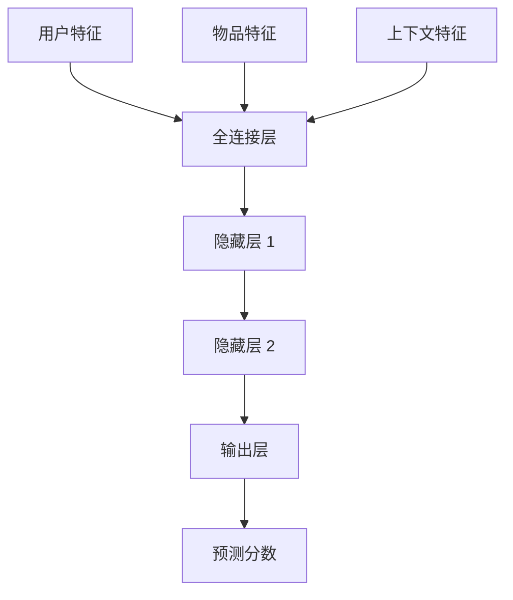
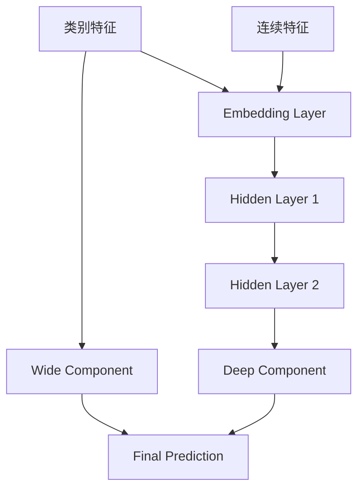
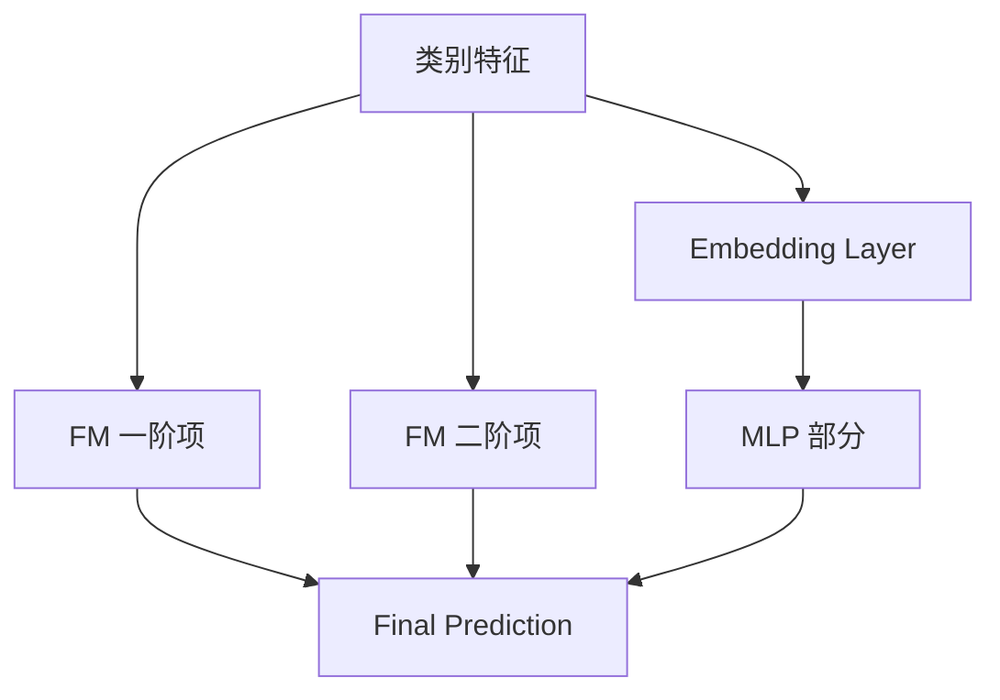
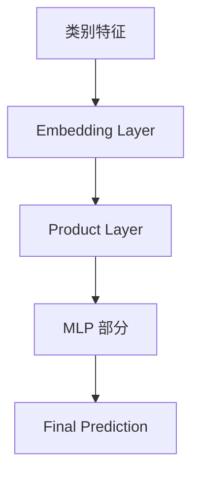

# 自动化推荐系统:从矩阵分解到深度学习

作者：禅与计算机程序设计艺术

## 1. 背景介绍
### 1.1 推荐系统的重要性
在当今信息爆炸的时代,个性化推荐系统已成为各大互联网公司不可或缺的关键技术之一。它能够从海量信息中智能地为用户推荐感兴趣的内容,极大提升了用户体验和平台粘性。从电商网站的商品推荐,到视频网站的视频推荐,再到新闻 App 的文章推荐,个性化推荐无处不在。
### 1.2 推荐系统的发展历程
推荐系统技术经历了从简单到复杂,从浅层到深层的发展过程。早期主要采用基于内容或协同过滤的浅层推荐方法,近年来则引入了深度学习技术,极大提升了推荐效果。本文将全面回顾推荐系统技术的发展历程,并着重介绍深度学习推荐系统的原理和实践。

## 2. 核心概念与联系
### 2.1 推荐系统的基本架构
典型的推荐系统主要包含以下几个模块:
- 用户画像:通过分析用户的注册信息、历史行为等构建用户特征向量。
- 物品画像:对推荐候选物品(如商品、新闻、视频等)提取结构化特征。
- 召回:从海量物品库中快速筛选出一批候选物品。常见方法有基于协同过滤的召回,基于内容相似度的召回等。
- 排序:对召回的候选集进行精排,生成个性化的推荐列表。常见方法有逻辑回归(LR)、因子分解机(FFM)、深度学习模型等。
### 2.2 常见的推荐场景及任务
根据是否个性化,推荐任务可分为个性化推荐和非个性化推荐:
- 个性化推荐旨在根据用户的个性化特征,为其量身推荐感兴趣的内容。如电商平台"猜你喜欢"。
- 非个性化推荐对所有用户推荐相同的热门内容。如热搜榜单、热门商品等。

根据是否考虑上下文信息,又可分为上下文感知推荐(Context-aware Recommendation)和传统推荐:
- 上下文感知推荐会考虑用户的实时上下文信息,如地理位置、设备、时间等,使推荐更加精准。
- 传统推荐主要关注用户和物品两个维度的建模。

### 2.3 深度学习在推荐系统中的应用价值
相比传统的推荐方法,深度学习推荐系统的优势主要体现在:
- 深度学习强大的特征表示和非线性建模能力,可以学习到高质量的用户、物品向量表示。
- 深度学习可以端到端地训练,自动地从原始特征学习到最终的预测结果。
- 深度学习可以灵活地建模各种辅助信息,如文本、图像、视频等。
- 深度学习可以学习任意的非线性函数,充分利用大规模的训练数据。

## 3. 核心算法原理具体操作步骤
### 3.1 矩阵分解算法
矩阵分解是传统推荐系统的经典算法,其核心思想是把用户-物品交互矩阵分解为两个低维矩阵的乘积,从而得到用户和物品的隐向量表示。
#### 3.1.1 SVD 分解
单值分解(Singular Value Decomposition,简称 SVD)可将用户-物品评分矩阵 R 分解为三个矩阵:
$$R \approx U\Sigma V^T$$
其中,U 和 V 分别表示用户和物品的隐语义向量,维度为 K,K 远小于用户和物品数。Σ 为对角矩阵,对角线上的元素是奇异值。

SVD 分解的步骤如下:
1. 构建用户-物品评分矩阵 R
2. 对 R 做 mean-centering 处理,减去每一行的均值 
3. 对 R 做 SVD 分解,得到 U、Σ、V 三个矩阵
4. 取 U 和 V 的前 K 列作为用户和物品的 K 维隐向量
5. 用 $\hat{r}_{ui} = \mathbf{p}_u^T\mathbf{q}_i$ 估计用户 u 对物品 i 的评分

#### 3.1.2 PMF 概率矩阵分解
概率矩阵分解(Probabilistic Matrix Factorization,简称 PMF)从概率的角度重新诠释了矩阵分解。其核心思想是把观测到的评分看作是高斯分布的,用户和物品的隐向量服从球型高斯先验分布。通过最大后验估计可以求解出隐向量。

PMF 的生成过程如下:
1. 对每个用户 u,从先验分布 $N(0,\sigma_U^2\mathbf{I})$ 中采样隐向量 $\mathbf{p}_u$  
2. 对每个物品 i,从先验分布 $N(0,\sigma_V^2\mathbf{I})$ 中采样隐向量 $\mathbf{q}_i$
3. 对每个观测评分 $r_{ui}$,从条件分布 $N(\mathbf{p}_u^T\mathbf{q}_i,\sigma^2)$ 中采样

PMF 通过最小化以下损失函数求解隐向量:
$$L = \sum_{(u,i) \in K} (r_{ui} - \mathbf{p}_u^T\mathbf{q}_i)^2 + \lambda_U\sum_u ||\mathbf{p}_u||^2 + \lambda_V\sum_i ||\mathbf{q}_i||^2$$

其中第一项是评分的重构误差,后两项是隐向量的 L2 正则化。

### 3.2 因子分解机 
因子分解机(Factorization Machines,简称 FM)是经典的特征交叉模型,它可以高效地对一阶和二阶特征交叉进行建模。

给定 n 维特征向量 $\mathbf{x} \in R^n$,FM 的二阶项如下所示:
$$\hat{y}_{FM} = \underbrace{w_0}_{\text{global bias}} + \underbrace{\sum_{i=1}^n w_ix_i}_{\text{一阶项}} + \underbrace{\sum_{i=1}^n\sum_{j=i+1}^n \langle \mathbf{v}_i, \mathbf{v}_j \rangle x_ix_j}_{\text{二阶项}}$$  

其中,$\mathbf{V} \in R^{n \times k}$ 为隐向量矩阵,k 是隐向量的维度。$\langle \mathbf{v}_i, \mathbf{v}_j \rangle$ 表示第 i 维和第 j 维特征对应隐向量的内积,用来刻画它们之间的交叉关系。

FM 的二次项可通过化简,在线性时间内计算:
$$\sum_{i=1}^n\sum_{j=i+1}^n \langle \mathbf{v}_i, \mathbf{v}_j \rangle x_ix_j = \frac{1}{2}\sum_{f=1}^k \big((\sum_{i=1}^n v_{i,f}x_i)^2 - \sum_{i=1}^n v_{i,f}^2x_i^2\big)$$

其中 $v_{i,f}$表示第 i 维特征第 f 个因子。这种化简使得 FM 的计算复杂度从 $O(kn^2)$ 降到了 $O(kn)$。

### 3.3 深度学习模型 
近年来,深度学习凭借其强大的表示能力,在个性化推荐领域取得了巨大成功。以下简要介绍几个代表性的模型结构。
#### 3.3.1 MLP
多层感知机(Multilayer Perceptron,简称 MLP)作为最基础的前馈神经网络,曾在工业界的个性化推荐算法大赛中屡创佳绩。其结构如下:

MLP 可以灵活地接入各类特征,包括用户的人口统计学特征、历史行为特征,物品的元数据,以及一些上下文特征如地理位置、设备信息等。它的优势在于可以自动地学习高阶的特征交叉和非线性变换。
#### 3.3.2 Wide & Deep 
Wide & Deep 模型由 Google 在 2016 年提出,是工业界应用非常广泛的模型结构。顾名思义,它由 Wide 部分和 Deep 部分组成:
- Wide 部分是一个广义线性模型,可以记忆稀疏的交叉特征
- Deep 部分是一个 MLP 结构,用于学习隐含的高阶特征交叉

这两部分的输出会被拼接,再通过 Sigmoid 函数输出最终的 CTR 预估值。

Wide & Deep 的优势在于综合了记忆和泛化,对于 CTR 预估等工业界常见的稀疏场景有很好的效果。

#### 3.3.3 DeepFM
DeepFM 由华为诺亚方舟实验室在 2017 年提出,是对因子分解机的深度学习改进。它明确地把 FM 的一阶项和二阶项拆分出来,再接入深度神经网络学习高阶特征交叉:

FM 部分和 MLP 部分共享同一个 Embedding 层。模型总体的输出为:
$$\hat{y} = \text{sigmoid}(y_{FM} + y_{DNN})$$
其中 $y_{FM}$ 是 FM 的一阶项与二阶项之和,$y_{DNN}$ 是 MLP 的输出。

DeepFM 巧妙地继承了因子分解机的优点,又引入深度学习对高阶特征交叉建模,是一个有力的 CTR 预估模型。它的另一个优势在于端到端训练,没有任何特征工程。

#### 3.3.4 PNN
Product-based Neural Network(简称 PNN)是南京大学在 2016 年提出的一个深度学习推荐模型。受 FM 启发,它显式地对 Embedding 层的向量做了特征交叉:

PNN 的 Product 层定义了三种向量交叉操作:
1. Inner Product:对两个 Embedding 向量做内积,$\langle \mathbf{v}_i, \mathbf{v}_j \rangle$ 
2. Outer Product:对两个 Embedding 向量做外积,得到一个二维矩阵
3. Concatenation:把两个 Embedding 向量拼接成更长的向量 

这些交叉特征再输入到后面的 MLP 中,学习更高阶的特征交叉。

PNN 的贡献在于用 Product 层替代了 Wide & Deep 中 Wide 部分,使模型可以端到端训练。但它需要大量的内存来存储 Product 层,尤其是 Outer Product 操作。

## 4. 数学模型和公式详细讲解举例说明
给定用户集合 $U={u_1,u_2,...,u_M}$ 和物品集合 $I={i_1,i_2,...,i_N}$,令 $r_{ui}$ 表示用户 u 对物品 i 的评分。评分矩阵 R 可表示为:
$$
R = 
\begin{bmatrix} 
r_{11} & r_{12} & \dots & r_{1N} \\
r_{21} & r_{22} & \dots & r_{2N} \\
\vdots & \vdots & \ddots & \vdots \\
r_{M1} & r_{M2} & \dots & r_{MN}
\end{bmatrix}
$$

推荐系统的目标是估计所有未知评分 $\hat{