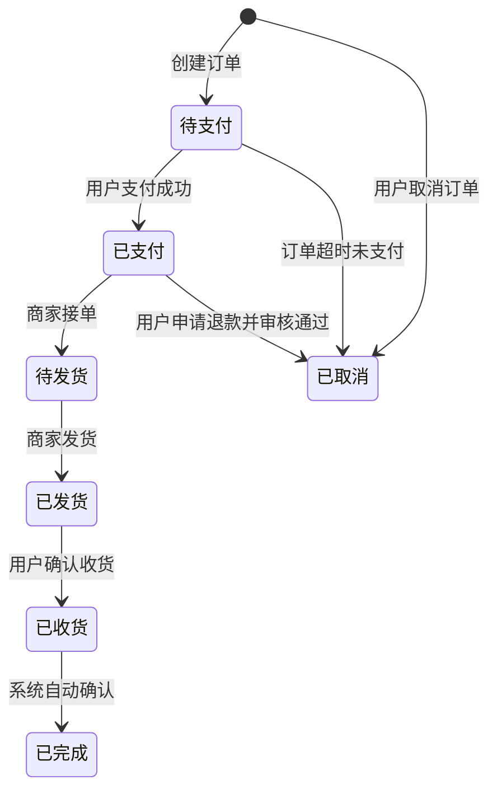

# 订单状态机：精细化订单状态管理

作者：禅与计算机程序设计艺术

## 1. 背景介绍

### 1.1 电商业务的快速发展与订单状态管理挑战

近年来，随着电子商务的蓬勃发展，线上交易规模急剧扩大，订单量呈现爆炸式增长。传统的订单管理系统面临着前所未有的挑战，主要体现在以下几个方面：

* **订单状态复杂多样化**: 随着电商平台业务模式的不断创新，订单状态不再局限于简单的“已下单”、“已支付”、“已发货”等，而是衍生出诸如“预售”、“拼团”、“秒杀”等多种复杂状态，以及“部分发货”、“退款中”、“售后处理”等异常状态，这对订单状态的管理提出了更高的要求。
* **订单流程长且环节多**:  一个完整的订单流程通常涉及用户下单、支付、商家接单、仓库发货、物流配送、用户确认收货、售后服务等多个环节，每个环节都可能出现各种异常情况，需要进行相应的处理，这使得订单状态的流转变得异常复杂。
* **实时性要求高**:  在电商平台激烈的竞争环境下，用户对于订单状态的实时性和准确性要求越来越高，希望能够随时随地跟踪订单的最新状态，以及时了解订单的进展情况。

### 1.2 传统订单状态管理方式的局限性

传统的订单状态管理方式主要依靠数据库表字段或硬编码来实现，存在以下几个方面的局限性：

* **代码冗余，维护困难**:  当订单状态较多时，需要在代码中编写大量的 if-else 语句来判断状态，导致代码冗长且难以维护。
* **可扩展性差**: 当需要新增或修改订单状态时，需要修改代码并重新部署，难以适应业务的快速变化。
* **状态流转逻辑不清晰**:  使用数据库表字段或硬编码的方式难以清晰地表达订单状态之间的流转关系，不利于开发人员理解和维护。

### 1.3 订单状态机的优势

为了解决上述问题，引入订单状态机来管理订单状态成为一种必然趋势。订单状态机是一种软件设计模式，它可以将复杂的订单状态流转逻辑以图形化或代码化的方式清晰地表达出来，并提供状态转移的触发条件和处理逻辑，具有以下优势：

* **提高代码可读性和可维护性**:  订单状态机将状态流转逻辑从业务代码中分离出来，使得代码更加简洁易懂，易于维护。
* **增强系统可扩展性**: 当需要新增或修改订单状态时，只需要修改状态机配置，无需修改业务代码，提高了系统的可扩展性。
* **提高系统稳定性和可靠性**:  订单状态机可以确保订单状态的流转符合预定的规则，避免出现状态混乱或异常，提高了系统的稳定性和可靠性。

## 2. 核心概念与联系

### 2.1 状态机

状态机是一种抽象的数学模型，用于描述一个系统在不同状态之间进行转换的行为。它由以下几个核心要素组成：

* **状态（State）**:  系统在某一时刻所处的状况，例如订单的“待支付”、“已支付”、“已发货”等状态。
* **事件（Event）**:  触发状态转换的条件，例如用户支付成功、商家发货、用户确认收货等事件。
* **转换（Transition）**:  状态之间的转移关系，例如用户支付成功后，订单状态从“待支付”转换为“已支付”。
* **动作（Action）**:  状态转换时执行的操作，例如发送通知、更新数据库等操作。

### 2.2 订单状态机

订单状态机是状态机模式在订单管理系统中的具体应用，它将订单的不同状态以及状态之间的转换关系抽象成一个状态机模型，并定义了状态转换的触发条件和处理逻辑。

### 2.3 状态机图

状态机图是一种图形化的方式来描述状态机模型，它使用圆圈表示状态，使用箭头表示状态之间的转换关系。



## 3. 核心算法原理具体操作步骤

### 3.1 状态机设计

设计订单状态机的第一步是确定订单的所有可能状态以及状态之间的转换关系。这需要根据具体的业务需求进行分析，例如：

* 订单创建后，初始状态为“待支付”。
* 用户支付成功后，订单状态转换为“已支付”。
* 商家接单后，订单状态转换为“待发货”。
* 商家发货后，订单状态转换为“已发货”。
* 用户确认收货后，订单状态转换为“已完成”。

同时，还需要考虑各种异常情况，例如：

* 用户可以取消订单，订单状态转换为“已取消”。
* 订单超时未支付，订单状态转换为“已取消”。
* 用户可以申请退款，订单状态转换为“退款中”。
* 退款申请审核通过后，订单状态转换为“已取消”。

### 3.2 状态转换条件

确定状态转换条件是设计状态机的关键步骤之一。状态转换条件可以是简单的条件判断，也可以是复杂的业务逻辑。例如：

* 用户支付成功是订单状态从“待支付”转换为“已支付”的条件。
* 商家发货是订单状态从“待发货”转换为“已发货”的条件。
* 用户确认收货是订单状态从“已发货”转换为“已完成”的条件。

### 3.3 状态转换动作

状态转换动作是指状态转换时需要执行的操作，例如：

* 订单状态转换为“已支付”后，需要发送支付成功通知给用户。
* 订单状态转换为“已发货”后，需要更新订单物流信息。
* 订单状态转换为“已完成”后，需要更新商品库存信息。

### 3.4 代码实现

可以使用多种编程语言和框架来实现订单状态机，例如 Java、Python、Spring Statemachine 等。

以下是一个使用 Spring Statemachine 实现订单状态机的示例代码：

```java
@Configuration
@EnableStateMachine
public class OrderStateMachineConfig extends EnumStateMachineConfigurerAdapter<OrderStatus, OrderEvent> {

    @Override
    public void configure(StateMachineConfigurationConfigurer<OrderStatus, OrderEvent> config)
            throws Exception {
        config
                .withConfiguration()
                .autoStartup(true);
    }

    @Override
    public void configure(StateMachineStateConfigurer<OrderStatus, OrderEvent> states)
            throws Exception {
        states
                .withStates()
                .initial(OrderStatus.WAIT_PAYMENT)
                .states(EnumSet.allOf(OrderStatus.class));
    }

    @Override
    public void configure(StateMachineTransitionConfigurer<OrderStatus, OrderEvent> transitions)
            throws Exception {
        transitions
                .withExternal()
                .source(OrderStatus.WAIT_PAYMENT).target(OrderStatus.PAID).event(OrderEvent.PAY)
                .and()
                .withExternal()
                .source(OrderStatus.PAID).target(OrderStatus.DELIVERING).event(OrderEvent.DELIVER)
                .and()
                .withExternal()
                .source(OrderStatus.DELIVERING).target(OrderStatus.RECEIVED).event(OrderEvent.RECEIVE)
                .and()
                .withExternal()
                .source(OrderStatus.RECEIVED).target(OrderStatus.FINISHED).event(OrderEvent.FINISH);
    }
}
```

## 4. 数学模型和公式详细讲解举例说明

### 4.1 有限状态机

订单状态机是一种有限状态机（Finite State Machine，FSM），它可以用数学模型来描述。一个有限状态机可以表示为一个五元组：

```
FSM = (Q, Σ, δ, q0, F)
```

其中：

* Q 是状态的有限集合。
* Σ 是输入符号的有限集合。
* δ 是状态转移函数，它定义了在当前状态下，接收到某个输入符号后，状态机的下一个状态。
* q0 是初始状态。
* F 是终止状态的集合。

### 4.2 订单状态机的数学模型

以电商订单状态机为例，可以用以下数学模型来描述：

```
Q = {待支付, 已支付, 待发货, 已发货, 已收货, 已完成, 已取消}
Σ = {创建订单, 用户支付成功, 商家接单, 商家发货, 用户确认收货, 用户取消订单, 订单超时未支付}
δ = {
    (待支付, 创建订单) -> 待支付,
    (待支付, 用户支付成功) -> 已支付,
    (已支付, 商家接单) -> 待发货,
    (待发货, 商家发货) -> 已发货,
    (已发货, 用户确认收货) -> 已收货,
    (已收货, 系统自动确认) -> 已完成,
    (待支付, 用户取消订单) -> 已取消,
    (待支付, 订单超时未支付) -> 已取消,
    (已支付, 用户申请退款并审核通过) -> 已取消
}
q0 = 待支付
F = {已完成, 已取消}
```

### 4.3 状态转移图

状态转移图是有限状态机的图形化表示，它使用圆圈表示状态，使用箭头表示状态之间的转换关系。


## 5. 项目实践：代码实例和详细解释说明

### 5.1 项目背景

假设我们需要开发一个电商平台的订单管理系统，需要实现订单状态的精细化管理。

### 5.2 技术选型

* **编程语言**: Java
* **状态机框架**: Spring Statemachine

### 5.3 代码实现

#### 5.3.1 订单状态枚举类

```java
public enum OrderStatus {
    WAIT_PAYMENT, // 待支付
    PAID, // 已支付
    DELIVERING, // 待发货
    DELIVERED, // 已发货
    RECEIVED, // 已收货
    FINISHED, // 已完成
    CANCELLED // 已取消
}
```

#### 5.3.2 订单事件枚举类

```java
public enum OrderEvent {
    CREATE, // 创建订单
    PAY, // 支付
    DELIVER, // 发货
    RECEIVE, // 收货
    FINISH, // 完成
    CANCEL // 取消
}
```

#### 5.3.3 订单状态机配置类

```java
@Configuration
@EnableStateMachine
public class OrderStateMachineConfig extends EnumStateMachineConfigurerAdapter<OrderStatus, OrderEvent> {

    @Override
    public void configure(StateMachineConfigurationConfigurer<OrderStatus, OrderEvent> config)
            throws Exception {
        config
                .withConfiguration()
                .autoStartup(true);
    }

    @Override
    public void configure(StateMachineStateConfigurer<OrderStatus, OrderEvent> states)
            throws Exception {
        states
                .withStates()
                .initial(OrderStatus.WAIT_PAYMENT)
                .states(EnumSet.allOf(OrderStatus.class));
    }

    @Override
    public void configure(StateMachineTransitionConfigurer<OrderStatus, OrderEvent> transitions)
            throws Exception {
        transitions
                .withExternal()
                .source(OrderStatus.WAIT_PAYMENT).target(OrderStatus.PAID).event(OrderEvent.PAY)
                .and()
                .withExternal()
                .source(OrderStatus.PAID).target(OrderStatus.DELIVERING).event(OrderEvent.DELIVER)
                .and()
                .withExternal()
                .source(OrderStatus.DELIVERING).target(OrderStatus.DELIVERED).event(OrderEvent.DELIVER)
                .and()
                .withExternal()
                .source(OrderStatus.DELIVERED).target(OrderStatus.RECEIVED).event(OrderEvent.RECEIVE)
                .and()
                .withExternal()
                .source(OrderStatus.RECEIVED).target(OrderStatus.FINISHED).event(OrderEvent.FINISH)
                .and()
                .withExternal()
                .source(OrderStatus.WAIT_PAYMENT).target(OrderStatus.CANCELLED).event(OrderEvent.CANCEL)
                .and()
                .withExternal()
                .source(OrderStatus.PAID).target(OrderStatus.CANCELLED).event(OrderEvent.CANCEL);
    }
}
```

#### 5.3.4 订单服务类

```java
@Service
public class OrderService {

    @Autowired
    private StateMachine<OrderStatus, OrderEvent> stateMachine;

    public void createOrder(Order order) {
        // 创建订单逻辑
        stateMachine.start();
    }

    public void payOrder(Long orderId) {
        // 支付订单逻辑
        stateMachine.sendEvent(MessageBuilder.withPayload(OrderEvent.PAY).setHeader("orderId", orderId).build());
    }

    public void deliverOrder(Long orderId) {
        // 发货订单逻辑
        stateMachine.sendEvent(MessageBuilder.withPayload(OrderEvent.DELIVER).setHeader("orderId", orderId).build());
    }

    public void receiveOrder(Long orderId) {
        // 确认收货逻辑
        stateMachine.sendEvent(MessageBuilder.withPayload(OrderEvent.RECEIVE).setHeader("orderId", orderId).build());
    }

    public void finishOrder(Long orderId) {
        // 完成订单逻辑
        stateMachine.sendEvent(MessageBuilder.withPayload(OrderEvent.FINISH).setHeader("orderId", orderId).build());
    }

    public void cancelOrder(Long orderId) {
        // 取消订单逻辑
        stateMachine.sendEvent(MessageBuilder.withPayload(OrderEvent.CANCEL).setHeader("orderId", orderId).build());
    }
}
```

### 5.4 代码解释

* `OrderStatus` 枚举类定义了订单的所有状态。
* `OrderEvent` 枚举类定义了所有可以触发订单状态转换的事件。
* `OrderStateMachineConfig` 类是状态机配置类，它使用 `@EnableStateMachine` 注解启用状态机功能，并使用 `EnumStateMachineConfigurerAdapter` 来简化配置。
    * `configure(StateMachineConfigurationConfigurer<OrderStatus, OrderEvent> config)` 方法用于配置状态机的基本信息，例如自动启动。
    * `configure(StateMachineStateConfigurer<OrderStatus, OrderEvent> states)` 方法用于配置状态机的状态，例如初始状态和所有状态。
    * `configure(StateMachineTransitionConfigurer<OrderStatus, OrderEvent> transitions)` 方法用于配置状态机的状态转换关系，例如从哪个状态转换到哪个状态，以及触发转换的事件。
* `OrderService` 类是订单服务类，它注入了 `StateMachine` 对象，并使用 `sendEvent()` 方法来触发状态转换事件。

## 6. 实际应用场景

订单状态机可以应用于各种需要进行状态管理的业务场景，例如：

* **电商平台**:  订单管理、商品管理、售后服务等。
* **金融系统**:  账户管理、交易管理、风控管理等。
* **游戏开发**:  角色状态管理、任务状态管理等。
* **物联网**:  设备状态管理、数据采集状态管理等。

## 7. 工具和资源推荐

* **Spring Statemachine**:  Spring 官方提供的状态机框架，功能强大，易于使用。
* **Squirrel Statemachine**:  一款轻量级的状态机框架，简单易用，性能优异。
* **State Machine Diagram Editor**:  一款在线状态机图编辑器，可以方便地创建和编辑状态机图。

## 8. 总结：未来发展趋势与挑战

### 8.1 未来发展趋势

* **更加智能化的状态机**:  随着人工智能技术的不断发展，未来的状态机将会更加智能化，例如可以根据历史数据自动学习状态转换规则，并进行预测和优化。
* **更加轻量级的状态机**:  为了适应微服务架构和云原生环境，未来的状态机将会更加轻量级，例如可以使用 Serverless 架构来实现状态机。
* **更加广泛的应用场景**:  随着状态机技术的不断成熟，它将会被应用于更加广泛的业务场景，例如人工智能、物联网、区块链等领域。

### 8.2 面临的挑战

* **状态爆炸问题**:  当状态机规模较大时，可能会出现状态爆炸问题，导致状态机难以维护。
* **状态一致性问题**:  在分布式系统中，如何保证状态机的一致性是一个挑战。
* **性能问题**:  当状态机处理的数据量较大时，可能会出现性能问题。

## 9. 附录：常见问题与解答

### 9.1 什么是状态模式？

状态模式是一种软件设计模式，它允许一个对象在其内部状态改变时改变它的行为。

### 9.2 状态模式和状态机模式的区别是什么？

状态模式和状态机模式都是用来解决对象状态管理问题的，但它们之间有一些区别：

* 状态模式侧重于描述一个对象在不同状态下的行为，而状态机模式侧重于描述状态之间的转换关系。
* 状态模式通常使用多个类来表示不同的状态，而状态机模式可以使用一个类来表示所有状态。
* 状态模式比较灵活，可以根据需要动态地添加或删除状态，而状态机模式相对来说比较固定。

### 9.3 如何选择合适的状态机框架？

选择状态机框架需要考虑以下因素：

* 功能需求：不同的状态机框架提供的功能有所不同，需要根据实际需求进行选择。
* 性能要求：不同的状态机框架的性能有所差异，需要根据实际情况进行选择。
* 易用性：不同的状态机框架的易用性有所不同，需要根据开发团队的