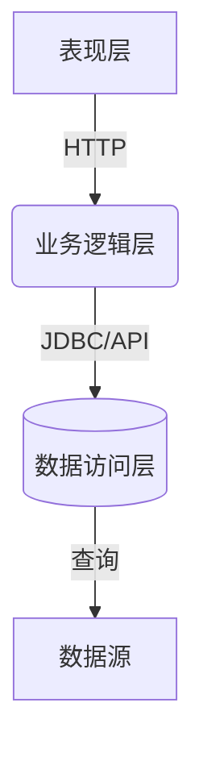

# 软件信息发布系统详细设计与具体代码实现

## 1. 背景介绍

### 1.1 软件信息发布系统概述

在当今快节奏的软件开发环境中,及时、高效地发布软件信息至关重要。软件信息发布系统(Software Release Information System,SRIS)旨在简化和自动化这一过程,确保软件版本、更新、文档和其他相关信息能够准确、一致地传播给最终用户和其他利益相关方。

### 1.2 系统需求与挑战

设计和实现一个健壮的SRIS需要解决以下几个关键挑战:

- **信息集成**:整合来自多个来源(如版本控制系统、缺陷跟踪系统、文档存储库等)的信息。
- **信息处理**:对原始数据进行解析、转换和格式化,以生成可读的发布信息。
- **信息分发**:通过多种渠道(网站、邮件列表、RSS源等)高效分发发布信息。
- **访问控制**:根据角色和权限控制对发布信息的访问。
- **审计跟踪**:跟踪发布活动并提供报告,以确保合规性。
- **可扩展性**:系统能够适应不断变化的需求和技术环境。

## 2. 核心概念与联系

### 2.1 系统架构概览

SRIS遵循经典的三层架构,包括:

1. **表现层**:用户界面,支持Web、命令行等不同方式访问和交互。
2. **业务逻辑层**:实现系统的核心功能,如信息采集、处理、分发和访问控制。
3. **数据访问层**:与底层数据源(数据库、文件系统等)进行交互。



### 2.2 核心模块

SRIS由以下几个核心模块组成:

- **信息提取器(Extractors)**: 从各种源系统中提取原始软件信息。
- **信息处理器(Processors)**: 将原始信息转换为规范的内部数据模型。
- **内容生成器(Content Generators)**: 根据内部数据模型生成人类可读的发布信息。
- **信息分发器(Distributors)**: 通过多种渠道分发发布信息。
- **访问控制模块(Access Control)**: 基于角色和权限控制对发布信息的访问。
- **审计模块(Auditing)**: 记录和报告发布活动。

## 3. 核心算法原理具体操作步骤

### 3.1 信息提取

信息提取是SRIS的第一步,需要从异构的源系统中获取所需的软件信息。常用的信息提取方法包括:

1. **版本控制系统挂钩(VCS Hooks)**: 当代码提交或版本发布时,触发特定脚本从VCS(如Git、SVN)中提取相关信息。

2. **问题跟踪系统集成(Issue Tracker Integration)**: 通过API或数据库查询从缺陷跟踪系统(如JIRA)中提取相关问题和修复信息。

3. **文档解析(Documentation Parsing)**: 使用格式化文本解析器从软件文档中提取版本信息、功能描述等。

4. **元数据扫描(Metadata Scanning)**: 分析构建产物(如JAR文件、安装包)中的元数据,提取版本号、依赖信息等。

提取的原始数据通常以异构格式存在,如XML、JSON、纯文本等,需要进一步处理和转换。

### 3.2 信息处理

信息处理模块将异构的原始数据转换为SRIS内部的统一数据模型,以便后续的内容生成和信息分发。主要步骤包括:

1. **解析(Parsing)**: 将原始数据解析为结构化的内部模型对象。

2. **规范化(Normalization)**: 对解析后的数据执行转换和清理,如修复格式错误、删除无用信息等。

3. **关联(Correlation)**: 将来自不同源的相关信息(如代码提交和对应的缺陷)关联在一起。

4. **丰富(Enrichment)**: 利用外部数据源(如组件元数据库)为内部模型补充额外的上下文信息。

5. **持久化(Persistence)**: 将最终的内部数据模型对象持久化存储,以供后续使用。

### 3.3 内容生成

内容生成模块基于内部数据模型,生成人类可读的发布信息。这通常包括以下步骤:

1. **模板应用(Template Application)**: 使用预定义的模板将内部模型渲染为特定格式(如HTML、纯文本)的发布内容。

2. **内容组装(Content Assembly)**: 将多个独立的内容片段(如新功能列表、修复问题列表等)组装为一个完整的发布说明文档。

3. **版本控制(Revision Control)**: 将生成的发布内容存储在版本控制系统中,以便审计和协作编辑。

4. **多语言支持(Localization)**: 根据需求,利用机器翻译或人工翻译,为发布内容提供多语言版本。

### 3.4 信息分发

生成的发布内容需要通过多种渠道分发给最终用户和其他利益相关方。常用的分发渠道包括:

1. **Web门户(Web Portal)**: 在公司网站或内部门户网站上发布发布说明。

2. **邮件列表(Mailing Lists)**: 通过邮件列表发送发布通知和说明。

3. **RSS/Atom源(Feeds)**: 提供发布信息的RSS或Atom订阅源。

4. **API访问(API Access)**: 提供面向程序的API接口,以便其他系统集成发布信息。

5. **社交媒体(Social Media)**: 通过Twitter、Facebook等社交媒体渠道发布发布公告。

分发渠道可配置为自动或手动触发,并支持个性化订阅和访问控制。

### 3.5 访问控制

由于发布信息可能包含敏感数据(如安全漏洞修复),因此SRIS需要提供细粒度的访问控制,确保信息只对授权的角色和个人可见。常用的访问控制模型包括:

1. **基于角色的访问控制(RBAC)**: 根据用户的角色(如开发人员、产品经理等)授予不同级别的访问权限。

2. **基于属性的访问控制(ABAC)**: 根据发布信息的属性(如版本号、组件、严重程度等)和用户属性(如部门、地理位置等)进行访问控制决策。

3. **强制访问控制(MAC)**: 基于预先定义的安全级别和规则,严格控制对象和主体之间的信息流动。

访问控制策略可集成到SRIS的各个模块中,确保整个发布生命周期的信息安全。

### 3.6 审计和报告

为了满足合规性要求和提高可追溯性,SRIS需要对发布活动进行全面的审计和报告。主要包括:

1. **活动日志(Activity Logging)**: 记录所有发布相关活动,如信息提取、内容生成、分发等,以及操作人员和时间戳。

2. **差异跟踪(Diff Tracking)**: 跟踪发布内容的变更,以便比较和审查版本差异。

3. **报告生成(Reporting)**: 基于日志数据生成各种报告,如发布活动汇总报告、合规性报告等。

4. **警报和通知(Alerts & Notifications)**: 在发生异常情况(如发布失败)时及时发出警报和通知。

审计模块通常与SRIS的其他模块紧密集成,以确保全面的活动覆盖和数据完整性。

## 4. 数学模型和公式详细讲解举例说明 

在软件信息发布系统中,一些关键算法和模型需要使用数学公式和模型进行描述和分析。

### 4.1 文本相似度计算

在关联来自不同源的相关信息时,需要计算文本之间的相似度。一种常用的方法是基于TF-IDF(Term Frequency-Inverse Document Frequency)的余弦相似度:

$$
sim(d_i, d_j) = \frac{\vec{d_i} \cdot \vec{d_j}}{|\vec{d_i}||\vec{d_j}|} = \frac{\sum\limits_{t\in V}tfidf(t, d_i)tfidf(t, d_j)}{\sqrt{\sum\limits_{t\in V}tfidf(t, d_i)^2}\sqrt{\sum\limits_{t\in V}tfidf(t, d_j)^2}}
$$

其中:

- $d_i$和$d_j$是两个文本文档
- $V$是文档中出现的所有词条集合
- $tfidf(t, d)$是词条$t$在文档$d$中的TF-IDF值,定义为:

$$
tfidf(t, d) = tf(t, d) \times idf(t)
$$

$tf(t, d)$是词条$t$在文档$d$中的词频(Term Frequency),通常使用增强型词频:

$$
tf(t, d) = \frac{n_{t,d}}{\sqrt{\sum\limits_{t'\in d}n_{t',d}^2}}
$$

$idf(t)$是词条$t$的逆向文档频率(Inverse Document Frequency),衡量词条在整个语料库中的重要性:

$$
idf(t) = \log\frac{N}{n_t}
$$

其中$N$是语料库中文档总数,$n_t$是包含词条$t$的文档数。

通过计算两个文本的TF-IDF向量之间的余弦相似度,我们可以量化它们的相似程度,并将高相似度的文本对关联在一起。

### 4.2 版本依赖分析

在软件构件中,通常存在复杂的版本依赖关系。我们可以使用有向无环图(Directed Acyclic Graph, DAG)来建模和分析这些依赖关系。

假设有一个软件系统$S$,包含$n$个构件$C_1, C_2, \ldots, C_n$,每个构件有多个版本。我们用$v_{i,j}$表示构件$C_i$的第$j$个版本。依赖关系可以表示为:

$$
v_{i,j} \rightarrow v_{k,l}
$$

表示版本$v_{i,j}$依赖于版本$v_{k,l}$。所有依赖关系构成了一个DAG $G = (V, E)$,其中:

- $V$是所有构件版本的集合,即$V = \{v_{i,j}\}$
- $E$是所有依赖关系的集合,即$E = \{(v_{i,j}, v_{k,l}) | v_{i,j} \rightarrow v_{k,l}\}$

在DAG $G$中,我们可以使用拓扑排序算法来确定一个线性顺序,使得对于任何依赖关系$(v_{i,j}, v_{k,l}) \in E$,版本$v_{i,j}$总是出现在$v_{k,l}$之前。这个顺序对于确定正确的构建和部署顺序非常重要。

此外,我们还可以在DAG $G$中查找环路,环路表示存在循环依赖,这是不允许的。通过检测和消除环路,我们可以确保依赖关系的合理性和一致性。

通过建模和分析版本依赖关系,SRIS可以更好地管理和控制复杂的软件发布过程。

## 5. 项目实践:代码实例和详细解释说明

为了更好地理解SRIS的实现细节,我们将介绍一个基于Java的SRIS原型系统。该系统包括以下主要组件:

### 5.1 信息提取器(Extractors)

信息提取器从不同的源系统中提取原始软件信息。以下是一些示例实现:

**GitExtractor**

```java
public class GitExtractor implements SourceExtractor {
    private GitRepository repo;
    
    public GitExtractor(String repoUrl) {
        this.repo = new GitRepository(repoUrl);
    }
    
    public List<CommitInfo> extractCommits(String branch, Date since) {
        List<CommitInfo> commits = new ArrayList<>();
        for (Commit commit : repo.getCommits(branch, since)) {
            CommitInfo info = new CommitInfo();
            info.setRevision(commit.getRevision());
            info.setAuthor(commit.getAuthor());
            info.setDate(commit.getDate());
            info.setMessage(commit.getMessage());
            info.setFiles(commit.getModifiedFiles());
            commits.add(info);
        }
        return commits;
    }
}
```

**JiraExtractor**

```java
public class JiraExtractor implements IssueExtractor {
    private JiraClient client;
    
    public JiraExtractor(String url, String username, String password) {
        this.client = new JiraClient(url, username