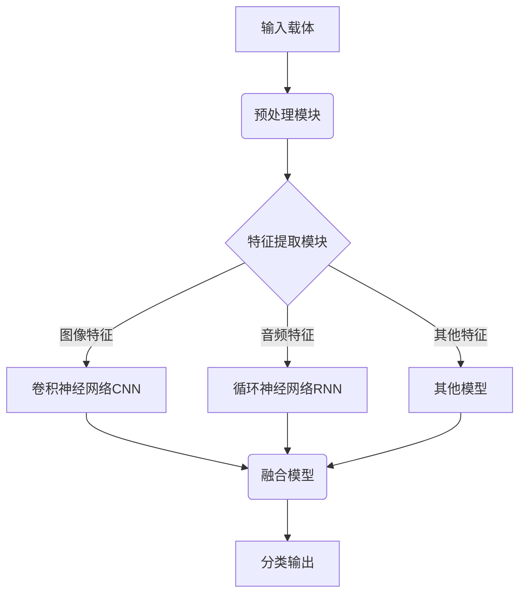

# 隐写GhostNet:隐藏攻击载体的对抗技术

## 1.背景介绍

### 1.1 隐写术概述

隐写术(Steganography)是一种将秘密信息隐藏在看似无害的载体(如图像、音频、视频等)中的技术。它不同于加密,加密的目的是将信息变得无法被读取,而隐写术则是将信息隐藏起来,使其难以被发现。隐写术在保密通信、数字水印、版权保护等领域有着广泛的应用。

### 1.2 隐写术在网络攻击中的应用

黑客和攻击者也可以利用隐写术来隐藏恶意代码和攻击载体,绕过防火墙和入侵检测系统。他们可以将恶意代码隐藏在普通的网页、图像或其他文件中,以躲避安全检查。一旦受害者打开这些被植入隐写攻击载体的文件,就会触发隐藏的恶意代码执行,从而实现入侵或其他攻击目的。

### 1.3 对抗隐写攻击的重要性

由于隐写攻击手段隐蔽、危害严重,因此有效检测和防御隐写攻击载体成为了网络安全领域的一个重要课题。本文将介绍一种名为GhostNet的对抗隐写攻击技术,它能够有效检测和防御隐藏在各种载体中的攻击载体。

## 2.核心概念与联系

### 2.1 隐写术的基本原理

隐写术的基本原理是将秘密信息隐藏在一个无害的载体(如图像、音频等)中,使得载体在肉眼观察或一般分析下看似完好无损。常见的隐写术方法有:

- 空间域隐写术: 直接修改载体文件的像素值或波形数据来隐藏信息
- 变换域隐写术: 先将载体转换到变换域(如离散余弦变换DCT),然后修改变换系数来隐藏信息
- 统计隐写术: 利用载体的统计特征(如直方图)来隐藏信息
- 文件结构隐写术: 在文件的结构元数据中隐藏信息

### 2.2 GhostNet对抗隐写攻击的核心思想

GhostNet的核心思想是通过机器学习和深度学习技术,训练一个能够高精度检测各种隐写攻击载体的模型。该模型可以自动提取隐写载体的微小特征,并将其与正常载体区分开来。

GhostNet的优势在于:

- 可以检测已知和未知类型的隐写攻击载体
- 适用于各种载体类型(图像、音频、视频等)
- 具有较高的检测精度和较低的误报率
- 可以持续在线学习,提高检测能力

### 2.3 机器学习在对抗隐写攻击中的作用

机器学习在对抗隐写攻击中发挥着关键作用:

- 特征提取: 自动从大量正常和隐写载体样本中提取微小的特征模式
- 模型训练: 使用标记的训练数据训练分类模型,学习区分隐写和正常载体
- 在线学习: 持续输入新的样本,不断优化和更新模型参数,提高检测能力
- 攻击检测: 对新的未知载体进行分类,高精度识别潜在的隐写攻击载体

通过机器学习技术,GhostNet能够自主发现隐写攻击载体的特征模式,而不需要人工设计复杂的检测规则,从而有效应对不断变化的隐写攻击手段。

## 3.核心算法原理具体操作步骤  

### 3.1 GhostNet系统架构

GhostNet的整体架构如下图所示:



1. 预处理模块: 对输入的载体文件进行解码、格式转换等预处理操作
2. 特征提取模块: 针对不同类型的载体,提取相应的特征,如图像的像素特征、音频的频谱特征等
3. 多模型并行: 使用不同的深度学习模型(CNN、RNN等)分别对不同特征进行建模和分类
4. 模型融合: 将多个模型的输出进行融合,得到最终的分类结果

### 3.2 图像隐写载体检测

对于图像隐写载体,GhostNet主要采用卷积神经网络(CNN)进行检测,具体步骤如下:

1. 图像预处理: 对输入图像进行尺寸调整、像素值归一化等预处理
2. 卷积层提取特征: 使用多层卷积层自动提取图像的低级和高级特征
3. 池化层降维: 使用最大池化层对特征图进行降维,减少计算量
4. 全连接层分类: 将卷积特征图展平,接入全连接层对隐写和正常图像进行二分类
5. 模型训练: 使用标记的正常和隐写图像训练集,通过反向传播算法优化CNN模型参数

### 3.3 音频隐写载体检测

对于音频隐写载体,GhostNet主要采用循环神经网络(RNN)进行检测,具体步骤如下:

1. 音频预处理: 对输入音频进行重采样、分帧等预处理
2. 短时傅里叶变换(STFT): 将每帧音频转换到频域,得到频谱特征
3. RNN建模: 使用LSTM或GRU等RNN模型,对音频的时序频谱特征进行建模
4. 分类输出: RNN的最后一个时间步的隐状态,接入全连接层进行隐写与正常音频的二分类
5. 模型训练: 使用标记的正常和隐写音频训练集,通过反向传播算法优化RNN模型参数

### 3.4 其他载体类型检测

除了图像和音频,GhostNet还可以针对其他类型的载体(如视频、文档等)进行检测。具体的模型架构和算法可能有所不同,但总的思路是:

1. 针对不同载体提取相应的特征,如视频的运动矢量特征、文档的结构特征等
2. 使用合适的深度学习模型(CNN、RNN或其他)对提取的特征进行建模和分类
3. 在标记的训练集上训练模型,优化模型参数
4. 对新的未知载体进行预测,输出隐写或正常的分类结果

## 4.数学模型和公式详细讲解举例说明

在GhostNet的核心算法中,涉及了多种数学模型和公式,下面将对其中的关键部分进行详细讲解和举例说明。

### 4.1 卷积神经网络(CNN)

卷积神经网络是GhostNet用于图像隐写载体检测的核心模型。CNN能够自动学习图像的层次特征,具有平移不变性,是计算机视觉领域的主流模型。

CNN的基本运算是卷积操作,其数学定义为:

$$
(I * K)(i,j) = \sum_{m}\sum_{n}I(i+m,j+n)K(m,n)
$$

其中$I$是输入特征图,$K$是卷积核,$i,j$是输出特征图的坐标。卷积操作实现了对输入特征图的滤波,可以提取出边缘、纹理等低级特征。

在CNN中,卷积层往往交替与池化层,池化层的作用是对特征图进行下采样,减少计算量。常用的池化操作是最大池化,其数学定义为:

$$
(f \bigodot_{\beta} g)(i,j) = \max_{(m,n) \in \beta(i,j)} f(i+m,j+n)
$$

其中$\beta$是池化窗口的形状和大小。

CNN通过多层卷积和池化操作,可以自动学习图像的层次特征表示,最终将这些特征输入全连接层进行分类。在隐写载体检测任务中,CNN能够敏锐地捕捉到隐写操作带来的微小图像畸变特征。

### 4.2 循环神经网络(RNN)

循环神经网络是GhostNet用于音频隐写载体检测的核心模型。RNN擅长对序列数据(如音频)进行建模,能够很好地捕捉时序信息。

RNN的核心是循环单元,常用的循环单元包括LSTM(长短期记忆)和GRU(门控循环单元)。以LSTM为例,其数学定义为:

$$
\begin{aligned}
f_t &= \sigma(W_f\cdot[h_{t-1}, x_t] + b_f) & \text{(forget gate)} \\
i_t &= \sigma(W_i\cdot[h_{t-1}, x_t] + b_i) & \text{(input gate)} \\
\tilde{C}_t &= \tanh(W_C\cdot[h_{t-1}, x_t] + b_C) & \text{(candidate state)} \\
C_t &= f_t * C_{t-1} + i_t * \tilde{C}_t & \text{(cell state)} \\
o_t &= \sigma(W_o\cdot[h_{t-1}, x_t] + b_o) & \text{(output gate)} \\
h_t &= o_t * \tanh(C_t) & \text{(hidden state)}
\end{aligned}
$$

其中$f_t,i_t,o_t$分别是遗忘门、输入门、输出门,用于控制信息的流动;$C_t$是记忆细胞,用于存储长期状态;$h_t$是隐状态,作为输出。

在音频隐写载体检测任务中,RNN能够对音频的时序频谱特征进行建模,捕捉到隐写操作带来的频谱畸变特征,从而实现高精度的检测。

### 4.3 损失函数和优化

GhostNet在训练过程中,需要最小化一个损失函数(如二元交叉熵损失),使模型输出与真实标签之间的差异最小。损失函数的数学定义为:

$$
L = -\frac{1}{N}\sum_{i=1}^N[y_i\log(\hat{y}_i) + (1-y_i)\log(1-\hat{y}_i)]
$$

其中$N$是样本数量,$y_i$是真实标签(0或1),$\hat{y}_i$是模型输出(隐写载体的概率)。

为了最小化损失函数,GhostNet采用了随机梯度下降(SGD)等优化算法,根据损失函数对模型参数的梯度进行迭代更新:

$$
\theta_{t+1} = \theta_t - \eta \frac{\partial L}{\partial \theta_t}
$$

其中$\theta$是模型参数,$\eta$是学习率。

通过不断迭代优化,GhostNet的模型参数能够收敛到一个较优的状态,从而实现对隐写载体的高精度检测。

## 4.项目实践:代码实例和详细解释说明

为了更好地理解GhostNet的实现细节,下面将给出一些核心代码示例,并进行详细的解释说明。

### 4.1 图像隐写载体检测示例

这是一个使用PyTorch实现的简单CNN模型,用于对图像隐写载体进行二分类检测:

```python
import torch
import torch.nn as nn

class StegCNN(nn.Module):
    def __init__(self):
        super(StegCNN, self).__init__()
        self.conv1 = nn.Conv2d(3, 16, 3, padding=1)
        self.pool = nn.MaxPool2d(2, 2)
        self.conv2 = nn.Conv2d(16, 32, 3, padding=1)
        self.fc1 = nn.Linear(32 * 16 * 16, 128)
        self.fc2 = nn.Linear(128, 2)
        
    def forward(self, x):
        x = self.pool(nn.functional.relu(self.conv1(x)))
        x = self.pool(nn.functional.relu(self.conv2(x)))
        x = x.view(-1, 32 * 16 * 16)
        x = nn.functional.relu(self.fc1(x))
        x = self.fc2(x)
        return x

# 训练代码
model = StegCNN()
criterion = nn.CrossEntropyLoss()
optimizer = torch.optim.Adam(model.parameters(), lr=0.001)

for epoch in range(10):
    for data, target in train_loader:
        output = model(data)
        loss = criterion(output,