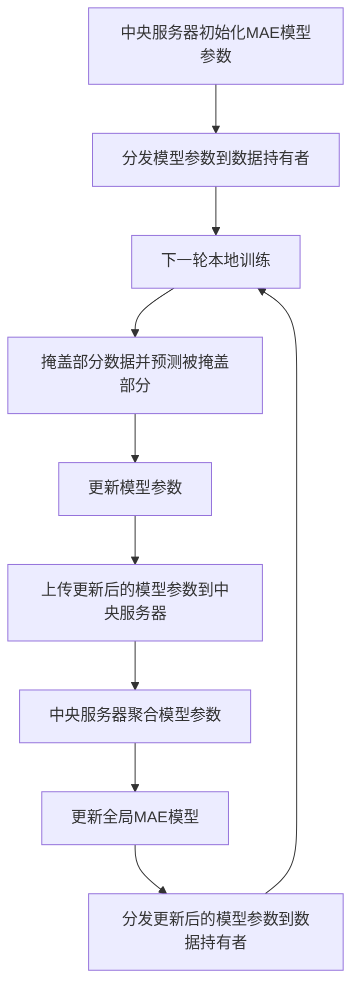

# 面向隐私保护的MAE模型联邦学习

作者：禅与计算机程序设计艺术

## 1.背景介绍

### 1.1 联邦学习的兴起

联邦学习（Federated Learning, FL）是一种新兴的机器学习范式，旨在解决数据隐私和安全问题。在传统的集中式机器学习中，数据需要集中到一个服务器上进行训练，这引发了隐私泄露和数据安全的担忧。联邦学习通过在数据源本地进行模型训练，仅上传模型参数或梯度，避免了数据的集中化存储，从而保护了数据隐私。

### 1.2 隐私保护的需求

随着数据隐私保护法规（如GDPR）的实施，保护用户数据隐私变得尤为重要。企业和研究机构需要在不违反隐私法规的前提下，充分利用分散的数据资源进行机器学习。联邦学习提供了一种解决方案，但也面临着新的挑战，如通信成本、模型更新的同步和攻击防护等。

### 1.3 MAE模型的应用

MAE（Masked Autoencoders）是一种自监督学习模型，通过掩盖部分输入数据并预测被掩盖部分来进行训练。MAE在图像处理、自然语言处理等领域表现出色，但其应用在联邦学习中仍处于探索阶段。将MAE模型引入联邦学习，不仅可以提高模型的泛化能力，还可以进一步增强数据隐私保护。

## 2.核心概念与联系

### 2.1 联邦学习的基本概念

联邦学习的核心思想是将模型训练过程分布到多个数据持有者（如用户设备）上，每个数据持有者在本地训练模型，并将更新后的模型参数发送到中央服务器进行聚合。聚合后的模型参数再分发到各个数据持有者，进行下一轮训练。这种方式避免了数据的集中存储，从而保护了数据隐私。

### 2.2 MAE模型的基本概念

MAE模型是一种自监督学习方法，通过掩盖部分输入数据（如图像的某些像素或文本的某些词）并预测被掩盖部分来进行训练。MAE模型能够从大量未标注的数据中学习特征表示，具有较强的泛化能力。

### 2.3 联邦学习与MAE模型的结合

将MAE模型引入联邦学习，可以在数据隐私保护的前提下，利用分散的数据资源进行自监督学习。具体来说，每个数据持有者在本地训练MAE模型，通过掩盖部分数据并预测被掩盖部分来进行训练。训练后的模型参数上传到中央服务器进行聚合，再分发到各个数据持有者进行下一轮训练。

## 3.核心算法原理具体操作步骤

### 3.1 联邦学习的基本流程

1. **初始化**：中央服务器初始化全局模型参数，并将其分发到各个数据持有者。
2. **本地训练**：每个数据持有者在本地使用自己的数据训练模型，更新模型参数。
3. **参数上传**：每个数据持有者将更新后的模型参数上传到中央服务器。
4. **参数聚合**：中央服务器聚合所有数据持有者上传的模型参数，更新全局模型。
5. **模型分发**：中央服务器将更新后的全局模型参数分发到各个数据持有者，进行下一轮训练。

### 3.2 MAE模型的训练步骤

1. **数据掩盖**：随机掩盖输入数据的一部分（如图像的某些像素或文本的某些词）。
2. **模型训练**：使用掩盖后的数据训练MAE模型，预测被掩盖部分的数据。
3. **损失计算**：计算预测结果与真实数据之间的损失，更新模型参数。

### 3.3 联邦学习与MAE模型的结合步骤

1. **初始化**：中央服务器初始化MAE模型参数，并将其分发到各个数据持有者。
2. **本地训练**：每个数据持有者在本地使用自己的数据训练MAE模型，掩盖部分数据并预测被掩盖部分，更新模型参数。
3. **参数上传**：每个数据持有者将更新后的MAE模型参数上传到中央服务器。
4. **参数聚合**：中央服务器聚合所有数据持有者上传的MAE模型参数，更新全局MAE模型。
5. **模型分发**：中央服务器将更新后的全局MAE模型参数分发到各个数据持有者，进行下一轮训练。

### 3.4 具体操作步骤的Mermaid流程图



## 4.数学模型和公式详细讲解举例说明

### 4.1 联邦学习的数学模型

在联邦学习中，假设有 $N$ 个数据持有者，每个数据持有者 $i$ 拥有本地数据集 $D_i$。全局模型参数为 $\theta$，本地模型参数为 $\theta_i$。联邦学习的目标是最小化全局损失函数：

$$
\min_{\theta} \sum_{i=1}^{N} \frac{|D_i|}{|D|} L_i(\theta)
$$

其中，$|D_i|$ 是数据持有者 $i$ 的数据量，$|D|$ 是所有数据持有者的数据总量，$L_i(\theta)$ 是数据持有者 $i$ 的本地损失函数。

### 4.2 MAE模型的数学模型

在MAE模型中，假设输入数据为 $x$，掩盖操作为 $M$，掩盖后的数据为 $x_M$。MAE模型的目标是通过掩盖部分数据并预测被掩盖部分来进行训练。损失函数为：

$$
L(\theta) = \mathbb{E}_{x \sim D} \left[ \| x - f(x_M; \theta) \|^2 \right]
$$

其中，$f(x_M; \theta)$ 是MAE模型的预测结果，$\theta$ 是模型参数。

### 4.3 联邦学习与MAE模型结合的数学模型

在联邦学习与MAE模型结合的情况下，每个数据持有者 $i$ 在本地训练MAE模型，掩盖部分数据并预测被掩盖部分。全局损失函数为：

$$
\min_{\theta} \sum_{i=1}^{N} \frac{|D_i|}{|D|} \mathbb{E}_{x \sim D_i} \left[ \| x - f(x_M; \theta) \|^2 \right]
$$

其中，$f(x_M; \theta)$ 是MAE模型的预测结果，$\theta$ 是全局模型参数。

## 5.项目实践：代码实例和详细解释说明

### 5.1 环境配置

在开始项目实践之前，需要配置好开发环境。以下是所需的环境和库：

```bash
pip install tensorflow federated-learning
```

### 5.2 数据准备

在本地准备数据集，并进行数据预处理。以下是一个简单的示例代码：

```python
import tensorflow as tf
import numpy as np

# 加载数据集
(x_train, y_train), (x_test, y_test) = tf.keras.datasets.mnist.load_data()

# 数据预处理
x_train = x_train / 255.0
x_test = x_test / 255.0
```

### 5.3 MAE模型定义

定义一个简单的MAE模型：

```python
from tensorflow.keras import layers, models

def create_mae_model(input_shape):
    inputs = layers.Input(shape=input_shape)
    x = layers.Flatten()(inputs)
    x = layers.Dense(256, activation='relu')(x)
    x = layers.Dense(128, activation='relu')(x)
    x = layers.Dense(np.prod(input_shape), activation='sigmoid')(x)
    outputs = layers.Reshape(input_shape)(x)
    
    model = models.Model(inputs, outputs)
    model.compile(optimizer='adam', loss='mse')
    return model
```

### 5.4 本地训练

在本地进行MAE模型的训练：

```python
# 定义输入形状
input_shape = (28, 28)

# 创建MAE模型
mae_model = create_mae_model(input_shape)

# 掩盖部分