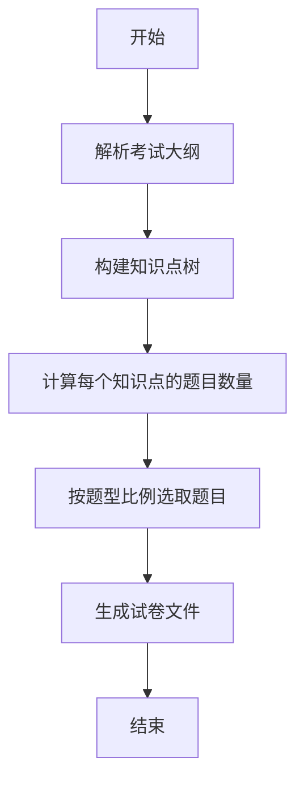

# 题库自动组卷系统详细设计与具体代码实现

## 1.背景介绍

### 1.1 项目概述

随着教育行业的不断发展,自动化组卷系统已经成为了教育评估的重要工具。传统的人工组卷过程耗时耗力,难以满足大规模考试的需求。因此,开发一套高效、灵活、可扩展的自动组卷系统,能够极大地提高组卷效率,优化考试流程,节省人力成本。

自动组卷系统的主要功能是根据预设的考试大纲、知识点分布和难度系数等规则,从题库中自动选取符合要求的题目,生成试卷。同时,系统还需要支持题目的管理、分类、打分等功能,为教师和学生提供完整的考试解决方案。

### 1.2 项目意义

自动组卷系统的应用价值主要体现在以下几个方面:

1. **提高组卷效率**:系统可以在几秒钟内完成人工需要数小时甚至数天的工作,大幅提升组卷速度。

2. **保证试卷质量**:通过科学的算法和规则,系统能够生成难度适中、知识点均衡的高质量试卷。

3. **降低人力成本**:减少了大量重复性的人工操作,节省了大量人力和财力。

4. **方便管理和维护**:集中式的题库管理,方便老师添加、修改和查询题目,提高工作效率。

5. **促进教育公平**:通过标准化的试卷生成过程,确保所有考生获得公平、公正的考试机会。

## 2.核心概念与联系

### 2.1 考试大纲

考试大纲是组卷的基础,它明确规定了本次考试所涉及的知识范围、知识点分布比例等内容。一份完整的考试大纲通常包括以下几个要素:

- 考试科目
- 考试年级
- 考试时间
- 知识点清单及权重
- 题型比例
- 分值分配

### 2.2 题库

题库是存储所有题目的数据库,题目按照知识点、难度系数、题型等属性进行分类和标注。一个规范的题库数据结构通常包括:

- 题目内容(题干、选项、答案解析等)
- 知识点
- 难度系数
- 题型
- 分值
- 出题教师
- 命题时间
- 命题目的(期中、期末等)
- 历史使用记录

### 2.3 组卷策略

组卷策略是指根据考试大纲的要求,从题库中选取合适的题目并生成试卷的算法和规则。一个好的组卷策略需要综合考虑以下几个因素:

- 知识点分布
- 难度系数分布
- 题型分布
- 分值分配
- 题目新旧程度
- 防止题目重复

### 2.4 试卷生成

试卷生成是组卷系统的最终目标,通过执行组卷策略,从题库中筛选出符合要求的题目,并按照统一的格式输出成试卷文件(通常为Word或PDF格式)。

生成的试卷文件需要包含以下内容:

- 试卷标题(考试科目、时间等)
- 考生信息栏
- 题目内容
- 答题区域
- 参考答案或评分标准(如果需要)

## 3.核心算法原理具体操作步骤

组卷系统的核心算法就是根据考试大纲要求,从题库中选取合适的题目,并生成最终试卷的过程。我们可以将此过程分为以下几个步骤:

### 3.1 解析考试大纲

首先,系统需要解析输入的考试大纲文件,提取出需要的信息,包括:

- 知识点清单及权重
- 题型比例
- 总分值
- 题目数量

这些信息将作为组卷策略的输入条件。

### 3.2 构建知识点树

为了更好地表示知识点之间的层级关系,我们可以将知识点构建成一个树状结构。每个知识点作为一个节点,子知识点作为其子节点。

通过构建知识点树,我们可以方便地计算每个知识点的权重,并按照权重比例选取题目。

### 3.3 计算每个知识点的题目数量

根据考试大纲中规定的知识点权重分布,我们可以计算出每个知识点需要选取的题目数量。

假设总题目数为 $N$,第 $i$ 个知识点的权重为 $w_i$,则该知识点的题目数量 $n_i$ 可以计算为:

$$n_i = N \times w_i$$

如果计算结果是小数,我们可以对其进行向上或向下取整,并对总题目数进行调整,确保题目数量之和等于 $N$。

### 3.4 按照题型比例选取题目

接下来,我们需要按照考试大纲规定的题型比例,从每个知识点对应的题库中选取题目。

假设第 $i$ 个题型的比例为 $p_i$,则该题型的题目数量 $m_i$ 可以计算为:

$$m_i = N \times p_i$$

同样,如果计算结果是小数,我们需要进行取整并调整总数。

在选取过程中,我们可以按照题目的难度系数、新旧程度等属性进行排序,优先选取难度适中、较新的题目。

### 3.5 生成试卷文件

最后,我们需要将选取的题目按照指定格式输出到试卷文件中。这个过程包括:

1. 生成试卷标题
2. 插入考生信息栏
3. 按顺序插入题目内容
4. 为每道题目预留答题区域
5. 插入参考答案或评分标准(可选)

生成的试卷文件可以是Word、PDF或其他格式,以满足不同的使用需求。

### 3.6 算法流程图

下面是自动组卷系统的核心算法流程图:



## 4.数学模型和公式详细讲解举例说明

在自动组卷系统中,我们需要使用一些数学模型和公式来实现核心功能,下面将对其进行详细讲解。

### 4.1 知识点权重计算

假设一个考试大纲中包含 $n$ 个知识点,每个知识点的权重为 $w_i(i=1,2,...,n)$,则所有权重之和应该等于 1,即:

$$\sum_{i=1}^n w_i = 1$$

如果考试大纲中没有直接给出知识点的权重值,我们可以根据知识点的重要程度或者在教学大纲中所占比例来估算权重值。

例如,某次期末考试的知识点包括:

- 算术运算 (30%)
- 代数概念 (25%)
- 几何概念 (25%)
- 统计概率 (20%)

我们可以将权重设置为:

$$
\begin{aligned}
w_1 &= 0.3 &&\text{(算术运算)} \\
w_2 &= 0.25 &&\text{(代数概念)} \\
w_3 &= 0.25 &&\text{(几何概念)} \\
w_4 &= 0.2 &&\text{(统计概率)}
\end{aligned}
$$

### 4.2 题目数量分配

已知总题目数量为 $N$,根据知识点权重 $w_i$,我们可以计算出每个知识点对应的题目数量 $n_i$:

$$n_i = N \times w_i$$

如果计算结果是小数,我们需要进行取整,并对总题目数进行调整,确保题目数量之和等于 $N$。

假设 $N=100$,根据上面的知识点权重,我们可以计算出每个知识点的题目数量:

$$
\begin{aligned}
n_1 &= 100 \times 0.3 = 30 &&\text{(算术运算)} \\
n_2 &= 100 \times 0.25 = 25 &&\text{(代数概念)} \\
n_3 &= 100 \times 0.25 = 25 &&\text{(几何概念)} \\
n_4 &= 100 \times 0.2 = 20 &&\text{(统计概率)}
\end{aligned}
$$

### 4.3 题型分布

假设一次考试包含 $m$ 种题型,每种题型的比例为 $p_j(j=1,2,...,m)$,则所有比例之和应该等于 1,即:

$$\sum_{j=1}^m p_j = 1$$

与知识点权重类似,我们可以根据每种题型的题目数量 $m_j$ 计算出对应的比例:

$$p_j = \frac{m_j}{N}$$

例如,某次考试包含 100 道题目,其中:

- 选择题 60 道
- 填空题 20 道 
- 解答题 20 道

我们可以计算出每种题型的比例:

$$
\begin{aligned}
p_1 &= \frac{60}{100} = 0.6 &&\text{(选择题)} \\
p_2 &= \frac{20}{100} = 0.2 &&\text{(填空题)} \\
p_3 &= \frac{20}{100} = 0.2 &&\text{(解答题)}
\end{aligned}
$$

### 4.4 难度系数分布

每道题目在题库中都有一个难度系数 $d_i$,通常取值范围为 $[0, 1]$ 或 $[1, 5]$ 等。我们可以根据题目的难度系数,将其分为几个难度等级,例如:

- $[0, 0.3]$ 为简单题
- $(0.3, 0.7]$ 为中等题
- $(0.7, 1]$ 为困难题

然后,我们可以设置每个难度等级的题目比例,例如:

- 简单题 30%
- 中等题 50%
- 困难题 20%

假设总题目数量为 $N$,简单题比例为 $r_1$,中等题比例为 $r_2$,困难题比例为 $r_3$,则每个难度等级的题目数量可以计算为:

$$
\begin{aligned}
n_1 &= N \times r_1 &&\text{(简单题数量)} \\
n_2 &= N \times r_2 &&\text{(中等题数量)} \\
n_3 &= N \times r_3 &&\text{(困难题数量)}
\end{aligned}
$$

在选取题目时,我们可以按照这些比例从对应的难度等级中随机抽取题目。

## 4.项目实践:代码实例和详细解释说明

在本节中,我将提供一个基于 Python 的自动组卷系统的代码实现示例,并对关键部分进行详细解释。

### 4.1 题库数据结构

首先,我们定义一个 `Question` 类来表示题目,包括题目内容、知识点、难度系数等属性:

```python
class Question:
    def __init__(self, content, knowledge_point, difficulty, question_type, score):
        self.content = content
        self.knowledge_point = knowledge_point
        self.difficulty = difficulty
        self.question_type = question_type
        self.score = score
```

接下来,我们定义一个 `QuestionBank` 类来管理题库,提供添加、删除、查询题目等功能:

```python
class QuestionBank:
    def __init__(self):
        self.questions = []
        self.knowledge_points = set()

    def add_question(self, question):
        self.questions.append(question)
        self.knowledge_points.add(question.knowledge_point)

    def remove_question(self, question):
        self.questions.remove(question)

    def get_questions_by_knowledge_point(self, knowledge_point):
        return [q for q in self.questions if q.knowledge_point == knowledge_point]

    def get_questions_by_difficulty(self, min_difficulty, max_difficulty):
        return [q for q in self.questions if min_difficulty <= q.difficulty <= max_difficulty]

    def get_questions_by_type(self, question_type):
        return [q for q in self.questions if q.question_type == question_type]
```

### 4.2 知识点树构建

为了方便管理知识点之间的层级关系,我们定义一个 `KnowledgePoint` 类,并使用递归的方式构建知识点树:

```python
class KnowledgePoint:
    def __init__(self, name, weight=0):
        self.name = name
        self.weight = weight
        self.children = []

    def add_child(self, child):
        self.children.append(child)

    def build_tree(knowledge_points, parent=None):