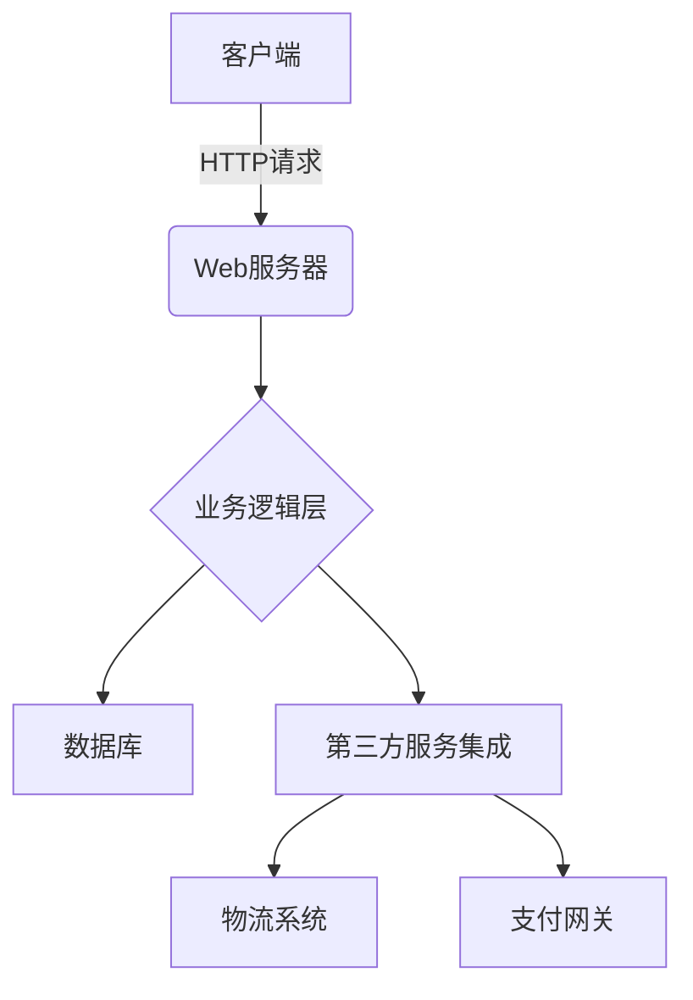

# 鲜花销售系统详细设计与具体代码实现

## 1.背景介绍

### 1.1 鲜花销售行业概况

鲜花销售是一个古老而又充满活力的行业。自古以来,鲜花一直被视为表达情感、庆祝节日和装饰环境的理想选择。随着人们生活水平的提高和对美好事物的追求,鲜花销售市场正在蓬勃发展。

根据市场研究数据,全球鲜花销售市场规模预计将从2021年的560亿美元增长到2028年的770亿美元,年复合增长率为5.4%。这一增长主要得益于电子商务的兴起、物流系统的改善以及消费者对高品质鲜花的需求不断增加。

### 1.2 鲜花销售系统的重要性

在这一蓬勃发展的市场中,一个高效、可靠的鲜花销售系统对于企业的成功至关重要。这种系统不仅能够优化订单处理流程,还可以提高库存管理效率,改善客户体验,并为企业提供宝贵的业务洞察。

设计和实现一个全面的鲜花销售系统需要考虑多个方面,包括用户界面、订单管理、库存跟踪、物流集成、支付处理等。同时,系统还需要具备良好的可扩展性和安全性,以适应不断变化的市场需求和技术进步。

## 2.核心概念与联系

### 2.1 系统架构概览

鲜花销售系统通常采用基于Web的客户端-服务器架构。客户端可以是网页、移动应用程序或其他前端界面,用于展示产品目录、接收订单和处理支付。服务器端则负责处理业务逻辑、管理数据库和与外部系统(如物流公司)集成。



### 2.2 核心模块

一个典型的鲜花销售系统包含以下核心模块:

1. **产品目录管理**:维护鲜花产品信息,包括类别、价格、库存等。
2. **购物车和订单管理**:处理客户添加商品到购物车、创建订单和支付流程。
3. **库存管理**:跟踪实时库存水平,并在订单完成时更新库存。
4. **物流集成**:与物流公司的系统集成,安排送货和跟踪订单状态。
5. **用户管理**:处理客户注册、登录和个人信息管理。
6. **报告和分析**:生成销售报告和分析业务数据,以支持决策。

### 2.3 关键技术

实现鲜花销售系统需要综合运用多种技术,包括但不限于:

- **Web开发技术**:HTML、CSS、JavaScript、React/Angular/Vue等前端框架,Node.js、Python/Django、Java/Spring等后端框架。
- **数据库技术**:关系型数据库(如MySQL、PostgreSQL)或NoSQL数据库(如MongoDB)。
- **缓存技术**:Redis、Memcached等,用于提高系统响应速度。
- **消息队列**:RabbitMQ、Apache Kafka等,用于异步处理和解耦系统组件。
- **安全技术**:HTTPS、JWT认证、加密等,保护系统和用户数据安全。
- **DevOps实践**:持续集成、持续交付、容器化(Docker)等,加速系统交付和部署。

## 3.核心算法原理具体操作步骤

### 3.1 购物车算法

购物车是电子商务系统中的一个核心功能,它允许用户临时存储他们想要购买的商品,并在结账时一次性进行支付。购物车算法需要解决以下几个主要问题:

1. **商品添加和移除**:当用户将商品添加到购物车或从购物车中移除商品时,需要更新购物车中的商品列表。
2. **数量更新**:用户可以更改购物车中某个商品的数量,算法需要相应地更新商品数量和总价格。
3. **价格计算**:根据商品单价和数量计算购物车中商品的总价格。
4. **促销活动**:处理各种促销活动,如打折、满减优惠等,并正确计算最终价格。
5. **库存检查**:在用户结账之前,需要检查购物车中的商品是否有足够的库存。

以下是购物车算法的伪代码:

```python
class ShoppingCart:
    def __init__(self):
        self.items = {}  # 商品ID映射到(商品, 数量)

    def add_item(self, product, quantity):
        if product.id in self.items:
            self.items[product.id][1] += quantity
        else:
            self.items[product.id] = [product, quantity]

    def remove_item(self, product_id):
        if product_id in self.items:
            del self.items[product_id]

    def update_quantity(self, product_id, new_quantity):
        if product_id in self.items:
            self.items[product_id][1] = new_quantity

    def get_total_price(self):
        total = 0
        for product, quantity in self.items.values():
            total += product.price * quantity
        return total

    def apply_promotion(self, promotion):
        # 根据促销规则调整总价格
        pass

    def check_inventory(self):
        # 检查购物车中商品的库存
        pass
```

### 3.2 库存管理算法

库存管理是电子商务系统的另一个关键部分。它需要跟踪商品的实时库存水平,并在订单完成时相应地更新库存。以下是一个简单的库存管理算法:

```python
class Inventory:
    def __init__(self):
        self.stock = {}  # 商品ID映射到库存量

    def add_stock(self, product_id, quantity):
        if product_id in self.stock:
            self.stock[product_id] += quantity
        else:
            self.stock[product_id] = quantity

    def remove_stock(self, product_id, quantity):
        if product_id in self.stock:
            self.stock[product_id] -= quantity
            if self.stock[product_id] < 0:
                raise OutOfStockError(f"Product {product_id} is out of stock")

    def get_stock(self, product_id):
        if product_id in self.stock:
            return self.stock[product_id]
        else:
            return 0
```

在处理订单时,系统需要先检查库存是否足够,然后再进行支付和发货操作。如果库存不足,可以通知用户或自动取消订单。

### 3.3 订单处理算法

订单处理算法负责管理订单的整个生命周期,从创建订单到支付、发货、跟踪和最终完成或取消。以下是一个简化的订单处理算法:

```python
class OrderProcessor:
    def __init__(self, inventory, shipping_provider):
        self.inventory = inventory
        self.shipping_provider = shipping_provider

    def create_order(self, cart, customer):
        order = Order(customer)
        for product, quantity in cart.items.values():
            if self.inventory.get_stock(product.id) < quantity:
                raise OutOfStockError(f"Product {product.id} is out of stock")
            order.add_item(product, quantity)
            self.inventory.remove_stock(product.id, quantity)
        return order

    def process_payment(self, order, payment_info):
        # 处理支付
        pass

    def ship_order(self, order):
        # 与物流公司集成,安排发货
        pass

    def track_order(self, order_id):
        # 跟踪订单状态
        pass

    def complete_order(self, order_id):
        # 标记订单为已完成
        pass

    def cancel_order(self, order_id):
        # 取消订单并退款
        pass
```

这个算法首先从购物车中获取商品信息,检查库存是否足够。如果库存充足,它会创建一个新订单,从库存中扣除相应的商品数量。然后,它会处理支付、安排发货、跟踪订单状态,并最终将订单标记为已完成或取消。

## 4.数学模型和公式详细讲解举例说明

在鲜花销售系统中,有几个地方需要使用数学模型和公式:

### 4.1 价格计算

计算订单总价格时,需要考虑商品单价、数量、折扣和税费等因素。假设一个订单包含 $n$ 种商品,第 $i$ 种商品的单价为 $p_i$,数量为 $q_i$,则订单总价格 $P$ 可以用以下公式计算:

$$P = \sum_{i=1}^{n}p_iq_i(1+t)$$

其中 $t$ 是税率。如果有折扣,可以在公式中引入折扣系数 $d$:

$$P = \sum_{i=1}^{n}p_iq_i(1+t)(1-d)$$

例如,如果一个订单包含3束鲜花,单价分别为10美元、15美元和20美元,数量分别为2、3和1,税率为8%,并且有10%的折扣,则总价格为:

$$P = (10 \times 2 + 15 \times 3 + 20 \times 1)(1 + 0.08)(1 - 0.1) = 85.68\text{美元}$$

### 4.2 库存管理模型

在库存管理中,我们需要预测未来的需求,以确定合适的进货量。一种常用的模型是基于过去销售数据的指数平滑模型。

设 $D_t$ 为第 $t$ 期的实际需求量, $F_t$ 为第 $t$ 期的预测需求量,则在第 $t+1$ 期,预测需求量 $F_{t+1}$ 可以按照以下公式计算:

$$F_{t+1} = \alpha D_t + (1 - \alpha)F_t$$

其中 $\alpha$ 是平滑系数,取值在0到1之间。$\alpha$ 值越大,模型对最新数据的反应越灵敏;$\alpha$ 值越小,模型对历史数据的依赖越大。

例如,假设过去4周的鲜花销售量分别为100、120、90和110束,我们取 $\alpha = 0.3$,则第5周的预测销售量为:

$$F_5 = 0.3 \times 110 + 0.7 \times ((0.3 \times 90 + 0.7 \times 120) = 106$$

### 4.3 推荐系统模型

为了提高销售额和用户体验,鲜花销售系统可以集成推荐系统,根据用户的购买历史和浏览记录推荐感兴趣的商品。一种常用的协同过滤算法是基于用户的nearest neighbor算法。

设 $r_{ui}$ 表示用户 $u$ 对商品 $i$ 的评分,则用户 $u$ 与用户 $v$ 之间的相似度 $s_{uv}$ 可以用余弦相似度公式计算:

$$s_{uv} = \frac{\sum_{i \in I}r_{ui}r_{vi}}{\sqrt{\sum_{i \in I}r_{ui}^2}\sqrt{\sum_{i \in I}r_{vi}^2}}$$

其中 $I$ 是两个用户都评分过的商品集合。

对于目标用户 $u$,我们可以找到与其最相似的 $k$ 个用户,记为 $N_k(u)$,然后根据这些相似用户的评分,预测目标用户对商品 $j$ 的评分:

$$p_{uj} = \overline{r_u} + \frac{\sum_{v \in N_k(u)}(r_{vj} - \overline{r_v})s_{uv}}{\sum_{v \in N_k(u)}|s_{uv}|}$$

其中 $\overline{r_u}$ 和 $\overline{r_v}$ 分别是用户 $u$ 和 $v$ 的平均评分。

根据预测的评分,系统可以推荐给用户最感兴趣的商品。

## 4.项目实践:代码实例和详细解释说明

在这一部分,我们将通过一个基于Python的鲜花销售系统示例项目,演示如何将前面讨论的算法和模型付诸实践。

### 4.1 项目结构

```
flower-shop/
├── app/
│   ├── __init__.py
│   ├── models.py
│   ├── views.py
│   ├── cart.py
│   ├── inventory.py
│   ├── order.py
│   └── recommender.py
├── tests/
│   ├── __init__.py
│   └── test_models.py
├── config.py
├── requirements.txt
└── run.py
```

- `app/models.py`: 定义系统中的数据模型,如产品、订单、用户等。
- `app/views.py`: 实现Web应用的路由和视图函数。
- `app/cart.py`: 实现购物车算法。
- `app/inventory.