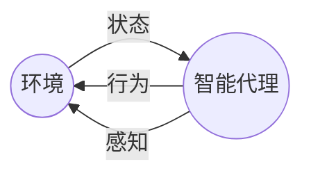

# AI Agent: AI的下一个风口 解决方案与研究方向

## 1. 背景介绍

### 1.1 人工智能的发展历程

人工智能(Artificial Intelligence, AI)是一个旨在模拟人类智能行为的广泛领域,包括学习、推理、规划、问题解决和感知等方面。自20世纪50年代AI概念被正式提出以来,这一领域经历了几个重要的发展阶段。

#### 1.1.1 早期发展阶段

早期的AI系统主要集中在特定的问题领域,如博弈、定理证明和符号推理等。这些系统通常采用基于规则的方法,依赖于人工编码的知识库和推理引擎。尽管取得了一些成功,但这种方法的局限性也很明显,因为它们无法很好地处理不确定性和模糊性,并且知识获取和表示是一个巨大的挑战。

#### 1.1.2 机器学习和神经网络的兴起

20世纪80年代,机器学习和神经网络的概念开始引起广泛关注。这种基于数据的方法旨在从大量示例中自动学习模式和规律,而不是依赖于人工编码的知识。尽管早期的神经网络模型存在一些局限性,但它们为未来的深度学习奠定了基础。

#### 1.1.3 深度学习的突破

21世纪初,benefiting from大量数据、增强的计算能力和新的训练算法,深度学习取得了突破性进展。深度神经网络能够自动从原始数据中提取多层次特征表示,在计算机视觉、自然语言处理和语音识别等领域取得了令人印象深刻的成绩。

### 1.2 AI Agent的兴起

随着AI技术的不断发展,AI Agent(智能代理)的概念开始受到越来越多的关注。AI Agent是一种具有自主性、响应性和主动性的软件实体,能够感知环境、处理信息、做出决策并采取行动。与传统的AI系统相比,AI Agent具有更强的交互能力和决策能力,可以在复杂的环境中执行任务并达成目标。

AI Agent的应用领域广泛,包括智能助手、机器人控制、游戏AI、自动驾驶、智能制造等。随着技术的进步,AI Agent将变得越来越智能、灵活和自主,成为实现人机协作和增强人类能力的关键技术。

## 2. 核心概念与联系

### 2.1 智能代理的定义

智能代理(Intelligent Agent)是一种能够感知环境、处理信息、做出决策并采取行动的自主实体。它具有以下几个关键特征:

1. **感知能力(Perception)**: 通过传感器获取环境信息。
2. **表示和推理(Representation and Reasoning)**: 基于感知信息构建内部模型,并进行推理和决策。
3. **行为选择(Action Selection)**: 根据推理结果选择合适的行为。
4. **执行(Execution)**: 执行选定的行为,影响环境。

智能代理通常被设计为具有某种目标或偏好函数,并努力优化其行为以实现这些目标。

### 2.2 代理与环境的交互

智能代理与环境之间存在着持续的交互循环,如下图所示:

1. 环境提供当前状态信息给智能代理。
2. 智能代理感知环境状态,并基于内部模型做出决策。
3. 智能代理执行选定的行为,影响环境。
4. 环境根据代理的行为转移到新的状态,循环重复。

这种交互循环使得智能代理能够持续学习和优化其行为,以更好地适应环境并实现目标。

### 2.3 代理类型

根据代理的特征和能力,可以将其分为以下几种类型:

1. **简单反射代理(Simple Reflex Agent)**: 基于当前感知信息做出反射性决策,没有内部状态表示。
2. **基于模型的反射代理(Model-based Reflex Agent)**: 维护内部状态模型,基于当前状态和感知信息做出决策。
3. **基于目标的代理(Goal-based Agent)**: 具有明确的目标,能够规划并执行一系列行动以实现目标。
4. **基于效用的代理(Utility-based Agent)**: 根据效用函数(或奖励函数)评估行为序列,选择期望效用最大的行为。
5. **学习代理(Learning Agent)**: 能够从经验中学习,并不断优化其决策过程。

智能代理的复杂程度取决于其感知、决策和学习能力。更高级的代理通常具有更强的自主性和适应性,能够在动态和不确定的环境中有效运作。

## 3. 核心算法原理具体操作步骤

智能代理的核心算法原理涉及多个方面,包括感知、表示、推理、规划和学习等。下面将详细介绍一些关键算法和具体操作步骤。

### 3.1 感知算法

感知算法负责从环境中获取相关信息,并将其转换为代理可以理解和处理的内部表示形式。常见的感知算法包括:

#### 3.1.1 计算机视觉算法

计算机视觉算法用于从图像或视频数据中提取有用的信息,如物体检测、识别、跟踪和场景理解等。典型的算法包括:

1. **特征提取**: 使用卷积神经网络(CNN)等深度学习模型从原始像素数据中提取多层次特征表示。
2. **目标检测**: 基于特征表示,使用算法如YOLO、Faster R-CNN等定位和识别图像中的目标对象。
3. **语义分割**: 将图像像素级别地分割为不同的语义类别,如人、车辆、道路等。
4. **视觉跟踪**: 在连续视频帧中跟踪感兴趣的目标对象。

#### 3.1.2 自然语言处理算法

自然语言处理(NLP)算法用于从文本数据中提取有用的信息,如语义理解、情感分析和对话系统等。常见的NLP算法包括:

1. **词向量表示**: 使用Word2Vec、GloVe等模型将单词映射到连续的向量空间中,捕捉语义和语法信息。
2. **序列标注**: 使用条件随机场(CRF)、递归神经网络(RNN)等模型对文本序列进行标注,如命名实体识别、词性标注等。
3. **语义表示**: 使用注意力机制、Transformer等模型捕捉文本的上下文语义信息。
4. **对话系统**: 基于序列到序列模型(如Seq2Seq)构建对话代理,实现自然语言交互。

#### 3.1.3 其他感知算法

除了视觉和语言信息之外,智能代理还可以感知其他类型的数据,如声音、传感器读数等。相应的算法包括语音识别、信号处理和特征工程等。

### 3.2 表示和推理算法

表示和推理算法负责构建代理的内部世界模型,并基于该模型进行推理和决策。常见的算法包括:

#### 3.2.1 逻辑推理

逻辑推理是一种基于符号规则的推理方法,常用于专家系统和规则引擎中。典型的算法包括:

1. **命题逻辑推理**: 基于命题逻辑规则进行推理,如前向链接和反向链接。
2. **一阶逻辑推理**: 基于一阶逻辑规则进行推理,如归结、单元化等。
3. **不确定性推理**: 处理不确定性知识的推理,如贝叶斯网络、fuzzy逻辑等。

#### 3.2.2 概率图模型

概率图模型是一种基于概率原理的表示和推理框架,广泛应用于机器学习和人工智能领域。常见的模型包括:

1. **贝叶斯网络**: 使用有向无环图表示随机变量之间的条件独立关系,并进行概率推理。
2. **马尔可夫网络**: 使用无向图模型表示随机变量之间的马尔可夫性质,常用于结构化预测任务。
3. **因子图模型**: 将复杂的联合概率分布分解为多个因子的乘积,用于高效推理。

#### 3.2.3 知识图谱

知识图谱是一种结构化的知识表示形式,使用实体、关系和属性来描述现实世界的概念及其相互关系。常见的算法包括:

1. **实体链接**: 将文本中的实体mention与知识库中的实体进行链接和disambiguate。
2. **关系抽取**: 从文本中抽取实体之间的语义关系,构建知识三元组。
3. **知识推理**: 基于已有的知识图谱,进行逻辑推理、关系推理和知识完善等。

### 3.3 规划算法

规划算法用于生成一系列行动,以实现代理的目标。常见的规划算法包括:

#### 3.3.1 经典规划算法

1. **状态空间搜索**: 在状态空间中搜索从初始状态到目标状态的路径,如A*、IDA*等算法。
2. **规划图搜索**: 在规划图中搜索解决方案,如图划分、GraphPlan等算法。
3. **层次任务网络规划**: 使用分层任务网络表示复杂任务,并进行分解和调度。

#### 3.3.2 决策理论规划

1. **马尔可夫决策过程(MDP)**: 基于马尔可夫假设,在确定的环境中寻找最优策略。
2. **部分可观测马尔可夫决策过程(POMDP)**: 在部分可观测环境中进行规划和决策。
3. **强化学习**: 通过与环境的交互,学习最优策略以最大化累积奖励。

#### 3.3.3 其他规划算法

1. **约束满足问题(CSP)**: 在满足一系列约束条件的前提下寻找解决方案。
2. **时间规划**: 考虑时间约束和资源约束的规划问题。
3. **多智能体规划**: 在多个智能代理协同工作的情况下进行规划。

### 3.4 学习算法

学习算法使得智能代理能够从经验中获取知识,并不断优化其行为。常见的学习算法包括:

#### 3.4.1 监督学习

1. **神经网络**: 使用多层感知机、卷积神经网络、递归神经网络等模型进行监督学习。
2. **核方法**: 如支持向量机(SVM)等,将输入映射到高维特征空间进行线性分类或回归。
3. **决策树和集成方法**: 如随机森林、Boosting等,构建多个弱学习器并集成以提高性能。

#### 3.4.2 无监督学习

1. **聚类算法**: 如K-Means、高斯混合模型等,将数据划分为多个簇。
2. **降维算法**: 如主成分分析(PCA)、t-SNE等,将高维数据映射到低维空间。
3. **关联规则挖掘**: 发现数据集中的频繁模式和相关性规则。

#### 3.4.3 强化学习

1. **动态规划**: 如价值迭代、策略迭代等,求解马尔可夫决策过程的最优策略。
2. **时序差分学习**: 如Q-Learning、Sarsa等,基于价值函数的无模型强化学习算法。
3. **策略梯度算法**: 如REINFORCE、Actor-Critic等,直接优化策略函数的参数。
4. **深度强化学习**: 将深度神经网络与强化学习相结合,如Deep Q-Network(DQN)、AlphaGo等。

#### 3.4.4 迁移学习

1. **域适应**: 将在源域学习到的知识迁移到目标域,如域对抗训练、子空间插值等。
2. **多任务学习**: 同时学习多个相关任务,提高泛化能力和数据利用率。
3. **元学习**: 学习如何快速适应新任务,如模型无关元学习(MAML)等。

这些算法为智能代理提供了强大的感知、表示、推理、规划和学习能力,是构建智能系统的核心基础。

## 4. 数学模型和公式详细讲解举例说明

在智能代理的各个组成部分中,数学模型和公式扮演着重要的角色。下面将详细介绍一些常