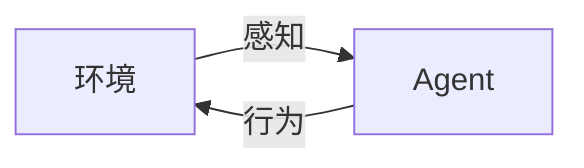
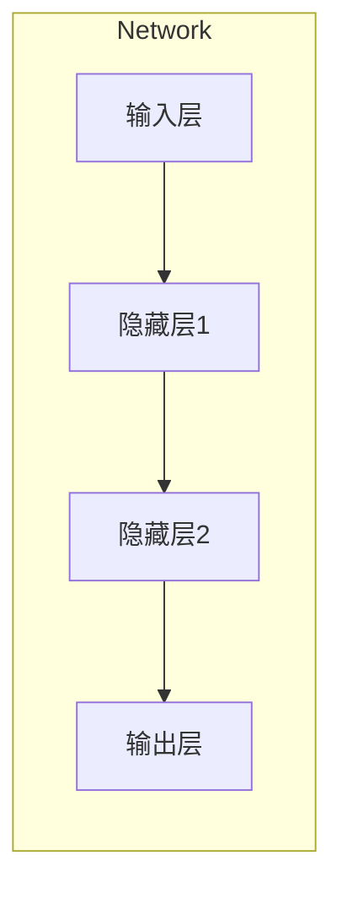
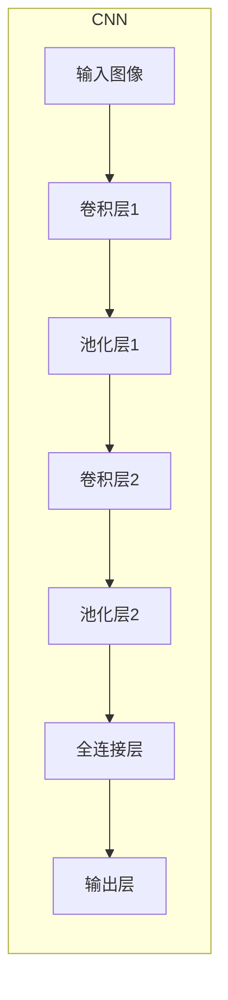
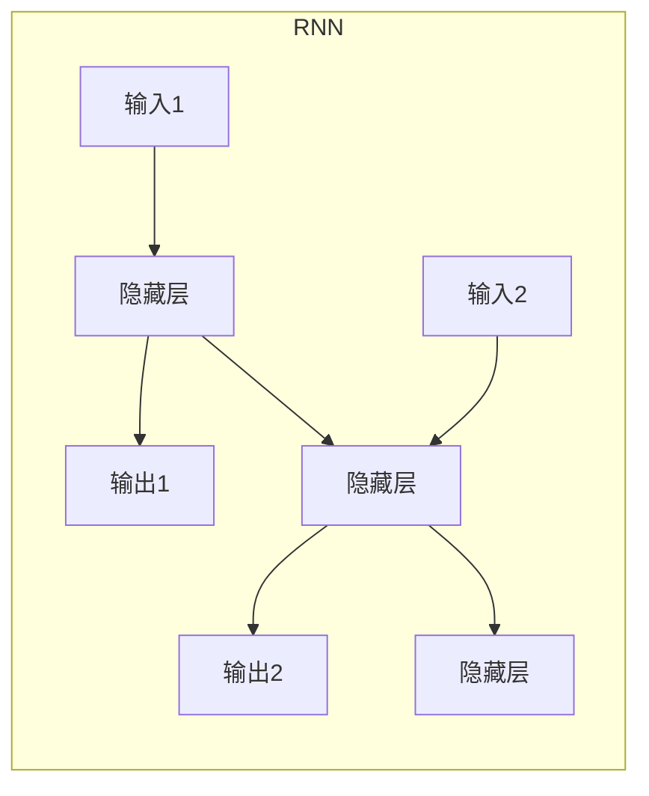
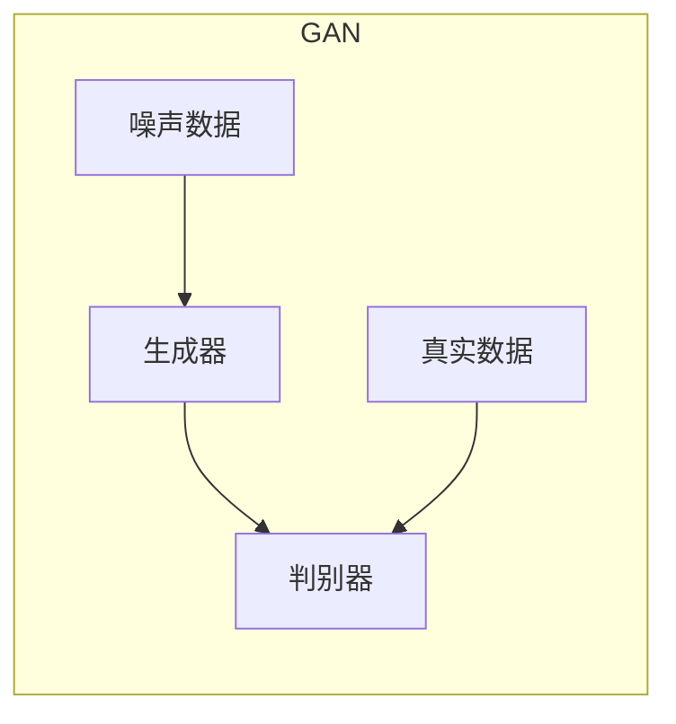

# AI Agent: AI的下一个风口 软件的角色与硬件的配合

## 1. 背景介绍

### 1.1 人工智能的发展历程

人工智能(Artificial Intelligence, AI)是当代科技发展的热点领域之一。自20世纪50年代AI概念被正式提出以来,经历了几个重要的发展阶段。

#### 1.1.1 AI的起步阶段

1956年,AI这一术语在达特茅斯学院的一次会议上被正式使用。会议上,研究人员提出了一些雄心勃勃的目标,如赋予机器智能、解决复杂问题的能力等。这标志着AI研究的开端。

#### 1.1.2 AI的萌芽与低谷期

60年代初期,AI取得了一些初步成果,如机器证明、游戏程序等。但由于计算能力和算法的限制,AI进入了一个相对低迷的阶段。

#### 1.1.3 AI的复兴与深度学习时代  

21世纪初,大数据、强大算力和新算法的出现,推动了AI尤其是深度学习的蓬勃发展。深度学习在计算机视觉、自然语言处理等领域取得了突破性进展。

### 1.2 AI的重要性与影响

AI已经渗透到了现代社会的方方面面,对经济、科技、社会等产生了深远影响。一些典型应用包括:

- 智能家居设备(如语音助手)
- 无人驾驶汽车
- 医疗诊断辅助系统
- 金融风险评估
- 智能安防监控等

AI的发展不仅提高了生产效率,也为人类生活带来了诸多便利。但同时也引发了一些伦理、隐私、就业等方面的担忧和挑战。

## 2. 核心概念与联系  

### 2.1 AI Agent

AI Agent是AI系统的核心组成部分,是感知环境、做出决策并执行行为的智能体。一个理想的AI Agent应该具备:

- 感知能力:获取环境信息
- 认知能力:理解和建模环境
- 决策能力:根据目标制定行动计划 
- 执行能力:采取行动影响环境

AI Agent可以是虚拟软件代理,也可以是具有物理体的机器人Agent。

#### 2.1.1 Agent与环境的交互模型

AI Agent与环境的交互可以用下面的模型描述:



Agent通过感知器获取环境状态,通过执行器对环境产生影响。这是一个持续的循环过程。

#### 2.1.2 Agent程序的基本结构

一个Agent程序的基本结构如下:

```python
def agent_program(percept):
    persistent_data = static_data() # 初始化静态数据
    
    while True:
        percepts = sense_environment(percept) # 获取感知数据
        state = update_state(persistent_data, percepts) # 更新状态
        action = make_decision(state) # 根据状态做出决策
        execute_action(action) # 执行行为
        persistent_data = update_data(persistent_data, action) # 更新持久数据
```

这个程序循环执行感知、决策和行为三个基本步骤。

### 2.2 AI Agent与软硬件的关系

AI Agent作为软件系统,需要在硬件平台上运行。软硬件的配合对Agent的性能有着重要影响。

#### 2.2.1 AI软件与硬件的互馆关系

软件决定了Agent的智能算法和功能,而硬件的计算能力则决定了算法的运行效率。二者相辅相成:

- 软件为硬件赋予"智能"
- 硬件为软件提供计算支持

#### 2.2.2 异构计算与AI加速

为了加速AI算法的运行,出现了诸如GPU、TPU、FPGA等异构计算加速硬件。它们针对AI算法的特点进行了专门的硬件设计和优化。

利用异构计算,可以大幅提升AI软件的性能,这为AI的实际应用提供了强有力的支持。

## 3. 核心算法原理与具体操作步骤

### 3.1 机器学习算法

机器学习是AI的一个重要分支,旨在让计算机从数据中自动分析获得规律,并对新数据作出预测或决策。主要算法包括:

#### 3.1.1 监督学习

##### 3.1.1.1 原理

监督学习的目标是从标注好的训练数据中学习出一个模型,使其能够对新的输入数据作出正确的预测或分类。

常见的监督学习任务包括:

- 分类(Classification): 将输入实例划分到有限个类别中
- 回归(Regression): 预测一个连续的数值输出

##### 3.1.1.2 算法

一些典型的监督学习算法包括:

- 线性回归
- 逻辑回归
- 支持向量机(SVM)
- 决策树和随机森林
- 神经网络

##### 3.1.1.3 操作步骤

1) 收集并准备好标注数据
2) 将数据分为训练集和测试集 
3) 选择合适的算法和模型
4) 训练模型,调整超参数
5) 在测试集上评估模型性能
6) 模型调优,重复以上步骤
7) 应用模型进行预测或决策

#### 3.1.2 无监督学习

##### 3.1.2.1 原理 

无监督学习的目标是从未标注的原始数据中发现内在的模式和结构。它不需要人工标注的训练数据。

常见的无监督学习任务包括:

- 聚类(Clustering): 将相似的实例分组到同一个簇
- 降维(Dimensionality Reduction): 将高维数据映射到低维空间
- 关联规则挖掘(Association Rule Learning)

##### 3.1.2.2 算法

一些典型的无监督学习算法包括:

- K-Means聚类
-层次聚类
- 主成分分析(PCA)
- 奇异值分解(SVD)
- 高斯混合模型(GMM)
- 关联规则挖掘Apriori算法

##### 3.1.2.3 操作步骤

1) 收集原始数据
2) 预处理数据(清洗、标准化等)
3) 选择合适的算法和模型
4) 在数据上运行算法,获得模式
5) 分析并可视化结果
6) 根据需要调整算法参数
7) 应用模式进行数据分析或处理

#### 3.1.3 强化学习

##### 3.1.3.1 原理

强化学习的目标是让Agent通过与环境的互动,自主学习如何获取最大的长期回报。它模拟了人类"试错学习"的过程。

在强化学习中,Agent与环境交互的过程可以看作是一个马尔可夫决策过程(MDP):

- 状态(State): Agent当前所处的环境状态
- 行为(Action): Agent选择的行为
- 奖励(Reward): 环境给Agent的反馈奖励值
- 策略(Policy): Agent如何选择行为的策略

Agent的目标是学习一个最优策略,在长期内获得最大的累计奖励。

##### 3.1.3.2 算法 

一些典型的强化学习算法包括:

- 时序差分学习(Temporal Difference Learning)
- Q-Learning
- Sarsa
- 策略梯度(Policy Gradient)方法
- 深度强化学习(Deep RL)算法,如DQN、A3C等

##### 3.1.3.3 操作步骤

1) 构建环境模型和奖励机制
2) 初始化Agent的状态和策略
3) 让Agent与环境进行互动
4) 观测状态、行为和奖励,更新策略
5) 重复以上步骤,直到策略收敛
6) 评估最终学习到的策略
7) 应用策略指导Agent的行为

### 3.2 深度学习算法

深度学习是机器学习的一个重要分支,它使用深层神经网络模型对数据建模。主要算法包括:

#### 3.2.1 前馈神经网络

##### 3.2.1.1 原理

前馈神经网络是最基本的深度学习模型,它由多个层次的神经元组成,每层之间是全连接的。信息从输入层通过隐藏层向前传播到输出层。

该模型可以用于监督学习任务,如分类和回归。

##### 3.2.1.2 网络结构

前馈神经网络的基本结构如下:



每个神经元对输入信号进行加权求和,然后通过激活函数(如Sigmoid、ReLU等)获得输出。

##### 3.2.1.3 训练算法

- 前向传播计算输出
- 反向传播计算梯度
- 基于梯度下降算法更新权重

#### 3.2.2 卷积神经网络

##### 3.2.2.1 原理

卷积神经网络(CNN)是一种用于处理网格结构数据(如图像)的专门神经网络。它通过卷积、池化等操作来自动提取数据的局部特征。

CNN广泛应用于计算机视觉任务,如图像分类、目标检测、语义分割等。

##### 3.2.2.2 网络结构

CNN的基本结构包括:

- 卷积层: 提取局部特征
- 池化层: 下采样,保留主要特征
- 全连接层: 对特征进行高层次处理



##### 3.2.2.3 训练算法

- 前向传播计算特征映射
- 反向传播计算梯度 
- 基于梯度下降算法更新权重

#### 3.2.3 循环神经网络

##### 3.2.3.1 原理

循环神经网络(RNN)是一种用于处理序列数据(如文本、语音)的神经网络。它在隐藏层中引入了循环连接,能够捕捉序列数据中的长期依赖关系。

RNN常用于自然语言处理、语音识别等任务。

##### 3.2.3.2 网络结构 

RNN的基本结构如下:



隐藏层的状态会被传递到下一个时间步,从而建模序列的动态行为。

##### 3.2.3.3 训练算法  

- 前向传播计算输出序列
- 反向通过时间(BPTT)计算梯度
- 基于梯度下降算法更新权重

#### 3.2.4 生成对抗网络

##### 3.2.4.1 原理

生成对抗网络(GAN)由两个神经网络组成:生成器(Generator)和判别器(Discriminator)。二者相互对抗,最终达到生成器生成的数据无法被判别器区分的平衡状态。

GAN可用于生成逼真的图像、音频、文本等数据。

##### 3.2.4.2 网络结构

GAN的基本结构如下:



生成器从噪声数据生成假数据,判别器判断输入是真实数据还是假数据。

##### 3.2.4.3 训练算法

- 生成器:最小化判别器判别为假的概率
- 判别器:最大化正确区分真假数据的概率
- 生成器和判别器相互对抗地训练

## 4. 数学模型和公式详细讲解举例说明

### 4.1 线性回归

线性回归是一种常用的监督学习算法,用于预测连续的数值输出。给定一组数据样本 $\{(x_i, y_i)\}_{i=1}^N$,线性回归试图找到一个线性函数 $f(x) = wx + b$,使其能够很好地拟合这些数据。

#### 4.1