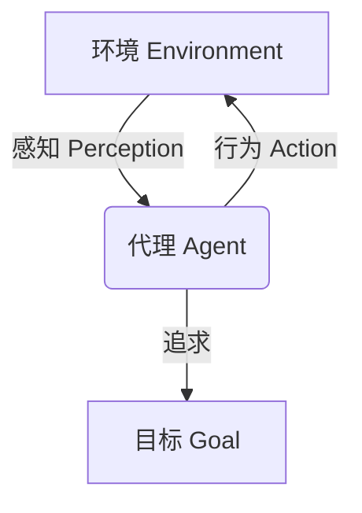

# AI人工智能代理工作流AI Agent WorkFlow：智能代理在航空领域系统中的应用

## 1.背景介绍

### 1.1 航空领域的重要性和复杂性

航空业是一个高度复杂和关键的行业,对安全性、效率和可靠性有着极高的要求。它涉及飞机设计、制造、航线规划、机场运营、空中交通管制等多个环节,每一个环节都需要精密的协调和管理。任何一个小小的失误都可能导致严重的后果。

### 1.2 人工智能在航空领域的应用潜力

传统的航空系统主要依赖人工操作,但人为错误一直是导致事故的主要原因之一。随着人工智能(AI)技术的不断发展,智能代理系统有望在航空领域发挥重要作用,提高效率、降低风险、优化决策。

### 1.3 智能代理的概念

智能代理是一种自主的软件实体,能够感知环境、处理信息、做出决策并执行行动,以实现特定目标。它可以代表人类或其他系统执行各种任务,如数据处理、决策支持、自动化控制等。

## 2.核心概念与联系  

### 2.1 智能代理的核心概念

智能代理系统由以下几个核心概念组成:

1. **代理(Agent)**: 能够自主感知、思考和行动的软件实体。
2. **环境(Environment)**: 代理所处的外部世界,包括其他代理、资源等。
3. **感知(Perception)**: 代理获取环境信息的过程。
4. **行为(Action)**: 代理对环境做出响应的行为。
5. **目标(Goal)**: 代理所要实现的期望状态或任务。

### 2.2 智能代理在航空系统中的作用

在航空系统中,智能代理可以扮演以下角色:

- **决策支持系统**: 辅助人工决策,提供建议和预测。
- **自动化控制系统**: 执行复杂的控制任务,如飞行控制、空中交通管理等。  
- **监控和诊断系统**: 实时监控系统状态,预测故障并提供诊断建议。
- **资源优化系统**: 优化资源分配和调度,提高效率。
- **安全管理系统**: 评估风险,规避潜在危险。

## 3.核心算法原理具体操作步骤

智能代理系统通常采用一些核心算法来实现感知、决策和行为控制,下面将介绍几种常见算法的原理和步骤。

### 3.1 规划算法

规划算法旨在找到从初始状态到目标状态的一系列行动,常用于航路规划、机场运营调度等场景。

#### 3.1.1 A*算法

A*算法是一种常用的启发式搜索算法,它利用评估函数有效地探索解空间。算法步骤如下:

1. 初始化开放列表和闭环列表为空,将起点加入开放列表。
2. 从开放列表中选取评估值最小的节点n。
3. 如果n是目标节点,返回路径并结束。否则将n移到闭环列表。
4. 对n的每个邻居节点m:
    - 如果m在闭环列表中,忽略。
    - 如果m不在开放列表中,将m加入开放列表,设置m的父节点为n。
    - 如果m在开放列表中,检查从n到m的路径是否更短,如果是则更新m的父节点为n。
5. 重复步骤2-4,直到找到目标节点或开放列表为空。

其中,评估函数f(n)=g(n)+h(n),g(n)是从起点到n的实际代价,h(n)是从n到目标的估计代价(启发函数)。

#### 3.1.2 实时再规划算法(RRT)

对于动态环境,RRT算法可以实时重新规划路径。算法步骤:

1. 初始化树T只包含起点。
2. 随机采样一个点x。 
3. 在T中找到最近的节点y。
4. 从y向x延伸一小步得到新节点z,将z加入T。
5. 如果z接近目标点,返回路径并结束。否则重复2-4。

RRT算法通过不断扩展树,逐步逼近目标点,适用于高维空间和复杂约束条件。

### 3.2 强化学习算法

强化学习算法通过探索和利用环境反馈,学习获取最优策略,可应用于飞行控制、空中交通管理等控制系统。

#### 3.2.1 Q-Learning算法 

Q-Learning是一种常用的无模型强化学习算法,不需要事先了解环境的转移概率,算法步骤如下:

1. 初始化Q表格,所有Q(s,a)值设为任意值。
2. 对每个回合:
    - 观察当前状态s
    - 选择一个行动a(如ε-贪婪策略)
    - 执行a,获得回报r,转移到新状态s'
    - 更新Q(s,a)值:
        $$Q(s,a) \leftarrow Q(s,a) + \alpha[r + \gamma\max_a Q(s',a') - Q(s,a)]$$
        其中,α为学习率,γ为折扣因子。
3. 重复步骤2,直到收敛。

Q-Learning通过不断尝试和更新,最终学习到一个最优的Q函数,对应最优策略。

#### 3.2.2 策略梯度算法

策略梯度算法直接对代理的策略进行参数化,通过梯度上升优化策略参数。算法步骤:

1. 初始化策略参数θ。
2. 对每个回合:
    - 生成一个轨迹τ=(s_0,a_0,r_0,s_1,...)根据当前策略π_θ。
    - 计算轨迹的回报R(τ)。
    - 根据R(τ)更新θ:
        $$\theta \leftarrow \theta + \alpha \nabla_\theta \log\pi_\theta(\tau)R(\tau)$$
        其中α为学习率。
3. 重复步骤2,直到收敛。

策略梯度算法适用于连续动作空间,可以直接学习确定性或随机策略。

### 3.3 多智能体协作算法

在复杂的航空系统中,通常需要多个智能代理协同工作。下面介绍一些多智能体协作的算法。

#### 3.3.1 分布值迭代(Distributed Value Function Iteration)

DVI算法将全局最优化问题分解为多个局部子问题,每个代理只需优化自己的Value Function。算法步骤:

1. 每个代理i初始化自己的Value Function $V_i$。
2. 对每个回合:
    - 代理i计算本地最优策略$\pi_i^*$: 
        $$\pi_i^* = \arg\max_{\pi_i} [R_i(\pi_i,\pi_{-i}) + \gamma \sum_{s'}P(s'|s,\pi)V_i(s')]$$
    - 代理i将$\pi_i^*$发送给其他代理。
    - 代理i更新自己的Value Function $V_i$。
3. 重复步骤2,直到收敛。

DVI算法通过值函数迭代和策略协调,使得所有代理的行为收敛到一个稳定的最优策略。

#### 3.3.2 算法博弈(Algorithmic Game Theory)

算法博弈结合了博弈论和算法设计,研究多个自私智能体如何达成均衡。常见的方法有:

- **拍卖算法(Auction Algorithms)**: 通过拍卖的方式分配资源或任务。
- **投票算法(Voting Algorithms)**: 代理通过投票协调决策。
- **博弈论算法**: 如纳什均衡、核算极小化等。

算法博弈为设计多智能体系统提供了理论基础和技术方法。

## 4.数学模型和公式详细讲解举例说明

智能代理系统中常常需要使用数学模型来表示和求解各种问题,下面将详细介绍几种常见模型。

### 4.1 马尔可夫决策过程(MDP)

MDP是一种描述序列决策问题的数学模型,广泛应用于规划、强化学习等领域。一个MDP可以用一个五元组(S, A, P, R, γ)来表示:

- S是状态集合
- A是行动集合  
- P是状态转移概率,P(s'|s,a)表示在状态s执行行动a后转移到状态s'的概率
- R是回报函数,R(s,a)表示在状态s执行行动a获得的即时回报
- γ∈[0,1]是折扣因子,用于权衡即时回报和长期回报

在MDP中,我们的目标是找到一个策略π:S→A,使得期望的累积折扣回报最大:

$$\max_\pi \mathbb{E}\left[\sum_{t=0}^\infty \gamma^t R(s_t, \pi(s_t))\right]$$

例如,在机场运营调度中,我们可以将机场看作MDP的状态,飞机起降等操作看作行动,机场拥堵程度作为回报,目标是最小化拥堵和延误。

### 4.2 部分可观测马尔可夫决策过程(POMDP)

在现实中,智能代理往往无法完全观测到环境的真实状态,这种情况可以用POMDP模型来描述。一个POMDP由一个六元组(S, A, P, R, Ω, O)表示:

- S, A, P, R与MDP相同
- Ω是观测集合
- O是观测概率,O(o|s',a)表示在执行a后,从状态s'观测到o的概率

在POMDP中,代理基于历史观测序列h_t=(o_0,a_0,o_1,a_1,...,o_t)做出决策,策略π为π:H→A,其中H是所有可能历史的集合。

POMDP比MDP更能反映现实情况,但求解更加复杂。它可以应用于飞机故障诊断等需要基于不完全信息做决策的场景。

### 4.3 机器人运动规划

对于无人机、机器人等移动智能体,需要进行运动规划以避障和到达目标位置。常用的数学模型有:

#### 4.3.1 配置空间

配置空间(Configuration Space)是机器人所有可能配置(位置和姿态)的集合C。我们将障碍物从工作空间映射到配置空间,得到C_{obs}。则可行配置为C_{free}=C-C_{obs}。

#### 4.3.2 运动规划问题

运动规划的目标是在C_{free}中找到一条从起点q_{init}到终点q_{goal}的可行路径。数学上可以表示为:

$$\tau^*=\arg\min_{\tau\in\Sigma(q_{init},q_{goal})}\int_\tau c(q(t),\dot{q}(t))dt$$

其中Σ(q_{init},q_{goal})是所有从起点到终点的路径的集合,c是代价函数。

#### 4.3.3 采样型路径规划算法

常用的采样型路径规划算法包括RRT(Rapidly-exploring Random Tree)、PRM(Probabilistic Road Map)等,它们通过在C_{free}中随机采样点并连接这些点来构造路径。

例如,RRT算法从q_{init}开始,反复执行以下步骤:

1. 在C_{free}中随机采样一个点q_{rand}
2. 从树T中找到距离q_{rand}最近的节点q_{near}
3. 以q_{near}为起点,朝q_{rand}方向延伸一小步,得到新节点q_{new}
4. 如果q_{new}可行,则将其加入T

重复上述过程,直到找到到达q_{goal}的路径或达到计算限制。

### 4.4 多智能体系统建模

在复杂的航空系统中,通常需要多个智能代理协同工作,因此需要对多智能体系统进行建模和分析。

#### 4.4.1 马尔可夫游戏(Markov Game)

马尔可夫游戏是MDP的推广,用于描述多个智能体之间的互动。一个n个代理的马尔可夫游戏可以用一个八元组(n, S, A_1,...,A_n, P, R_1,...,R_n)表示:

- n是代理数量
- S是状态集合
- A_i是代理i的行动集合
- P是状态转移概率,P(s'|s,a_1,...,a_n)表示在状态s下,所