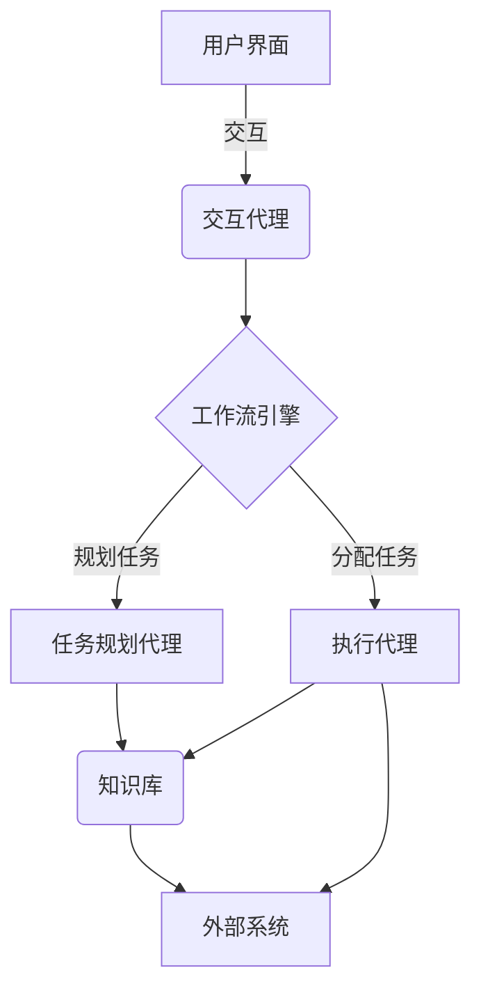

# AI人工智能代理工作流AI Agent WorkFlow：面向未来的AI代理与工作流研究方向

## 1.背景介绍

### 1.1 人工智能代理的兴起

人工智能代理(AI Agent)是近年来兴起的一种新型计算机系统,它集成了人工智能、自然语言处理、知识图谱等多种先进技术,旨在帮助人类完成各种复杂任务。随着人工智能技术的不断发展,AI代理的能力越来越强大,应用场景也越来越广泛。

传统的软件系统往往是被动执行预定义的指令,而AI代理则更加主动和智能化。它能够理解人类的自然语言指令,根据上下文自主规划和执行任务流程,并与人类进行自然交互。AI代理的出现为人机协作带来了全新的体验和可能性。

### 1.2 工作流管理的重要性

在复杂的业务环境中,工作流(Workflow)管理是确保高效协作和优化资源利用的关键。传统的工作流管理系统通常依赖于预先定义的规则和流程,缺乏灵活性和智能化。

随着AI代理技术的兴起,将人工智能引入工作流管理变得可行。智能化的AI代理能够根据实际情况动态调整工作流,提高效率和适应能力。同时,AI代理还可以通过自然语言交互的方式让工作流管理变得更加人性化。

### 1.3 AI代理工作流的应用前景

AI代理工作流技术将人工智能与工作流管理相结合,为企业和组织带来了全新的机遇。它可以广泛应用于各个领域,如:

- 智能办公自动化
- 客户服务与支持
- 项目管理与协作
- 物流与供应链优化
- 医疗健康管理
- 教育与学习辅助

通过AI代理工作流,企业和组织可以提高运营效率、降低人力成本、优化资源配置,并为员工和客户提供更智能化、个性化的服务体验。

## 2.核心概念与联系  

### 2.1 人工智能代理(AI Agent)

人工智能代理是指能够感知环境、规划行动并执行任务的智能系统。它具备以下关键特征:

1. **感知能力**: 通过各种传感器获取环境信息,如视觉、语音、文本等。
2. **认知能力**: 对获取的信息进行理解、推理和决策。
3. **行动能力**: 根据认知结果执行相应的动作,如控制机器人、发送指令等。
4. **交互能力**: 与人类或其他代理进行自然语言交互。
5. **学习能力**: 通过经验不断优化自身的知识库和决策模型。

人工智能代理的核心是智能决策系统,它需要综合利用多种人工智能技术,如机器学习、自然语言处理、知识表示与推理等。

### 2.2 工作流管理(Workflow Management)

工作流管理是指对组织内部的业务流程进行有效管理和优化。它通常包括以下几个关键环节:

1. **流程建模**: 对业务流程进行形式化描述和可视化表示。
2. **流程执行**: 根据建模的流程自动分配任务、传递数据等。
3. **流程监控**: 实时跟踪流程执行情况,发现并解决异常问题。
4. **流程优化**: 基于历史数据和反馈,不断优化和重新设计流程。

传统的工作流管理系统主要依赖于预定义的规则和人工干预,缺乏智能化和自适应能力。

### 2.3 AI代理工作流

AI代理工作流是将人工智能代理技术与工作流管理相结合的新型范式。它的核心思想是:

1. 利用AI代理的感知、认知和交互能力,实现工作流的智能化管理。
2. 通过AI代理的自主决策和行动能力,动态优化和执行工作流。
3. 将人机协作融入工作流,实现人机混合智能的高效协同。

AI代理工作流系统通常由多个AI代理组成,它们分工协作完成不同的任务,并通过工作流进行有序的交互和协调。这种范式赋予了工作流更强的智能性、自适应性和人性化体验。

## 3.核心算法原理具体操作步骤

### 3.1 AI代理工作流系统架构

一个典型的AI代理工作流系统架构包括以下几个核心模块:

1. **AI代理模块**: 包含多个具有不同功能的AI代理,如任务规划代理、执行代理、交互代理等。
2. **工作流引擎**: 负责工作流的建模、执行、监控和优化。
3. **知识库**: 存储系统所需的各种知识,如领域知识、流程模型、历史数据等。
4. **通信中间件**: 实现AI代理之间以及代理与外部系统之间的通信和协作。

这些模块通过标准化的接口和协议进行交互和集成,形成一个灵活、可扩展的AI代理工作流系统。

### 3.2 工作流建模与优化算法

工作流建模是AI代理工作流系统的基础。常用的建模方法包括:

1. **基于规则的建模**: 根据领域专家的经验,使用规则语言(如BPMN)描述流程。
2. **基于数据的建模**: 从历史日志数据中自动发现流程模型,常用算法有α算法、遗传算法等。
3. **基于目标的建模**: 根据预定义的目标和约束,自动生成满足条件的最优流程模型。

对于已建模的工作流,AI代理可以利用各种优化算法进行动态调整,以提高效率和适应性:

- **启发式搜索算法**: 如A*算法、启发式修复算法等,用于快速规划任务流程。
- **强化学习算法**: 如Q-Learning、策略梯度等,通过试错学习优化决策策略。
- **在线规划算法**: 如马尔可夫决策过程(MDP)、部分可观测马尔可夫决策过程(POMDP)等,用于处理不确定环境。

### 3.3 AI代理协作与任务分解

在AI代理工作流系统中,通常需要多个代理协作完成复杂任务。任务分解是实现协作的关键:

1. **层次分解**: 将高层次的抽象任务逐步分解为具体的子任务。
2. **功能分解**: 根据不同代理的功能特点,将任务分配给最合适的代理执行。
3. **时空分解**: 将任务按时间或空间维度进行划分,由不同代理并行执行。

任务分解后,各个AI代理需要基于工作流模型协调行动。常用的协作策略包括:

- **层次协作**: 高层代理分配任务,低层代理执行任务,并向上层反馈结果。
- **市场机制**: 代理通过竞价的方式获取任务,实现分散式协作。
- **组织模型**: 代理按照预定义的组织结构和角色进行协作。

此外,AI代理还需要具备有效的冲突检测和解决机制,以确保协作的一致性和高效性。

### 3.4 人机交互与混合智能

人机交互是AI代理工作流系统的重要组成部分。常用的交互方式包括:

1. **自然语言交互**: 用户可以用自然语言指令控制工作流的执行。
2. **图形用户界面**: 提供可视化的流程监控和控制界面。
3. **虚拟助理**: 基于对话代理技术,模拟人性化的虚拟助手。
4. **增强现实**: 将虚拟信息叠加到现实环境中,实现无缝交互。

除了人机交互,AI代理工作流系统还需要支持人机混合智能协作:

1. **人工干预**: 人工专家可以在必要时介入工作流,对AI代理的决策进行审核和调整。
2. **交互式学习**: AI代理通过与人类的交互来持续优化自身的知识和决策模型。
3. **群体智能**: 将人工专家的集体智慧与AI代理的计算能力相结合。

人机混合智能协作可以发挥人类的创造力和AI代理的高效性,实现"1+1>2"的协同效应。

## 4.数学模型和公式详细讲解举例说明

### 4.1 马尔可夫决策过程(MDP)

马尔可夫决策过程(Markov Decision Process, MDP)是AI代理工作流系统中常用的数学模型,用于描述和求解序列决策问题。一个MDP可以形式化定义为一个五元组$(S, A, P, R, \gamma)$:

- $S$是有限的状态集合
- $A$是有限的动作集合
- $P(s'|s,a)$是状态转移概率,表示在状态$s$执行动作$a$后,转移到状态$s'$的概率
- $R(s,a)$是奖励函数,表示在状态$s$执行动作$a$获得的即时奖励
- $\gamma \in [0,1)$是折现因子,用于权衡即时奖励和长期收益

在MDP中,AI代理的目标是找到一个最优策略$\pi^*(s)$,使得从任意初始状态$s_0$开始,按照该策略执行动作序列,可以最大化预期的累积奖励:

$$
V^*(s_0) = \max_\pi E\left[\sum_{t=0}^\infty \gamma^t R(s_t, \pi(s_t))\right]
$$

其中$V^*(s_0)$被称为最优价值函数。

求解MDP的经典算法有价值迭代和策略迭代等。此外,还可以利用深度强化学习等技术,从大量经验中直接学习最优策略,而无需事先建模MDP。

在AI代理工作流系统中,MDP可以用于任务规划和流程优化。例如,将工作流中的每个状态看作MDP的状态,将可执行的任务看作动作,则AI代理可以通过求解MDP来获得最优的任务执行序列。

### 4.2 部分可观测马尔可夫决策过程(POMDP)

部分可观测马尔可夫决策过程(Partially Observable Markov Decision Process, POMDP)是MDP的扩展,用于描述部分可观测的序列决策问题。一个POMDP可以形式化定义为一个六元组$(S, A, P, R, \Omega, O)$:

- $S, A, P, R$与MDP中的定义相同
- $\Omega$是有限的观测集合
- $O(o|s',a)$是观测概率,表示在执行动作$a$并转移到状态$s'$后,获得观测$o$的概率

在POMDP中,AI代理无法直接获取当前状态,只能通过观测来估计状态。因此,AI代理需要维护一个称为信念状态(belief state)的概率分布,表示对当前状态的估计。信念状态可以根据观测和状态转移概率进行更新,更新规则如下:

$$
b'(s') = \eta O(o|s',a)\sum_{s \in S}P(s'|s,a)b(s)
$$

其中$\eta$是归一化常数,使$\sum_{s'}b'(s')=1$。

在POMDP中,AI代理的目标是找到一个最优策略$\pi^*(b)$,使得从任意初始信念状态$b_0$开始,按照该策略执行动作序列,可以最大化预期的累积奖励:

$$
V^*(b_0) = \max_\pi E\left[\sum_{t=0}^\infty \gamma^t R(s_t, \pi(b_t))\right]
$$

求解POMDP的经典算法有基于点的价值迭代、有界策略迭代等。近年来,基于深度学习的方法也展现出良好的性能。

在AI代理工作流系统中,POMDP可以用于处理不确定环境下的任务规划和执行。例如,当工作流的某些状态无法被完全观测时,AI代理可以基于POMDP模型进行推理和决策,以适应不确定性。

### 4.3 组织建模与博弈论

在AI代理工作流系统中,通常需要多个代理协同工作。组织建模(Organizational