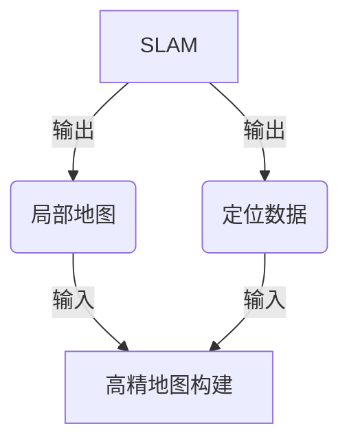
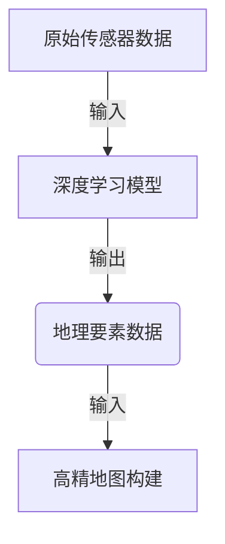
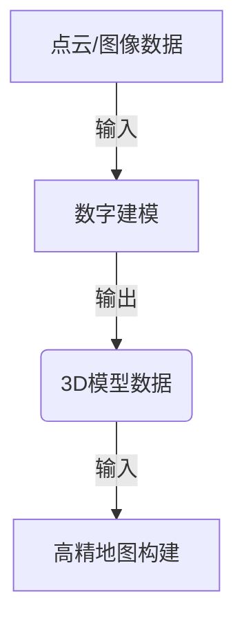
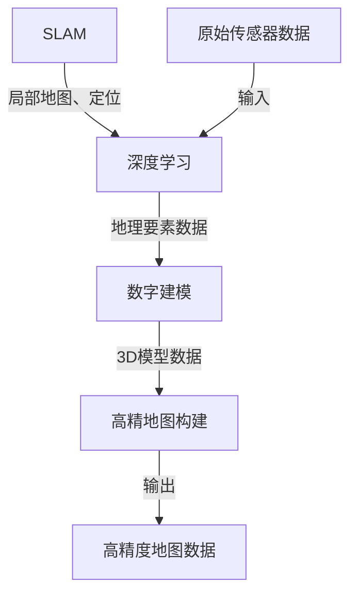

# AI人工智能深度学习算法：在高精地图构建中的应用

## 1.背景介绍

### 1.1 高精地图的重要性

随着自动驾驶技术的快速发展,高精度地图已成为其核心基础设施之一。高精度地图不仅能够为自动驾驶汽车提供精确的道路信息和周边环境数据,还能为规划路线、感知障碍物和定位等关键功能提供支持。因此,构建高质量的高精地图对于实现安全可靠的自动驾驶至关重要。

### 1.2 传统地图构建方法的局限性

传统的地图构建方法主要依赖于人工采集和标注数据,这种方式存在以下几个主要缺陷:

- 效率低下且成本高昂
- 数据质量参差不齐,难以满足自动驾驶的高精度要求
- 无法及时更新动态路况和临时障碍物信息

因此,迫切需要一种新的高效、准确、可扩展的地图构建解决方案。

### 1.3 AI深度学习在地图构建中的应用前景

近年来,人工智能(AI)深度学习技术取得了长足进步,尤其在计算机视觉和模式识别领域表现出色。将深度学习算法应用于高精地图的构建,可以自动从海量传感器数据(如激光雷达点云、视频图像等)中提取所需的地理信息,从而大幅提高地图制作效率,降低人工成本,并确保数据质量。

本文将重点探讨如何将深度学习算法与其他先进技术(如SLAM、数字建模等)相结合,为高精地图的快速高效构建提供创新的解决方案。

## 2.核心概念与联系

在介绍具体算法之前,我们先来了解一些核心概念及其相互关系。

### 2.1 SLAM

SLAM(同步定位与地图构建)是自动驾驶领域的基础技术之一。它使用传感器(如激光雷达、相机等)感知周围环境,并同时估计车辆的位置和构建环境地图。SLAM的输出是局部地图和定位数据,为后续的高精地图构建提供了重要数据源。

### 2.2 深度学习

深度学习是机器学习的一个新兴热点领域,它通过对数据建模的方式更好地拟合真实数据,在计算机视觉、自然语言处理等领域表现出优异性能。在高精地图构建中,深度学习可以自动从原始传感器数据中提取所需的地理要素信息。

### 2.3 数字建模

数字建模技术能够将采集的点云、图像等原始数据转换为精确的3D模型,用于表示真实世界的物理环境。在高精地图构建过程中,数字建模可以提供精细的几何形状和空间信息。

### 2.4 整体流程

综合以上三个核心技术,高精地图构建的整体流程如下:

## 3.核心算法原理具体操作步骤

高精地图构建的核心算法可以概括为以下几个关键步骤:

### 3.1 数据采集

使用多种传感器(如激光雷达、摄像机、GPS/IMU等)采集车载环境数据,包括点云、图像、位置和姿态信息等。这些原始数据为后续的数据处理和分析奠定基础。

### 3.2 SLAM定位与映射

利用SLAM算法,将采集的点云、图像等数据进行实时建图和定位。SLAM输出包括局部地图和定位轨迹,为地图构建提供基本地理信息。

常用的SLAM算法有:

- 基于滤波的SLAM (如卡尔曼滤波、粒子滤波)
- 基于图优化的SLAM (如g2o、GTSAM)
- 基于学习的SLAM (如DeepLearning SLAM)

### 3.3 深度学习语义分割

将SLAM的点云数据、图像数据输入到训练好的深度学习模型中,对场景中的道路、车辆、行人、路牌等对象进行像素级语义分割。这一步的输出是分割后的地理要素数据。

常用的深度学习模型有:

- 全卷积网络 (FCN)
- SegNet
- Mask R-CNN
- DeepLab 系列

### 3.4 数字建模与融合

利用分割后的地理要素数据,结合原始点云和图像,通过数字建模技术生成精确的3D模型。这些模型包含了场景的几何形状、空间尺寸和语义信息。

在此过程中,还需要对来自不同传感器的异构数据进行时空准确的融合与配准,以消除噪声和冲突。

### 3.5 地图数据组织与优化

将上一步获得的3D模型数据与SLAM的定位轨迹相结合,构建出初始的地图数据。然后对地图数据进行空间分块组织、冗余去除和拓扑结构构建等优化,生成高质量、高精度的地图数据产品。

### 3.6 实时更新与发布

最后一步是实时更新地图数据并发布给使用者。由于实际道路环境是动态变化的,因此需要持续采集新数据,并将变化的部分实时更新到地图中。同时还需要提供高效的数据分发和访问机制,确保地图数据可以被自动驾驶系统实时获取和使用。

## 4.数学模型和公式详细讲解举例说明

在高精地图构建的算法流程中,涉及了多种数学模型和公式,下面将对其中的几个关键模型进行详细讲解。

### 4.1 SLAM中的运动模型

SLAM算法需要建立运动模型来描述机器人(车辆)在世界坐标系下的运动状态,常用的有:

$$
\boldsymbol{x}_t = f(\boldsymbol{x}_{t-1}, \boldsymbol{u}_t) + \boldsymbol{\epsilon}_t^x \\
\boldsymbol{z}_t = h(\boldsymbol{x}_t) + \boldsymbol{\epsilon}_t^z
$$

其中 $\boldsymbol{x}_t$ 为时刻t的状态变量(如位姿)，$\boldsymbol{u}_t$ 为控制量(如速度、角速度)，$\boldsymbol{z}_t$ 为观测量(如激光点云)，$f(\cdot)$ 为状态转移方程，$h(\cdot)$ 为观测方程，$\boldsymbol{\epsilon}_t^x$ 和 $\boldsymbol{\epsilon}_t^z$ 分别为过程噪声和观测噪声。

以常见的机器人运动模型为例:

$$
\begin{bmatrix}
x_t\\
y_t\\
\theta_t
\end{bmatrix} = 
\begin{bmatrix}
x_{t-1} + v_t \cdot \cos(\theta_{t-1} + \omega_t) \cdot \Delta t\\
y_{t-1} + v_t \cdot \sin(\theta_{t-1} + \omega_t) \cdot \Delta t\\
\theta_{t-1} + \omega_t \cdot \Delta t
\end{bmatrix} + \boldsymbol{\epsilon}_t^x
$$

这里 $(x, y, \theta)$ 为机器人的位姿，$(v, \omega)$ 为线速度和角速度控制量，$\Delta t$ 为时间间隔。

### 4.2 深度学习模型

深度学习模型的核心是通过多层非线性变换来拟合输入数据,常用的是人工神经网络模型。以三层全连接网络为例:

$$
\begin{aligned}
\boldsymbol{h}^{(1)} &= \sigma(\boldsymbol{W}^{(1)} \boldsymbol{x} + \boldsymbol{b}^{(1)})\\
\boldsymbol{h}^{(2)} &= \sigma(\boldsymbol{W}^{(2)} \boldsymbol{h}^{(1)} + \boldsymbol{b}^{(2)})\\
\boldsymbol{y} &= \boldsymbol{W}^{(3)} \boldsymbol{h}^{(2)} + \boldsymbol{b}^{(3)}
\end{aligned}
$$

其中 $\boldsymbol{x}$ 为输入, $\boldsymbol{y}$ 为输出, $\boldsymbol{h}^{(i)}$ 为第i层隐藏层的激活值, $\boldsymbol{W}^{(i)}$ 和 $\boldsymbol{b}^{(i)}$ 分别为权重和偏置参数, $\sigma(\cdot)$ 为非线性激活函数(如ReLU、Sigmoid等)。

通过有监督或无监督的方式学习模型参数,使得输出 $\boldsymbol{y}$ 能很好地拟合训练数据,从而获得强大的特征表达能力。

### 4.3 数字建模中的曲面重建

数字建模的一项关键技术是曲面重建,即由有限的点云数据重建出连续的曲面模型。常用的方法是基于移动最小二乘面(Moving Least Squares, MLS)的投影算法。

对于一个局部领域 $\mathcal{N}(p)$ 内的点云 $\{q_i\}_{i=1}^n$,MLS面 $\mathcal{S}(p)$ 由以下优化问题求解:

$$
\begin{aligned}
\min_{\boldsymbol{a}(p)} \sum_{i=1}^n &\Big( \boldsymbol{a}(p)^T \begin{bmatrix}q_i - p\\ 1\end{bmatrix} \Big)^2 \theta\Big(\|q_i - p\|^2\Big)\\
\text{s.t. } &\|\boldsymbol{a}(p)\|^2 = 1
\end{aligned}
$$

其中 $\theta(\cdot)$ 为权重函数,确保远离 $p$ 的点对拟合面的影响越小。

求得 $\boldsymbol{a}(p)$ 后,局部重建面为:

$$
\mathcal{S}(p) = \{ q \in \mathbb{R}^3 \mid \boldsymbol{a}(p)^T \begin{bmatrix}q - p\\ 1\end{bmatrix} = 0 \}
$$

通过在每个点 $p$ 处重复上述过程,即可获得完整的曲面模型。

### 4.4 地图优化中的误差最小化

在地图构建的最后阶段,需要优化地图数据以提高精度。常用的方法是将其建模为一个误差最小化问题:

$$
\begin{aligned}
\min_{\boldsymbol{x}_1, \ldots, \boldsymbol{x}_n} &\sum_{i=1}^n \sum_{j \in \mathcal{N}_i} \rho\Big(\big\|\boldsymbol{e}_{ij}(\boldsymbol{x}_i, \boldsymbol{x}_j)\big\|_{\boldsymbol{\Sigma}_{ij}}^2\Big)\\
\text{s.t. } &\boldsymbol{x}_i \in \mathcal{C}_i, \quad i=1,\ldots,n
\end{aligned}
$$

其中 $\boldsymbol{x}_i$ 为第i个位姿节点的状态变量, $\boldsymbol{e}_{ij}(\cdot)$ 为误差项(如位姿变换残差), $\rho(\cdot)$ 为鲁棒核函数(如阶梯函数、Cauchy核等)用于降低outlier的影响, $\boldsymbol{\Sigma}_{ij}$ 为协方差矩阵, $\mathcal{N}_i$ 为与第i个节点相连的节点集合, $\mathcal{C}_i$ 为节点状态的约束条件。

通过优化求解上述非线性最小二乘问题,即可获得全局一致的高精度位姿和地图估计。

以上是高精地图构建过程中涉及的几种数学模型,还有很多其他模型(如点云配准的I