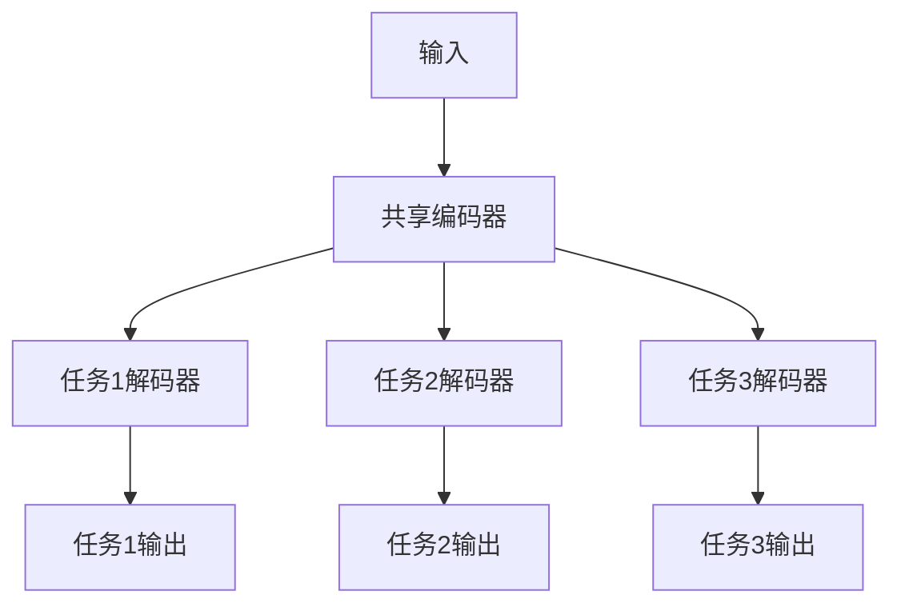

# AI大模型中的多任务学习：一石多鸟

## 1.背景介绍

### 1.1 人工智能的发展历程

人工智能(Artificial Intelligence, AI)是当代科技发展的前沿领域,近年来取得了长足的进步。从早期的专家系统、机器学习算法,到深度学习的兴起,再到当前的大型语言模型和多模态AI系统,AI技术不断突破,正在深刻影响和改变着各行各业。

### 1.2 大模型的兴起

传统的机器学习模型通常专注于解决单一任务,但现实世界中的问题往往是复杂多变的。为了应对这一挑战,研究人员开发了大规模的人工神经网络模型,俗称"大模型"。这些庞大的模型通过消化大量数据进行预训练,获得了广泛的知识,并可以通过微调等方式快速适应各种下游任务。

### 1.3 多任务学习的重要性

尽管大模型展现出了强大的能力,但独立训练多个单一任务的模型在计算和存储资源上是低效的。为了提高资源利用率并充分发挥大模型的潜力,多任务学习(Multi-Task Learning, MTL)应运而生。MTL旨在使单个模型能够同时处理多个不同但相关的任务,从而实现"一石多鸟"的效果。

## 2.核心概念与联系

### 2.1 什么是多任务学习?

多任务学习是一种机器学习范式,它使用单个模型同时学习解决多个相关任务。与传统的独立训练多个单一任务模型不同,MTL利用不同任务之间的相关性,共享底层知识表示,从而提高了数据利用效率、减少了计算资源消耗,并增强了模型的泛化能力。

### 2.2 多任务学习与迁移学习的关系

多任务学习与迁移学习(Transfer Learning)有着密切的联系。迁移学习旨在将在源域学习到的知识迁移到目标域,以提高目标任务的性能。而多任务学习则是在不同但相关的任务之间共享知识表示,可视为一种"同域迁移"。实际上,两者往往结合使用,先在多个源任务上进行多任务学习,再将获得的知识迁移到目标任务中。

### 2.3 多任务学习的挑战

尽管多任务学习带来了诸多好处,但也面临一些挑战:

1. **任务关联性**: 不同任务之间的关联程度会影响知识共享的效果。如果任务之间关联性较低,共享知识反而会引入噪声,降低性能。

2. **任务权衡**: 在多任务学习中,不同任务的重要性可能不同,需要平衡各个任务的权重,避免某些任务被忽视。

3. **计算复杂度**: 同时训练多个任务会增加计算开销,对硬件资源的需求也更高。

4. **数据不平衡**: 不同任务可能拥有不同数量的训练数据,如何有效利用这些不平衡的数据是一个挑战。

## 3.核心算法原理具体操作步骤

多任务学习的核心思想是在底层网络中共享知识表示,同时为每个任务设置特定的输出层。下面我们将介绍一种常见的硬参数共享的多任务学习算法。

### 3.1 模型架构

我们以一个包含共享编码器和多个任务特定解码器的模型为例。如下图所示:



该模型由以下几个部分组成:

1. **输入层**: 接收原始输入数据,如文本、图像等。

2. **共享编码器**: 一个共享的网络层,用于从输入中提取通用的特征表示。所有任务共享这个编码器的参数。

3. **任务特定解码器**: 每个任务都有一个独立的解码器网络,将共享编码器的输出映射到该任务的目标空间。

4. **输出层**: 每个任务都有一个单独的输出层,生成该任务的预测结果。

### 3.2 前向传播

在前向传播过程中,输入数据首先通过共享编码器提取特征表示,然后分别传递到每个任务的解码器中。每个解码器根据自身的参数和目标任务,对编码器输出进行进一步的转换和处理,最终生成该任务的预测输出。

### 3.3 损失函数

我们将每个任务的损失函数相加,作为整个多任务模型的总损失:

$$J(\theta) = \sum_{t=1}^{T} \lambda_t J_t(\theta)$$

其中:
- $T$ 是总任务数
- $J_t(\theta)$ 是第 $t$ 个任务的损失函数
- $\lambda_t$ 是第 $t$ 个任务的权重系数,用于平衡不同任务的重要性

通常,我们会在验证集上调整这些权重系数,以获得最佳的多任务性能。

### 3.4 反向传播与参数更新

在反向传播阶段,我们计算总损失相对于每个参数的梯度,并使用优化算法(如随机梯度下降)更新参数。由于共享编码器的参数被所有任务共享,因此会同时受到来自所有任务的梯度的影响,从而实现知识共享。

具体的参数更新规则为:

$$\theta \leftarrow \theta - \eta \frac{\partial J(\theta)}{\partial \theta}$$

其中 $\eta$ 是学习率。

通过不断迭代上述前向传播、计算损失、反向传播和参数更新的过程,模型就可以同时学习解决多个任务。

## 4.数学模型和公式详细讲解举例说明

在多任务学习中,我们通常使用硬参数共享的方式,即不同任务共享底层网络的参数。这种方式可以用数学模型来表示。

假设我们有 $T$ 个任务,每个任务 $t$ 都有一个相应的损失函数 $\mathcal{L}_t$。我们的目标是最小化所有任务损失函数的加权和:

$$\min_{\theta} \sum_{t=1}^{T} \lambda_t \mathcal{L}_t(\theta)$$

其中 $\theta$ 表示模型的参数,而 $\lambda_t$ 是第 $t$ 个任务的权重系数,用于平衡不同任务的重要性。

在硬参数共享的多任务学习中,我们将模型的参数 $\theta$ 分为两部分:共享参数 $\theta_s$ 和任务特定参数 $\theta_t^{(1)}, \theta_t^{(2)}, \ldots, \theta_t^{(T)}$。共享参数 $\theta_s$ 由所有任务共享,而每个任务 $t$ 还有自己的特定参数 $\theta_t$。

因此,我们可以将目标函数重写为:

$$\min_{\theta_s, \theta_t^{(1)}, \ldots, \theta_t^{(T)}} \sum_{t=1}^{T} \lambda_t \mathcal{L}_t\left(f_t\left(x; \theta_s, \theta_t^{(t)}\right), y_t\right)$$

其中 $f_t$ 是第 $t$ 个任务的模型函数,它取决于共享参数 $\theta_s$ 和该任务的特定参数 $\theta_t^{(t)}$。$x$ 和 $y_t$ 分别表示输入和第 $t$ 个任务的目标输出。

通过优化上述目标函数,我们可以同时学习共享参数 $\theta_s$ 和每个任务的特定参数 $\theta_t^{(t)}$。共享参数 $\theta_s$ 捕获了不同任务之间的共同知识,而特定参数 $\theta_t^{(t)}$ 则编码了每个任务的独特特征。

让我们用一个具体的例子来说明。假设我们有两个文本分类任务:情感分析和主题分类。我们可以使用一个共享的 BERT 编码器作为 $\theta_s$,并为每个任务添加一个特定的分类头作为 $\theta_t^{(1)}$ 和 $\theta_t^{(2)}$。

在训练过程中,BERT 编码器会从两个任务中学习通用的文本表示,而分类头则专门学习每个任务的特定知识。通过这种方式,我们可以利用两个任务之间的相关性来提高模型的性能,同时降低计算和存储开销。

## 4.项目实践:代码实例和详细解释说明

为了更好地理解多任务学习,我们将使用 PyTorch 提供一个简单的代码示例,实现一个基本的硬参数共享多任务模型。

在这个例子中,我们将构建一个共享编码器和两个任务特定解码器的模型,用于同时解决回归和分类任务。

### 4.1 导入必要的库

```python
import torch
import torch.nn as nn
import torch.optim as optim
```

### 4.2 定义模型

```python
class MultiTaskModel(nn.Module):
    def __init__(self, input_size, hidden_size, output_size_reg, output_size_cls):
        super(MultiTaskModel, self).__init__()
        
        # 共享编码器
        self.encoder = nn.Sequential(
            nn.Linear(input_size, hidden_size),
            nn.ReLU()
        )
        
        # 回归任务解码器
        self.decoder_reg = nn.Linear(hidden_size, output_size_reg)
        
        # 分类任务解码器
        self.decoder_cls = nn.Sequential(
            nn.Linear(hidden_size, hidden_size),
            nn.ReLU(),
            nn.Linear(hidden_size, output_size_cls)
        )
        
    def forward(self, x):
        # 通过共享编码器提取特征
        encoded = self.encoder(x)
        
        # 通过任务特定解码器进行预测
        output_reg = self.decoder_reg(encoded)
        output_cls = self.decoder_cls(encoded)
        
        return output_reg, output_cls
```

在这个模型中,我们定义了一个共享编码器 `self.encoder` 和两个任务特定解码器 `self.decoder_reg` 和 `self.decoder_cls`。

在 `forward` 函数中,输入数据 `x` 首先通过共享编码器提取特征表示 `encoded`。然后,`encoded` 分别传递给两个解码器,生成回归任务的输出 `output_reg` 和分类任务的输出 `output_cls`。

### 4.3 定义损失函数

```python
def multi_task_loss(output_reg, output_cls, target_reg, target_cls):
    # 回归任务损失
    loss_reg = nn.MSELoss()(output_reg, target_reg)
    
    # 分类任务损失
    loss_cls = nn.CrossEntropyLoss()(output_cls, target_cls)
    
    # 总损失 = 回归损失 + 分类损失
    loss = loss_reg + loss_cls
    
    return loss
```

在这个例子中,我们将回归任务的均方误差损失和分类任务的交叉熵损失相加,作为总损失。在实际应用中,你可以根据任务的重要性对损失函数进行加权。

### 4.4 训练模型

```python
# 创建模型实例
model = MultiTaskModel(input_size=10, hidden_size=20, output_size_reg=1, output_size_cls=3)

# 定义优化器
optimizer = optim.SGD(model.parameters(), lr=0.01)

# 训练循环
for epoch in range(num_epochs):
    for batch_x, batch_y_reg, batch_y_cls in data_loader:
        # 前向传播
        output_reg, output_cls = model(batch_x)
        
        # 计算损失
        loss = multi_task_loss(output_reg, output_cls, batch_y_reg, batch_y_cls)
        
        # 反向传播
        optimizer.zero_grad()
        loss.backward()
        optimizer.step()
```

在训练过程中,我们首先创建一个 `MultiTaskModel` 实例,并定义一个优化器。然后,在每个训练epoch中,我们遍历数据加载器,获取输入数据 `batch_x` 和两个任务的目标输出 `batch_y_reg` 和 `batch_y_cls`。

接下来,我们进行前向传播,获取模型对两个任务的预测输出 `output_reg` 和 `output_cls`。然后,我们使用 `multi_task_loss` 函数计算总损失。

最后,我们执行反向传播,计算梯度并使用优化器