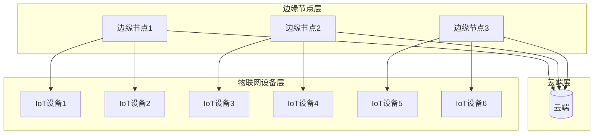

# AI模型部署到边缘原理与代码实战案例讲解

## 1.背景介绍

### 1.1 边缘计算的兴起

随着物联网(IoT)设备和5G网络的快速发展,越来越多的数据被产生并需要实时处理。传统的云计算架构由于网络延迟和带宽限制,难以满足实时性和隐私性等新兴需求。为了解决这些挑战,边缘计算(Edge Computing)应运而生。

边缘计算是一种将计算资源靠近数据源的分布式计算范式,旨在减少数据传输延迟,提高响应速度,降低带宽成本,并增强隐私和安全性。它将计算能力下沉到靠近数据源的边缘设备(如网关、路由器、工业PC等),在边缘节点执行数据处理、分析和决策,只将必要的数据传输到云端。

### 1.2 AI模型在边缘设备上的应用

人工智能(AI)技术的飞速发展推动了许多创新应用,如计算机视觉、自然语言处理、预测分析等。然而,将训练好的AI模型部署到资源受限的边缘设备上面临诸多挑战,如模型大小、计算能力、内存限制、功耗等。

通过模型压缩、量化、蒸馏等技术,可以将庞大的AI模型精简到能够在边缘设备上高效运行。同时,专门为边缘设备设计的硬件加速器(如GPU、TPU、NPU等)也为AI模型在边缘的部署提供了硬件支持。

将AI模型部署到边缘设备上,可以极大提高实时响应能力,减少数据传输,增强隐私保护,并降低运营成本。它广泛应用于智能视频分析、工业自动化、智能家居、自动驾驶等领域。

## 2.核心概念与联系  

### 2.1 边缘计算架构

边缘计算架构通常由三个层次组成:

1. **物联网设备层(IoT Device Layer)**: 包括传感器、摄像头、可穿戴设备等数据采集设备。
2. **边缘节点层(Edge Node Layer)**: 由具有一定计算能力的边缘设备(如网关、工业PC等)组成,负责对采集的数据进行本地处理、分析和决策。
3. **云端层(Cloud Layer)**: 提供大规模的存储和计算资源,用于存储历史数据、训练AI模型、进行复杂的数据分析等。

边缘节点通过有线或无线网络与物联网设备相连,实现数据采集。同时,边缘节点也与云端保持连接,用于同步数据、更新模型等。

### 2.2 AI模型部署流程

将AI模型部署到边缘设备上的典型流程包括:

1. **模型训练**: 使用大量标注数据在云端训练AI模型,获得高精度的模型。
2. **模型优化**: 通过模型压缩、量化、蒸馏等技术,将庞大模型精简为能在边缘设备上高效运行的小模型。
3. **模型转换**: 将优化后的模型转换为边缘设备支持的格式(如TensorFlow Lite、ONNX等)。
4. **模型部署**: 将转换后的模型部署到边缘设备上,并结合设备硬件加速器(如GPU、TPU等)进行加速推理。
5. **模型更新**: 根据边缘设备的反馈数据,在云端重新训练并优化模型,然后推送到边缘设备更新模型。

## 3.核心算法原理具体操作步骤

### 3.1 模型压缩

模型压缩旨在减小深度神经网络模型的大小和计算复杂度,使其能够在资源受限的边缘设备上高效运行。常见的模型压缩技术包括:

#### 3.1.1 网络剪枝(Network Pruning)

网络剪枝通过移除神经网络中的冗余权重连接来减小模型大小,同时尽量保持模型精度。典型的剪枝算法包括:

1. **权重剪枝(Weight Pruning)**: 移除权重绝对值较小的连接。
2. **滤波器剪枝(Filter Pruning)**: 移除对输出贡献较小的整个滤波器。
3. **通道剪枝(Channel Pruning)**: 移除对输出贡献较小的整个通道。

剪枝算法通常包括三个步骤:

1. **评估连接重要性**: 根据某种评价标准(如权重绝对值、滤波器范数等)确定连接的重要性。
2. **移除冗余连接**: 根据重要性评分,移除不重要的连接。
3. **微调模型**: 在移除连接后,微调剩余权重以恢复模型精度。

#### 3.1.2 知识蒸馏(Knowledge Distillation)

知识蒸馏是一种模型压缩技术,旨在将大型教师模型(Teacher Model)的知识迁移到小型学生模型(Student Model)中。具体步骤如下:

1. **训练教师模型**: 使用大量数据训练一个高精度的大型教师模型。
2. **生成软标签**: 使用教师模型对训练数据进行前向推理,获得输出的软标签(Soft Labels),即类别概率分布。
3. **训练学生模型**: 使用软标签和硬标签(Hard Labels)的加权组合作为训练目标,训练一个小型的学生模型。

通过知识蒸馏,学生模型不仅学习了硬标签的知识,还吸收了教师模型更丰富的类别概率分布信息,从而提高了泛化能力。

#### 3.1.3 低秩分解(Low-Rank Decomposition)

低秩分解旨在将高维稠密的权重矩阵分解为低秩的稀疏矩阵,从而减小模型大小和计算复杂度。常见的低秩分解方法包括:

1. **奇异值分解(SVD)**: 将矩阵 $W$ 分解为 $W = U\Sigma V^T$,其中 $U$ 和 $V$ 为正交矩阵, $\Sigma$ 为对角矩阵。保留 $\Sigma$ 中最大的 $k$ 个奇异值,可以获得矩阵 $W$ 的低秩近似。
2. **张量分解**: 将高阶张量(如卷积核权重张量)分解为低秩张量的乘积,从而减小参数数量。

低秩分解可以显著减小模型大小,但可能会导致一定精度损失。通常需要结合其他技术(如量化、知识蒸馏等)来进一步优化模型。

### 3.2 模型量化

模型量化是将原始的32位或16位浮点数权重和激活值量化为较低比特位(如8位或更低)的有限精度表示,从而减小模型大小和计算复杂度。常见的量化方法包括:

#### 3.2.1 张量量化(Tensor Quantization)

张量量化对模型中的权重张量和激活值张量进行统一量化,通常包括以下步骤:

1. **确定量化范围**: 计算张量的最大值和最小值,确定量化范围。
2. **选择量化方法**: 常见的量化方法包括线性量化、对数量化等。
3. **量化张量**: 将原始浮点数张量值映射到有限的量化级别。
4. **存储量化因子**: 存储量化范围和量化方法的参数,以便在推理时重建原始浮点数值。

张量量化可以显著减小模型大小,但可能会引入一定的精度损失。通常需要进行量化感知训练(Quantization-Aware Training)来提高量化模型的精度。

#### 3.2.2 权重剪裁(Weight Ternarization/Binarization)

权重剪裁是一种极端量化方法,将权重限制为两个值(二值化)或三个值(三值化),从而极大地减小模型大小和计算复杂度。常见的权重剪裁方法包括:

1. **二值化(Binarization)**: 将权重限制为 $\{-1, +1\}$ 两个值。
2. **三值化(Ternarization)**: 将权重限制为 $\{-\alpha, 0, +\alpha\}$ 三个值,其中 $\alpha$ 为一个缩放因子。

权重剪裁可以将模型压缩到极小的大小,但通常会导致较大的精度损失。需要结合其他技术(如知识蒸馏、量化感知训练等)来提高精度。

### 3.3 硬件加速

为了在资源受限的边缘设备上高效运行AI模型,通常需要利用专用的硬件加速器,如GPU、TPU、NPU等。这些加速器通过并行计算和特殊指令集,可以极大地提高深度学习模型的推理性能。

#### 3.3.1 GPU加速

GPU(图形处理器)最初设计用于图形渲染,但由于其高度并行的架构,也可以高效地执行深度学习模型的矩阵和张量运算。主流的深度学习框架(如TensorFlow、PyTorch等)都提供了GPU加速支持。

在边缘设备上,通常使用较小的嵌入式GPU(如NVIDIA Jetson系列)来加速AI模型推理。嵌入式GPU的功耗较低,但计算能力也相对有限。

#### 3.3.2 TPU加速

TPU(张量处理器)是Google专门为深度学习任务设计的专用AI加速器。TPU采用了定制的矩阵乘法单元和高度优化的内存系统,可以比GPU提供更高的计算密度和能效。

Google已经推出了适用于边缘设备的Coral系列TPU,如Coral USB Accelerator和Coral Dev Board。这些TPU可以显著提高边缘设备上的AI推理性能。

#### 3.3.3 NPU加速

NPU(神经网络处理器)是一种专门为深度学习任务优化的AI加速器。与GPU和TPU相比,NPU通常具有更低的功耗和更高的能效,因此更适合于资源受限的边缘设备。

一些主流芯片制造商(如高通、华为、苹果等)已经在自家的移动芯片中集成了NPU,用于加速手机、平板电脑等移动设备上的AI推理。

在部署AI模型到边缘设备时,应该充分利用硬件加速器的优势,选择合适的深度学习框架和部署工具,以获得最佳的推理性能和能效。

## 4.数学模型和公式详细讲解举例说明

### 4.1 模型压缩中的稀疏约束

在模型压缩的网络剪枝和低秩分解技术中,通常需要引入稀疏约束来限制模型的参数数量。常见的稀疏约束包括 $\ell_1$ 范数正则化和组稀疏正则化。

#### 4.1.1 $\ell_1$ 范数正则化

$\ell_1$ 范数正则化旨在使权重矩阵 $W$ 中的大部分元素接近于零,从而实现稀疏化。它通过在损失函数中添加 $\ell_1$ 范数项 $\|W\|_1$ 作为正则化项:

$$
\min_W \mathcal{L}(W) + \lambda \|W\|_1
$$

其中 $\mathcal{L}(W)$ 是模型的损失函数, $\lambda$ 是正则化强度的超参数。

$\ell_1$ 范数正则化具有使权重精确等于零的性质,因此可以直接实现网络剪枝。但它也可能导致一些重要的权重被过度压缩,影响模型精度。

#### 4.1.2 组稀疏正则化

组稀疏正则化旨在将整个滤波器或通道的权重一起压缩为零,从而实现滤波器级或