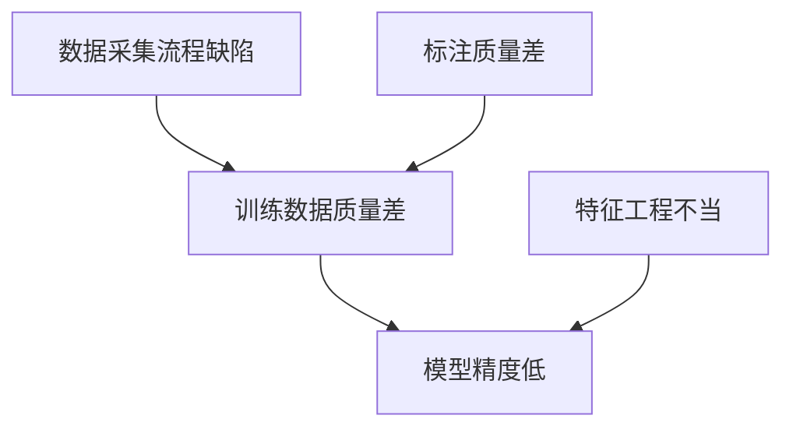

# AI系统根因分析原理与代码实战案例讲解

## 1.背景介绍

### 1.1 什么是根因分析？

根因分析(Root Cause Analysis, RCA)是一种系统的方法和流程,用于识别和解决问题的根本原因。它不仅关注症状,更重要的是深入挖掘并解决导致问题发生的根源。在复杂的人工智能(AI)系统中,根因分析尤为重要,因为这些系统通常涉及多个组件、大量数据和复杂的模型交互。

### 1.2 AI系统中根因分析的重要性

由于AI系统的复杂性,即使是一个小小的错误或异常,也可能会导致严重的后果。通过根因分析,我们可以:

- 识别和修复系统中的缺陷和漏洞
- 防止类似问题在将来再次发生
- 提高系统的可靠性和稳定性
- 优化系统性能和效率
- 增强对系统行为的理解和控制

### 1.3 根因分析的挑战

尽管根因分析的重要性不言而喻,但在AI系统中实施它并非一蹴而就。一些主要挑战包括:

- 系统复杂性:AI系统通常由多个相互关联的组件组成,导致问题根源难以追踪。
- 数据质量:低质量或有偏差的数据可能会导致模型错误,但发现这些问题并不容易。
- 模型不透明性:许多AI模型(如深度神经网络)是黑盒,内部工作机制难以解释。
- 技能缺口:缺乏具备AI和根因分析双重专业知识的人才。

## 2.核心概念与联系

### 2.1 系统思维

系统思维是根因分析的核心理念。它强调从整体出发,认识到系统各个部分是相互关联的,而不是孤立地看待单个组件。在AI系统中,数据、模型、基础架构和应用程序都是相互作用的,因此需要综合考虑它们之间的关系。

### 2.2 5个为什么原则

"5个为什么"是一种简单而有效的根因分析技术。它通过反复提出"为什么"这个问题,逐层剥离表象,最终找到问题的根源。例如:

1. 为什么模型的预测结果不准确?
2. 因为训练数据有噪声和偏差。
3. 为什么训练数据有噪声和偏差?
4. 因为数据采集和预处理流程有缺陷。
5. 为什么数据采集和预处理流程有缺陷?
6. ...

经过5次"为什么"的追问,我们可能就能找到真正的根因。

### 2.3 因果关系图

因果关系图是一种可视化工具,用于描绘事件、条件和因果关系之间的联系。在AI系统的根因分析中,它可以帮助我们梳理复杂的因果链,识别潜在的根本原因。



### 2.4 AI系统全生命周期管理

AI系统的根因往往渗透到其整个生命周期中,因此有必要对其进行端到端的管理。这包括数据采集、模型开发、系统集成、部署、监控和维护等各个环节。只有从全生命周期的角度来审视,才能全面地发现并解决根本问题。

## 3.核心算法原理具体操作步骤

尽管根因分析更多是一种系统化的方法论,但也有一些核心算法和工具可以为我们提供支持。本节将介绍其中的一些关键技术。

### 3.1 相关性分析

相关性分析旨在发现事件或指标之间的相关关系,从而识别潜在的因果关联。在AI系统中,我们可以分析各种指标(如模型精度、延迟、资源利用率等)之间的相关性,并将高度相关的指标作为根因分析的切入点。

常用的相关性分析算法包括:

- 皮尔逊相关系数
- 斯皮尔曼等级相关系数
- 互信息(Mutual Information)

### 3.2 异常检测

异常检测算法旨在从大量数据中发现"异常"的数据点或模式。在AI系统中,异常可能意味着错误、故障或安全风险。及时发现并分析这些异常,有助于防患于未然。

一些常用的异常检测算法有:

- 基于统计的方法(如高斯分布、箱线图等)
- 基于聚类的方法(如K-Means、DBSCAN等)
- 基于深度学习的方法(如自编码器、生成对抗网络等)

### 3.3 时间序列分析

时间序列分析关注数据在时间维度上的变化模式,并试图发现其中的趋势、周期性和异常。在AI系统中,我们可以对各种指标数据进行时间序列分析,识别异常的尖峰或突变,并追溯其根源。

常用的时间序列分析算法包括:

- 移动平均(Moving Average)
- 指数平滑(Exponential Smoothing)
- 自回归移动平均(ARMA/ARIMA)
- 季节分解(Seasonal Decomposition)

### 3.4 决策树和规则提取

决策树是一种常用的机器学习模型,通过学习训练数据构建决策规则。在根因分析中,我们可以使用决策树来发现影响系统行为的关键特征和规则,从而追踪根本原因。

除了传统的决策树算法(如ID3、C4.5、CART等),我们还可以尝试从深度神经网络中提取规则,以提高模型的可解释性。一些常用的规则提取技术包括:

- 决策树提取
- 模型压缩
- 可解释的人工智能(XAI)

### 3.5 交互式可视化

由于AI系统的复杂性,单一的算法或工具通常难以完全解决根因分析的挑战。因此,交互式的可视化工具可以发挥重要作用,将多种分析技术融合在一起,为用户提供直观的探索和诊断界面。

一些流行的可视化工具包括:

- Tensorboard(用于可视化TensorFlow模型)
- Weights & Biases(用于机器学习实验管理)
- Streamlit(用于构建数据应用)
- Bokeh、Plotly等通用可视化库

## 4.数学模型和公式详细讲解举例说明

在根因分析中,数学模型和公式可以为我们提供量化和形式化的支持。本节将介绍一些常用的数学工具。

### 4.1 相关性度量

相关性度量用于衡量两个随机变量之间的线性相关程度。最常用的指标是**皮尔逊相关系数**,定义如下:

$$r=\frac{\sum_{i=1}^{n}(x_i-\bar{x})(y_i-\bar{y})}{\sqrt{\sum_{i=1}^{n}(x_i-\bar{x})^2\sum_{i=1}^{n}(y_i-\bar{y})^2}}$$

其中$x_i$和$y_i$分别表示第$i$个样本的两个变量值,$\bar{x}$和$\bar{y}$是它们的均值。相关系数$r$的取值范围是$[-1,1]$,绝对值越大表示相关性越强。

对于非线性或有序变量,我们可以使用**斯皮尔曼等级相关系数**:

$$\rho=1-\frac{6\sum_{i=1}^{n}d_i^2}{n(n^2-1)}$$

其中$d_i$是两个变量在各自等级中的等级差,$n$是样本数量。

### 4.2 异常检测模型

异常检测的一种常用方法是基于**高斯分布**建模。假设正常数据服从高斯分布$\mathcal{N}(\mu,\sigma^2)$,那么一个样本$x$被判定为异常的概率为:

$$P(x|\mu,\sigma^2)=\frac{1}{\sqrt{2\pi\sigma^2}}e^{-\frac{(x-\mu)^2}{2\sigma^2}}$$

如果该概率值低于给定的阈值,则将$x$标记为异常。

在多维情况下,我们可以使用**马哈拉诺比斯距离**(Mahalanobis Distance)来测量一个样本与分布的"距离":

$$D(x)=\sqrt{(x-\mu)^T\Sigma^{-1}(x-\mu)}$$

其中$\mu$是均值向量,$\Sigma$是协方差矩阵。$D(x)$的值越大,越有可能是异常点。

### 4.3 时间序列模型

时间序列分析中的一个核心模型是**自回归移动平均模型**(ARMA),它将时间序列$y_t$建模为过去值的线性组合:

$$y_t=c+\sum_{i=1}^{p}\phi_iy_{t-i}+\sum_{j=1}^{q}\theta_j\epsilon_{t-j}+\epsilon_t$$

其中$c$是常数项,$\phi_i$和$\theta_j$分别是自回归(AR)和移动平均(MA)部分的系数,$\epsilon_t$是白噪声项。通过估计这些参数,我们可以对时间序列进行预测和异常检测。

对于存在趋势和季节性的时间序列,我们可以使用**SARIMA**(Seasonal ARIMA)模型,它在ARIMA的基础上增加了季节项。

### 4.4 决策树与信息增益

决策树是一种常用的机器学习模型,其构建过程基于**信息增益**原理。假设有一个特征$A$,其取值为$\{a_1,a_2,...,a_v\}$,数据集$D$根据$A$的取值分为$\{D_1,D_2,...,D_v\}$,则$A$对$D$的信息增益定义为:

$$\text{Gain}(D,A)=\text{Ent}(D)-\sum_{j=1}^{v}\frac{|D_j|}{|D|}\text{Ent}(D_j)$$

其中$\text{Ent}(D)$是数据集$D$的信息熵,反映了其纯度或无序程度。信息增益越大,说明使用特征$A$分割数据能够获得越高的"信息增值"。

在构建决策树时,我们将递归地选择信息增益最大的特征进行分割,直到满足停止条件(如最大深度或最小叶子节点样本数)。

## 4.项目实践:代码实例和详细解释说明

为了加深对根因分析技术的理解,本节将通过一个实际案例,演示如何使用Python代码进行分析。我们将基于一个开源的航空数据集,分析飞机延误的根本原因。

### 4.1 数据集介绍

我们将使用的数据集是来自Kaggle的"航班延误和取消"(Flight Delays and Cancellations)数据集。它包含了2015年1月至2015年4月期间,美国国内航班的准点性信息。

以下是数据集中的一些关键字段:

- `FL_DATE`: 航班日期
- `AIRLINE`: 航空公司代码
- `ORIGIN_AIRPORT`: 起飞机场
- `DEST_AIRPORT`: 目的地机场
- `DEP_DELAY`: 起飞延误时间(分钟)
- `ARR_DELAY`: 到达延误时间(分钟)
- `CANCELLED`: 航班是否取消(1=取消)
- `AIR_SYSTEM_DELAY`: 航空系统延误时间(分钟)
- `SECURITY_DELAY`: 安检延误时间(分钟)
- `WEATHER_DELAY`: 天气延误时间(分钟)
- ...

我们的目标是分析导致航班延误的主要根源,并提出相应的改进建议。

### 4.2 数据探索和预处理

在进行根因分析之前,我们需要先对数据进行探索和预处理。以下是Python代码示例:

```python
import pandas as pd

# 读取数据
df = pd.read_csv('flight_delays.csv')

# 查看数据摘要
print(df.info())
print(df.describe())

# 处理缺失值
df = df.dropna(subset=['DEP_DELAY', 'ARR_DELAY'])

# 创建新特征
df['TOTAL_DELAY'] = df['DEP_DELAY'] + df['ARR_DELAY']
df['IS_DELAYED'] = (df['TOTAL_DELAY'] > 0).astype(int)

# 对类别特征进行编码
cat_cols = ['AIRLINE', 'ORIGIN_AIRPORT', 'DEST_AIRPORT']
df = pd.get_dummies