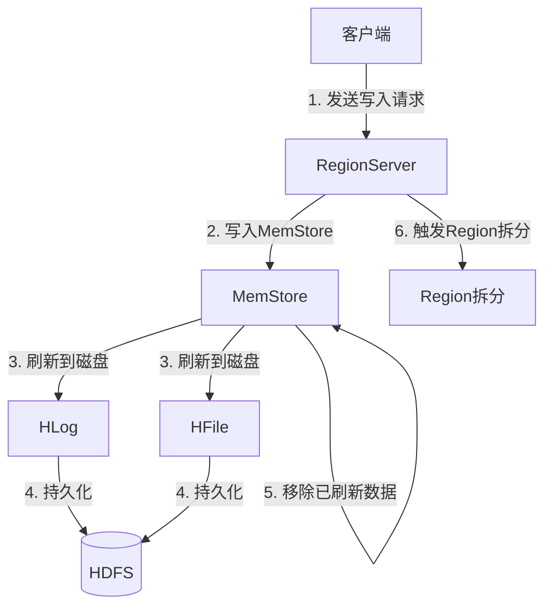
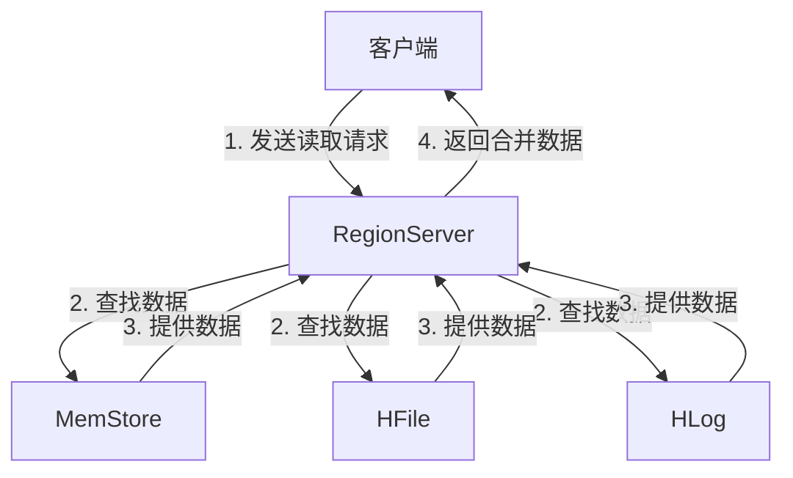

# HBase原理与代码实例讲解

## 1.背景介绍

HBase是一个分布式、可伸缩、面向列的开源数据库，它建立在Hadoop文件系统之上，可以为海量数据提供随机、实时的读写访问。HBase最初是作为Hadoop项目的一部分进行开发的，后来由Apache软件基金会作为顶级项目独立出来。

HBase的设计灵感来自于Google的BigTable论文，它采用了类似的数据模型。HBase非常适合于需要在非结构化的稀疏数据上进行快速查询的场景，例如网络日志分析、内容传递网络等。

### 1.1 HBase的优势

- **线性扩展能力**：通过简单地添加更多的节点,HBase可以轻松地扩展以处理更大的数据集。
- **高可靠性**：HBase具有自动故障转移和恢复的能力,可以提供高度的可用性和容错能力。
- **实时读写**：HBase支持低延迟的随机读写操作,非常适合于需要实时访问大数据的应用程序。
- **灵活的模式**：HBase采用了面向列的数据模型,可以轻松地处理结构化和半结构化的数据。
- **与Hadoop生态系统集成**：HBase可以与Hadoop生态系统中的其他组件(如MapReduce、Spark等)无缝集成。

### 1.2 HBase的应用场景

HBase非常适合于以下场景:

- **物联网(IoT)数据**：HBase可以高效地存储和处理来自各种传感器和设备的大量数据流。
- **操作数据存储**：对于需要频繁读写的应用程序,HBase可以提供低延迟和高吞吐量。
- **大数据分析**：HBase可以与Hadoop生态系统中的其他工具(如Hive、Spark等)集成,用于大数据分析。
- **消息队列**：HBase可以用作消息队列,存储和传递大量的消息数据。

## 2.核心概念与联系

在深入探讨HBase的原理之前,我们需要了解一些核心概念。

### 2.1 Row Key(行键)

Row Key是用于唯一标识表中每一行的主键。它由一个或多个字符串组成,并按字典序排序。Row Key的设计对HBase的性能有着重大影响,因为HBase会自动对数据进行分区和分布,以便在多个RegionServer上并行处理。

### 2.2 Column Family(列族)

Column Family是HBase表的基本组织单元。每个Column Family都是一个独立的存储文件,可以独立打开或关闭。Column Family中的所有列都具有相同的前缀,例如"data:"或"meta:"。

在创建表时,必须预先定义Column Family。添加新的Column Family是一个非常昂贵的操作,因为它需要重新写入整个表。因此,建议在创建表时就预先规划好所需的Column Family。

### 2.3 Column Qualifier(列限定符)

Column Qualifier是Column Family中的一个列。它由一个任意的字节数组组成,用于标识该列中存储的数据类型。例如,在一个存储网页访问日志的表中,Column Qualifier可以是"content"、"referrer"等。

### 2.4 Cell(单元格)

Cell是HBase中最小的数据单元,由以下四个部分组成:

- Row Key
- Column Family
- Column Qualifier
- Timestamp

每个Cell都包含了一个版本号(由时间戳表示),HBase会自动保留指定数量的最新版本。

### 2.5 Region

Region是HBase中分布式存储和负载均衡的基本单元。一个表最初只有一个Region,随着数据的增长,Region会自动拆分为多个子Region,每个子Region都由一个RegionServer负责处理。

Region的拆分是自动进行的,当一个Region达到一定的阈值时,就会触发拆分操作。拆分后的两个子Region会分别存储原Region中一半的数据。

### 2.6 RegionServer

RegionServer是HBase的核心组件之一,负责处理客户端的读写请求,并且管理在本地数据节点上的Region。每个RegionServer可以管理多个Region。

### 2.7 HMaster

HMaster是HBase集群的主节点,负责监控整个集群的状态,并进行负载均衡和故障转移等操作。HMaster会自动分配Region到合适的RegionServer上,并在RegionServer发生故障时将其上的Region迁移到其他节点。

## 3.核心算法原理具体操作步骤

### 3.1 写入数据流程

当客户端向HBase写入数据时,会经历以下步骤:

1. **客户端**向**RegionServer**发送写入请求,包括Row Key、Column Family、Column Qualifier和要写入的数据。

2. **RegionServer**根据Row Key定位到对应的**Region**,将数据写入内存中的**MemStore**。

3. 当**MemStore**达到一定大小时,就会创建一个新的**HLog**文件和一个**HFile**文件。**HLog**文件记录了所有写入操作,用于数据恢复;**HFile**文件则存储了已排序的键值对数据。

4. **HLog**和**HFile**会定期刷新到**HDFS**上,以确保数据的持久性。

5. 当**MemStore**中的数据被刷新到**HDFS**后,就会从内存中移除,以释放空间。

6. 如果**Region**达到了拆分阈值,就会触发**Region**拆分操作,将数据划分到两个子**Region**中。

下面是HBase写入数据流程的示意图:



### 3.2 读取数据流程

当客户端从HBase读取数据时,会经历以下步骤:

1. **客户端**向**RegionServer**发送读取请求,包括要读取的Row Key范围。

2. **RegionServer**根据Row Key定位到对应的**Region**,并从**MemStore**、**HFile**和**HLog**中查找所需的数据。

3. **MemStore**中存储着最新写入的数据;**HFile**中存储着已持久化的数据;**HLog**用于数据恢复。

4. **RegionServer**会将从不同存储层次读取到的数据进行合并,并返回给客户端。

5. 如果请求的数据跨越多个**Region**,则客户端需要并行地从多个**RegionServer**读取数据,并自行合并结果。

下面是HBase读取数据流程的示意图:



## 4.数学模型和公式详细讲解举例说明

在HBase中,有一些重要的数学模型和公式,可以帮助我们更好地理解和优化系统性能。

### 4.1 Region拆分策略

HBase采用了一种基于Region大小的拆分策略。当一个Region的大小超过了预设的阈值时,就会触发拆分操作。拆分后,原Region会被一分为二,形成两个新的子Region。

Region拆分的目标是将数据均匀地分布到多个RegionServer上,从而实现负载均衡和提高整体吞吐量。

Region拆分的阈值可以由以下公式计算:

$$
RegionSplitThreshold = max(R_1, R_2 \times \sqrt{numRegionServers})
$$

其中:

- $R_1$是一个固定的常量,默认值为64MB。
- $R_2$是另一个固定的常量,默认值为2GB。
- $numRegionServers$是当前集群中RegionServer的数量。

这个公式可以确保当集群规模较小时,Region拆分阈值较低,从而避免出现过大的Region;当集群规模增长时,阈值会相应增加,以减少过于频繁的拆分操作。

### 4.2 CompactionSelection算法

在HBase中,随着时间的推移,每个Region都会积累大量的HFile文件。为了提高读取性能和减少磁盘空间占用,HBase会定期对HFile进行合并(Compaction)操作。

CompactionSelection算法就是用于选择哪些HFile需要进行合并的策略。HBase采用了一种基于文件大小的贪婪算法,具体步骤如下:

1. 将所有HFile按大小排序,从小到大。
2. 从最小的HFile开始,将其与后续的HFile进行合并,直到合并后的文件大小超过了CompactionThreshold。
3. 将上一步合并得到的文件标记为一个Compaction任务。
4. 重复步骤2和3,直到所有HFile都被处理完毕。

CompactionThreshold的计算公式如下:

$$
CompactionThreshold = R \times \sqrt{numRegionServers}
$$

其中:

- $R$是一个固定的常量,默认值为2GB。
- $numRegionServers$是当前集群中RegionServer的数量。

这个公式可以确保当集群规模较小时,CompactionThreshold较低,从而减少单个Compaction任务的开销;当集群规模增长时,阈值会相应增加,以提高吞吐量。

### 4.3 BlockCache算法

BlockCache是HBase中用于缓存读取数据的一种机制。它可以显著提高读取性能,尤其是对于那些被频繁访问的数据。

BlockCache采用了一种基于LRU(Least Recently Used)策略的算法,具体步骤如下:

1. 当读取一个数据块时,首先检查BlockCache中是否已经缓存了该数据块。
2. 如果命中缓存,直接从缓存中读取数据,无需从磁盘读取。
3. 如果未命中缓存,则从磁盘读取该数据块,并将其插入到BlockCache中。
4. 如果BlockCache已满,则根据LRU策略淘汰最近最少使用的数据块,为新的数据块腾出空间。

BlockCache的大小可以由以下公式计算:

$$
BlockCacheSize = max(M_1, M_2 \times numRegionServers)
$$

其中:

- $M_1$是一个固定的常量,默认值为256MB。
- $M_2$是另一个固定的常量,默认值为0.4。
- $numRegionServers$是当前集群中RegionServer的数量。

这个公式可以确保BlockCache的大小随着集群规模的增长而增加,从而提高整体的缓存命中率。

## 4.项目实践:代码实例和详细解释说明

在本节中,我们将通过一些代码示例来展示如何使用HBase进行数据操作。

### 4.1 创建表

以下代码展示了如何使用Java API创建一个HBase表:

```java
import org.apache.hadoop.conf.Configuration;
import org.apache.hadoop.hbase.HBaseConfiguration;
import org.apache.hadoop.hbase.HColumnDescriptor;
import org.apache.hadoop.hbase.HTableDescriptor;
import org.apache.hadoop.hbase.TableName;
import org.apache.hadoop.hbase.client.Admin;
import org.apache.hadoop.hbase.client.Connection;
import org.apache.hadoop.hbase.client.ConnectionFactory;

public class CreateTable {
    public static void main(String[] args) throws Exception {
        Configuration conf = HBaseConfiguration.create();
        Connection connection = ConnectionFactory.createConnection(conf);
        Admin admin = connection.getAdmin();

        // 创建表描述符
        HTableDescriptor tableDescriptor = new HTableDescriptor(TableName.valueOf("my_table"));

        // 创建列族描述符
        HColumnDescriptor columnFamily1 = new HColumnDescriptor("cf1");
        HColumnDescriptor columnFamily2 = new HColumnDescriptor("cf2");

        // 将列族添加到表描述符
        tableDescriptor.addFamily(columnFamily1);
        tableDescriptor.addFamily(columnFamily2);

        // 创建表
        admin.createTable(tableDescriptor);

        admin.close();
        connection.close();
    }
}
```

在上面的示例中,我们首先创建了一个HBase连接,然后构建了一个表描述符和两个列族描述符。接下来,我们将列族添加到表描述符中