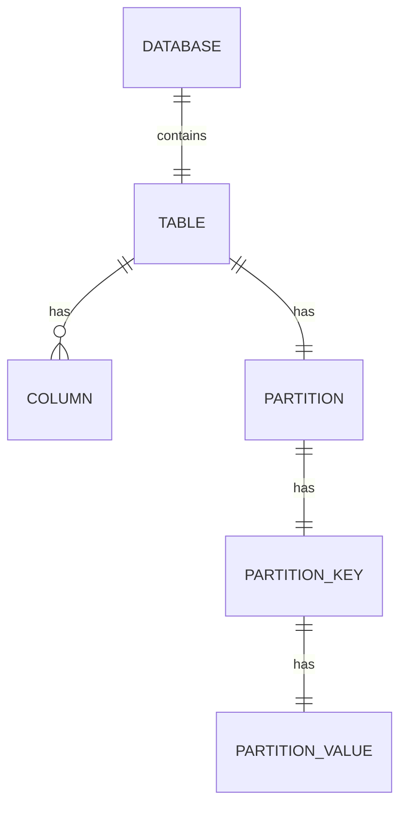

# HCatalog在业务智能中的应用

## 1.背景介绍

### 1.1 大数据时代的到来

随着互联网、物联网和移动互联网的快速发展,数据呈现出爆炸式增长。传统的数据处理和分析方式已经无法满足当前海量数据的需求。大数据时代的到来,给企业带来了新的挑战和机遇。企业需要采用新的技术和架构来存储、处理和分析这些大数据,从中发现隐藏的价值,为业务决策提供支持。

### 1.2 大数据处理平台的演进

Apache Hadoop作为开源的大数据处理平台,可以在廉价的硬件集群上可靠地存储和处理海量数据。Hadoop生态圈不断壮大,衍生出了诸如Hive、HBase、Pig、Sqoop等多种工具和组件,为大数据的存储、处理、分析和管理提供了全面的解决方案。

### 1.3 数据治理的重要性

随着企业数据资产的不断增长,数据治理变得越来越重要。数据治理确保数据的完整性、一致性、可访问性和安全性,从而支持企业的业务智能和数据分析需求。HCatalog作为Hadoop生态系统中的元数据服务,为数据治理提供了重要支持。

## 2.核心概念与联系

### 2.1 HCatalog概述

HCatalog是Apache Hive中的元数据服务,提供了统一的元数据管理层。它允许不同的数据处理工具(如Pig、MapReduce、Hive等)共享和访问相同的元数据,从而实现数据的一致性和可管理性。HCatalog使用Apache HCatalog存储元数据,并提供了RESTful API和命令行工具来管理和访问元数据。

### 2.2 HCatalog与Hive的关系

HCatalog最初是作为Hive的一个子项目开发的,旨在将Hive的元数据服务独立出来,使其可以被其他工具共享和访问。随着发展,HCatalog已经成为Hadoop生态系统中一个独立的项目,但仍然与Hive紧密集成。Hive使用HCatalog作为其元数据存储和管理服务。

### 2.3 HCatalog与数据治理

HCatalog通过提供统一的元数据管理层,支持数据治理的以下几个方面:

1. **数据发现和可访问性**: HCatalog使不同工具能够发现和访问相同的数据集,提高了数据的可访问性。

2. **数据一致性**: 由于所有工具共享相同的元数据,数据在不同工具之间保持一致性。

3. **数据安全性**: HCatalog支持基于角色的访问控制,确保只有授权用户可以访问数据。

4. **数据血缘跟踪**: HCatalog记录了数据的来源和转换过程,支持数据血缘跟踪。

5. **元数据管理**: HCatalog提供了RESTful API和命令行工具,方便管理和维护元数据。

## 3.核心算法原理具体操作步骤

HCatalog的核心算法和操作步骤主要包括以下几个方面:

### 3.1 元数据存储

HCatalog使用Apache HCatalog作为其元数据存储后端。Apache HCatalog是一个可扩展的元数据存储系统,支持关系型和非关系型数据模型。它使用MySQL或Derby作为底层存储引擎,并提供了一个基于Thrift的服务层。

HCatalog将元数据存储在一组表中,包括:

- `COLUMNS`: 存储列元数据
- `PARTITION_KEYS`: 存储分区键元数据
- `PARTITION_KEY_VALS`: 存储分区值元数据
- `PARTITIONS`: 存储分区元数据
- `DBS`: 存储数据库元数据
- `TBLS`: 存储表元数据

这些表共同构成了HCatalog的元数据模型,用于描述数据库、表、列和分区等元数据信息。

### 3.2 元数据操作

HCatalog提供了RESTful API和命令行工具,用于执行元数据操作,包括创建、读取、更新和删除(CRUD)元数据。

1. **RESTful API**: HCatalog提供了一组RESTful API,允许客户端使用HTTP协议与元数据服务进行交互。这些API支持创建、读取、更新和删除数据库、表、分区等元数据对象。

2. **命令行工具**: HCatalog还提供了一个命令行工具`hcat`,用于管理元数据。用户可以使用`hcat`执行各种元数据操作,如创建数据库、创建表、添加分区等。

以下是一些常见的`hcat`命令示例:

```bash
# 创建数据库
hcat -e "CREATE DATABASE mydb;"

# 创建表
hcat -e "CREATE TABLE mydb.mytable (id INT, name STRING) PARTITIONED BY (year INT);"

# 添加分区
hcat -e "ALTER TABLE mydb.mytable ADD PARTITION (year=2022);"

# 列出表
hcat -e "SHOW TABLES IN mydb;"
```

### 3.3 元数据共享

HCatalog的一个关键特性是允许不同的数据处理工具共享和访问相同的元数据。这是通过以下机制实现的:

1. **Hive集成**: Hive使用HCatalog作为其元数据存储和管理服务。Hive可以直接读写HCatalog中的元数据。

2. **HCatalog客户端**: HCatalog提供了Java、Python和C++客户端库,允许其他工具通过这些客户端访问HCatalog中的元数据。

3. **HCatalog存储处理程序**: HCatalog支持不同的存储处理程序,如HiveStorageHandler和PigStorageHandler,用于将元数据映射到底层数据存储。

通过这些机制,不同的工具可以共享和访问相同的元数据,实现数据的一致性和可管理性。

## 4.数学模型和公式详细讲解举例说明

在HCatalog中,没有直接涉及复杂的数学模型和公式。但是,我们可以讨论一下HCatalog中元数据存储和查询的一些基本概念和原理。

### 4.1 元数据模型

HCatalog使用关系数据模型来存储元数据。元数据被组织为数据库、表、列和分区等对象,并存储在相应的表中。

我们可以使用实体关系模型(Entity-Relationship Model,ER Model)来描述HCatalog的元数据模型。ER模型使用实体(Entity)、属性(Attribute)和关系(Relationship)来表示数据对象及其之间的关联。

在HCatalog中,我们可以将数据库、表、列和分区视为实体,它们的属性存储在相应的表中。例如,`TBLS`表存储了表实体的属性,如表名、数据库名、表类型等。实体之间的关系通过外键约束来表示,例如`PARTITIONS`表中的`TBL_ID`列引用了`TBLS`表中的表ID。

ER模型可以用图形符号来表示,如下所示:



在这个ER图中,矩形表示实体,菱形表示关系,线条表示实体之间的关联。我们可以清楚地看到数据库包含表,表包含列和分区,分区由分区键和分区值组成。

### 4.2 元数据查询

HCatalog提供了RESTful API和命令行工具来查询元数据。这些查询操作本质上是对底层元数据表的查询。

我们可以使用关系代数来描述这些查询操作。关系代数是一种形式化的查询语言,它定义了一组基本的关系运算,如选择(Selection)、投影(Projection)、并集(Union)、差集(Difference)和笛卡尔积(Cartesian Product)等。

例如,当我们使用`hcat`命令列出某个数据库中的所有表时,HCatalog实际上执行了以下关系代数操作:

$$
\pi_{TBL_NAME}(\sigma_{DB_NAME = 'mydb'}(TBLS))
$$

这个表达式首先从`TBLS`表中选择出`DB_NAME`为`'mydb'`的行(Selection),然后投影出`TBL_NAME`列(Projection),即表名。

再如,当我们查询某个表的所有分区时,HCatalog可能执行以下操作:

$$
\pi_{PARTITION_VALS}(\sigma_{TBL_ID = t.TBL_ID}(PARTITIONS \times PARTITION\_KEY\_VALS))
$$

这个表达式首先计算`PARTITIONS`表和`PARTITION_KEY_VALS`表的笛卡尔积,然后选择出`TBL_ID`与目标表`t`的`TBL_ID`相同的行,最后投影出`PARTITION_VALS`列,即分区值。

通过关系代数,我们可以形式化地描述HCatalog中的元数据查询操作,并分析它们的复杂度和优化策略。

## 5.项目实践:代码实例和详细解释说明

在本节中,我们将提供一些HCatalog的实际使用示例,包括Java代码和命令行操作,并详细解释每一步的含义和作用。

### 5.1 使用Java代码操作HCatalog

HCatalog提供了Java客户端库,允许我们使用Java代码与HCatalog元数据服务进行交互。以下是一个示例,演示如何创建一个新的数据库和表:

```java
import java.util.ArrayList;
import java.util.List;
import org.apache.hadoop.hive.conf.HiveConf;
import org.apache.hadoop.hive.metastore.HiveMetaStoreClient;
import org.apache.hadoop.hive.metastore.api.Database;
import org.apache.hadoop.hive.metastore.api.FieldSchema;
import org.apache.hadoop.hive.metastore.api.SerDeInfo;
import org.apache.hadoop.hive.metastore.api.StorageDescriptor;
import org.apache.hadoop.hive.metastore.api.Table;

public class HCatalogExample {
    public static void main(String[] args) throws Exception {
        // 创建HiveMetaStoreClient实例
        HiveConf conf = new HiveConf();
        HiveMetaStoreClient client = new HiveMetaStoreClient(conf);

        // 创建新数据库
        Database db = new Database();
        db.setName("mydb");
        client.createDatabase(db);

        // 创建新表
        List<FieldSchema> columns = new ArrayList<>();
        columns.add(new FieldSchema("id", "int", null));
        columns.add(new FieldSchema("name", "string", null));

        SerDeInfo serDeInfo = new SerDeInfo();
        serDeInfo.setSerializationLib("org.apache.hadoop.hive.serde2.lazy.LazySimpleSerDe");

        StorageDescriptor sd = new StorageDescriptor();
        sd.setCols(columns);
        sd.setSerdeInfo(serDeInfo);
        sd.setInputFormat("org.apache.hadoop.mapred.TextInputFormat");
        sd.setOutputFormat("org.apache.hadoop.hive.ql.io.HiveIgnoreKeyTextOutputFormat");

        Table table = new Table();
        table.setDbName("mydb");
        table.setTableName("mytable");
        table.setSd(sd);

        client.createTable(table);
    }
}
```

让我们逐步解释这段代码:

1. 首先,我们创建一个`HiveMetaStoreClient`实例,用于与HCatalog元数据服务进行通信。

2. 然后,我们创建一个`Database`对象,设置数据库名为`"mydb"`,并调用`createDatabase`方法在HCatalog中创建这个新数据库。

3. 接下来,我们创建一个新表`"mytable"`。我们首先定义表的列信息,包括列名和数据类型。

4. 然后,我们创建一个`SerDeInfo`对象,指定序列化和反序列化类。

5. 接着,我们创建一个`StorageDescriptor`对象,设置表的列信息、序列化信息,以及输入和输出格式。

6. 最后,我们创建一个`Table`对象,设置数据库名、表名和存储描述符,并调用`createTable`方法在HCatalog中创建这个新表。

通过这段代码,我们成功地在HCatalog中创建了一个新的数据库`"mydb"`和一个新表`"mytable"`。

### 5.2 使用命令行操作HCatalog

除了使用Java代码,我们还可以使用HCatalog提供的命令行工具`hcat`来操作元数据。以下是一些示例命令:

```bash
# 创建数据库
hcat -e "CREATE DATABASE mydb;"

# 创建表
hcat -e "CREATE TABLE mydb.mytable (id INT, name STRING) PARTITIONED BY (year INT);"

# 添加分区
hcat -e "ALTER TABLE mydb.mytable ADD PARTITION (year=2022);"

# 列出表
hcat -e "SHOW TABLES IN mydb;"

# 查看表