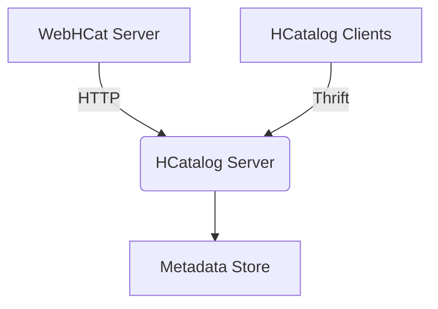

# HCatalog在地理信息系统中的应用

## 1.背景介绍

### 1.1 地理信息系统概述

地理信息系统(Geographic Information System, GIS)是一种将地理数据与相关属性信息进行采集、存储、管理、运算、分析、显示和描述的计算机系统。它是一种空间信息系统,用于捕获、存储、查询、分析和显示地理空间数据。GIS技术将传统的地理学与现代计算机技术相结合,为人们提供了一种全新的空间数据管理和分析方式。

### 1.2 大数据与Hadoop生态系统

随着信息技术的快速发展,数据量呈现出爆炸式增长,传统的数据处理方式已经无法满足现代大数据应用的需求。Apache Hadoop作为一个开源的分布式系统基础架构,为海量数据的存储和处理提供了可靠、高效的解决方案。Hadoop生态圈涵盖了大数据处理的方方面面,包括数据存储(HDFS)、资源管理和调度(YARN)、数据处理(MapReduce)、数据查询(Hive)、数据集成(Sqoop)、数据流处理(Storm/Spark Streaming)等多种组件。

### 1.3 HCatalog在Hadoop生态系统中的作用

HCatalog是Apache Hive的一个子项目,旨在为Hadoop生态系统中的数据提供统一的元数据服务。它提供了一个基于表的数据抽象层,使得不同的数据处理引擎(如MapReduce、Pig、Hive等)都可以方便地访问和共享数据,从而提高了数据的可管理性和可移植性。HCatalog将元数据存储在Apache HCatalog中,并通过Thrift接口对外提供服务,支持多种编程语言访问。

## 2.核心概念与联系

### 2.1 HCatalog架构

HCatalog的核心架构由以下几个主要组件组成:

- **WebHCat Server**: 提供RESTful接口,允许用户通过HTTP方式与HCatalog交互。
- **HCatalog Server**: HCatalog的核心服务器,负责处理客户端请求并与元数据存储进行交互。
- **Metadata存储**: 存储HCatalog的元数据信息,默认使用Apache HCatalog作为后端存储。
- **HCatalog客户端**: 提供了多种语言的客户端库,如Java、Python、C++等,方便用户编写应用程序与HCatalog进行交互。



### 2.2 表和存储管理器

在HCatalog中,表(Table)是最核心的数据抽象概念。HCatalog支持创建不同类型的表,如托管表(Managed Table)、外部表(External Table)等。每个表都由一个存储管理器(StorageHandler)负责管理其底层数据存储。

HCatalog提供了多种内置的存储管理器,如:

- HBase存储管理器: 用于将HBase作为表的存储后端。
- Hive存储管理器: 用于将Hive中的数据作为表的存储后端。
- DFS存储管理器: 用于将HDFS上的文件作为表的存储后端。

用户还可以开发自定义的存储管理器,从而支持将任意数据源映射为HCatalog表。

### 2.3 Hive与HCatalog集成

Apache Hive是构建在Hadoop之上的数据仓库基础架构,提供了类SQL的查询语言HiveQL。Hive与HCatalog的集成使得Hive可以直接访问和共享HCatalog中的元数据和数据,从而提高了数据的可管理性和可移植性。

Hive通过HCatalogStorer存储处理器与HCatalog进行集成。HCatalogStorer允许Hive直接读写HCatalog表,并且支持多种文件格式,如TextFile、SequenceFile、RCFile等。此外,Hive还可以直接访问HCatalog中的分区表和分桶表。

## 3.核心算法原理具体操作步骤

### 3.1 创建HCatalog表

要在HCatalog中创建一个新表,需要指定表名、列信息、表属性等元数据信息。以下是一个创建托管表的示例:

```java
import org.apache.hadoop.hive.conf.HiveConf;
import org.apache.hcatalog.common.HCatUtil;
import org.apache.hcatalog.data.schema.HCatSchema;
import org.apache.hcatalog.managed.ForeignServerUtil;

// 创建HCatalog Schema
HCatSchema schema = new HCatSchema(Arrays.asList(
    new HCatFieldSchema("id", HCatFieldSchema.Type.INT, ""),
    new HCatFieldSchema("name", HCatFieldSchema.Type.STRING, "")
));

// 创建表属性
Map<String, String> tableProperties = new HashMap<>();
tableProperties.put("comment", "This is a managed table");

// 创建HCatalog表
HiveConf hiveConf = new HiveConf();
try {
    HCatUtil.createTable(hiveConf, "default", "managed_table", schema, tableProperties);
} catch (Exception e) {
    e.printStackTrace();
}
```

对于外部表,需要额外指定表数据的存储位置:

```java
String location = "hdfs://namenode:8020/path/to/data";
ForeignServerUtil.createTable(hiveConf, "default", "external_table", schema, tableProperties, location);
```

### 3.2 查询HCatalog表

HCatalog提供了多种语言的客户端库,用于查询和操作HCatalog表。以下是使用Java客户端进行查询的示例:

```java
import java.util.List;
import org.apache.hadoop.hive.conf.HiveConf;
import org.apache.hcatalog.common.HCatUtil;
import org.apache.hcatalog.data.DefaultHCatRecord;
import org.apache.hcatalog.data.HCatRecord;
import org.apache.hcatalog.data.schema.HCatSchema;
import org.apache.hcatalog.data.transfer.HCatReader;
import org.apache.hcatalog.data.transfer.ReaderContext;

HiveConf conf = new HiveConf();
HCatSchema schema = HCatUtil.getTable(conf, "default", "managed_table").getDataColumns();

ReaderContext context = new ReaderContext(schema, conf);
HCatReader reader = HCatUtil.getHCatReader(context, conf, "default", "managed_table");

List<HCatRecord> records = reader.read();
for (HCatRecord record : records) {
    System.out.println(record.getAll());
}
```

此外,HCatalog还支持通过WebHCat Server提供的RESTful API进行查询和操作。

### 3.3 HCatalog与Hive集成

要在Hive中访问HCatalog表,只需在HiveQL语句中指定表的数据库和表名即可,无需进行额外的配置。例如:

```sql
USE default;
SELECT * FROM managed_table;
```

Hive还支持直接创建外部HCatalog表:

```sql
CREATE EXTERNAL TABLE external_table (
    id INT,
    name STRING
)
STORED BY 'org.apache.hcatalog.hive.HCatStorer'
TBLPROPERTIES ('hcatalog.table.output.format'='org.apache.hcatalog.data.JsonOutputFormat');
```

## 4.数学模型和公式详细讲解举例说明

在地理信息系统中,常常需要对空间数据进行各种几何运算和空间分析。HCatalog本身并不直接提供这些功能,但可以与其他工具集成以支持空间数据处理。

### 4.1 空间索引

对于大规模的地理空间数据,使用合适的空间索引结构可以极大提高数据查询和分析的效率。常用的空间索引方法包括:

- R树(R-Tree)
- 四叉树(Quadtree)
- 网格索引(Grid Index)

以R树为例,其基本思想是对空间对象进行分层嵌套,每个节点代表一个最小包围矩形(Minimum Bounding Rectangle, MBR)。查询时,先在根节点判断目标对象是否与MBR相交,如果相交则继续在子节点中查找,否则直接剪枝,从而大大减少了搜索空间。

R树的构建过程可以用以下公式描述:

$$
\begin{aligned}
M &= \text{leaf node capacity} \\
m &= \text{minimum number of entries} \\
    &= \lceil M/2 \rceil \\
\text{Root} &\succeq \text{level}_1 \succeq \text{level}_2 \succeq \cdots \succeq \text{leaf nodes} \\
\forall A, B \in \text{leaf} &: A \cap B = \emptyset \\
m \le \#\text{entries(N)} \le M &\qquad \forall \text{node } N
\end{aligned}
$$

其中$M$表示叶子节点的最大容量,$m$表示节点最小entries数量,根节点覆盖整个数据空间,叶子节点之间的MBR不相交。

### 4.2 空间连接

在GIS应用中,常常需要对两个数据集进行空间连接操作,即根据两个数据集之间的空间关系(如相交、包含等)将它们连接起来。

假设有两个数据集$R$和$S$,其中$R$中的元素用$r$表示,$S$中的元素用$s$表示。空间连接可以用以下公式表达:

$$
R \boxtimes_{\theta} S = \{(r, s) | r \in R, s \in S, \theta(r, s)\}
$$

其中$\theta$是空间谓词函数,用于判断两个空间对象之间的关系是否满足给定条件。常见的空间谓词包括:

- $\theta = \text{intersects}$: 判断两个对象是否相交
- $\theta = \text{contains}$: 判断一个对象是否包含另一个对象
- $\theta = \text{within}$: 判断一个对象是否被另一个对象包含

空间连接的效率很大程度上取决于使用的空间索引结构和连接算法。一种常用的算法是基于R树的嵌套循环算法,其时间复杂度为$O(n \log^{d-1} n)$,其中$n$为数据集大小,$d$为空间维度。

## 4.项目实践: 代码实例和详细解释说明  

本节将通过一个实际的地理信息系统项目,展示如何将HCatalog与其他工具集成,实现空间数据的存储、索引和分析。

### 4.1 项目概述

我们的项目需求是构建一个基于Hadoop的城市道路网络分析系统。系统需要存储大规模的道路数据,并支持以下功能:

1. 导入和管理道路数据
2. 构建道路网络的空间索引
3. 最短路径查询
4. 空间数据可视化

### 4.2 数据存储

我们使用HCatalog作为道路数据的元数据管理系统,并将实际数据存储在HDFS上。首先,我们需要在HCatalog中创建一个外部表来描述道路数据:

```sql
CREATE EXTERNAL TABLE roads (
    road_id BIGINT,
    name STRING,
    geometry STRING
)
STORED BY 'org.apache.hadoop.hive.ql.metadata.StoredAsTextFile'
LOCATION '/path/to/road/data';
```

这里我们使用`geometry`列来存储道路的空间几何信息,格式为WKT(Well-Known Text)。

接下来,我们可以使用Sqoop或其他工具将道路数据导入到HDFS中。以Sqoop为例:

```bash
sqoop import \
    --connect jdbc:mysql://hostname/database \
    --table roads \
    --target-dir /path/to/road/data \
    --fields-terminated-by '\t' \
    --null-string '\\N'
```

### 4.3 空间索引

为了提高空间查询的效率,我们需要为道路数据构建空间索引。这里我们使用开源的JTS(Java Topology Suite)库,基于R树实现道路数据的索引。

首先,我们需要读取HCatalog表中的数据:

```java
import org.apache.hadoop.hive.ql.metadata.HiveException;
import org.apache.hcatalog.common.HCatUtil;
import org.apache.hcatalog.data.HCatRecord;
import org.apache.hcatalog.data.transfer.HCatReader;
import org.apache.hcatalog.data.transfer.ReaderContext;

HiveConf conf = new HiveConf();
HCatSchema schema = HCatUtil.getTable(conf, "default", "roads").getDataColumns();
ReaderContext context = new ReaderContext(schema, conf);
HCatReader reader = HCatUtil.getHCatReader(context, conf, "default", "roads");

List<HCatRecord> records = reader.read();
```

然后,我们可以解析每条记录中的WKT几何数据,并将其插入到R树中:

```java
import com.vividsolutions.jts.geom.GeometryFactory;
import com.vividsolutions.jts.index.strtree.STRtree;

STRtree roadIndex = new STRtree();
GeometryFactory factory