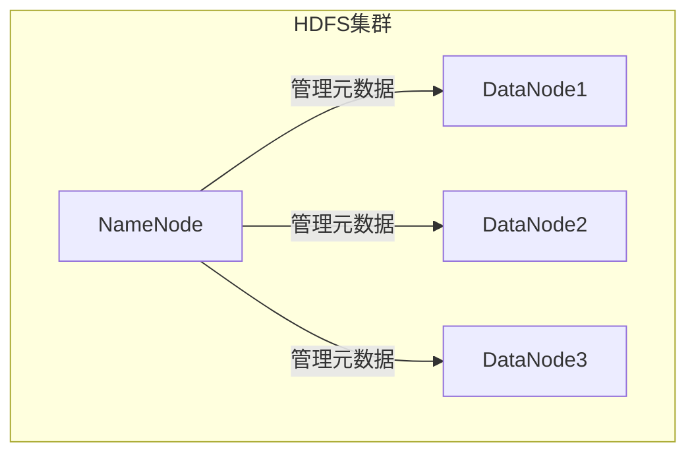
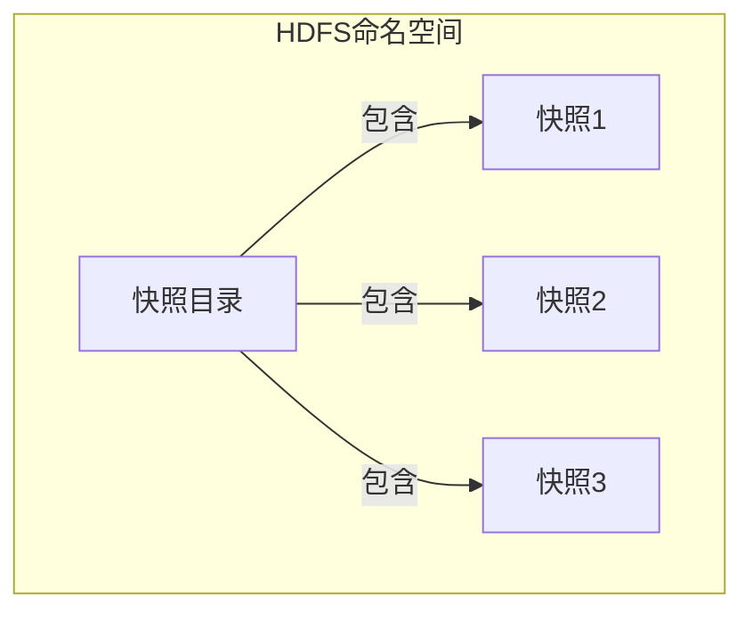
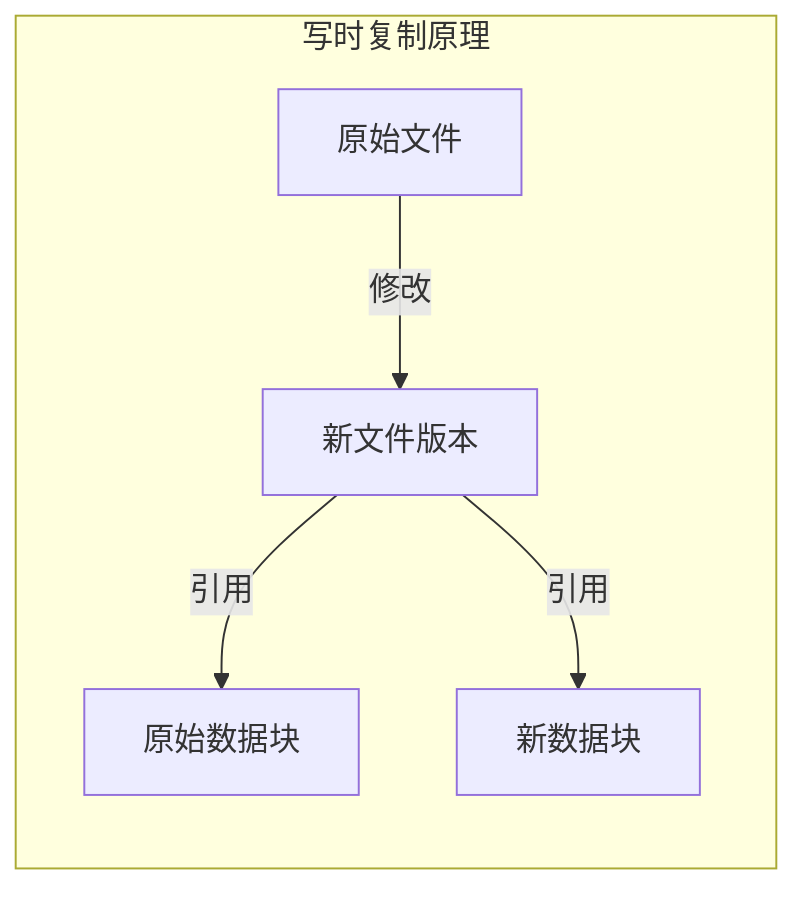
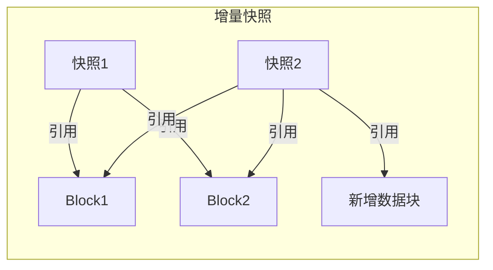

# HDFS快照：数据备份与版本控制利器

## 1.背景介绍

在当今数据驱动的世界中,数据是企业最宝贵的资产之一。无论是金融交易记录、社交媒体数据还是物联网传感器数据,它们都需要被安全地存储和管理。Apache Hadoop分布式文件系统(HDFS)作为Apache Hadoop生态系统的核心组件,为大数据应用程序提供了可靠、高吞吐量的存储解决方案。然而,随着数据量的不断增长,数据备份和版本控制变得至关重要。HDFS快照功能应运而生,为用户提供了一种简单而强大的数据保护机制。

### 1.1 数据保护的重要性

数据保护对于任何组织都是一个关键挑战。无论是由于人为错误、系统故障还是恶意攻击,数据丢失或损坏都可能导致严重的财务损失和声誉损害。因此,确保数据的完整性、可用性和一致性至关重要。传统的数据备份方法通常涉及定期将数据复制到辅助存储介质(如磁带或磁盘),这种方法不仅耗时耗力,而且在恢复数据时往往需要停机维护,影响业务连续性。

### 1.2 HDFS快照的优势

相比之下,HDFS快照提供了一种更加高效、灵活的数据保护解决方案。它允许管理员在不中断正常操作的情况下捕获HDFS命名空间的一致视图。这些快照可用于数据备份、数据恢复、数据分析等多种场景。HDFS快照的主要优势包括:

- **高效**: 快照基于写时复制(Copy-on-Write)原理,只需复制被修改的数据块,从而大大减少了存储开销。
- **一致性**: 快照捕获的是HDFS命名空间在特定时间点的一致视图,确保了数据的完整性和一致性。
- **灵活性**: 快照可以在任何级别(文件或目录)创建,并支持增量快照,从而实现细粒度的版本控制。
- **无中断**: 快照的创建和删除操作不会中断正常的文件系统操作,确保了业务连续性。

通过HDFS快照,用户可以轻松地管理和保护他们的关键数据资产,从而降低数据丢失的风险,提高数据可用性和业务连续性。

## 2.核心概念与联系

在深入探讨HDFS快照的核心原理之前,让我们先了解一些基本概念和它们之间的关系。

### 2.1 HDFS架构概览

HDFS是一种分布式文件系统,由一个NameNode(命名节点)和多个DataNode(数据节点)组成。NameNode负责管理文件系统的命名空间和元数据,而DataNode负责实际存储文件数据块。



### 2.2 HDFS快照概念

HDFS快照是对HDFS命名空间的一致视图的捕获。它包含了文件系统在特定时间点的目录树结构、文件元数据和数据块位置信息。HDFS支持以下两种类型的快照:

1. **快照目录(Snapshottable Directory)**: 一个支持快照功能的目录,用户可以在该目录下创建快照。
2. **快照(Snapshot)**: 捕获快照目录在特定时间点的状态。



### 2.3 写时复制(Copy-on-Write)原理

HDFS快照的实现依赖于写时复制(Copy-on-Write)原理。当用户对文件进行修改时,HDFS不会直接覆盖原始数据块,而是创建一个新的数据块来存储修改后的数据。这样,原始数据块就被保留下来,可以被快照引用。通过这种方式,快照可以保持对文件系统过去状态的一致视图,而不会影响当前的文件系统操作。



### 2.4 增量快照(Incremental Snapshot)

为了进一步优化存储空间利用率,HDFS支持增量快照。增量快照只捕获自上一个快照以来发生的变化,而不是完整复制整个目录树。这样可以大大减少快照的存储开销,特别是对于大型文件系统。



通过这些核心概念,我们可以更好地理解HDFS快照的工作原理和优势。接下来,我们将深入探讨快照的创建、管理和使用方式。

## 3.核心算法原理具体操作步骤 

HDFS快照的实现涉及多个核心算法和操作步骤,包括快照目录的创建、快照的捕获、数据块管理等。让我们逐一探讨这些关键步骤。

### 3.1 创建快照目录

要使用HDFS快照功能,首先需要创建一个支持快照的目录,即快照目录(Snapshottable Directory)。这可以通过以下命令实现:

```
hdfs dfsadmin -allowSnapshot /path/to/directory
```

该命令会在NameNode的内存中为指定目录分配一个额外的元数据区域,用于存储快照相关信息。创建快照目录不会影响现有数据,也不会产生任何数据复制。

### 3.2 捕获快照

一旦快照目录创建完成,就可以在该目录下捕获快照了。捕获快照的过程包括以下步骤:

1. **锁定目录**: NameNode会先对快照目录进行锁定,防止在快照创建期间发生任何修改操作。
2. **构建元数据映射**: NameNode遍历快照目录的整个目录树,为每个文件和目录构建一个元数据映射,记录其元数据信息(如权限、所有者、修改时间等)和数据块位置。
3. **保存快照元数据**: 构建完成后,NameNode将快照元数据映射持久化到编辑日志中。
4. **解锁目录**: 最后,NameNode解锁快照目录,允许继续进行修改操作。

通过这些步骤,HDFS就捕获了快照目录在特定时间点的一致视图。值得注意的是,快照的创建过程不会复制任何实际数据块,只有元数据被复制和持久化。

### 3.3 写时复制算法

当用户对快照目录下的文件进行修改时,HDFS会根据写时复制(Copy-on-Write)原理执行以下操作:

1. **检测文件修改**: DataNode检测到文件被修改后,会通知NameNode。
2. **分配新数据块**: NameNode为修改后的数据分配一个新的数据块。
3. **写入新数据块**: DataNode将修改后的数据写入新分配的数据块中。
4. **更新元数据映射**: NameNode更新快照目录的元数据映射,将修改后的文件与新数据块关联起来,同时保留原始数据块的映射供快照引用。

通过这种方式,HDFS可以在不影响现有快照的情况下,支持对文件的修改和新数据的写入。原始数据块被保留下来,快照可以继续引用它们,从而保持对过去状态的一致视图。

### 3.4 增量快照算法

为了优化存储空间利用率,HDFS支持增量快照。增量快照的创建过程与完整快照类似,但有以下不同之处:

1. **比较元数据映射**: 在创建增量快照时,NameNode会比较当前快照目录的元数据映射与上一个快照的映射,识别出发生变化的文件和目录。
2. **记录变化**: NameNode只为发生变化的部分构建新的元数据映射,并将其持久化到编辑日志中。
3. **引用未变化部分**:对于未发生变化的文件和目录,增量快照会直接引用上一个快照的元数据映射和数据块。

通过这种方式,增量快照可以大幅减少存储开销,特别是对于大型文件系统或者修改较少的情况。同时,由于增量快照与完整快照的查询方式相同,用户无需关注它们之间的差异。

上述算法和操作步骤揭示了HDFS快照背后的核心原理,展现了它如何通过巧妙的设计实现高效、一致的数据保护。接下来,我们将深入探讨快照功能的数学模型和公式。

## 4.数学模型和公式详细讲解举例说明

为了更好地理解HDFS快照的工作原理和性能特征,我们需要引入一些数学模型和公式。这些模型和公式不仅能够量化快照的存储开销,还可以帮助我们优化快照策略。

### 4.1 快照存储开销模型

假设我们有一个快照目录,其中包含 $N$ 个文件,每个文件的平均大小为 $S$ 字节。在创建第一个快照之前,整个目录占用的存储空间为:

$$
Space_{before} = N \times S
$$

创建第一个完整快照后,由于采用写时复制原理,HDFS不会立即复制所有数据块。相反,它只需复制元数据映射,其开销可以近似为:

$$
Space_{metadata} = \alpha \times N
$$

其中 $\alpha$ 是一个常数,表示每个文件的元数据映射所占用的空间。

在后续的修改操作中,假设有 $M$ 个文件被修改,每个修改文件的平均大小为 $S'$ 字节。根据写时复制原理,HDFS需要为这些修改后的数据分配新的数据块。因此,整个目录在创建第一个快照后的存储开销为:

$$
Space_{after} = Space_{before} + Space_{metadata} + M \times S'
$$

如果我们创建增量快照,存储开销会进一步降低。假设在创建第二个快照时,有 $M'$ 个文件发生了变化,每个变化文件的平均大小为 $S''$ 字节。增量快照只需要为这些变化部分保存元数据映射和新数据块,因此存储开销为:

$$
Space_{incremental} = \beta \times M' + M' \times S''
$$

其中 $\beta$ 是一个常数,表示每个变化文件的元数据映射所占用的空间。

通过上述模型,我们可以量化HDFS快照的存储开销,并比较完整快照和增量快照的空间效率。一般来说,如果文件修改率较低,增量快照会比完整快照更加节省存储空间。

### 4.2 快照恢复时间模型

除了存储开销,快照的恢复时间也是一个重要的性能指标。恢复时间取决于需要读取的数据量和网络带宽。

假设我们需要从快照中恢复 $K$ 个文件,每个文件的平均大小为 $S_k$ 字节。如果这些文件在快照中都是完整的,则需要读取的数据量为:

$$
Data_{read} = K \times S_k
$$

如果网络带宽为 $B$ 字节/秒,则恢复这些文件所需的时间为:

$$
Time_{recovery} = \frac{Data_{read}}{B} = \frac{K \times S_k}{B}
$$

然而,在实际情况中,由于写时复制原理,一些文件可能只需要读取部分数据块。假设有 $P$ 个文件需要读取完整数据块,其余 $(K-P)$ 个文件只需要读取部分数据块,平均读取量为 $S_p$ 字节。那么,总的读取数据量为:

$$
Data_{read} = P \times S_k + (K-P) \times S_p
$$

将其代入恢复时间公式,我们可以得到更准确的估计值。

通过上