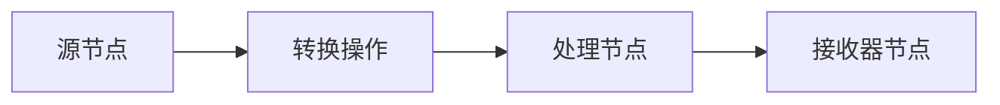

## 1.背景介绍

在我们的日常工作中，我们经常需要处理大量的实时数据。这些数据可能来自多种不同的来源，例如日志文件、传感器、用户行为等。处理这些数据的一个主要挑战是如何快速、准确和可扩展地处理它们。这就是Apache Kafka Streams的用武之地。

Apache Kafka是一个分布式流处理平台，它能够处理和分析数据在motion中的实时数据流。而Kafka Streams则是Apache Kafka的一个客户端库，用于构建高效、实时的数据处理和分析应用程序。

## 2.核心概念与联系

在深入了解Kafka Streams之前，我们首先需要了解一些核心的概念。

### 2.1 Kafka Streams

Kafka Streams是一个Java库，用于构建实时、高度可扩展的数据处理应用程序。这些应用程序可以作为一个普通的Java应用程序运行，无需任何特殊的分布式处理框架。

### 2.2 Stream

在Kafka Streams中，Stream是一个无限的、连续的、不可变的数据记录序列。这些记录按照它们的时间戳进行排序。

### 2.3 KStream and KTable

KStream和KTable是Kafka Streams的两种基本抽象。KStream表示一个记录的流，每个记录代表一个事件。KTable则表示一个更新的流，每个记录代表一个更新。

## 3.核心算法原理具体操作步骤

Kafka Streams的处理流程可以分为以下几个步骤：

1. **源节点**：数据从Kafka主题中读取，生成KStream或KTable。

2. **转换操作**：对数据进行各种转换操作，例如过滤、映射、聚合等。

3. **处理节点**：在这些节点上进行数据处理，例如join、window等操作。

4. **接收器节点**：处理后的数据被写回到Kafka主题中。

这个处理流程可以用以下的Mermaid流程图进行表示：



## 4.数学模型和公式详细讲解举例说明

在Kafka Streams中，我们经常需要进行各种各样的计算，例如统计、聚合等。这些计算可以用数学模型和公式来表示。

例如，我们可以用累加器模型来表示一个简单的统计计算。假设我们有一个KStream，其中包含一系列的整数。我们想要计算这些整数的总和。这可以用以下的累加器模型来表示：

$$
S = \sum_{i=1}^{n} a_i
$$

其中，$S$表示总和，$a_i$表示第$i$个整数，$n$表示整数的数量。

## 4.项目实践：代码实例和详细解释说明

为了更好地理解Kafka Streams的工作原理，我们来看一个简单的代码实例。

```java
StreamsBuilder builder = new StreamsBuilder();
KStream<String, String> textLines = builder.stream("TextLinesTopic");
KTable<String, Long> wordCounts = textLines
    .flatMapValues(textLine -> Arrays.asList(textLine.toLowerCase().split("\\W+")))
    .groupBy((key, word) -> word)
    .count(Materialized.as("counts-store"));
wordCounts.toStream().to("WordsWithCountsTopic", Produced.with(Serdes.String(), Serdes.Long()));
```

这个代码实例中，我们首先从"TextLinesTopic"主题中读取数据，生成一个KStream。然后，我们对这个KStream进行flatMapValues操作，将每行文本分割成单词。接着，我们对单词进行groupBy操作，按照单词进行分组。最后，我们对每个分组进行count操作，计算每个单词的数量，并将结果写回到"WordsWithCountsTopic"主题中。

## 5.实际应用场景

Kafka Streams可以应用在许多实际的场景中，例如实时分析、实时监控、日志处理等。

例如，在实时分析中，我们可以使用Kafka Streams来处理用户的点击流数据，实时计算用户的行为特征。在实时监控中，我们可以使用Kafka Streams来处理系统的日志数据，实时监控系统的运行状态。在日志处理中，我们可以使用Kafka Streams来处理大量的日志数据，实时分析日志中的关键信息。

## 6.工具和资源推荐

在使用Kafka Streams的过程中，有一些工具和资源可能会对你有所帮助。

- **Apache Kafka官方文档**：这是学习和使用Kafka Streams的最重要的资源。它包含了详细的API文档、教程和示例。

- **Kafka Streams in Action**：这是一本关于Kafka Streams的书籍，它详细介绍了Kafka Streams的工作原理和使用方法。

- **Kafka Streams GitHub**：这是Kafka Streams的官方GitHub仓库，你可以在这里找到最新的代码和文档。

## 7.总结：未来发展趋势与挑战

随着数据量的不断增长，实时数据处理和分析的需求也在不断增加。Kafka Streams作为一个强大的实时数据处理库，将会在未来的数据处理和分析领域中发挥越来越重要的作用。

然而，Kafka Streams也面临一些挑战。例如，如何处理大规模的数据？如何处理复杂的数据处理逻辑？如何保证数据的准确性和完整性？这些都是Kafka Streams在未来需要解决的问题。

## 8.附录：常见问题与解答

在这个部分，我们将回答一些关于Kafka Streams的常见问题。

**Q: Kafka Streams是否支持窗口操作？**

A: 是的，Kafka Streams支持多种类型的窗口操作，例如滑动窗口、跳跃窗口、会话窗口等。

**Q: Kafka Streams是否支持状态存储？**

A: 是的，Kafka Streams支持状态存储。你可以使用Kafka Streams提供的状态存储API来存储和查询状态信息。

**Q: Kafka Streams是否支持流表join操作？**

A: 是的，Kafka Streams支持流表join操作。你可以使用Kafka Streams提供的join API来进行流表join操作。

以上就是关于Kafka Streams的原理和代码实例的讲解，希望对你有所帮助。如果你有任何问题或建议，欢迎留言交流。