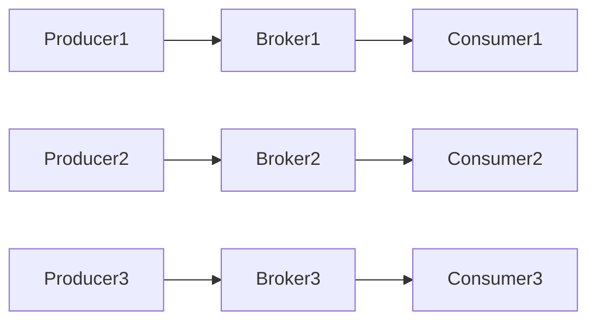
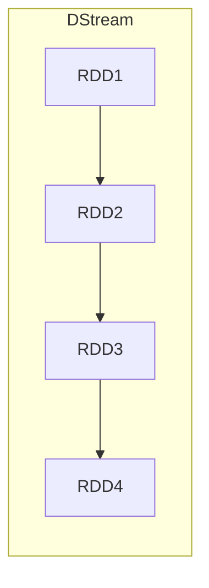
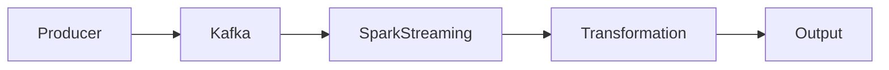

# Kafka-Spark Streaming整合原理与代码实例讲解

## 1. 背景介绍
### 1.1 大数据实时处理的重要性
### 1.2 Kafka在实时数据处理中的地位
### 1.3 Spark Streaming的优势

## 2. 核心概念与联系
### 2.1 Kafka
#### 2.1.1 Kafka的基本架构
#### 2.1.2 生产者与消费者
#### 2.1.3 Topic与Partition
### 2.2 Spark Streaming 
#### 2.2.1 DStream
#### 2.2.2 Receiver与DirectStream
#### 2.2.3 状态管理
### 2.3 Kafka与Spark Streaming的整合

## 3. 核心算法原理具体操作步骤
### 3.1 Kafka Producer发送数据
### 3.2 Kafka Broker接收与存储
### 3.3 Spark Streaming消费Kafka数据
#### 3.3.1 创建DirectStream
#### 3.3.2 处理DStream
#### 3.3.3 结果输出

## 4. 数学模型和公式详细讲解举例说明
### 4.1 Kafka分区与消费的数学模型
### 4.2 Spark Streaming窗口操作的数学原理
#### 4.2.1 滑动窗口
#### 4.2.2 滚动窗口

## 5. 项目实践：代码实例和详细解释说明
### 5.1 环境准备
### 5.2 Kafka生产者代码实现
### 5.3 Spark Streaming消费代码实现
#### 5.3.1 StreamingContext初始化
#### 5.3.2 创建Kafka DirectStream
#### 5.3.3 DStream转换操作
#### 5.3.4 结果输出到外部系统
### 5.4 启动Kafka与Spark Streaming应用
### 5.5 测试与验证

## 6. 实际应用场景
### 6.1 日志实时处理
### 6.2 实时推荐系统
### 6.3 实时异常检测

## 7. 工具和资源推荐
### 7.1 Kafka Tool
### 7.2 Spark Web UI
### 7.3 集成开发环境
### 7.4 学习资源

## 8. 总结：未来发展趋势与挑战
### 8.1 Kafka与Spark Streaming发展趋势
### 8.2 实时处理面临的挑战
### 8.3 未来的机遇

## 9. 附录：常见问题与解答
### 9.1 如何选择Kafka分区数？
### 9.2 如何处理Kafka消息重复消费？
### 9.3 Spark Streaming micro-batch与continuous processing的区别？
### 9.4 如何权衡Spark Streaming的吞吐量与延迟？

---

## 1. 背景介绍

### 1.1 大数据实时处理的重要性

在当今大数据时代，数据的产生速度远超过传统批处理系统的处理能力。为了从海量数据中及时获取有价值的信息，实时数据处理变得越来越重要。实时处理让我们能够在数据产生的时候就进行处理和分析，从而快速做出反应，抓住商机，或者发现潜在的风险。

实时处理在许多场景下都有广泛应用，例如：

- 实时欺诈检测：对交易数据进行实时分析，识别异常行为，防止欺诈发生。
- 实时推荐：根据用户的实时行为，推荐相关的内容或商品，提升用户体验。
- 实时监控：对系统或应用的日志数据进行实时分析，发现异常情况，及时报警。

### 1.2 Kafka在实时数据处理中的地位

Apache Kafka是一个分布式的流处理平台，已经成为实时数据处理领域的事实标准。Kafka的主要特点包括：

- 高吞吐量：Kafka能够每秒处理数百万条消息，满足大规模实时数据处理的需求。
- 低延迟：Kafka的延迟可以达到毫秒级别，满足实时应用的需求。
- 可扩展性：Kafka支持水平扩展，可以轻松应对数据量的增长。
- 持久性：Kafka将数据持久化到磁盘，提供数据的可靠性保证。

Kafka广泛应用于各种实时数据处理场景，例如日志聚合、指标监控、流式处理等。许多知名公司如LinkedIn、Netflix、Uber等都在使用Kafka进行实时数据处理。

### 1.3 Spark Streaming的优势

Spark Streaming是Apache Spark生态系统的一部分，是一个可扩展的实时数据处理引擎。相比其他流处理框架，Spark Streaming具有以下优势：

- 与Spark生态系统紧密集成：Spark Streaming可以无缝集成Spark的其他组件，如Spark SQL、MLlib等，提供了一站式的大数据处理平台。
- 高吞吐量和低延迟：Spark Streaming基于Spark的内存计算引擎，能够实现高吞吐量和低延迟的实时处理。
- 容错性：Spark Streaming提供了RDD（弹性分布式数据集）的容错抽象，能够从节点失败中自动恢复。
- 丰富的API：Spark Streaming提供了丰富的API，支持Java、Scala、Python等多种编程语言，使用简单。

Spark Streaming与Kafka的整合，能够发挥两者的优势，构建高性能、可扩展的实时数据处理管道。接下来我们将详细探讨Kafka和Spark Streaming的核心概念，以及两者的整合原理。

## 2. 核心概念与联系

### 2.1 Kafka

#### 2.1.1 Kafka的基本架构

Kafka的基本架构由以下几个组件组成：

- Producer：生产者，负责将数据发布到Kafka的topic中。
- Broker：Kafka集群中的服务器，负责存储和管理数据。
- Consumer：消费者，负责从Kafka的topic中读取数据。
- Topic：Kafka中的消息都属于一个特定的主题（Topic）。
- Partition：每个topic可以分为多个分区（Partition），以实现数据的并行处理。

下图展示了Kafka的基本架构：

#### 2.1.2 生产者与消费者

Kafka的生产者负责将数据发布到特定的topic中。生产者可以通过push或pull的方式将数据发送到Broker。

Kafka的消费者负责从特定的topic中读取数据。消费者可以订阅一个或多个topic，并从中读取数据。多个消费者可以组成一个消费者组（Consumer Group），共同消费一个topic的数据，实现负载均衡和容错。

#### 2.1.3 Topic与Partition

Kafka中的消息都属于一个特定的主题（Topic）。每个topic可以分为多个分区（Partition），每个分区是一个有序的、不可变的消息序列。

分区可以分布在Kafka集群的不同节点上，以实现数据的并行处理。每个分区都有一个leader副本和零个或多个follower副本，leader负责读写请求，follower负责同步leader的数据。

### 2.2 Spark Streaming

#### 2.2.1 DStream

Spark Streaming的核心抽象是DStream（Discretized Stream），表示一个连续的数据流。DStream由一系列连续的RDD（弹性分布式数据集）组成，每个RDD包含一个时间间隔内的数据。

下图展示了DStream的基本结构：

#### 2.2.2 Receiver与DirectStream

Spark Streaming提供了两种从Kafka读取数据的方式：Receiver和DirectStream。

- Receiver：使用Receiver从Kafka读取数据，并将数据存储在Spark Executor的内存中。这种方式可能会导致数据的重复消费。
- DirectStream：直接从Kafka读取数据，并将数据转换为RDD，无需在Spark Executor中存储数据。这种方式可以保证数据的exactly-once语义。

#### 2.2.3 状态管理

Spark Streaming提供了状态管理的功能，可以在数据流上维护状态，并对状态进行更新。常见的状态管理操作包括：

- updateStateByKey：对每个key维护一个状态，并根据新的数据更新状态。
- mapWithState：对每个key维护一个状态，并根据新的数据和旧的状态计算新的状态。

### 2.3 Kafka与Spark Streaming的整合

Kafka与Spark Streaming可以无缝整合，构建实时数据处理管道。整合的基本步骤如下：

1. Kafka Producer将数据发布到Kafka的topic中。
2. Spark Streaming使用DirectStream从Kafka的topic中读取数据，并将数据转换为DStream。
3. Spark Streaming对DStream进行各种转换操作，如map、filter、reduce等。
4. Spark Streaming将处理后的数据输出到外部系统，如HDFS、HBase等。

下图展示了Kafka与Spark Streaming整合的架构：

## 3. 核心算法原理具体操作步骤

### 3.1 Kafka Producer发送数据

Kafka Producer发送数据的基本步骤如下：

1. 创建ProducerRecord对象，指定topic、partition、key和value。
2. 调用KafkaProducer的send方法发送ProducerRecord。
3. KafkaProducer将ProducerRecord序列化并发送到Broker。
4. Broker接收到消息后，将其追加到指定的partition中。

### 3.2 Kafka Broker接收与存储

Kafka Broker接收与存储数据的基本步骤如下：

1. Broker接收到Producer发送的消息。
2. Broker将消息追加到指定的partition中。
3. Broker将消息写入到磁盘上的日志文件中。
4. Broker定期将内存中的数据刷新到磁盘上。

### 3.3 Spark Streaming消费Kafka数据

#### 3.3.1 创建DirectStream

Spark Streaming使用DirectStream从Kafka读取数据，创建DirectStream的基本步骤如下：

1. 创建SparkConf对象，配置Spark应用的属性。
2. 创建StreamingContext对象，指定批处理间隔。
3. 调用KafkaUtils.createDirectStream方法创建DirectStream，指定Kafka的配置参数。

#### 3.3.2 处理DStream

Spark Streaming对DStream进行各种转换操作，常见的转换操作包括：

- map：对DStream中的每个元素应用一个函数，返回一个新的DStream。
- flatMap：对DStream中的每个元素应用一个函数，返回一个新的DStream，并将结果展平。
- filter：对DStream中的每个元素应用一个函数，返回一个新的DStream，仅包含满足条件的元素。
- reduce：对DStream中的元素进行聚合操作，返回一个新的DStream，仅包含聚合后的结果。

#### 3.3.3 结果输出

Spark Streaming将处理后的数据输出到外部系统，常见的输出操作包括：

- print：将DStream中的元素打印到控制台。
- saveAsTextFiles：将DStream中的元素保存为文本文件。
- saveAsHadoopFiles：将DStream中的元素保存为Hadoop文件。
- foreachRDD：对DStream中的每个RDD应用一个函数，可以将数据写入到外部系统，如HBase、Cassandra等。

## 4. 数学模型和公式详细讲解举例说明

### 4.1 Kafka分区与消费的数学模型

Kafka的分区机制可以使用哈希函数来实现，常见的哈希函数包括：

- 基于key的哈希：将消息的key进行哈希，然后对分区数取模，得到分区编号。
  $partition = hash(key) \% numPartitions$
- 基于消息的哈希：将消息的内容进行哈希，然后对分区数取模，得到分区编号。
  $partition = hash(message) \% numPartitions$
- 轮询：将消息依次发送到不同的分区，实现负载均衡。
  $partition = (lastPartition + 1) \% numPartitions$

例如，假设有一个topic，包含4个分区，使用基于key的哈希算法，消息的key分别为1、2、3、4、5，则消息的分区分配如下：

$hash(1) \% 4 = 1 \rightarrow partition0$
$hash(2) \% 4 = 2 \rightarrow partition2$ 
$hash(3) \% 4 = 3 \rightarrow partition3$
$hash(4) \% 4 = 0 \rightarrow partition0$
$hash(5) \% 4 = 1 \rightarrow