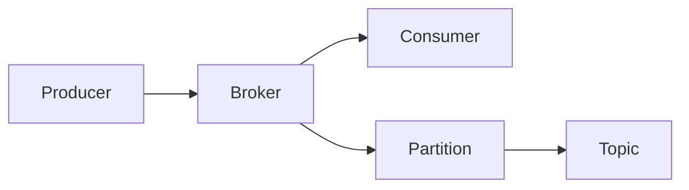

# Kafka原理与代码实例讲解

作者：禅与计算机程序设计艺术

## 1. 背景介绍

### 1.1 消息队列的重要性
在当今高度互联和数据驱动的世界中,消息队列扮演着至关重要的角色。它是连接分布式系统各个组件的纽带,支撑着海量数据的高效传输和处理。

### 1.2 Kafka的崛起 
Kafka作为新一代分布式消息队列平台,凭借其高吞吐、低延迟、高可靠等特性,在业界得到了广泛应用。LinkedIn、Netflix、Uber等互联网巨头都将Kafka作为其核心基础设施。

### 1.3 Kafka的应用场景
Kafka主要应用于以下几个场景:

- 网站活动追踪
- 指标监控
- 日志聚合
- 流处理

## 2. 核心概念与联系

### 2.1 Producer
Producer是生产者,负责将消息发布到Kafka的topic中。

### 2.2 Consumer
Consumer是消费者,负责从Kafka的topic中拉取消息并进行消费。

### 2.3 Broker
Broker是Kafka集群中的服务器。Producer和Consumer都要连接到Broker才能完成消息的发送与消费。

### 2.4 Topic
Topic是Kafka中消息的类别,Producer将消息发布到特定的topic,Consumer从特定的topic中拉取消息。

### 2.5 Partition
Partition是物理上的概念,每个topic可以分为多个partition,每个partition内部消息是有序的。

### 2.6 关系图解
下图展示了Kafka的核心概念之间的关系:



## 3. 核心算法原理具体操作步骤

### 3.1 生产者发送消息的过程
1. 生产者先将消息序列化
2. 序列化后的消息被发送到partitioner 
3. Partitioner为消息选择合适的partition
4. 消息被添加到一个记录batch中
5. 当batch满了或者超时,会被发送到broker

### 3.2 消费者消费消息的过程 
1. 消费者向broker发送拉取消息请求
2. Broker返回一批消息给消费者
3. 消费者处理这批消息
4. 消费者更新自己消费位移offset
5. 定期向broker提交自己的offset

### 3.3 Broker处理消息的过程
1. Broker接收到生产者发来的消息
2. 将消息追加到partition的日志文件中
3. 等待消费者来拉取消息

## 4. 数学模型和公式详细讲解举例说明

### 4.1 生产者吞吐量模型

生产者吞吐量可以用下面的公式来估算:

$$ProducerThroughput = \frac{BatchSize}{BatchSize / ProducerThroughput + ProducerLatency}$$

其中:
- $BatchSize$: 是指一个batch中消息的大小总和
- $ProducerLatency$: 是指一个消息从发送到接收到ack的时间

举例,如果BatchSize是10MB,ProducerLatency是10ms,那么吞吐量就是:

$$ProducerThroughput = \frac{10MB}{10MB/1MB/s + 0.01s} = 0.99MB/s$$

### 4.2 消费者吞吐量模型

消费者吞吐量可以用下面的公式来估算:

$$ConsumerThroughput = \frac{FetchSize}{FetchSize/ConsumerThroughput+ConsumerLatency}$$

其中:
- $FetchSize$: 是指消费者一次拉取的消息大小
- $ConsumerLatency$: 是指从发送拉取请求到收到消息的时间

举例,如果FetchSize是2MB,ConsumerLatency是50ms,那么消费者吞吐量就是:

$$ConsumerThroughput=\frac{2MB}{2MB/40MB/s+0.05s}=39.2MB/s$$

## 5. 项目实践:代码实例和详细解释说明

### 5.1 生产者示例代码

```java
public class ProducerExample {
    public static void main(String[] args) {
        Properties props = new Properties();
        props.put("bootstrap.servers", "localhost:9092");
        props.put("key.serializer", "org.apache.kafka.common.serialization.StringSerializer");
        props.put("value.serializer", "org.apache.kafka.common.serialization.StringSerializer");

        Producer<String, String> producer = new KafkaProducer<>(props);
        for (int i = 0; i < 10; i++) {
            producer.send(new ProducerRecord<>("my-topic", Integer.toString(i), "Message:" + i));
        }

        producer.close();
    }
}
```

这个例子展示了如何使用Kafka的Java客户端创建一个生产者,并发送10条消息到名为"my-topic"的topic。

### 5.2 消费者示例代码

```java
public class ConsumerExample {
    public static void main(String[] args) {
        Properties props = new Properties();
        props.setProperty("bootstrap.servers", "localhost:9092");
        props.setProperty("group.id", "test");
        props.setProperty("key.deserializer", "org.apache.kafka.common.serialization.StringDeserializer");
        props.setProperty("value.deserializer", "org.apache.kafka.common.serialization.StringDeserializer");

        KafkaConsumer<String, String> consumer = new KafkaConsumer<>(props);
        consumer.subscribe(Arrays.asList("my-topic"));
        while (true) {
            ConsumerRecords<String, String> records = consumer.poll(Duration.ofMillis(100));
            for (ConsumerRecord<String, String> record : records)
                System.out.printf("offset = %d, key = %s, value = %s%n", record.offset(), record.key(), record.value());
        }
    }
}
```

这个例子展示了如何使用Kafka的Java客户端创建一个消费者,并持续从"my-topic"拉取消息并打印出来。

## 6. 实际应用场景

### 6.1 日志聚合
Kafka常被用于收集分布在不同服务器上的日志,然后供后续的离线分析和实时监控。

### 6.2 网站活动追踪
Kafka可以用于实时记录用户在网站上的各种活动,如浏览、点击、搜索等,为实时推荐和分析提供数据支持。

### 6.3 指标监控
Kafka可以收集应用程序和服务器产生的各种指标数据,用于实时监控系统的运行状态。

## 7. 工具和资源推荐

### 7.1 Kafka官网
Kafka的官方网站提供了详尽的文档、教程和下载资源。
https://kafka.apache.org

### 7.2 Confluent
Confluent公司是Kafka的主要贡献者,它提供了一站式的Kafka服务和管理平台。
https://www.confluent.io

### 7.3 Kafka可视化工具Kafka Tool
Kafka Tool是一款优秀的Kafka可视化管理工具,可以方便地查看topic、partition等信息。
https://www.kafkatool.com

## 8. 总结:未来发展趋势与挑战

### 8.1 云原生化
随着云计算的发展,Kafka正朝着云原生化的方向发展,提供更灵活的部署和伸缩能力。

### 8.2 结合流处理
Kafka将与流处理技术如Spark Streaming、Flink等进一步融合,提供端到端的实时数据处理能力。

### 8.3 挑战:数据治理
如何有效管理和治理海量的Kafka数据,将成为一个重要的挑战。

## 9. 附录:常见问题与解答

### 9.1 Kafka如何保证消息的顺序?
Kafka只能保证同一个partition内消息的顺序,不能保证全局消息的顺序。

### 9.2 Kafka如何实现高可用?
通过复制(replication)机制,Kafka可以在部分节点失效的情况下仍能提供服务。

### 9.3 Kafka如何选择合适的partition数?
partition数需要根据期望的吞吐量和可用的Broker节点数综合考虑。

### 9.4 Kafka消息会丢失吗?
一般情况下不会。但如果producer和consumer同时设置ack为0,则有可能丢失。

总之,Kafka是一个功能强大的分布式消息系统,广泛应用于数据管道、流处理等领域。深入理解Kafka的原理和最佳实践,对于构建大规模数据系统至关重要。