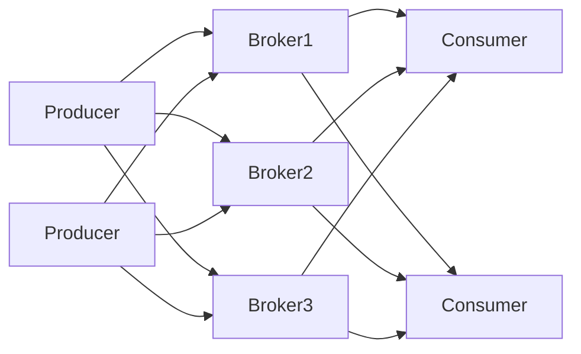
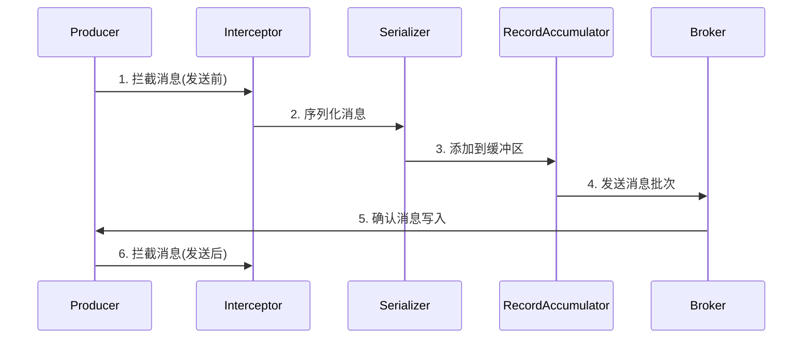

# Kafka生产者：发送消息的艺术

作者：禅与计算机程序设计艺术

## 1. 背景介绍
### 1.1 消息队列的重要性
### 1.2 Kafka在消息队列领域的地位
### 1.3 Kafka生产者的角色与作用

## 2. 核心概念与联系
### 2.1 Kafka基本架构
#### 2.1.1 Broker
#### 2.1.2 Topic与Partition
#### 2.1.3 Producer与Consumer
### 2.2 生产者关键概念
#### 2.2.1 序列化器(Serializer)
#### 2.2.2 分区器(Partitioner)
#### 2.2.3 拦截器(Interceptor)
#### 2.2.4 生产者配置参数
### 2.3 生产者发送消息的流程

## 3. 核心算法原理具体操作步骤
### 3.1 消息发送的三种模式
#### 3.1.1 发后即忘(Fire-and-forget) 
#### 3.1.2 同步(Sync)
#### 3.1.3 异步(Async)
### 3.2 消息分区策略
#### 3.2.1 轮询(Round-Robin)
#### 3.2.2 按键哈希(Key-Hashing)
#### 3.2.3 自定义分区器
### 3.3 消息批次发送
#### 3.3.1 批次大小(Batch Size)
#### 3.3.2 等待时间(Linger Time)
#### 3.3.3 内存缓冲区(Buffer Memory)
### 3.4 消息压缩
#### 3.4.1 GZIP
#### 3.4.2 Snappy
#### 3.4.3 LZ4

## 4. 数学模型和公式详细讲解举例说明
### 4.1 生产者吞吐量模型
### 4.2 消息大小对性能的影响
### 4.3 批次发送的最优配置计算

## 5. 项目实践：代码实例和详细解释说明
### 5.1 Java版生产者示例
#### 5.1.1 基本配置与使用
#### 5.1.2 自定义序列化器
#### 5.1.3 自定义分区器
#### 5.1.4 使用拦截器
### 5.2 Spring Kafka生产者示例  
#### 5.2.1 配置详解
#### 5.2.2 发送不同类型消息
#### 5.2.3 消息回调与错误处理
### 5.3 Kafka Streams与生产者
#### 5.3.1 KStream作为生产者
#### 5.3.2 Processor API自定义处理

## 6. 实际应用场景
### 6.1 日志收集
### 6.2 数据同步
### 6.3 流式数据处理
### 6.4 事件驱动系统

## 7. 工具和资源推荐
### 7.1 Kafka集群监控工具
#### 7.1.1 Kafka Manager
#### 7.1.2 Kafka Eagle
#### 7.1.3 Kafka Offset Monitor
### 7.2 测试工具
#### 7.2.1 Kafka-Producer-Perf-Test
#### 7.2.2 Kafka Load Testing
### 7.3 生产者常用类库
#### 7.3.1 Confluent Kafka
#### 7.3.2 Reactive Kafka

## 8. 总结：未来发展趋势与挑战
### 8.1 Kafka生产者的优化方向
### 8.2 下一代消息中间件的发展
### 8.3 实时数据处理的新挑战

## 9. 附录：常见问题与解答
### 9.1 如何选择合适的消息分区数?
### 9.2 如何保证消息的顺序性?
### 9.3 如何避免消息重复发送?
### 9.4 生产者的消息可靠性如何保证?
### 9.5 如何处理消息发送失败的情况?

Apache Kafka作为一个高吞吐、低延迟、高可扩展的分布式消息中间件平台,在实时数据处理领域占据着举足轻重的地位。而Kafka生产者作为数据进入Kafka的入口,其性能和可靠性直接影响了整个系统的效率和稳定性。

Kafka生产者的主要职责是将消息序列化并发布到Kafka集群的指定主题(Topic)和分区(Partition)中。在这个过程中,生产者需要考虑消息的分区策略、批次发送、压缩等诸多因素,以达到高效、可靠地发送消息的目的。同时,生产者还要正确处理可能出现的错误,如网络异常、Broker不可用等,确保消息不会丢失。

理解Kafka生产者的内部机制和最佳实践,对于构建高性能、高可靠的数据管道和实时应用至关重要。本文将深入探讨Kafka生产者的方方面面,从基本概念到核心原理,从配置优化到典型应用,力求为读者提供一个全面而深入的指南,助力更好地驾驭Kafka生产者,发挥Kafka在实时数据处理中的巨大潜力。

### 2.1 Kafka基本架构

Kafka采用了分布式的架构设计,由多个Broker组成集群,每个Broker都是一个独立的Kafka服务器。Broker负责接收和处理来自生产者的消息,并将消息持久化到磁盘。

Kafka使用主题(Topic)来组织和管理消息。一个主题可以被认为是一个消息的分类或者数据流。主题又进一步被划分为多个分区(Partition),每个分区是一个有序、不可变的消息序列,分区内的消息都被赋予了一个唯一的偏移量(Offset)。

生产者(Producer)负责将消息发布到指定的主题,消费者(Consumer)订阅主题并消费其中的消息。生产者和消费者都可以同时与多个Broker交互,从而实现了高可用和负载均衡。

下图展示了Kafka的基本架构:



### 2.2 生产者关键概念

#### 2.2.1 序列化器(Serializer)

序列化器负责将生产者发送的消息(一般是对象或数据结构)转换为字节数组,以便通过网络传输和持久化存储。Kafka提供了一些内置的序列化器,如StringSerializer、IntegerSerializer等,也允许用户自定义序列化器以支持特定的数据类型。

#### 2.2.2 分区器(Partitioner)

分区器决定生产者发送的每条消息被分配到哪个分区。Kafka默认使用基于消息键哈希的分区策略,即对消息的key进行散列,然后对分区数取模得到分区编号。用户也可以实现自定义分区器,根据特定的业务逻辑分配分区。

#### 2.2.3 拦截器(Interceptor)  

拦截器允许在消息发送前后对其进行定制化处理,如修改消息内容、记录消息发送指标等。生产者可以配置多个拦截器,它们按照指定的顺序依次执行。

#### 2.2.4 生产者配置参数

Kafka生产者有许多可配置的参数,用于控制消息发送的行为和性能,例如:

- `bootstrap.servers`:指定初始连接的Kafka Broker地址列表。
- `key.serializer`和`value.serializer`:指定消息键和值的序列化器类。
- `acks`:控制消息的确认模式,可以是0(不等待确认)、1(等待Leader写入)、-1或all(等待所有副本写入)。
- `compression.type`:指定消息压缩算法,如none、gzip、snappy、lz4等。
- `batch.size`:指定一个批次可以包含的最大字节数。
- `linger.ms`:指定发送批次之前等待更多消息加入批次的时间。

合理配置这些参数对于实现高性能、高可靠的消息发送至关重要。

### 2.3 生产者发送消息的流程

生产者发送消息的大致流程如下:

1. 生产者创建消息对象(ProducerRecord),指定目标主题、分区(可选)、消息键(可选)和消息值。
2. 序列化器将消息键和值序列化为字节数组。
3. 如果消息没有指定分区,分区器根据消息键或其他策略选择一个分区。
4. 拦截器按照配置的顺序对消息进行预处理。
5. 生产者将消息追加到内存缓冲区(RecordAccumulator),并根据目标分区维护一个消息批次(Batch)。
6. 发送线程(Sender)定期从缓冲区获取满足条件(如批次大小、等待时间)的消息批次,并发送给对应的Broker。
7. Broker接收到消息后,将其写入分区的日志文件,并在达到acks要求的条件后向生产者发送确认。
8. 生产者收到Broker的确认后,更新内部的元数据(如果发送失败则重试)。
9. 拦截器对发送完成的消息进行后处理。

整个过程可以用下图表示:



### 3.1 消息发送的三种模式

Kafka生产者提供了三种消息发送模式,分别是发后即忘(Fire-and-forget)、同步(Sync)和异步(Async)。

#### 3.1.1 发后即忘(Fire-and-forget)

在该模式下,生产者发送完消息后不关心消息是否到达Kafka,也不等待任何确认。这种模式吞吐量最高,但有可能导致消息丢失。示例代码:

```java
producer.send(record);
```

#### 3.1.2 同步(Sync)

在同步模式下,生产者发送消息后会等待Broker的确认,直到收到确认或发生错误。这种模式可靠性较高,但会增加延迟。示例代码:

```java
try {
    RecordMetadata metadata = producer.send(record).get();
    // 处理返回的元数据
} catch (Exception e) {
    // 处理发送异常
}
```

#### 3.1.3 异步(Async)

异步模式是发后即忘和同步的折中,生产者发送消息后立即返回,并指定一个回调函数来处理Broker的确认或错误。这种模式兼顾了吞吐量和可靠性。示例代码:

```java
producer.send(record, (metadata, exception) -> {
    if (exception != null) {
        // 处理发送异常
    } else {
        // 处理返回的元数据
    }
});
```

### 3.2 消息分区策略

Kafka的分区机制使得消息可以并行地写入和消费,提高了系统的吞吐量。生产者决定消息发送到哪个分区的策略主要有三种。

#### 3.2.1 轮询(Round-Robin)

轮询策略是默认的分区策略,当消息没有指定分区和键时,生产者将消息均衡地分配给每个分区。假设有3个分区,第1条消息发送到分区0,第2条发送到分区1,第3条发送到分区2,第4条又发送到分区0,以此类推。

#### 3.2.2 按键哈希(Key-Hashing)

当消息指定了键时,生产者对键进行哈希,然后对分区数取模,得到目标分区。这样可以保证具有相同键的消息总是被发送到同一个分区,实现了消息的有序性。哈希算法一般使用murmur2。

#### 3.2.3 自定义分区器

用户可以实现自定义的分区器,根据特定的业务逻辑决定消息的目标分区。例如,可以根据消息的某个字段的值、时间戳、随机数等进行分区。要实现自定义分区器,需要继承`Partitioner`接口并实现`partition`方法:

```java
public class CustomPartitioner implements Partitioner {
    public int partition(String topic, Object key, byte[] keyBytes, Object value, 
                         byte[] valueBytes, Cluster cluster) {
        // 自定义分区逻辑
    }
    // 其他方法
}
```

### 3.3 消息批次发送

Kafka生产者为了提高