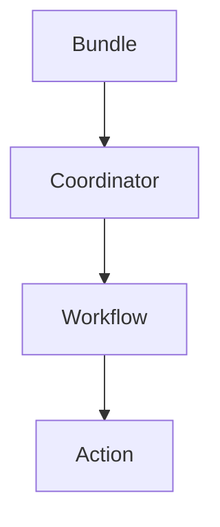

# Oozie Bundle原理与代码实例讲解

## 1.背景介绍

### 1.1 什么是Oozie

Apache Oozie是一个用于管理Hadoop作业（如MapReduce、Pig、Hive等）的工作流调度系统。它在Hadoop生态系统中扮演着重要的角色,可以有效地协调和监控复杂的数据处理流程。Oozie支持多种类型的Hadoop作业,并提供了一种灵活的方式来链接和组合这些作业。

### 1.2 Oozie的作用

在大数据处理中,通常需要将多个作业组合在一起形成复杂的工作流。手动执行和监控这些工作流是一项艰巨的任务。Oozie的出现解决了这个问题,它允许用户通过XML或Java API定义工作流,并提供了调度、监控和重试等功能。

Oozie的主要优势包括:

- **工作流编排**:将多个Hadoop作业组织成有向无环图(DAG),定义作业之间的依赖关系。
- **调度和监控**:支持基于时间和数据可用性的触发器,并监控作业的执行状态。
- **容错和重试**:如果作业失败,Oozie可以自动重试或采取补救措施。
- **参数化**:允许在运行时传递参数,提高工作流的灵活性。
- **安全集成**:与Hadoop安全集成,支持Kerberos认证。

### 1.3 Oozie Bundle的概念

Oozie Bundle是Oozie中的一个重要概念,它允许将多个Oozie协调器(Coordinator)组合在一起,形成更大的处理单元。Bundle可以包含一个或多个Coordinator,每个Coordinator又可以包含一个或多个Workflow。

Bundle的主要优势在于:

- **并行处理**:多个Coordinator可以并行执行,提高处理效率。
- **逻辑分组**:将相关的Coordinator组合在一起,提高可维护性。
- **共享配置**:Bundle中的Coordinator可以共享公共配置,避免重复定义。

## 2.核心概念与联系

### 2.1 Oozie工作流(Workflow)

Oozie Workflow定义了一系列需要执行的Hadoop作业,以及它们之间的依赖关系。它是Oozie中最基本的构建块,用于描述单个数据处理流程。Workflow由一个或多个Action组成,Action可以是MapReduce作业、Pig作业、Hive作业等。

Workflow支持多种控制节点,如决策(decision)、分支(fork/join)和循环(loop),使得工作流具有很强的表现力。此外,Workflow还支持全局和局部参数,可以在运行时动态传入参数值。

### 2.2 Oozie协调器(Coordinator)

Oozie Coordinator用于定义需要周期性执行的工作流。它基于时间和数据可用性触发器来调度Workflow的执行。Coordinator可以包含一个或多个Workflow,并定义它们的执行顺序和依赖关系。

Coordinator支持各种类型的触发器,如基于时间的触发器(cron表达式)和基于数据可用性的触发器。它还支持输入和输出数据集,可以指定Workflow读取和写入的数据位置。

### 2.3 Oozie Bundle

Oozie Bundle是一个更高层次的概念,它将多个Coordinator组合在一起,形成一个更大的处理单元。Bundle可以包含一个或多个Coordinator,每个Coordinator又可以包含一个或多个Workflow。

Bundle的主要作用是:

- **并行处理**:多个Coordinator可以并行执行,提高处理效率。
- **逻辑分组**:将相关的Coordinator组合在一起,提高可维护性。
- **共享配置**:Bundle中的Coordinator可以共享公共配置,避免重复定义。

### 2.4 核心概念关系

Oozie中的核心概念之间存在层级关系:

- Workflow是最基本的构建块,定义了单个数据处理流程。
- Coordinator用于定义需要周期性执行的Workflow,并基于时间和数据可用性触发器进行调度。
- Bundle将多个Coordinator组合在一起,形成更大的处理单元,支持并行处理和逻辑分组。

这些概念之间的关系如下图所示:



## 3.核心算法原理具体操作步骤

### 3.1 Oozie Bundle执行流程

Oozie Bundle的执行流程可以概括为以下几个步骤:

1. **Bundle提交**:用户通过Oozie命令行工具或Web UI将Bundle作业提交到Oozie服务器。
2. **Bundle解析**:Oozie服务器解析Bundle定义,识别出包含的Coordinator。
3. **Coordinator执行**:Oozie服务器并行执行Bundle中的所有Coordinator。
4. **Workflow触发**:每个Coordinator根据定义的触发器条件(时间或数据可用性)触发其包含的Workflow执行。
5. **Workflow执行**:Oozie服务器执行Workflow中的各个Action(MapReduce、Pig、Hive等)。
6. **状态监控**:Oozie服务器监控Bundle、Coordinator和Workflow的执行状态,并在必要时进行重试或补救措施。
7. **结果汇总**:所有Coordinator和Workflow执行完毕后,Oozie服务器将Bundle标记为成功或失败。

整个执行过程中,Oozie服务器负责协调和监控各个组件的执行,并根据定义的依赖关系和触发条件控制作业的执行顺序。

### 3.2 Bundle定义文件

Bundle的定义通常使用XML文件描述,文件结构如下:

```xml
<bundle-app>
  <name>Bundle名称</name>
  <bundle-path>Bundle应用程序路径</bundle-path>
  <coordinator>
    <name>Coordinator名称</name>
    <path>Coordinator应用程序路径</path>
    ...
  </coordinator>
  ...
</bundle-app>
```

Bundle定义文件包含以下主要元素:

- `<bundle-app>`: Bundle应用程序的根元素。
- `<name>`: Bundle的名称。
- `<bundle-path>`: Bundle应用程序在HDFS上的路径。
- `<coordinator>`: 定义Bundle中包含的Coordinator。每个Coordinator包含一个名称和路径。

### 3.3 Coordinator定义文件

每个Coordinator都有一个单独的XML定义文件,描述了它包含的Workflow、触发器条件和数据集等信息。文件结构如下:

```xml
<coordinator-app>
  <name>Coordinator名称</name>
  <start>开始时间</start>
  <end>结束时间</end>
  <frequency>执行频率</frequency>
  <workflow>
    <app-path>Workflow应用程序路径</app-path>
    ...
  </workflow>
  <input-events>
    <data-in>输入数据集</data-in>
    ...
  </input-events>
  <output-events>
    <data-out>输出数据集</data-out>
    ...
  </output-events>
</coordinator-app>
```

Coordinator定义文件包含以下主要元素:

- `<coordinator-app>`: Coordinator应用程序的根元素。
- `<name>`: Coordinator的名称。
- `<start>` 和 `<end>`: 定义Coordinator的执行时间范围。
- `<frequency>`: 定义Coordinator的执行频率,可以使用cron表达式或时间间隔。
- `<workflow>`: 定义Coordinator包含的Workflow及其路径。
- `<input-events>` 和 `<output-events>`: 定义Workflow的输入和输出数据集。

### 3.4 Workflow定义文件

Workflow的定义使用Apache OOZ工作流定义语言(WDL)描述,是一种基于XML的语言。文件结构如下:

```xml
<workflow-app>
  <start>
    <name>开始节点名称</name>
    ...
  </start>
  <action>
    <name>Action名称</name>
    <type>Action类型</type>
    ...
  </action>
  <decision>
    <name>决策节点名称</name>
    ...
  </decision>
  <fork>
    <name>分支节点名称</name>
    ...
  </fork>
  <join>
    <name>合并节点名称</name>
    ...
  </join>
  <kill>
    <name>终止节点名称</name>
    ...
  </kill>
  <end>
    <name>结束节点名称</name>
    ...
  </end>
</workflow-app>
```

Workflow定义文件包含以下主要元素:

- `<workflow-app>`: Workflow应用程序的根元素。
- `<start>`: 定义Workflow的开始节点。
- `<action>`: 定义Workflow中的Action,可以是MapReduce、Pig、Hive等作业。
- `<decision>`: 定义决策节点,用于根据条件执行不同的分支。
- `<fork>` 和 `<join>`: 定义并行分支和合并节点。
- `<kill>`: 定义终止节点,用于中止Workflow的执行。
- `<end>`: 定义Workflow的结束节点。

这些元素通过定义控制流程和数据依赖关系,构建出复杂的Workflow。

## 4.数学模型和公式详细讲解举例说明

在Oozie中,并没有直接使用复杂的数学模型或公式。但是,在定义Workflow的执行逻辑时,可能需要使用一些简单的数学表达式或条件判断。

### 4.1 Cron表达式

Cron表达式是一种用于定义时间调度的标准表示法,在Oozie中常用于定义Coordinator的执行频率。Cron表达式的格式如下:

```
* * * * * *
| | | | | |
| | | | | +-- Year (optional)
| | | | +---- Day of Week (0 - 7) (0 or 7 is Sunday)
| | | +------ Month (1 - 12)
| | +-------- Day of Month (1 - 31)
| +---------- Hour (0 - 23)
+------------ Minute (0 - 59)
```

每个字段可以使用数字、范围或通配符来表示。例如,以下Cron表达式表示每天上午8点执行:

```
0 8 * * *
```

### 4.2 EL表达式

Oozie支持使用EL(Expression Language)表达式来定义条件判断和数据操作。EL表达式可以在Workflow和Coordinator定义文件中使用,以实现更加灵活的控制流程。

EL表达式的语法类似于Java,支持各种运算符和函数。例如,以下EL表达式判断两个数字的大小关系:

```xml
<decision name="check-value">
  <switch>
    <case to="small">${value lt 10}</case>
    <case to="big">${value ge 10}</case>
    <default to="end"/>
  </switch>
</decision>
```

在上面的示例中,`${value lt 10}`是一个EL表达式,用于判断变量`value`是否小于10。

### 4.3 参数化和函数

Oozie还支持使用参数化和函数来实现更复杂的逻辑。例如,可以在Workflow中定义函数,并在Action中调用这些函数。函数可以执行各种计算和数据操作。

以下是一个简单的函数示例,用于计算两个数字的和:

```xml
<function>
  <resource-uri>my-functions.py</resource-uri>
  <function>
    <name>add</name>
    <interface>
      <def>def add(a, b)</def>
      <ret-type>number</ret-type>
    </interface>
    <script>return a + b</script>
  </function>
</function>
```

在Action中,可以使用EL表达式调用这个函数:

```xml
<map-reduce>
  <prepare>
    <delete path="${output}"/>
    <mkdir path="${output}"/>
  </prepare>
  <configuration>
    <property>
      <name>mapred.mapper.class</name>
      <value>my.mapper.Class</value>
    </property>
    <property>
      <name>mapred.reducer.class</name>
      <value>my.reducer.Class</value>
    </property>
    <property>
      <name>mapred.output.dir</name>
      <value>${wf:concat(output, add(1, 2))}</value>
    </property>
  </configuration>
</map-reduce>
```

在上面的示例中,`${wf:concat(output, add(1, 2))}`调用了`add`函数,并将结果与`output`参数拼接在一起。

通过组合使用Cron表达式、EL表达式、参数化和函数,Oozie可以实现复杂的控制流程和数据操作逻辑。

## 4.项目实践:代码实例和详细解释说明

为了更好地理解Oozie Bundle的使用,我们将通过一个实际项目实践来演示如何定义和执行Bundle。

### 4.1 项目概述

假设我们需要构建一个数据处理流程,用于每天处理网站日志数据。该流程包括以下步骤:

1. 从HDFS中获取前一天的网