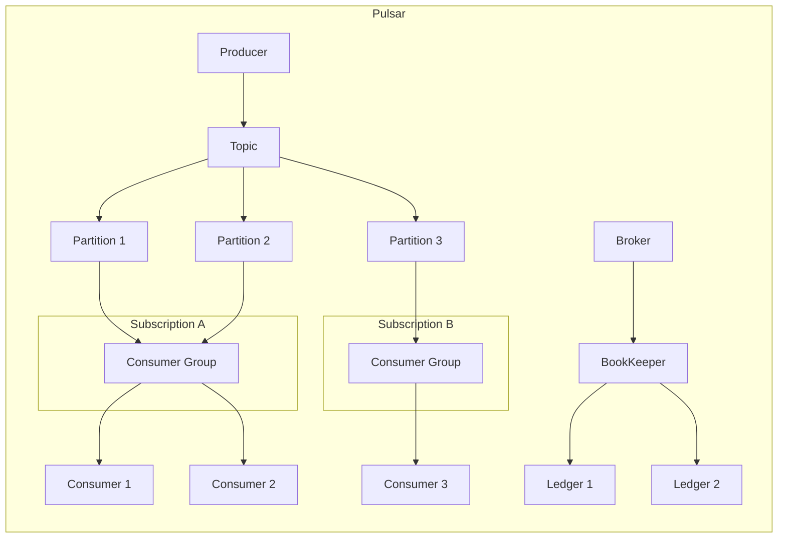

# Pulsar Consumer原理与代码实例讲解

作者：禅与计算机程序设计艺术

## 1. 背景介绍

### 1.1 消息队列与流式处理平台

在现代分布式系统中,消息队列(Message Queue)和流式处理(Stream Processing)平台扮演着至关重要的角色。它们提供了可靠、高吞吐、低延迟的数据传输和处理能力,使得系统各个组件能够松耦合地协同工作。

### 1.2 Apache Pulsar的崛起

Apache Pulsar作为后起之秀,凭借其优异的性能和丰富的功能,在消息队列和流式处理领域迅速崛起。Pulsar采用了计算与存储分离的架构,支持多租户、跨地域复制、端到端精确一次处理等特性,成为了众多企业的首选。

### 1.3 Consumer在Pulsar中的地位

在Pulsar的生态中,Consumer扮演着数据消费者的角色。它从Topic或Partition中读取消息,完成业务处理,是上下游系统衔接的关键一环。深入理解Pulsar Consumer的工作原理,对于构建高效、可靠的流式处理应用至关重要。

## 2. 核心概念与关联

### 2.1 Topic与Partition

- Topic是Pulsar的消息传输基本单位,生产者向Topic发送消息,消费者从Topic接收消息。
- 每个Topic可以划分为多个Partition,以提升吞吐和并行度。

### 2.2 Subscription与ConsumerGroup 

- 每个Consumer都隶属于一个Subscription。同一Subscription下的多个Consumer组成ConsumerGroup,共同消费Topic的数据。
- 不同Subscription之间消息互不影响,实现逻辑隔离。

### 2.3 Message与Acknowledgment

- Message是Pulsar中数据传输的基本单位,由消息体、元数据等部分组成。
- Consumer接收到消息后,需要发送Acknowledgment告知Pulsar消息已处理完毕,Pulsar将其从Backlog中移除。

### 2.4 Broker与BookKeeper

- Broker是Pulsar的消息服务层,负责接收和分发消息,协调Producer和Consumer。
- BookKeeper是Pulsar的存储层,以Ledger的形式持久化消息,保证数据可靠性。

下图展示了Pulsar Consumer涉及的核心概念以及它们之间的关联:



## 3. 核心算法原理与操作步骤

### 3.1 Consumer的初始化

1. 指定Pulsar集群的服务URL
2. 配置Consumer的属性,如Subscription、ConsumerGroup等
3. 创建Consumer实例,与Broker建立连接
4. 加入Subscription,成为ConsumerGroup的一员

### 3.2 消息的接收与确认

1. Consumer向Broker发送Pull请求,请求获取新消息
2. Broker从BookKeeper读取消息,返回给Consumer
3. Consumer处理接收到的消息,完成业务逻辑
4. Consumer向Broker发送Acknowledgment,确认消息处理完毕
5. Broker将已确认的消息从Consumer的Backlog中移除

### 3.3 Consumer的负载均衡

1. 当有新的Consumer加入ConsumerGroup时,触发Rebalance
2. Broker根据负载均衡策略,重新分配Partition到Consumer的映射关系
3. Consumer根据新的分配结果,调整消费任务,实现负载均衡

### 3.4 Consumer的容错与恢复

1. 当Consumer意外崩溃时,Broker感知到Consumer的离线
2. Broker触发Rebalance,将崩溃Consumer负责的Partition重新分配
3. 新的Consumer接管Partition,从上次的消费位点恢复消费,保证数据不丢失

## 4. 数学模型与公式详解

### 4.1 Consumer的吞吐量估算

假设单个Consumer的处理能力为$C$,Partition数量为$P$,ConsumerGroup的并行度为$N$,则整个ConsumerGroup的理论吞吐量$T$可估算为:

$$
T = min(C × N, P)
$$

其中,$C×N$表示ConsumerGroup的总处理能力,$P$表示Topic的最大并行度。二者取较小值,即为ConsumerGroup的实际吞吐量。

例如,单个Consumer的处理能力为1000条/s,Topic有10个Partition,ConsumerGroup有5个Consumer,则理论吞吐量为:

$$
T = min(1000 × 5, 10) = 5000 条/s
$$

### 4.2 Consumer的消息堆积估算

假设Consumer的消息处理速率为$C$,生产者的消息生成速率为$P$,则Consumer的消息堆积速率$R$可估算为:

$$
R = P - C
$$

当$R>0$时,表示Consumer无法及时处理生产者生成的消息,消息将堆积在Backlog中。堆积的消息总量$Q$可估算为:

$$
Q = R × t
$$

其中,$t$表示消息堆积的持续时间。

例如,生产者的消息生成速率为1000条/s,Consumer的消息处理速率为800条/s,持续1小时,则消息堆积总量为:

$$
Q = (1000 - 800) × 3600 = 720000 条
$$

## 5. 项目实践:代码实例与详解

下面通过一个简单的Java代码实例,演示如何使用Pulsar Consumer API实现消息的消费。

```java
import org.apache.pulsar.client.api.*;

public class PulsarConsumerExample {
    public static void main(String[] args) throws PulsarClientException {
        // 配置Pulsar服务URL
        String serviceUrl = "pulsar://localhost:6650";
        
        // 配置Consumer属性
        String topic = "my-topic";
        String subscription = "my-subscription";
        
        // 初始化Pulsar客户端
        PulsarClient client = PulsarClient.builder()
            .serviceUrl(serviceUrl)
            .build();
        
        // 创建Consumer实例
        Consumer<byte[]> consumer = client.newConsumer()
            .topic(topic)
            .subscriptionName(subscription)
            .subscriptionType(SubscriptionType.Shared)
            .subscribe();
        
        // 接收并处理消息
        while (true) {
            Message<byte[]> message = consumer.receive();
            
            // 处理消息
            String content = new String(message.getData());
            System.out.println("Received message: " + content);
            
            // 发送Acknowledgment
            consumer.acknowledge(message);
        }
        
        // 关闭Consumer和Client
        consumer.close();
        client.close();
    }
}
```

代码解读:

1. 配置Pulsar服务的URL,指定要连接的Pulsar集群。
2. 配置Consumer的属性,包括要订阅的Topic和Subscription名称。
3. 初始化PulsarClient,作为与Pulsar交互的入口。
4. 创建Consumer实例,指定Topic、Subscription等属性。
5. 在循环中接收消息,调用`receive()`方法从Broker拉取新消息。
6. 处理接收到的消息,这里简单地打印出消息内容。
7. 发送Acknowledgment,告知Broker消息已处理完毕。
8. 关闭Consumer和Client,释放资源。

以上代码展示了Pulsar Consumer的基本用法,通过简单的API调用,即可实现可靠的消息消费功能。

## 6. 实际应用场景

Pulsar Consumer在实际项目中有广泛的应用,下面列举几个典型场景:

### 6.1 日志收集与分析

- 将分布式系统的日志数据发送到Pulsar的Topic中
- 通过Pulsar Consumer实时消费日志数据
- 对日志进行解析、过滤、聚合等处理,生成统计报表或异常告警

### 6.2 实时数据处理

- 将IoT设备、监控系统等产生的实时数据发送到Pulsar中
- 通过Pulsar Consumer实时消费数据流
- 对数据进行清洗、转换、富化等处理,并将结果输出到下游系统

### 6.3 事件驱动的微服务架构

- 将微服务产生的领域事件发布到Pulsar的Topic中
- 通过Pulsar Consumer订阅感兴趣的事件
- 根据事件内容触发相应的业务逻辑,实现服务间的解耦合协作

### 6.4 数据同步与备份

- 将关键业务数据发送到Pulsar的Topic中
- 通过Pulsar Consumer将数据同步到备份集群或灾备系统
- 利用Pulsar的多地域复制能力,实现跨区域的数据同步与容灾

## 7. 工具与资源推荐

### 7.1 客户端库

- Java: [pulsar-client](https://pulsar.apache.org/docs/en/client-libraries-java/)
- Python: [pulsar-client-python](https://pulsar.apache.org/docs/en/client-libraries-python/) 
- Go: [pulsar-client-go](https://pulsar.apache.org/docs/en/client-libraries-go/)

### 7.2 管理工具

- [Pulsar Manager](https://github.com/apache/pulsar-manager): Pulsar的Web管理控制台
- [Pulsar Admin CLI](https://pulsar.apache.org/tools/pulsar-admin/): Pulsar的命令行管理工具

### 7.3 学习资源

- [Pulsar官方文档](https://pulsar.apache.org/docs/en/): 官方的文档资源,包含了使用指南、API参考、最佳实践等
- [Pulsar Summit](https://pulsar-summit.org/): Pulsar的年度技术大会,分享最新进展和用户案例
- [Pulsar Blog](https://pulsar.apache.org/blog/): Pulsar的官方博客,发布新特性介绍、技术深度文章等

## 8. 总结与展望

### 8.1 Pulsar Consumer的优势

- 采用计算存储分离架构,具备高吞吐、低延迟、高可靠等特性
- 支持多订阅模型,满足不同业务场景的消费需求
- 提供丰富的API,简化开发复杂度,提升消息处理效率
- 与Pulsar的其他组件无缝集成,构建端到端的流式处理应用

### 8.2 未来发展趋势

- 云原生化:与Kubernetes等云平台深度整合,提供弹性伸缩、自动运维等能力
- 智能化:引入AI和机器学习技术,实现智能化的资源调度和异常检测
- 标准化:积极参与开源社区建设,推动Pulsar接口和协议的标准化
- 生态建设:丰富周边工具,打造完善的Pulsar生态,为用户提供一站式解决方案

### 8.3 总结

Pulsar Consumer作为Pulsar消息系统的关键组件,凭借其优异的性能和灵活的功能,在实时数据处理领域大放异彩。了解Pulsar Consumer的工作原理和使用方法,对于构建高可靠、高性能的流式应用至关重要。

站在时代的浪潮之巅,Pulsar正引领着消息队列和流处理技术的变革。让我们携手并进,共同探索Pulsar Consumer在未来的无限可能,打造新一代的实时数据处理应用。

## 9. 附录:常见问题与解答

### 9.1 如何选择Consumer的订阅模式?

Pulsar提供了三种订阅模式:Exclusive、Shared、Failover,适用于不同的业务场景:

- Exclusive:一个Topic只能被一个Consumer消费,适用于严格顺序消费的场景
- Shared:一个Topic可以被多个Consumer共同消费,适用于可并行处理的场景
- Failover:一个Topic只能被一个Consumer消费,但支持自动Failover,适用于高可用场景

需要根据具体的业务需求,权衡吞吐量、可靠性、顺序性等因素,选择合适的订阅模式。

### 9.2 如何处理消费过程中的异常?

在消费消息的过程中,可能会遇到各种异常情况,如网络中断、消息格式错误等。为了保证消费的可靠性,建议采取以下措施:

- 在消费逻辑中添加异常处理,捕获和记录异常信息
- 对于可重试的异常,如网络超时,可以设置重试策略,自动进行若干次重试
- 对于不可恢复的异常,如消息格式错误,可以将消息转移到死信队列(Dead Letter Queue),交由人工处理
- 在关键节点设置消费进度的